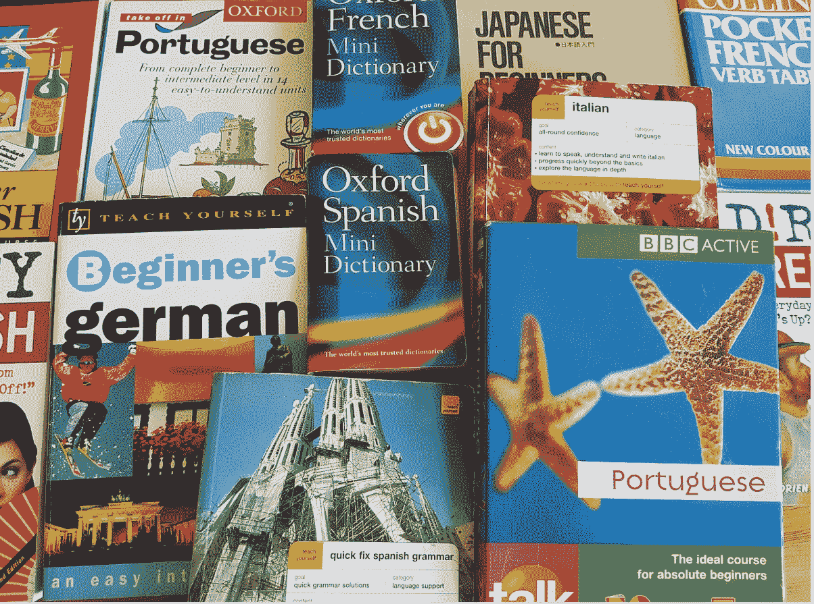
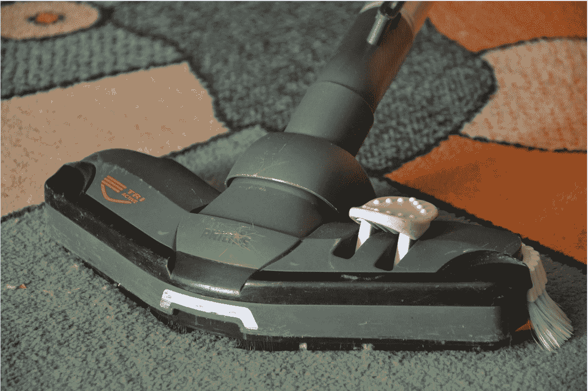

# 需要低投入的 8 个盈利的商业想法

> 原文：<https://medium.datadriveninvestor.com/8-profitable-business-ideas-that-need-low-investment-5165c72152f2?source=collection_archive---------6----------------------->

## 用最少的投资或不投资开始赚钱。

Photo by [Mika Baumeister](https://unsplash.com/@mbaumi?utm_source=medium&utm_medium=referral) on [Unsplash](https://unsplash.com?utm_source=medium&utm_medium=referral)

新冠肺炎会影响你的工作吗？

从减薪到裁员，这场全球性的疫情可能会影响全球数百万个工作岗位。这不仅会影响工作，也会影响商业。

人们正在寻找新的方式来支持他们的日常需求和维持他们的生活方式。

随着一些客户暂停他们的项目，我决定将我们的重点转移到内部项目上。我最近进入了绩效营销领域，将我博客的流量货币化，并充分利用我排名靠前的帖子。

 [## 利用股市相关性的最佳方式|数据驱动的投资者

### 当阿尔弗雷德·温斯洛·琼斯开创了世界上第一个“对冲”基金(后来“d”被去掉了)时，他让其他投资者大吃一惊…

www.datadriveninvestor.com](https://www.datadriveninvestor.com/2020/02/02/the-best-way-to-use-stock-market-correlations/) 

除此之外，我还推出了我的第一个在线课程“如何成为一个有影响力的人”凭借我在咨询品牌和影响者方面的专业知识，这门课程肯定会为那些想利用他们的社交档案赚钱的人提供价值。

最棒的是。

它可以帮助我为我的生意建立一个固定的收入来源。

这就是我如何适应当前的市场危机并变得更加强大的全部内容。

来说说你吧:

你打算做什么？

你不想利用这段时间创造新的收入来源吗？

如果你想用你的编码技能赚钱或者开始一个在线业务，这是开始的正确时间。

看到这个艰难的时刻，我为你整理了一些最好的低投资商业想法。这些商业理念不仅需要低投资，而且很容易启动。

# 1.瑜伽和健身课程

Image via [Pixabay](https://pixabay.com/photos/weights-lifting-power-training-gym-817635/)

**范围:**随着所有关于增强免疫系统的宣传活动，人们对自己的健康变得更加谨慎。

专注于帮助人们保持健康的商业理念永远不会破产。最棒的是，它需要的投资很低。

你也可以在网上开设瑜伽和健身课程，并邀请人们订阅。

**所需技能:**要成为一名教练，你首先需要自己是一名健身爱好者。如果你身体健康，喜欢锻炼或做瑜伽，你可以与他人分享这些知识。

**所需投资:**您可以通过在线课程流免费开始学习。可以投资好的在线课程平台，也可以申请认证课程。

# 2.翻译工作

Image via [Pixabay](https://pixabay.com/photos/language-learning-books-education-2345801/)

**范围:**尽管市场上有许多语言翻译应用程序，但对熟练的专业翻译人员的需求一直很高。从 2018 年到 2028 年，翻译工作预计将增长 19%。

你可以很容易地在网上找到翻译工作并开始工作。

需要的技能:要成为一名翻译，你需要学习一门流行的语言。一些流行的语言包括法语、西班牙语和德语。

**需要投资:**你可以投资一门在线课程来学习一门新语言，或者利用书籍和 YouTube 教程自学。对你来说，熟练掌握一门语言并开始找工作需要时间。

# 3.蜡烛和肥皂制造业

Images via [Pixabay](https://pixabay.com/photos/honey-products-honey-beeswax-3413357/)

**范围:**蜡烛和肥皂是生活用品，不太可能很快被淘汰。许多美国公民在家里使用芳香蜡烛。

蜡烛和肥皂也是公司礼物的一大部分。如果你有合适的联系人，你可以与小公司和礼品店合作销售你的产品。

你也可以在网上销售你的产品。

所需技能:你应该能够想出新的设计和香水来吸引消费者。你应该有创意，也有体面的营销知识。

你可以在网上学习蜡烛和肥皂制作课程，其中许多课程是免费的。材料成本最低。

制作一支蜡烛将花费你大约 3 美元，你可以很容易地把它卖到 9 美元。

# 4.医疗快递服务

Images via [Pixabay](https://pixabay.com/photos/close-up-drugs-medical-medicine-1853400/)

**范围:**诊所、医院，甚至人们都寻找医疗快递服务，以便将所需的药品送到家门口。

所需技能:你应该具备处理医疗用品的知识，还需要一张执照。可以选择雇佣司机，也可以选择亲自送药。

**所需投资:**你需要在许可流程、药品库存和雇佣司机方面进行投资。你可以开始单飞，在开始盈利的同时拓展业务。

你可以通过医疗快递服务每小时赚 36 美元。

# 5.健康食品餐饮服务

Image via [Pixabay](https://pixabay.com/photos/breakfast-healthy-hummus-spread-1804457/)

**范围:**随着紧张的生活方式和不健康的饮食习惯引发健康问题，许多人都在寻找健康的饮食选择。创办一家专注于健康食品的餐饮企业可能是一个有利可图的选择。

**所需技能:**如果你是一个热爱烹饪的健身爱好者，那么这种低投入的经营思路正适合你。你可以尝试健康的食谱，这些食谱很容易在旅途中食用，并与办公室合作开始提供。

需要的投资:你可以从 5，000 到 10，000 美元的小规模投资开始，然后随着你的盈利不断扩大你的业务。如果你能找到回头客，你就能快速发展你的业务。

# 6.地毯和沙发清洁服务

Image via [Pixabay](https://pixabay.com/photos/cleaning-clean-up-the-order-of-the-381089/)

范围:许多人依靠专业的清洁服务来清洁和消毒他们昂贵的地毯和沙发。他们寻找可靠的服务来去除污渍、灰尘和细菌。

**所需技能:**你需要了解布料和室内装潢，以及可以使用哪种清洁剂。你应该学习新的清洁和消毒技术来保持竞争力。

**所需投资:**你需要买一台质量好的吸尘器和清洁剂。它可能花费你大约 170 到 399 美元。

可以自己动手，在附近地区提供清洁服务。如果你有更多的钱可以投资，你也可以雇佣工人并建立一个小团队来瞄准更大的区域。

# 7.托儿所

Image via [Pixabay](https://pixabay.com/photos/kids-words-toy-child-childhood-2293835/)

范围:有工作的父母总是需要专业人士在他们不在的时候照顾他们的孩子。对可靠的日托中心的需求正在上升，预计到 2021 年美国将有 [856K+](https://www.statista.com/statistics/796425/number-of-daycare-operators-us/) 日托运营商。

**所需技能:**如果你喜欢与孩子互动并照顾他们，那么这可能是你的最佳商业想法。然而，你将需要经验来处理幼儿。

**所需投资:**如果你要把房子的一部分改造成托儿所，那么你必须把内部装修得适合儿童，并购买玩具和其他物品。

# 8.宠物美容服务

Image via [Pixabay](https://pixabay.com/photos/pets-cute-cat-dog-cute-wallpaper-3715733/)

**范围:**如今，宠物美容服务已经成为宠物主人的必需品。这可能是一个蓬勃发展的商业想法，因为许多人喜欢收养宠物，并让他们打扮。

你可以提供各种服务，从理发，按摩，甚至宠物水疗。

**所需技能:**如果你热爱动物，喜欢照顾它们，那么你可以投资一家宠物美容企业。你可以瞄准附近地区的宠物主人，也可以建立一个网站来在线推广你的业务。

需要投资:网上有动物美容课程。你将不得不花费 2000 美元来参加专业课程和购买美容产品。

你平均每小时可以赚大约 12.07 美元 T21。

# 准备好成为自己的老板了吗？

创业需要激情、决心和努力。任何企业要取得成功，都需要提供卓越的服务质量。

最棒的是。

你现在可以在不放弃全职工作的情况下创业。这可以帮助你最小化风险，创造一个新的收入来源。

你可以使用任何这些低投资的商业想法来开始。确保你选择的想法符合你的兴趣和技能。

如果你开始获得良好的回报，你可以投入更多的时间和资源来进一步发展你的业务。

如果你有关于创业和推广新业务的问题，请在下面的评论中分享。我会很乐意回答的！

**进入专家视角—** [**订阅 DDI 英特尔**](https://datadriveninvestor.com/ddi-intel)