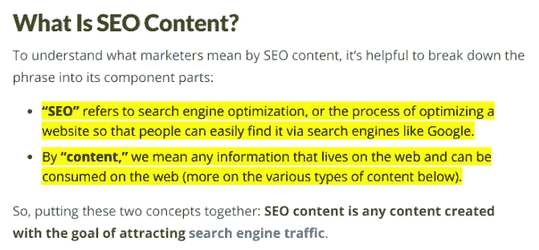
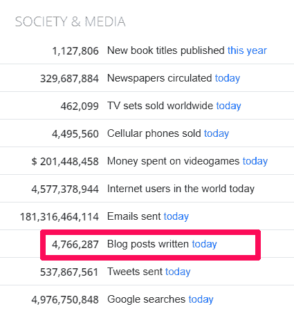
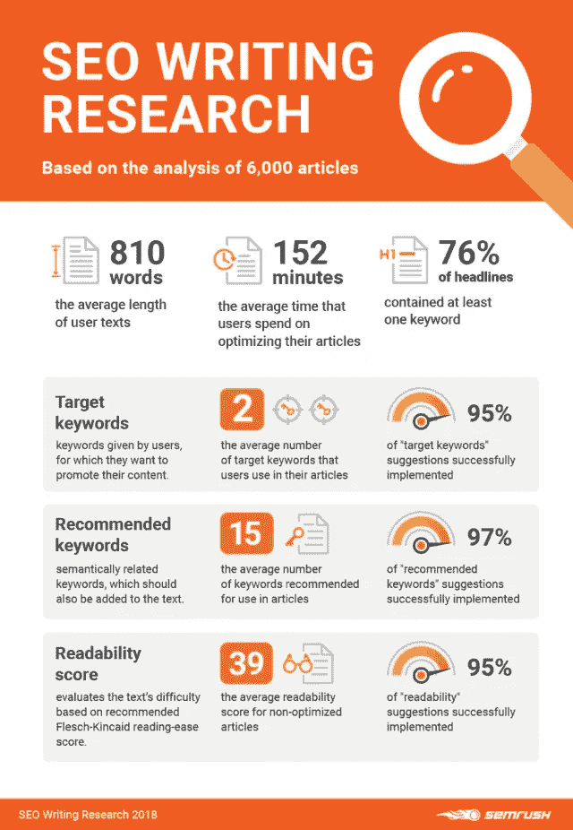
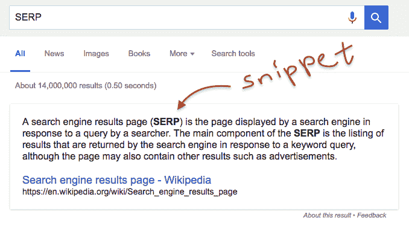

# 8 个 SEO 内容写作技巧，将提升有机流量和搜索排名

> 原文：<https://medium.datadriveninvestor.com/8-seo-content-writing-tips-that-will-boost-organic-traffic-and-search-ranking-c9712fb2eb2e?source=collection_archive---------0----------------------->

Photo by [Mel Poole](https://unsplash.com/@melipoole?utm_source=medium&utm_medium=referral) on [Unsplash](https://unsplash.com?utm_source=medium&utm_medium=referral)

你想学习史诗般的 [SEO 内容写作技巧](https://www.mossmedia.biz/seo-techniques-boost-ranking/)来提高你的搜索排名吗？或者你想知道什么是 SEO 的最佳内容写作技巧，将粉碎谷歌搜索结果？

这篇文章将为你的博客成功提供八个实用的 SEO 写作技巧。然而，由于每天都有大量的博客文章发表，博客行业的竞争非常激烈。

因此，要想在 SERPs 的第一页排名，你需要精心设计优化良好的 SEO 友好的内容。它给了你的内容一个适当的提升，以达到它想要的观众。

 [## 数据驱动始于数据素养|数据驱动的投资者

### 光是听到“数据”这个词就令人生畏。老实说，只有 21%的全球员工对自己的工作充满信心

www.datadriveninvestor.com](https://www.datadriveninvestor.com/2020/03/22/data-driven-starts-with-data-literacy/) 

搜索引擎优化已经成为数字营销领域所有行业的重要话题，包括博客、[社交媒体营销](https://www.mossmedia.biz/optimize-social-media-advertising-campaigns/)和/或[品牌营销](https://www.designhill.com/brand-identity)。它是所有数字营销事业的核心。

作为一个作家和搜索引擎优化专家是一个硬币的两面，在今天的在线商业世界已经变得必要。因此，这篇文章将包含 SEO 友好的内容写作技巧，这将超越你的竞争对手，提高你的内容的价值和投资回报率。

> 手选: [4 种有效的方法来撰写引人注目的 Instagram 标题，让你获得更多关注&流量](https://medium.com/datadriveninvestor/4-effective-ways-to-write-compelling-instagram-captions-thatll-gain-more-attention-and-traffic-337c80afb95d)

# 什么是 SEO 写作？

为搜索引擎优化写作是一种在考虑搜索引擎优化的情况下规划你的博客文章的方法。它包括使用 SEO 元素写博客，这将增加你的搜索知名度和谷歌排名。在这种情况下，你优化你的内容的唯一目标是提高搜索引擎排名。

还有，这里是 WordStream 对[什么是 SEO 内容](https://www.wordstream.com/blog/ws/2012/01/17/seo-content-beginners-guide#:~:text=%E2%80%9CSEO%E2%80%9D%20refers%20to%20search%20engine,various%20types%20of%20content%20below).)的定义？请看截图。

Source screenshot via WordStream

但是，需要提醒的是，SEO 写作并不等同于“SEO 文案”。为了更好的理解 SEO 文案，让我们来看看“文案”这个术语。文案是创造内容片段的过程，能够激发用户行动并最终转化。

因此，SEO 文案是一种内容写作方法，意味着创建吸引读者的在线内容，推动有针对性的有机流量，并将网站访问者转化为潜在客户和付费客户。

# 为什么 SEO 内容写作对你的博客成功至关重要？

创建 SEO 友好的博客文章对你的内容营销策略至关重要，因为它能让你出现在谷歌搜索结果中，并带动有机流量。根据 WorldOMeter 的数据，内容营销者每天发布近五百万篇博客文章。

Source image via WorldOMeter.

从图中，你还可以看到用户仅在谷歌上就进行了 50 亿次搜索。这意味着你出现在 SERPs 上的机会很小。但是有了 SEO 内容写作，你就增加了胜算。

所以，SEO 内容写作对于博客来说是必不可少的。他们携手同行，在几个对谷歌排名因素至关重要的方面提供帮助。好处包括高点击率，谷歌认为这是网站排名的一个重要因素。

这意味着越多的访问者点击你的博客，你就越有机会在搜索引擎上排名靠前。那么网页内容写作有哪些最好的 SEO 技巧呢？

# SEO 写作统计根据 6000 篇博文分析

Graphic via Jeffbullas

该信息图揭示了 SEMrush 对 6000 篇博客文章的[研究报告，以确定博客作者和内容创作者如何利用 SEO 最佳实践和博客写作技巧进行 SEO 写作。](https://www.jeffbullas.com/content-marketing-best-practice/)

该报告:

*   文章写作平均长度 810 字:文字内容平均长度存在不一致。一些专家建议 1500 英镑或更多，以便为读者提供价值。
*   博客作者平均花费 152 分钟(2 小时 32 分钟)优化博客内容:花大量时间优化你的博客是值得的。
*   平均而言，76%的文章标题至少包含一个目标关键词:文章标题中的关键词有助于提高你的内容可见性和搜索排名。这是内容写作和搜索引擎优化的最佳实践
*   文章作者平均每篇文章有两个关键词。95%的营销人员会采纳这个建议。
*   根据专家的建议，内容作者应该平均每篇博文使用 15 个关键词。97%的建议被成功应用。
*   未优化的博客文章可读性得分平均为 39%,而 95%的博客文章作者成功使用了推荐

# 8 个简单的 SEO 内容写作技巧可以增加你的网站流量

如前所述，在这篇文章中，你将学到实用的 SEO 内容写作技巧，这将使你的博客流量和搜索引擎排名飙升。因此，请务必阅读整篇文章。

## 1.知道排名因素的重要性

SEO 全靠数字的日子已经一去不复返了。随着时间的推移，它变得越来越像一个真正的人。搜索引擎有他们的工作方式，他们在你的博客写作中寻找五个基本因素:

1.  内容质量
2.  链接
3.  站点结构
4.  HTML 标签
5.  内容相关性

然而，让你的博客在 SERP 上排名第一的最重要的因素是你的内容质量。所以，你的博文写作需要:

*   简明的
*   详细的
*   写得很好，而且
*   与用户相关

因此，在发布你的博客文章之前，确保它包含所有重要的元素，比如表格、图表和信息图。这些成分增加了你文章的价值，使你的内容对读者更有吸引力。

## 2.关键词是你内容的主干

当你写博客和以 SEO 为目标时，你必须非常善于分析。关键词是用户在搜索引擎上搜索的搜索项。考虑到这一点，你需要用那些指定的高搜索量关键词来包装你的内容。

简单地说，使用具有优秀 SEO 价值的关键词。然而，选择最合适的关键字需要三个步骤:

1.  确定搜索者感兴趣的内容
2.  追踪搜索量
3.  用关键词的最佳组合来写你的博客。

但是，你可能想知道，什么是关键字的最佳组合？对于博文，要融入低量低竞争的长尾关键词。此外，语义关键词应该是你的关键词计划的一部分。而对于支柱页面，你应该瞄准容量大、竞争度高的短尾关键词。

> *相关帖子:* [*如何为 SEO 研究关键词找到合适的搜索*](https://www.mossmedia.biz/find-right-keywords/) *。*

## 3.定义读者意图

SEO 不仅仅是把关键词按顺序排列。这是一门艺术，你越努力，它就越精彩。在敲定完整的 SEO 条款后，下一步就是问问自己；为什么人们会搜索这些关键词？

你需要理解读者的搜索意图，然后根据这些意图来发展你的文章。根据谷歌的[评估指南](https://searchengineland.com/google-updates-search-quality-evaluator-guidelines-317189)，搜索者在寻找特定关键词时有四个不同的目的。

1.  他们想要关于那个主题的知识。
2.  他们想做一个动作或学习如何采取行动。
3.  搜索者可能正在寻找特定的来源，如网站或个人资料。
4.  一个搜索者正在搜索去那里的某个地方。

为了更好地理解这个概念，你可以进行搜索，以获得用户意图的确切想法，以及你的竞争对手提供了什么。这种方法会让你深入了解受众搜索行为，也有助于你创作更有说服力的文章。

## 4.瞄准谷歌特色片段

**什么是特色片段？**

如果你在想什么是特色片段，它们是谷歌选择出现在搜索结果顶部的短文本。这些文本材料为搜索者的查询提供了答案。Google 从 Google index repository 的网页中提取有特色的片段内容。

特色片段的常规类型是列表、表格、步骤和定义。Google snippet 对搜索者的查询给出了即时的回答，并且如前所述，它出现在搜索结果的顶部。因此，你需要针对这一点与 SEO 文章写作的最佳做法。

因此，您对搜索查询/主题的回答将出现在 SERP 的最高位置。为了让你的内容达到那个水平，你应该记住一些基本的方面，包括:

*   是否搜索已经存在的关键字片段？为此，你可以使用不同的工具，如 [SEMrush](http://www.semrush.com) 。
*   探究是否有片段，也要了解其结构。(是段落、列表还是表格)？
*   在你的博客中用一个问题做一个副标题，然后给出一个更有价值、更简洁的答案来解决这个问题。你的回应应该比特色片段各方面都要好。

## 5.介绍摩天大楼的方法到你的 SEO 写作内容中

你的内容应该是一流的，如果你想击败竞争对手，排名更高。但是你要怎么做呢？[摩天大楼方法](https://backlinko.com/skyscraper-technique)是一种[链接构建方法](https://www.mossmedia.biz/creative-backlink-strategies/)，它结合了内容写作技巧。通过采取这些小而重要的步骤，你可以创造摩天大楼的内容，让你的博客一飞冲天:

*   **确定竞争对手表现最佳的内容**:你已经选择了关键词；现在搜索关键字并分析搜索结果。排名最高的文章有哪些？仔细阅读它们，了解它们为什么排名。然后，填补你发现的任何缺陷。
*   **了解你的竞争对手为什么在排名:**你会看到竞争对手的日志记录者和内容营销者比你做得好的原因。分析它的排名是因为全面性，详细的博文，内容结构，还是任何其他原因。然后确保创造更好的内容。
*   **制作包含所有排名关键词的博客内容:**很简单。你必须用同样的关键词写一篇新文章，或者用你的竞争对手的排名关键词更新一篇类似的文章。这让你比他们更有优势，并显著提高你的排名。

## 6.高可靠性网站的链接

你的博客文章有几个外部链接，可以帮助读者找到更多有价值的主要资源。为此，链接到顶级可信的网站是非常好的，因为它为你的内容增加了很多价值，并提高了你的搜索引擎优化技术。所以，瞄准那些高度可靠且与你的主题相关的权威网站。

> 相关帖子:[决定你网站成功的 8 个 SEO 技术因素](https://medium.com/datadriveninvestor/8-technical-seo-factors-that-decide-website-success-443b6006e35a)

## 7.应用页面搜索引擎优化技术

[来源](https://linkgraph.io/wp-content/uploads/2018/11/How-to-Achieve-Optimal-On-Page-SEO-%E2%80%93-The-10-Definitive-Onpage-Factors.jpg) 页面搜索引擎优化技术是基础，当搜索引擎搜索你的网站时，它们搜索的第一个组件是 HTML 标签。这就是为什么你应该了解如何有效地实现页面搜索引擎优化技术以获得最佳搜索结果。

为此，在你的内容中使用目标关键词，包括你博客文章的前 100 个单词。在过去的几年里，搜索引擎算法不断变化，谷歌加入了“用户信号”。

[用户信号](https://www.searchmetrics.com/glossary/user-signals/)是简单的指示器，例如:

*   页面上的时间
*   跳出率
*   有机点击率
*   返回到 SERP 比率

这些信号向搜索引擎传递重要数据。因此，谷歌跟踪这些指标，以了解读者的行为、内容质量以及与用户搜索查询的相关性。使用这些 HTML 标签有助于你改善这些指标，并最终增加你的可靠性。

## 8.技术搜索引擎优化实践

作为一个博客作者，你应该在写文章之前考虑一下上面的 SEO 博客技巧。但是 SEO 文章写作和 SEO 文案并没有就此结束。还有其他方面，如页面加载速度、安全性、可抓取性等。，这有助于搜索引擎迅速对你的博客进行排名。

虽然为 SEO 写作或者为 SEO 写内容会帮助你创造优秀的网站内容，但是你的网站结构同样重要。所以，确保你的网站架构和内容结构没有技术上的 SEO 问题。

但是如果你在这些领域面临挑战，与 SEO 内容写作服务和 SEO 技术专家合作是你最好的选择。

> 相关帖子:[如何使用 Google Trends 创建 SEO 友好的内容](https://medium.com/swlh/4-proven-steps-to-use-google-trends-to-create-seo-friendly-blog-posts-c649c63f0284)。

## 为博客作者总结 8 个有效的 SEO 内容写作技巧

这里有八个经过测试的 SEO 内容写作技巧，可以帮助你保持在 Google 上的位置，增加网络流量。然而，知道这些 SEO 博客技巧是一回事，实现它们以获得最大效果完全是另一回事。

获得牵引力并最大化内容营销 ROI 的最佳方式是应用您所学的知识，并经常衡量结果。鉴于此，评估并使用这篇 SEO 文章写作和博客技巧的要点来帮助提高你的 SEO 和网站流量排名技术。

你有更多的见解和 SEO 博客写作技巧会让我们的读者着迷吗？欢迎您的评论！

*最初出现在*[*https://mossmedia . biz*](https://www.mossmedia.biz/seo-content-writing-tips/)

**访问专家视图—** [**订阅 DDI 英特尔**](https://datadriveninvestor.com/ddi-intel)