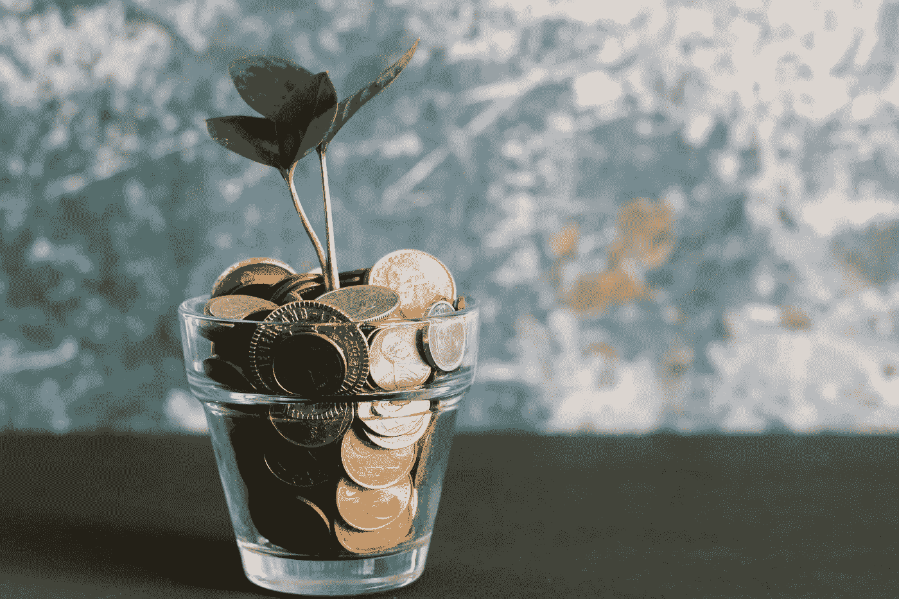

# 你还没准备好变得富有的 8 个迹象

> 原文：<https://medium.datadriveninvestor.com/8-signs-you-are-not-ready-to-become-rich-30c4b2b92586?source=collection_archive---------8----------------------->

## 你准备好挑战这些迹象了吗？

Photo by [Micheile Henderson](https://unsplash.com/@micheile?utm_source=unsplash&utm_medium=referral&utm_content=creditCopyText) on [Unsplash](https://unsplash.com/s/photos/rich?utm_source=unsplash&utm_medium=referral&utm_content=creditCopyText)

尽管你对“富有”的定义是主观的，但以下 8 个迹象表明，你还没有准备好变得像你希望的那样富有:

# 1.仅仅努力工作就会让我变得富有

即使你现在每月收入至少 10，000 美元，仅仅依靠你的日常工作收入和过节俭的生活可能会让你比平均水平更富有，但绝对不是你定义的富有。

如果你认为这是最有效的致富方式，那你就错了。任何日常工作都没有 100%的保证。时间会出乎意料地到来，你可能会面临减薪甚至裁员。看看现在。当所有人都对中美贸易战的经济影响感到担忧和谨慎时，冠状病毒从背后袭击了中国，并在短短两个月内导致全球经济暴跌。

 [## 更好的预算，打造更大的|数据驱动型投资者

### 即使是专家也承认它们并不完美。从 1 到 10 的范围内，安东尼·科普曼和德尔…

www.datadriveninvestor.com](https://www.datadriveninvestor.com/2018/11/08/budget-better-to-build-bigger/) 

研究表明，富人至少有 5 种收入来源，包括他们的日常工作。开始建立替代收入来源。开始时你可能挣得很少，但只要坚持下去，它至少会在你的日常工作收入受到威胁的那一天为你提供额外的保障。

# 2.储蓄和节俭的生活会让我变得富有

储蓄和节俭对于保持你的财富是必不可少的，但它们不是致富的方法。用三合一咖啡代替拿铁咖啡可以节省一些钱，这可以显著减少你一年的支出，但你不会因此成为千万富翁。

在通货膨胀时期，你什么都不做，你的钱只会贬值。例如，今天的一千美元在十年后将价值五百美元。你以为把钱存在银行里是安全的，结果却发现钱一年比一年少。

# 3.你认为变得富有不是你能决定的

这是一种危险的心态。富有并不是少数幸运者的特权。我们见过太多的人白手起家致富的例子，这并不完全是靠运气。他们中的许多人在致富的过程中并不是一帆风顺的。破产、债务和失败对他们来说都只是挑战的形式，他们必须克服这些挑战才能达到现在的位置。

# 4.只有当我变得更富有时，我才会投资

如果你的财务状况非常紧张，完全没有办法投资股票之类的东西，那就投资自己吧。这也是一种你可以马上进行的投资。学习新技能，多读书。好书中有许多黄金。光是这两点，就会让你在职业生涯中更有竞争力。

当你的可支配收入稍微多一点的时候，有各种低成本的方式投资股市。这不是富人的游戏。我们只需要谨慎，不要鲁莽。

# 5.关于如何增加我的财富，有太多的选择和不同的建议。对我来说太多了。

如果你想学得足够好，没有什么是简单的。编码很复杂。学习如何经营一家企业或一家初创公司是复杂的。为人父母真的让人不知所措。从某处开始。你可能比别人花更长的时间去学习一些东西，但这总比什么都不做要好。

# 6.有钱人有钱“扔”。我没有这样做的奢侈，因此我需要打它的安全。

这是我从富人那里学到的一课。富人实际上比你想象的更害怕冒险。股票市场上一美元的下跌对我们来说可能意味着几百到几千美元的损失，但对富人来说可能意味着数亿美元的损失。然而，计算风险和冲动风险是有区别的。他们知道不把所有资产放在一个篮子里的重要性，这样在危机时刻，他们的损失可以保持在最低水平。此外，回到不同的收入来源，他们也总是确保一些钱仍然来自其他来源。

# 7.所有的债务都是坏账

富人喜欢好债，他们知道如何利用好债。人们可以利用好的债务来获得更多的回报。例如，如果你从银行存款中获得的年利息高于贷款买房的年利息，那么考虑贷款。好债是为将来会增值的东西融资而产生的债务。另一方面，当支出随着时间的推移造成整体价值损失时，就会出现坏账。当然，当这种情况发生时，你必须尽可能多的支付以减少损失。

# 8.我有太多的生活责任，包括我要求很高的日常工作。后来我太累了，学不了这些。

事实是，如果你不下定决心去做任何事情，你永远也不会到达你想要的地方。

伯爵南丁格尔曾经说过，“如果你在你选择的领域每天多花一个小时学习，你将在五年或更短的时间内成为该领域的国家专家”。从这句话中我们可以得到的是，不需要每天花很多时间就能做好某件事。我知道你很忙。也许你对有一天成为国家金融专家不感兴趣，但是每天持续学习一小段时间就足以改变你的生活。

你准备好挑战这些迹象了吗？😉

感谢您的阅读:)