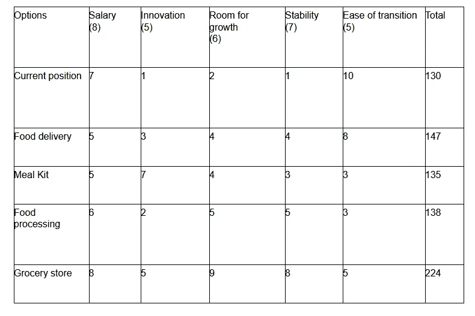

# 新冠肺炎疫情期间保护你职业生涯的 8 个步骤

> 原文：<https://medium.datadriveninvestor.com/8-steps-to-protect-your-career-during-the-covid-19-pandemic-1f702a2d795e?source=collection_archive---------12----------------------->

新冠肺炎打乱了我们生活的许多领域，包括我们的职业生涯。面对如此多的不确定性，当你为[的许多可能性](https://www.businessinsider.com/disaster-expert-companies-should-face-coronavirus-with-pessimism-2020-3)做准备时，拥有一份稳定的工作和职业比以往任何时候都重要。几个关键行业已经被连根拔起，T4 的失业人数已经跃升至历史最高水平，这让人们有充分的理由感到担忧。幸运的是，在这些不确定的时期，你可以采取一些措施来加强和保护你的职业生涯，以便在新冠肺炎冠状病毒疫情中生存和发展。

你应该定期评估你的工作安全性，不管是不是疫情，但现在尤其如此，因为稳定性尤其重要。捍卫你的职业需要坦诚的自我评估，并做出最好的决定。你需要做好准备，以防你被解雇，或者你的工作时间减少，或者你工作的公司——甚至你所在的行业——倒闭。在这种新的不正常情况下，你的目标是事业兴旺，而不仅仅是生存。

# 疫情期间做出明智职业决策的 8 个步骤

由于新冠肺炎疫情对餐饮业的毁灭性影响，我的一位[辅导](http://disasteravoidanceexperts.com/coaching)客户 Alex 曾在美国东北部一家拥有 24 家餐厅的区域连锁店担任首席运营官(首席运营官),她想探索将她的职业生涯转向不同的行业。

这些餐厅已经转向外卖模式，但面临着越来越大的亏损，她认为，如果疫情持续几个月以上，政府的救助可能无法拯救这家连锁店。她感到担心的是，为了进入一个新的行业，她很有可能不得不转换到一个较低的职位，但如果她坚持在餐饮业工作，她也会担心自己的未来。

 [## 人工智能如何在全球创造数百万个远程工作岗位|数据驱动的投资者

### 当人们谈论人工智能和就业市场时，他们经常谈论人工智能将如何从…

www.datadriveninvestor.com](https://www.datadriveninvestor.com/2020/02/26/how-ai-is-creating-millions-of-remote-jobs-around-the-world/) 

三月初，在疫情飓风全面来袭之前，亚历克斯向我寻求指导，我是她的高管教练。我向她推荐了一个 8 步决策过程，它解决了我们会犯的被称为[认知偏差](https://psycnet.apa.org/record/1996-01780-007)的危险判断错误，并在这个过程中指导她，帮助她做出[最明智、最有利可图的决定](https://disasteravoidanceexperts.com/nevergut/)。

# 步骤 1:确定启动决策过程的需求。当没有需要做出决定的明显危机时，或者当你的自然直觉让你不愿意承认需要做出艰难决定时，这种认识就显得尤为重要。最好的决策者会在事情变得紧急之前主动认识到决策的必要性，不要让直觉影响他们的决策能力。

Alex 已经决定评估转换到另一个角色和行业的决定，因此我们能够快速完成这一步。

# 第二步:就手头的问题从各种知情的角度收集相关信息。尤其重视那些你不同意的观点。矛盾的观点让你远离对直觉的依赖，并帮助你识别任何潜在的偏见盲点。

我让 Alex 从各种有相关观点的人那里收集信息。他们包括餐饮业的专业同事和导师；其他行业的联系人，如她的连锁餐厅的供应商；疫情问题专家；家庭成员受到她潜在转变的影响，尤其是她照顾孩子的全职丈夫。

特别是，我敦促她把她网络中那些跳槽到另一个行业的高管的意见包括进来，包括那些成功跳槽的和那些没有成功的。同样，我鼓励她与她的会计师进行一次严肃的谈话，考虑到疫情带来的苦难和不确定性，她是否有经济能力承受可能需要很长时间的求职。

# 第三步:收集数据，决定你想要达到的目标。为你的决策过程描绘一幅清晰的愿景。当看似一次性的决定是过程和实践中潜在问题的征兆时，认识到这一点尤为重要。让解决这些根本问题成为你想要实现的结果的一部分。

有了她手头的数据，我让 Alex 列出一个关键目标的列表，这个列表也应该解决潜在的问题。

确定的目标包括:

*   为了确保在一年之内，她有一个至少能支付她作为连锁餐厅首席运营官所得工资 75%的角色，根据她的会计师的指导，无论是留在连锁餐厅还是转向另一个行业
*   以确保如果她真的做出了改变，她有很大的职业发展空间
*   Alex 发现的一个潜在问题是，虽然她喜欢商业创新，但她经常与她当前公司的几个关键利益相关者发生争执，他们不想偏离传统的商业方法。她希望在换一个行业和公司时，她也能解决这个问题。因此，另一个目标是让她能够满足自己对创新的热情。

# 第四步:制定一个清晰的决策过程标准，衡量你希望如何实现愿景的各种选择。如果可能的话，在你开始考虑选择之前制定这些标准。我们的直觉使我们的决策标准偏向于鼓励某些符合我们本能的结果。因此，如果你在开始考虑选择之前没有制定标准，你会得到总体上更糟糕的决定。用 1(低)到 10(高)为每个标准的重要性排序。

亚历克斯提出了一些与转换相关的标准，并对它们进行了排序

她的优先级，低端 1 分，高端 10 分:

*   一年的薪水(8)
*   创新机会(5)
*   成长空间(6)
*   行业和公司在可预见的中长期未来的稳定性(7)
*   轻松过渡(5)

# 第五步:产生一些可行的选择，可以实现你的决策过程目标。我们经常陷入无法做出最佳决策的陷阱，尤其是在解决潜在挑战时。

# 为了解决这个问题，创造更多对我们来说直观的选项是非常重要的。否则，我们倾向于只产生 1 个或最多 2 个选项，并选择我们最初喜欢的选项，而不是真正考虑各种可能的未来来做出最有效的选择。

# 至少选择 5 个有吸引力的选项。请记住，这是一个集思广益的步骤，所以不要判断选项，即使它们可能看起来古怪或政治上不可接受。在我的咨询和指导经验中，最佳选择通常涉及从现成的和创新的选项中提取的元素。

起初，亚历克斯只列出了一个转换选项:很明显，她已经倾向于食品配送行业。然而，我说服她增加 3 个选项，这样她至少会有 5 个选项。她花了更多的时间考虑，最终提出了 5 个选项:

*   留在她现在的位置
*   食品配送行业
*   餐包行业
*   食品加工工业
*   杂货店行业

# 第六步:权衡这些选项，挑选最好的。在权衡选择的时候，不要跟着你最初的偏好走，尽你所能在严酷的光线下看到你自己偏好的选择。

# 此外，尽最大努力从你对提议者的看法中分别评估每个选项，以最小化个性、关系和内部政治对决策本身的影响。

在这一点上，亚历克斯仍然倾向于她喜欢的选择，即转向食品配送行业。她告诉我，她以前的一些同事也能够很容易地过渡到这个行业。

但是，我告诫她要仔细考虑和评估每一个选项，把每一个选项和向她推荐的人分开。我还敦促她首先考虑所有的可变因素，比如杂货店行业正在蓬勃发展，并将继续发展。

所以我们一起研究了每个选项，她根据每个标准变量对每个选项进行了排序。为此，我们制作了一个表格，左边是选项，上面是变量。然后，在根据相关标准对每个选项进行排序后，我们将排序乘以标准的权重。

Disaster Avoidance Avoidance

亚历克斯非常惊讶地发现，杂货店选项被证明比所有其他选项都好，包括她最喜欢的食品配送选项。这是因为杂货店因疫情而繁荣，到处都在雇佣工人和管理人员。

此外，那些与她交谈过的人预见到，疫情将导致人们获取食物方式的持久变化，人们将更加重视在家里吃饭，而不是在工作场所的餐馆或自助餐厅吃饭。鉴于人们比以前有更多的时间，并寻找让自己有事可做的方式，他们也预见到了外卖和套餐的转变，更多的人将时间花在烹饪上。

杂货店行业因此提供了更多的增长空间，稳定性和工资潜力

比她考虑的其他领域更重要。由于他们的大量招聘，她认为在那里过渡并不太困难。由于杂货店内有许多选择，他们也有很大的创新空间。

# 第七步:实现你选择的选项。为了执行决策，你需要最小化风险和最大化回报，因为你的目标是获得尽可能好的决策结果。

# 首先，想象决策完全失败。然后，头脑风暴导致这次失败的所有问题。

# 接下来，考虑如何解决这些问题，并将解决方案集成到您的实施计划中。

# 然后，想象这个决定绝对成功。头脑风暴成功的所有原因，考虑如何将这些原因带入生活，并将你所学到的整合到决策的实施中。

亚历克斯认为，向杂货店行业的转变失败了，原因有三:

*   缺乏合适的网络来寻找可能的工作机会；
*   不愿意承担组织层级中的下级角色；
*   首席运营官多年的发号施令所带来的学习新事物时的刻板态度

亚历克斯意识到，虽然她有广泛的关系网，但她培养的大多数专业联系人都来自餐饮业，所以她的关系网可能不足以求职。考虑到她为了成为首席运营官付出了多少努力和时间，她对不得不扮演一个较低级别的角色也有所保留。最后，她考虑到，如果她真的进入了一个非首席运营官的角色，那么不得不放弃自己的主导地位、追随别人的商业战略会有多困难。

Alex 对可能的解决方案进行了头脑风暴，并决定采取以下措施:

*   花一个月的时间拓展她的关系网，这样她就可以结交新的朋友，并结识杂货店行业的关键人物。
*   联系已经从高层领导职位上退下来的前同事和导师，听取他们的建议和见解，了解他们从这次经历中学到了什么。
*   找到一个好职位后，集中精力学习新技能，重温旧技能，深入了解食品杂货行业。这样，她可以集中精力成为高级管理层中有价值的一员，而不是纠结于任何“权力”

局限性。"

当她想象完失败并头脑风暴出解决方案后，Alex 开始想象转换到一个新的角色和行业的决定是成功的。

在思考了这一成功的潜在原因后，她认为这主要是因为她努力通过培养新的核心技能来有效地过渡到她的新角色和行业。除此之外，她还将自己在餐饮业的一些独特技能带到了杂货店行业，包括:

*   知道如何通过创造积极的客户体验来有效地服务客户
*   她在管理熟食配送方面的专业知识，这是一项至关重要的技能，因为在疫情期间，杂货店必须大量配送食物
*   广泛了解供应链如何运作，这是一项战略技能，因为杂货店行业也面临着供应链因疫情而中断的问题

# 第八步:评估决策的执行情况，并根据需要进行修改。

# 作为实施计划的一部分，制定清晰的成功标准，以便在整个实施过程中进行衡量。定期检查以确保实施达到或超过其成功标准。如果不是，根据需要修改实现。

# 有时候，你会意识到你也需要修改最初的决定，这没关系，只要回到你需要修改的步骤，然后再从那一步开始。更广泛地说，你会经常发现自己在这些步骤中来回走。这样做是做出重大决策的固有部分，并不表明你的过程中存在问题。

# 例如，假设你正处于选项生成阶段，你发现了相关的新信息。您可能需要返回并修改目标和标准阶段。

亚历克斯成功地转移了产业。不到 6 周，她就进入了一家大型食品连锁店，成为了熟食部的高级副总裁。虽然这比她在首席运营官的角色低了一级，但她能够获得的薪酬是她在以前公司担任首席运营官时的 85%，因为她加入了一个蓬勃发展的行业中一个更大的组织。

我指导她实施她的决策，她设定了以下成功标准:

*   通过每月增加 6 个来自杂货店行业的联系人来扩展她的网络
*   确定并努力掌握她在新角色和行业中取得成功所需的 4 项核心技能
*   在她的新网络中确定至少 6 个关键人物，每两周与他们讨论一次具体的行业问题
*   在这个新行业中培养导师

# 在新冠肺炎疫情为你的职业生涯找工作

当我最后一次在 5 月初通过视频会议与 Alex 聊天时，她高兴地告诉我，她可以轻松地过渡到她的新角色。她透露说，考虑到疫情的发展，当她换了工作和行业时，她感到宽慰和感激。她成功地拓展了自己在新行业的人脉，并找到了潜在的导师。

Alex 在求职过程中付出的大部分努力与一个典型的求职者相似，不管他是不是疫情人:

*   内部准备非常重要。你不能半途而废，这就是为什么应用本文讨论的 8 个步骤很重要。
*   在这个时代，网络变得更加强大，幸运的是，也更加灵活。由于目前的疫情，过去的面对面活动现在可以 100%虚拟化，这需要更少的时间，并大大扩展了您的地理范围。同事、联系人、导师、招聘人员和潜在雇主不会指望你像往常一样参加会议和面对面的介绍会。如今，简单地发送一封电子邮件或通过 LinkedIn 联系可以是一个良好的开端。
*   突出你的技能，但要放在疫情的背景下。以前，你会在面试中列举你的技能将如何满足一个部门或公司的需求，而这一次，你需要在这种新的不正常的背景下框定你的技能。准备好被问到与大流行相关的问题，也准备好问这些问题。鉴于许多公司已经转向虚拟设置，如果你有丰富的远程工作经验，或者在以前的职位上能够解决在家工作的相关问题，现在就是强调这一点的时候了。
*   耐心作为一种美德，其价值加倍。考虑到招聘和雇用流程现在可能需要更长的时间，因为招聘和管理团队需要考虑许多事情。做好准备，等待面试后的最新消息，或者收到工作邀请，或者被录用。但也要做好快速回复的准备，因为在当今以虚拟为中心的环境中，人们更希望在 12-24 小时内回复电子邮件。

# 结论

虽然许多人会满足于他们的工作，仅仅是在这个疫情生存，你真的想成为定居的人吗？或者你想有工作保障和职业发展来帮助你实现你真正的职业潜力？如果你愿意对自己的职业生涯进行一次坦率的评估，并采取最佳决策步骤来实现成功的职业转变，你就能做到这一点。

# 关键外卖

> 在这段疫情期间，换工作或换行业不仅是可能的，而且对实现你的职业潜力至关重要。使用最好的决策步骤，这样你和你的事业才能茁壮成长，而不仅仅是生存。→ [点击发微博](https://twitter.com/intent/tweet?text=Changing%20jobs%20or%20industries%20during%20this%20pandemic%20is%20not%20only%20possible%2C%20but%20might%20be%20critically%20important%20for%20achieving%20your%20career%20potential.%20Use%20the%20best%20decision-making%20steps%20so%20that%20you%20and%20your%20career%20can%20thrive%2C%20not%20just%20survive.%20&url=https%3A%2F%2Fbit.ly%2F30OMTHx&via=Gleb_Tsipursky)

# 需要考虑的问题(请在下面分享您的答案)

*   在这次疫情期间，你对转行有什么顾虑？
*   文章中的哪些内容可能会帮助你转换工作或行业？
*   根据阅读这篇文章，你将采取哪些后续步骤？

图片来源: [Pixabay](https://www.pexels.com/photo/person-people-woman-laptop-4192890/)

— -

**Bio** :国际公认的思想领袖，被称为灾难规避专家，[Gleb Tsipursky](https://disasteravoidanceexperts.com/glebtsipursky/)博士的使命是通过制定最有效的决策策略来保护领导者免受被称为认知偏差的危险判断错误的影响。作为一名畅销书作家，他最著名的作品是《T4》*《永远不要跟着感觉走:先锋领导者如何做出最佳决策并避免商业灾难* (职业出版社，2019 年)、《我们之间的盲点:如何克服无意识的认知偏见并建立更好的关系 (《新先驱》，2020 年)和《韧性:适应并计划新冠肺炎冠状病毒疫情 (《变革者图书》，2020 年)他发表了 550 多篇文章，接受了 450 多个知名媒体的采访，如[*Inc .*](https://www.inc.com/entrepreneurs-organization/a-behavioral-scientist-explains-why-your-swot-analysis-is-dangerously-flawed.html)[*企业家*](https://www.entrepreneur.com/article/348115)[*CBS 新闻*](https://www.cbsnews.com/video/study-says-taking-a-small-break-from-facebook-might-be-good-for-your-mental-health/)[*时代*](http://time.com/4257876/wounded-warrior-project-scandal/)[*商业内幕*](https://www.businessinsider.com/disaster-expert-companies-should-face-coronavirus-with-pessimism-2020-3)[*政府官员*](http://www.govexec.com/excellence/promising-practices/2017/03/heres-why-your-gut-instinct-wrong-work-and-how-know-when-it-isnt/136104/)[他的专业知识来自于作为](https://disasteravoidanceexperts.com/NeverGut/)[避灾专家](http://disasteravoidanceexperts.com/)的 CEO，20 多年的[咨询](https://disasteravoidanceexperts.com/consulting/)、[辅导](https://disasteravoidanceexperts.com/coaching/)、[演讲和培训](https://disasteravoidanceexperts.com/speaking/)。这也源于[作为一名行为经济学家和认知神经科学家在学术界超过 15 年的](http://disasteravoidanceexperts.com/research)。通过 Gleb[at]DisasterAvoidanceExperts[dot]com、Twitter[@ Gleb _ tsipursky](https://twitter.com/Gleb_Tsipursky)、insta gram[@ dr _ Gleb _ tsipursky](https://www.instagram.com/dr_gleb_tsipursky/)、 [LinkedIn](https://www.linkedin.com/in/dr-gleb-tsipursky/) 联系他，注册他的免费[明智决策者课程](https://disasteravoidanceexperts.com/newsletter/)。

## 访问专家视图— [订阅 DDI 英特尔](https://datadriveninvestor.com/ddi-intel)