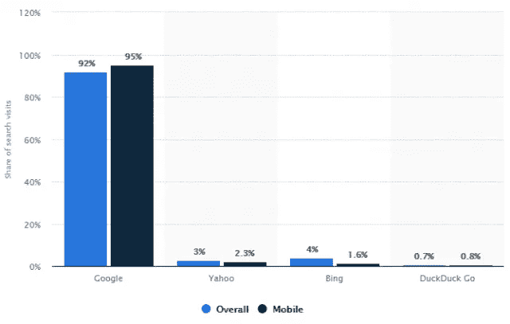
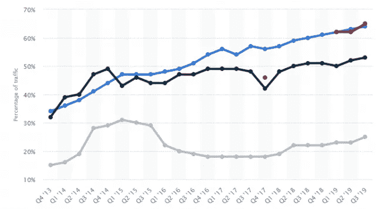

# 决定网站成功的 8 个 SEO 技术因素

> 原文：<https://medium.datadriveninvestor.com/8-technical-seo-factors-that-decide-website-success-443b6006e35a?source=collection_archive---------7----------------------->

Photo by [Webaroo.com.au](https://unsplash.com/@webaroo?utm_source=medium&utm_medium=referral) on [Unsplash](https://unsplash.com?utm_source=medium&utm_medium=referral)

技术型 SEO 的哪些要素是一个成功网站的决定因素？由于争夺谷歌首页更高排名的竞争是一个持续的游戏，每个营销人员都想频繁提升他们的 SEO 策略。

这种方法将有助于提高搜索引擎排名。请注意，您的网站排名取决于许多因素，包括页面内 SEO 和页面外 SEO 技术。

这使得技术性搜索引擎优化对网站的成功更加重要。它是潜在的力量，成为你的博客不断增长的超级结构的基础。

然而:

# 什么是技术型 SEO？

技术搜索引擎优化意味着优化你的网站，以帮助谷歌机器人了解你的网站内容，并可能增加谷歌搜索引擎排名。这种 SEO 技术可以帮助搜索引擎蜘蛛更有效地抓取和索引你的站点。

它还提高了有机搜索排名，增加了网站流量。我们稍后将讨论一些组件。但首先，让我们了解为什么技术搜索引擎优化是至关重要的数字营销战略。

# 为什么技术型 SEO 如此重要？

将 SEO 技术应用到你的数字营销策略中主要是为了增加流量和赚钱。因此，改善网站用户体验(UX)将有助于你实现你的目标。

尽管如此，技术搜索引擎优化不是只有搜索引擎优化营销策略，以促进您的搜索引擎优化目标。你需要更多的营销策略才能成功。但是一个精确的技术搜索引擎优化会让你做其他的事情更容易。

此外，尽管搜索引擎爬虫在抓取、理解网站信息和索引网页方面变得越来越聪明，但这些机器并非完美无瑕。甚至人类也会犯错。

因此，如果谷歌爬虫无法确定你的网站内容，搜索机器人将通过而不在搜索结果中显示你的页面。此外，当考虑如何实现技术搜索引擎优化，你必须记住网站类别太多。

既然有专门负责网站排名的技术性 SEO 要素，那么功能性 SEO 要素将有助于提升网站优化，改善用户体验。它确保你的网站为谷歌爬虫提供一个合适的设置，提供最佳的性能。

现在，让我们看看:

# 决定网站成功的 8 个 SEO 技术因素。

## 1.爬行错误

谷歌不对网页进行排名；它无法访问。[抓取错误](https://support.google.com/webmasters/answer/9073702?hl=en)给网站在 SERP 上的出现制造麻烦。如果搜索机器人无法抓取和找到你的网站，那么你必须检查抓取错误。

由于这些技术错误，观众可能无法访问您的网站。此外，如果有任何爬行错误，键入搜索查询的用户无法在 SERP 上找到信息。

爬行错误报告主要包括站点错误和 URL 错误。如果 DNS 服务器关闭，将会出现 DNS 错误。然而，人们通常在启动他们的网站时忘记更新 robot.txt 文件。

让 Google bot 抓取你所有的页面，或者你可以屏蔽你网站上的页面。您必须对网站的 robot.txt 文件进行彻底的审核。许多爬虫和审计工具可以帮助你启动你的站点而没有爬行错误。

您可以使用谷歌搜索控制台中的“获取为谷歌工具”来检查您的网站。

> *相关帖子:* [*什么是抓取预算？以及如何优化*](https://www.mossmedia.biz/what-is-a-crawl-budget-how-optimize-crawl-budget/)

## 2.为技术搜索引擎优化优化网站

如前所述，如果谷歌蜘蛛无法理解你的内容或充分访问你的网站，出现在搜索结果上的可能性就变得很小——这意味着你不会在谷歌上排名。

所以，如果你想让你的网站成功，从技术角度优化你的网站是至关重要的。也就是说，你可以观看这个视频来了解搜索引擎是如何工作的。

Video material via [Reliable Soft](https://www.reliablesoft.net/how-search-engines-work/).

## 3.你的网站加载时间有多长？

网站速度是网站成功的关键因素。谷歌搜索控制台挑选网站速度好的博客进行排名。如果你的博客或网站的跳出率很高是因为加载速度慢，这也会对排名产生负面影响。

页面加载缓慢也会影响抓取，从而影响网站索引。小小的延误也会让你失去大量的读者。因此，如果你的网站需要时间来加载，尤其是在移动平台上，它可能不会显示在谷歌搜索引擎结果页面(SERPs)上。

但是通过优化站点速度，你会在有机搜索中得到很好的结果。你可以在网上的工具上检查你的网站速度，比如 Google PageSpeed Insight。

这些工具将通过分析您的网站内容来帮助您提高网站速度，并提供关于如何使您的页面加载更快的有用数据。

## 4.网站安全(HTTPS)

网站安全是谷歌排名的关键因素。HTTPS 是信息通过网络浏览器和网站安全传递的礼仪。HTTPS 协议保护网络用户免受中间人攻击。

这种攻击可能发生在不安全的网站上。从那里，黑客可以用不同的方式攻击您的网站，包括:

*   暴力攻击
*   XSS 攻击
*   SQL 注入
*   身份盗窃
*   让你的网站崩溃
*   窃取有价值的数据

因此，HTTPS 非常有用，因为它保护用户数据和网络通信免受窥探。这就是为什么谷歌认为这是一个令人难以置信的技术搜索引擎优化因素。如果你的博客或网站不安全，确保升级到 HTTPS。

## 5.XML 站点地图

您必须提交一个正确的 XML 网站地图到谷歌搜索控制台，以便它帮助谷歌爬虫定位网页，并相应地在搜索结果页面上排列它们。网站管理员使用网站地图来形成网站结构，这种方式可以让谷歌索引你的网站更快。

因此，你的网站架构应该是正确的，因为它可以帮助用户轻松地浏览网站。所以你的站点地图必须遵循 XML 站点地图协议。

## 6.元描述和标签

如果你想让你的 SEO 策略有效，那么优化 SEO 的标题标签、元标签和元描述是成功的关键。彻底的关键字研究和关键字的战略布局有助于优化元描述和标签。

但是，请不要让你的元数据过载关键字。它可能会受到谷歌的处罚。所以，还是认真写你的元描述比较好。

说到元数据:

## 什么是元数据？

元数据是提供其他数据细节的信息。它描述和总结了有关数据的信息。请注意，元数据有多种类型，包括:

1.  描述性元数据
2.  结构化元数据，
3.  管理元数据
4.  参考元数据
5.  统计元数据

然而，它们都提供了关于其他数据的事实。因此，元描述的长度应该在字符限制内。谷歌不会在搜索引擎结果页面(SERP)上显示冗长的元描述。

所以它不会考虑你的网站排名，如果 MD 太长的话。标题标签有助于通知搜索引擎关于页面的信息，从而影响排名。此外，元数据必须足够吸引用户点击。

## 7.你的网站对手机友好吗？

据统计，美国占付费谷歌搜索结果移动点击量的 65%。

进一步的研究表明，从 2013 年到 2019 年，谷歌在美国的移动有机搜索稳步增长。数据显示，谷歌在此期间最大化了 95%的移动搜索总量。

因此，你必须让你的网站对手机友好。由于谷歌已经转向移动优先索引，有必要使您的网站移动优化。

因为谷歌搜索指数将网站移动版排在第一位，[建立一个移动友好的网站](https://www.wolftain.com/web-design-and-development.html)是保持游戏顶端的必要条件。你可能会注意到谷歌的移动优先指数排名有所下降。

所以，最好是运行一个手机友好的测试来审计你的网站。你可能想要评估的其他 SEO 技术因素是断开的链接和重复的内容。错误 404 或断开的链接会严重影响您的网站在 Google 上的抓取和索引。

负面影响也会影响你网站的可信度，因为它减少了网站的流量。因此，对 404 错误页面进行强制检查，以确保不会出现此类问题。

重复内容是你需要解决的另一个 SEO 技术因素。首先，它降低了网站的可靠性——让你的观众缺乏信任。其次，如果你的网站上有几个重复的内容，谷歌搜索可能会处罚你的博客。

## 8.网站域名管理机构

域名权威是 SEO 必不可少的技术因素吗？是的，它是！谷歌将域名权威作为决定网站质量和向搜索者展示哪些博客的决定性因素。

它决定了一个网站的影响力取决于指向该网站的链接的质量。Moz 从 0 到 100 的范围内评估一个网站的权威性。Moz 还根据网站的年龄来决定其域名权限。这种方法意味着旧域名获得谷歌排名青睐，在搜索中排名更高。

然而，通过正确的方法和 SEO 策略，你可以提高你的排名。例如，如果你在你的网站上添加了一个博客，它可以提高你获得更高排名的可能性超过 400%。这怎么可能呢？

通过定期在你的博客上发布信息内容——内容片段、你的读者和 Google love，你的博客将有助于提升网站用户体验。你可能已经知道，网络 UX 是谷歌的重中之重。

因此，如果你还没有博客，就在你的网站上添加一个，然后应用其他的搜索引擎优化最佳实践来发展你的网站。

# 总结技术搜索引擎优化

技术 SEO 元素和其他 SEO 排名因素一样重要。多年来，搜索引擎优化专家已经设计了新的网站优化公式。但是当创建一个新网站时，一些基本规则总是适用的。

如果你想在博客或网站排名的竞赛中领先，那么你必须在启动网站之前做一个详细的[网站审计](https://mossmedia.biz/seo-website-audit-tools)。如果你正在寻找一些搜索引擎优化的建议，请随时询问我们的专家。

*本文首发于* [*摩斯传媒*](https://www.mossmedia.biz/technical-seo-factors/)