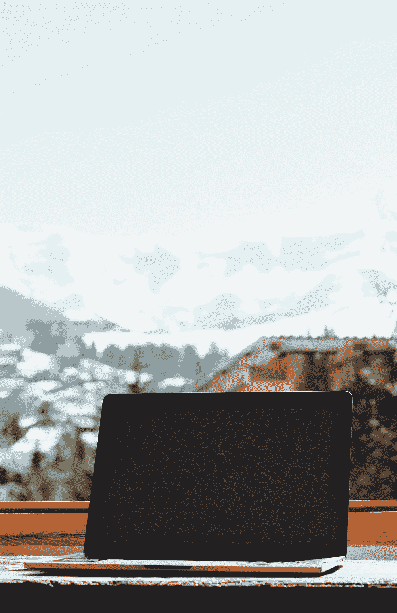

# 外汇交易教会我生活的 8 件事

> 原文：<https://medium.datadriveninvestor.com/8-things-forex-trading-taught-me-about-life-656f23c8f466?source=collection_archive---------4----------------------->

Photo by [Haut Risque](https://unsplash.com/@hautrisque?utm_source=medium&utm_medium=referral) on [Unsplash](https://unsplash.com?utm_source=medium&utm_medium=referral)

我第一次在金融交易的世界里跌跌撞撞，太激动了。这些图表上的价格波动非常诱人。我很兴奋——真的很兴奋——尤其是想到在短短 5 分钟或更短的时间内就能真正赚到钱。

我做到了。

没有经验，只是猜测，我有一些运气，在前 10 次左右的交易中，我赚了 85%的钱…

我觉得自己战无不胜。肾上腺素飙升到了空前的高度。

我的自我$1B。

我认为我是一个交易天才。90%的交易者失败了..呵？

在我看来，我就是为此而生的。或者这是专为我设计的。Idk。

然后就发生了…

我还记得我的运气走下坡路的准确时刻。还有我的钱。

我太紧张了。好害怕。我可以“触摸”到我的恐惧。我再也想不清楚了。

我很害怕失去那些钱。于是我开始做那个‘复仇交易’。你通过更大的、风险更高的、通常是非理性的交易来收回你的钱。

又交易了 6 次，我的账户少于 10 美元。这笔钱甚至没有资格提取。
我想我生病了。从 100 到 0 真的很快，整个场景就像一个糟糕的笑话。

我当时 19 岁。

我对妈妈撒谎说，我欠了一些债，急需偿还。

当她给我现金时，我立即把钱存入我的卡，加入这个交易行列，快速赚钱。

我有计划了。我计划赚些钱，然后买些东西，兴奋地回家。一千美元。

然而，仅仅两个小时后，我就一无所有了。我沮丧得想哭。

我妈妈仍然知道我有债要还。

无论如何，我仍然被这种交易的东西所吸引。我发誓要做好它。

我知道这是我想长期做的事情。因此，我开始阅读书籍、视频和所有我能找到的关于这个主题的资料。

当我练习时，我意识到我从交易中学到的一些经验不仅适用于其他交易领域，如股票和指数，也适用于“实际的”商业和生活。

我从交易中学到的关于生活的事情。

**1:生命是季节性的。**

在外汇交易中，有看涨期(当一种货币走强并上涨时)，看跌期(当一种货币走弱时)和巩固期(当它刚刚出现，就像一个行动缓慢的时期)。

生活中也一样，有时候生活变得很美好。太棒了。也很神奇。你会经历惊人的成长，也许是快速的成长。也有一些时候，事情似乎变坏了，或者没有好事发生。

要明白生活是季节性的。并不是所有时候生活都会令人惊奇。拥抱所有的季节，明白它们只是季节。他们总是在变。

不要试图抓住一个很久以前的季节不放。又一个来了。

**第二:第一次尝试新事物，你会很糟糕。**

接受你不知道某事的事实。并且愿意提高你的技能。我们总是把自己和专业人士相比，那些真正擅长某件事的专家会感到自卑。

好像我们永远不会像他们一样专业。

快讯:他们一开始也很糟糕。

当我刚开始交易的时候，论坛上有这样一句话提醒我

> 要成为某方面的专家，至少需要 10，000 个小时

这是一个很好的激励，因为知道高层的人也曾经是初学者。

不要生闷气，不要自怨自艾。不要放弃。坚持不懈地做好你正在做的事情，你也会逐渐达到顶峰。

 [## 为什么大多数人在日内交易中亏损(以及如何不成为他们中的一员)|数据驱动的投资者

### 日内交易很难，大多数人都赔钱。我确实有。事实上，我曾经在一个单一的损失更多的钱…

www.datadriveninvestor.com](https://www.datadriveninvestor.com/2020/09/23/why-most-people-lose-money-day-trading-and-how-to-not-be-one-of-them/) 

情绪是一个陷阱。

我们大多数人对自己的感觉和情感认同过深——这是我们问题的一个主要原因。

当我们如此沉浸在自己的感情中时，有多少决定已经作出？

在交易中，规则是，进来之前把你的情绪留在门口。
因为，太深陷于我们的情感会让我们失去理性。它影响我们正确交易的决定。

显然，你不能把情绪留在大门旁边。当你交易的时候，或者更重要的是当你生活的时候

但是你可以意识到你的情绪。当你纯粹出于感觉而没有任何理性地做决定时，要有意识。

在这种生活中，你想笑就笑，想哭就哭，只要知道什么时候搁置你的情绪，以提高你在一种情况下的清晰度。

基于强烈情绪的决定大多以后悔告终。

4:时机是关键。

这比你想象的要重要得多。

这让我想起了肯尼·罗杰斯的《赌徒》这首歌

> “你必须知道什么时候坚持。知道什么时候坚持，知道什么时候走开，知道什么时候逃跑。”

知道什么时候做新的事情，什么时候继续做，更重要的是，知道什么时候放弃。

止损在交易中和在现实生活中一样真实。

知道跑步的准确时间是很重要的。

否则，你会在这个没有前途的职业上多呆 10 年，不开心，痛苦。
同样，过早做事也是灾难性的。

对待你的生活事件一个射手在正确的时间把他的箭射向准确的地点。
做你人生的弓箭手。

快节奏的生活很可能会要了你的命。

像大多数新手交易者一样，我在疯狂波动的 1 分钟时间框架内交易。

赚快钱。导致账户快速死亡。
谢天谢地，这是一个帐户的死亡。

在现实生活中，这是现实生活的死亡。

看看有多少事故是因为超速造成的。

目前，作为一个社会，我们需要学习耐心。这么多人想马上变得富有、出名或快乐，看看效果如何。一个压抑、不快乐、只是疲惫的社会。

成长是一个过程。
练习耐心。*大量的*耐心。*和更多的*耐心。

这种“马上得到我想要的”的生活是目前世界上抑郁和不快乐的主要原因。

延迟满足是值得拥抱的。这样做的人并不愚蠢——与人们的想法相反。

拥抱缓慢而有目的的成长。因为这是唯一的办法。

**6:放下不断的控制欲。**

人生不期而遇。

你为那次面试做了充分的准备。你也完全有资格做这项工作。

你做得很好。

你走了很长的路才来到这里。

你很兴奋。紧张是因为这份工作是你人生的决定性时刻。

你等着那个说你加入的电话快疯了。

没事的。有这种感觉是正常的。

但是要明白这就是生活。就像交易一样，它天生就不守规矩。如果你的计划失败了，你会从天上掉下来——这真的很痛苦。

把自己从高期望和兴奋中释放出来，等待生活的展开。相信生活正朝着正确的方向发展。

如果你的计划没有按计划进行，把它当成是为了更好的未来而重新定向。那就出去再试一次。

7:在几件事情上变得真正擅长，你可以轻而易举地完成其余的事情。

在生活中，你不可能什么都知道。即使在你的激情和才能方面，你也不可能擅长所有的事情。

所以，决定你愿意发展的主要技能，并真正擅长它们。

你可以用 5 个或更少的货币对在外汇交易中赚很多钱。你也可以通过 5 件或更少你真正擅长的事情过上美好的生活。

假设你是一名篮球运动员。

你只会打篮球。你变得如此优秀，成为世界篮球冠军。

这一项技能足以让你过上最终的生活。选择进入创业或娱乐领域是不必要的。这是可选的。

假设你也非常擅长房地产投资和电视表演。你现在有 3 个主要技能。那足够养活你了。

除了你真正擅长的技能之外，你可以在其他方面表现平平。生活会很好的。

不要试图结束一切。忽略炒作和 ***只做你*** 。

**8:大部分事情都不值得。**

学会淹没噪音。

交易中有太多的假警报。你看到一个货币对上涨，但在一小时后反转，接下来几天看跌。

同样，生活中有如此多的虚假警报。你认为你已经准备好和你的前任复合了，否则如果你不在抖音，你会死的。但生活就是生活；给你假信号看你上钩。

现代社会有太多令人分心的事物。学会解读那些真正值得的东西，因为大多数都不值得。

你看得越远，越能决定你生活中真正需要的是什么，就越容易过滤周围的噪音。只要知道你要去哪里。

神秘的巫师们说，勤奋地学习一件事情——甚至是一个小沙粒——可以教会你宇宙的所有秘密。

> 你所要做的就是凝视一粒简单的沙子，你会在其中看到所有创造的奇迹。炼金术士保罗·柯艾略。

我不知道宇宙的秘密，也不知道它们是什么。但是我确信我们可以通过开放和观察我们周围的事物来了解生活是如何运作的。甚至一片落叶或一只狗的叫声都能教会你一些东西。

意识到你身边发生的事情。你学东西更快，这也会让你的生活更轻松。

## 访问专家视图— [订阅 DDI 英特尔](https://datadriveninvestor.com/ddi-intel)