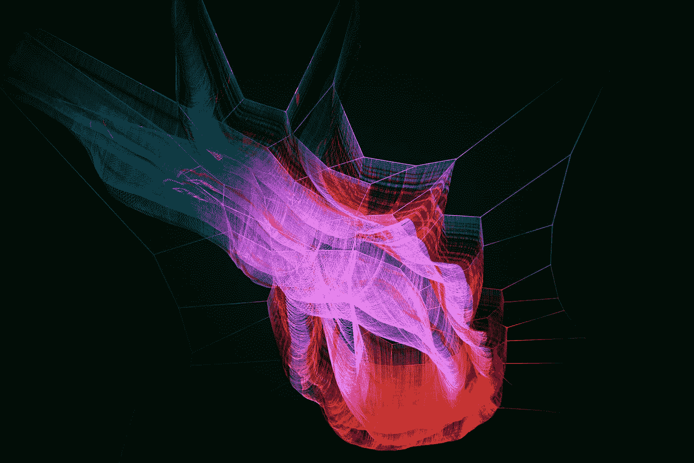

# 参与区块链的 8 个技巧——初学者指南

> 原文：<https://medium.datadriveninvestor.com/8-tips-for-getting-involved-in-blockchain-a-beginners-guide-7732e94f1f94?source=collection_archive---------8----------------------->

“如果你想走得快，就一个人走。想走远，就一起走。”~非洲谚语。

Photo by [Arif Wahid](https://unsplash.com/@arifrw?utm_source=medium&utm_medium=referral) on [Unsplash](https://unsplash.com?utm_source=medium&utm_medium=referral)

我能告诉你我是如何进入区块链的故事，并与你分享我从那次经历中学到的东西吗？

> 如果你喜欢只看我的最佳建议，请随意跳到最后，如果你对你的最佳建议有任何建议，请留下评论。

# 区块链如何改变货币和商业

大约五年前，我看过一个 Ted 演讲，讲的是一个优步式的演讲，当一个人在国外工作的时候，他会把钱寄回家给所爱的人。

这种新的金融服务为所有人带来了更具包容性的经济未来的希望。这种未来的希望更便宜、更安全，而且不需要中央集权的公司把钱汇回另一个国家。

 [## “区块链如何改变货币和商业”的文字记录

### TED Talk Subtitles and Transcript:什么是区块链？不知道就应该；如果你这样做，很可能你…

www.ted.com](https://www.ted.com/talks/don_tapscott_how_the_blockchain_is_changing_money_and_business/transcript) 

唐·塔斯考特的 Ted 演讲抓住了我的想象力，我迷上了这个新兴行业。

> 这种似乎在挑战现状的创新新技术是什么？

这似乎好得难以置信，因为这项技术也试图为所有全球公民带来经济利益。

在我迷失在区块链的炒作之前，首先，我是一名女商人。我在 2008 年前后都在金融部门工作过，所以我谨慎地进入了区块链。

我戴上怀疑的帽子——研究和分析这个新技术和市场。实质上，我继续在区块链疯狂学习，与区块链社区和一些慷慨地给我时间的区块链 CEO 接触。

## 闪亮的灯光

让我印象深刻的是我在这个行业中遇到的所有人(不管这项技术在未来如何发展和壮大)，有一个由才华横溢的人组成的社区，他们与区块链技术一起解决现实世界的问题。

在我的同龄人和同事中，我被称为区块链的头号极客。不到一年后，我在纽约向一群分析师、高级经理和董事做了第一次区块链市场研究报告。

在那里，我被要求向公司财务主管协会等团体做更多的介绍，将我的商业知识与快速发展的区块链市场结合起来。

 [## 5 行业转型区块链应用|数据驱动投资者

### 除非你一直生活在岩石下，否则我相信你现在已经听说过区块链了。而区块链…

www.datadriveninvestor.com](https://www.datadriveninvestor.com/2019/02/13/5-real-world-blockchain-applications/) 

区块链可能会令人困惑，因为它违背了正常的商业战略。从很多方面来说，我认为区块链是反文化的，这让任何人都很难理解。因此，你怎么知道你的研究和开发预算是否是正确的呢？

帮助人们理解这项技术对他们的业务和依赖的供应链意味着什么是一种特权。

Photo by [The New York Public Library](https://unsplash.com/@nypl?utm_source=medium&utm_medium=referral) on [Unsplash](https://unsplash.com?utm_source=medium&utm_medium=referral)

# 近 20 亿人无法获得银行服务

值得记住的是，世界上大约有 17 亿人享受不到银行服务，有些人认为这是理所当然的。

本质上，这有很多原因；

1.  **了解你的客户—** 了解你的客户在身份识别方面的复杂性是金融普惠的一个障碍。

在现实中，KYC 可能会阻碍金融普惠，因为如果你没有身份证，你怎么能设立一个银行账户。这实际上成了一个恶性循环，尤其是当你搬到一个新的国家，或者没有地址或水电费账单的时候。

身份是区块链的另一个用例，但是我将把细节留到以后再说。

2.**支付能力**——银行服务不是免费的，如果你很少或没有钱生活，一个人如何支付他们所需的银行服务。

3.**缺乏基础设施**——a)实际上无法去当地的分支机构，或者 b)如果您无法通过互联网获得服务，则需要在线服务。

网上的另一个问题是保护那些通常不以这种方式访问服务的人免受网络掠夺者的攻击。

以上只是三个原因，还有很多其他原因导致不是每个人都能参与到全球经济中来，这是一个值得解决的问题。

虽然有些人使用术语“技术为善”，但我不喜欢这个术语，除非是由面临问题的人来领导。我赞赏像 Manumit Coffee 这样的公司，这是一个由幸存者领导的反对现代奴隶制的组织，更多的组织应该采取这种商业模式。

 [## Manumit 咖啡

### Manumit 通过培训和就业为现代奴隶制的幸存者提供尊严和希望。我们的咖啡是由…烘焙的

manumitcoffee.co.uk](https://manumitcoffee.co.uk/) 

> 在帮助他人时，我们的方式不一定是实现新事物的唯一或正确的方式。

> **一句告诫的话；我不认为区块链能解决所有商业问题。我最近在《数据驱动投资者》——2050 年我们将如何赚钱生活？—列出了我认为在使用区块链作为解决方案之前应该问的问题。**

 [## 2050 年我们将如何挣钱生活？

### 区块链是信任，信任是支撑商业和就业的基础货币。

medium.com](https://medium.com/datadriveninvestor/how-will-we-earn-money-to-live-in-2050-b81e9a5353d3) 

# 区块链事件

2018 年，我开始对区块链事件感到疲劳——老实说，我已经以多种方式多次听到了同样的陈述。我报名参加了阿尔格兰德·区块链聚会，在路上，我迷路了，差点掉头就没去。那是一个寒冷、黑暗、多雨的冬天夜晚，我可能参加了太多的演讲。

坐在礼堂里听麻省理工学院教授西尔维奥·麦克利谈论他的区块链创新和经济学令人耳目一新。

西尔维奥给人的印象是聪明、谦逊、善良，甚至在回答另一家著名的区块链初创企业的冷淡问题时也表现得热情、睿智和镇定。

我坐在那里，思考着如何参与这个区块链项目，因为这个区块链很特别。不到一个月后，我加入了阿尔格兰德，成为他们全球大使计划的一部分。

2018 年只有少数几位大使，现在 2020 年，全球有超过 100 位大使。作为分享区块链和经济观点的全球知识库的一部分，解决现实世界的问题是具有挑战性和激励性的，为该领域带来了新的观点和意见。

毕竟，区块链的核心是以社区为中心。

# 阿尔格兰德

我相信阿尔格兰德是区块链地区保守得最好的秘密之一。最近成为头条新闻的成就是区块链和金融业的里程碑；

**马绍尔群岛利用阿尔格兰德和 SFB 技术推出世界上第一种国家数字货币**

SFB 技术公司宣布，世界上第一种国家数字货币——马绍尔主权货币(SOV)的区块链将采用 Algorand 技术建造。

SOV 将与美元一起流通，并帮助马绍尔群岛在全球经济中有效运作。

 [## 马绍尔群岛将与阿尔格兰德和 SFB 联手推出全球首个国家数字货币…

### (2020 年 3 月 2 日)-SFB 科技公司今天宣布，区块链为全球首个国家数字…

www.algorand.com](https://www.algorand.com/resources/news/marshall-islands-to-power-worlds-first-national-digital) 

# 我认为另外三个值得注意的真实用例是:

## 1.星球观察:全球空气质量监测倡议

PlanetWatch 将利用阿尔格兰德区块链和物联网(IoT)技术建立世界上第一个不可变的空气质量账本。

PlanetWatch 将从空气质量传感器收集的数据存储在阿尔格兰德区块链上，随后通过向传感器所有者分发公用事业令牌“星球令牌”来奖励对生态系统的贡献。

 [## Planetwatch.io -

### 你的星球需要你

www.planetwatch.io](https://www.planetwatch.io/) 

**2。SIAE:开放高效的区块链版权管理解决方案**

世界第六大收藏协会 SIAE 将与 Algorand 合作开发一个新的版权管理开放生态系统。他们的合作将允许工具和服务的发展和加强，并创建新的和可访问的解决方案，进一步提高效率和中介活动。

 [## SIAE 与阿尔格兰德合作，高效管理区块链版权

### 罗马，2019 年 12 月 6 日—意大利集体版权管理公司 SIAE 将与…

www.algorand.com](https://www.algorand.com/resources/blog/siae-partners-with-algorand-for-efficient-management) 

**3。世界象棋:Algorand 区块链和伦敦证券交易所的混合 IPO 计划**

世界象棋已经宣布了混合首次公开募股的计划，将通过首先在 Algorand 的区块链上发行数字令牌来筹集资金。由 Algorand Standard Assets 和 Securitize 的数字合规解决方案实现。

 [## 阿尔格兰德与世界象棋合作，成为国际棋联大奖赛官方区块链合作伙伴…

### 马萨诸塞州波士顿——2019 年 7 月 18 日——开源软件和区块链技术公司 Algorand 今天宣布了一项…

www.algorand.com](https://www.algorand.com/resources/news/world_chess_blockchain) 

我认为这些区块链项目很重要，因为它们正在应对气候变化等世界问题，并在这场最后的工业革命中让传统企业与我们站在一起。

## 参与区块链活动的最佳建议

1.  做你的研究
2.  警惕骗局
3.  了解许多不同的区块链项目
4.  加入一个著名的区块链项目松弛或不和谐渠道
5.  参加聚会和会议
6.  做一个免费的在线课程。我从 Hyperledger 开始，如果你以前没有区块链知识，它是非常容易理解的
7.  开发人员参与其中——algrand 的编程语言简单方便
8.  企业参与到对话中，并提出具有挑战性的问题

## 结论

区块链要想成功，企业和个人的思维方式都必须彻底改变。

我们需要摆脱导致不健康竞争和阻碍创新的稀缺思维。在这个勇敢的新世界里，我们当然不能保护主义或排斥我们的创新。

我想象我们未来的教育系统和管理机构将会与今天截然不同，以跟上我们生活的这个迷人但有时令人恐惧的时代的变化步伐。我认为区块链可以帮助改变社会。

## 取得联系

如果你想了解更多关于区块链的见解，请查看我在[区块链侦察](http://blockchainscout.co.uk/)上的其他文章，或者在[媒体](https://medium.com/@e_nicleoid)或[推特](https://twitter.com/e_nicleoid)上关注我。