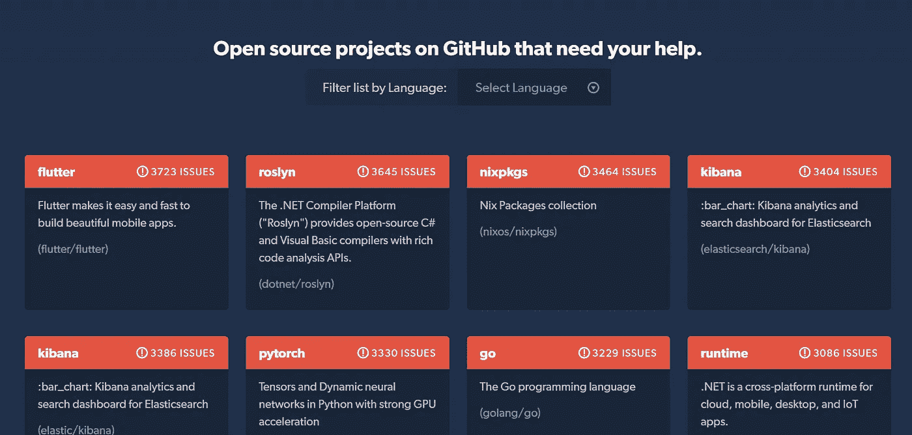
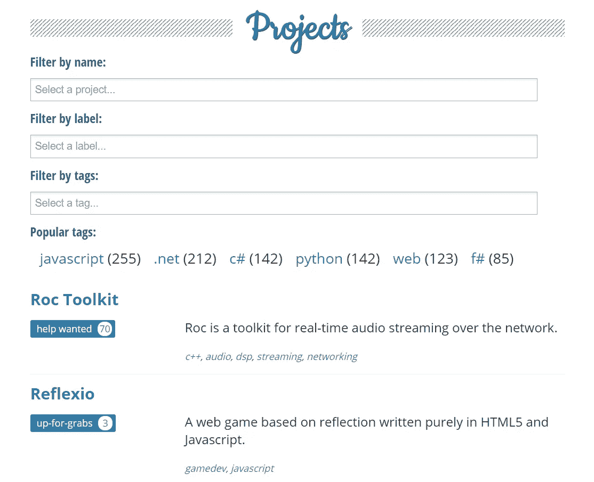
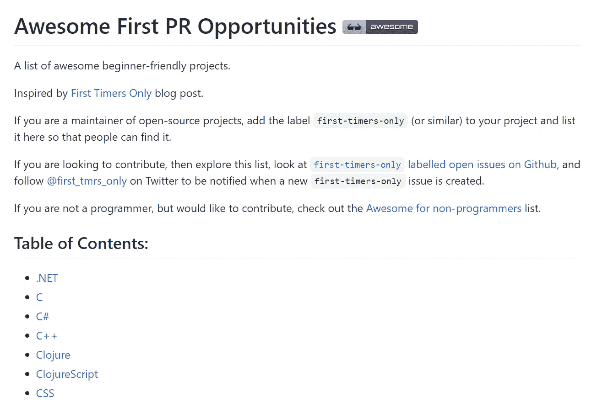

# 找到一个项目或一个问题来为下一个开源项目做贡献的 8 种方法

> 原文：<https://medium.datadriveninvestor.com/8-ways-to-find-a-project-or-an-issue-to-make-your-next-open-source-contribution-252021ff48ad?source=collection_archive---------4----------------------->

## 这个 hacktoberfest，庆祝开源精神

> 再过几天 [Hacktoberfest](https://hacktoberfest.digitalocean.com/) 就要结束了，但是这不应该让你停止为开源做贡献或者停止做开源项目。相反，Hacktoberfest 应该激励你开始为开源项目做贡献，为开源做贡献有无穷无尽的好处。

使用这个博客作为你的指南，为你的下一个开源贡献寻找一个项目/问题。

# 为什么要开源？

不管你是个人、组织、小企业还是非营利组织，开源都是最符合你利益的。有很多理由让你开始一个开源项目，或者作为个人开始开源贡献。我最喜欢的一些原因是:

*   世界各地的人都可以为您的代码做出贡献
*   你会遇到很多新朋友
*   如此多的机会(Hacktoberfest、GSoC、Outreachy 等)
*   代码质量得以保持
*   减少重复工作(您可以将许可证放入您的存储库中)
*   展示你的才华和能力

我喜欢开源的原因是，

*   提升社区(永远记住，“**我们通过提升他人**而崛起”)

## 开源是💚

*   你贡献的越多，你得到的意识和想法就越多！
*   和一些超级棒的人一起合作做项目
*   你会遇到志同道合的人，扩大你的人际网络
*   不能修复一个错误！？请求帮助

# 简单的话…

你能在 GitHub 上找到的每一个项目(当然不是私有的)都是开源项目。

**因此，**要做出贡献，你只需要找到一个适合自己的项目，一个可以为之努力的课题。

但是，这并不像看起来那么简单，寻找一个开源项目可能有点困难，尤其是如果你是一个初学者，这里是这个博客的切入点，用它来寻找你的下一个项目/问题(ง ͡ʘ ͜ʖ ͡ʘ)ง

## 在我们开始之前…

如果你是一个完全的开源初学者，可以看[这个视频](https://www.youtube.com/watch?v=I3AcUV3NZ0A)来入门 Git、GitHub 和开源。

# 找到下一个问题/项目的 8 种方法

你可以使用这 8 个快速提示中的任何一个来找到一个项目或问题来解决。(如果这对你有帮助，别忘了和你的朋友分享博客，分享是关爱)

## 1.发布中心

一个根据您所需的语言或问题标签帮助您找到项目/问题的网站—[http://issuehub.io/](http://issuehub.io/)

特色？您可以根据标签和语言过滤问题。

哇，出现在这个网站上的第一期杂志来自我的一个资料库。不夸张，但是看到这个我觉得自己像个英雄(哈哈，好吧，我的笑话有时候很蹩脚)

顺便说一句，如果你想看我的一些项目，[这是我的 GitHub 简介](https://github.com/MadhavBahl) —

 [## MadhavBahl -概述

### 在 GitHub 上注册你自己的个人资料，这是托管代码、管理项目和构建软件的最佳地方…

github.com](https://github.com/MadhavBahl) 

## 2.代码分类

这是一个更有用的搜索问题和项目的工具。

在 issuehub 显示问题列表的同时，该网站也显示项目列表—【https://www.codetriage.com/ 

 [## 在家工作如何提高我的工作效率|数据驱动型投资者

### 在家工作确实激发了我最大的潜能，让我更有效率。因为在家工作给了我…

www.datadriveninvestor.com](https://www.datadriveninvestor.com/2020/07/29/how-working-from-home-increased-my-productivity/) 

## 3.可利用的

初学者可以解决的问题的项目列表

> 这是一个专门为新贡献者策划任务的项目列表。这是开始一个项目的好方法，或者有助于分担开源项目的工作量。

在这里，您可以根据语言、标签和标记过滤问题和项目。现在就来看看吧—【https://up-for-grabs.net/ 

## 4.贡献

惊人的问题和存储库列表—[https://gauger.io/contrib/#/](https://gauger.io/contrib/#/)

不只是列表，你会爱上 UI

## 5.仅限第一次

你知道吗，有一些特别的标签欢迎第一次投稿的人，这些问题对初学者来说很容易也很受欢迎。

你可以在[https://www.firsttimersonly.com/](https://www.firsttimersonly.com/)网站上找到一些标有“仅限新手”的好问题

## 6.了不起的第一次

一个对初学者友好的项目列表—[https://github.com/MunGell/awesome-for-beginners](https://github.com/MunGell/awesome-for-beginners)

这是一个 GitHub 知识库，在这里你可以找到一些基于语言的好的首次项目/问题。

我可以说这个库的维护者一定做了一些很棒的研究！

## 7.拉动请求轮盘

需要审查的 PRs 列表—[http://www.pullrequestroulette.com/](http://www.pullrequestroulette.com/)

这个与其他的有些不同，在这里你可以找到需要回顾的公开的 PRs。(相信我，开源贡献不仅限于做 PRs，通过回顾别人的代码，可以增长自己的技能+帮助资源库的维护者)

## 8.GitHub 搜索

可以，我们自己去搜；)
[http://github.com/search](http://github.com/search)

你知道 GitHub 的高级搜索功能和改进搜索的前缀吗？

寻找一个开源项目可能有点困难，但是 GitHub search 让它变得超级简单，你需要做的就是知道如何使用它。

您可以根据许多因素过滤您的搜索

*   星星的数量
*   问题上的标签
*   程序设计语言
*   所有者的用户名
*   时间戳
*   叉子的数量，

还有更多…

我最近上传了一个类似主题的 YouTube 视频

点击视频上的“喜欢”和“订阅”按钮(我是 YouTube 的新手，你的支持对我来说意义重大！)

就这样，我希望你喜欢这篇文章。一定要让我知道你的开源贡献，很想听听你的故事！

如果你想讨论什么，随时联系我，:D

如果您能发送您的反馈和建议，我将非常高兴。此外，我喜欢交新朋友，我们可以成为朋友，只要给我发邮件就行了。

> 非常感谢你一直读到最后。如有需要可以联系我以防万一:
> Web:[*http://madhavbahl.tech/*](http://madhavbahl.tech/) *insta gram:*[*https://www.instagram.com/theleanprogrammer/*](https://www.instagram.com/theleanprogrammer/) *LinkedIn:*[*https://www.linkedin.com/in/madhavbahl/*](https://www.linkedin.com/in/madhavbahl/) *Github:*[*https://github.com/MadhavBahl*](https://github.com/MadhavBahlMD) *邮箱:theleanprogrammer@gmail.com*

## 访问专家视图— [订阅 DDI 英特尔](https://datadriveninvestor.com/ddi-intel)