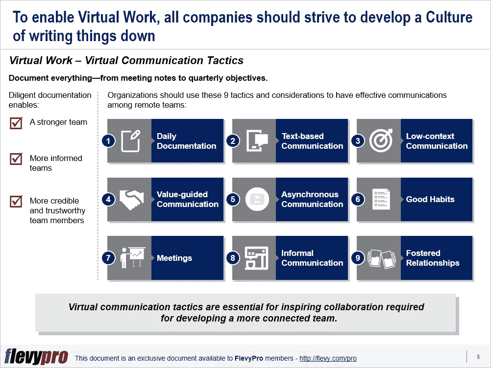

# 促成虚拟工作场所文化的 9 个重要沟通策略

> 原文：<https://medium.datadriveninvestor.com/9-communication-tactics-vital-to-enable-a-virtual-workplace-culture-85dacd5b4fa8?source=collection_archive---------49----------------------->

如今，虚拟工作已经成为一种常态。为了实现虚拟工作，组织应该努力发展一种把事情写下来的[组织文化](https://flevy.com/browse/stream/culture)。记录一切—从会议记录到季度目标—有助于建立更强大、更明智、更可信的团队。

组织需要注意并充分利用这些 [9 沟通策略，在他们的远程团队之间建立有效的沟通机制](https://flevy.com/browse/flevypro/virtual-teams-challenges-and-benefits-4013):

1.  **每日文档**
2.  **基于文本的通信**
3.  **低语境沟通**
4.  **价值导向型沟通**
5.  **异步通信**
6.  **好习惯**
7.  **会议**
8.  **非正式交流**
9.  **培养人际关系**

虚拟交流策略对于激发协作是至关重要的，而协作是发展一个更有联系的团队所必需的。

现在，让我们在[企业沟通](https://flevy.com/function/Corporate-Communications-comm)中更详细地谈谈这些策略。

# 日常文档

为了有更多的协作工作场所和富有成效的在线会议，虚拟组织需要遵循以下原则:

*   在实际会议之前，分享正式的议程和讨论项目。
*   努力记录关键想法、要点和决策，让地理上分散的团队成员了解他们的职责、行动项目和决策的基本原理。
*   虚拟团队应该得到领导层的鼓励和奖励，就像实现销售目标得到奖励一样。这是特别必要的，因为当人们手头有其他紧急任务时，他们倾向于留下文档。
*   鼓励团队在发现解决方案后立即记录下来，因为我们的记忆和回忆能力是有限的。解决方案的及时记录也确保了将来对其他团队成员的询问有现成的答案。

# 基于文本的通信

对于大多数在办公室工作的人来说，基于文本的信息是非常笨拙和麻烦的。他们习惯于一对一或面对面的会议和交流，而不是基于文本的交流。让这些人接受基于文本的公报，并利用它为自己服务，需要相当大的努力和行为改变。然而，掌握文本交流的艺术对团队、项目和组织都有很多好处，包括:

*   基于文本的交流对于团队成员分散在不同地理位置的虚拟工作至关重要。它是一种包容、尊重和强调文档文化的媒介。
*   文档是真正的竞争优势。没有强制性文件的文化会导致效率低下、知识泄露和重复。
*   基于文本的交流似乎是一种负担，但有助于避免不必要的会议，这些会议的唯一目的是“填补某人的空白”
*   培养通过文本交流问题答案的习惯可以使文档更简单，有助于异步工作，并同时为所有人提供信息。
*   它解放了个人沉思和产生想法的时间。

当游戏中的通信风险很高时，在基于文本的通信中有一些关键的考虑事项要遵循:

*   在分享之前，考虑通过一个外部团体的观点来评估你的保护。
*   注意不同文化和交流方式的差异。
*   由于地理位置和时区的差异，从其他团队成员那里获取信息可能会有延迟。
*   请记住，可以有最少或没有非语言交流。
*   交流有情感滞后。
*   分析观众的心态和心境有点困难。
*   管理层应该帮助团队成员进行有效的沟通，并从虚拟工作中获得最大收益。

有兴趣了解其他[沟通策略和虚拟工作环境指南](https://flevy.com/browse/flevypro/virtual-work-communication-tactics-5448)的更多信息吗？你可以在 [Flevy 文档市场](https://flevy.com/browse)的这里[下载一个关于**虚拟工作:沟通策略**的可编辑 PowerPoint 演示文稿。](https://flevy.com/browse/flevypro/virtual-work-communication-tactics-5448)

# 你在这个框架中找到价值了吗？

您可以从 [FlevyPro 库](https://flevy.com/pro/library)下载关于这个和数百个类似业务框架的深入介绍。 [FlevyPro](https://flevy.com/pro) 得到了数千名管理顾问和企业高管的信任和使用。有些人不得不说:

> *“我的 FlevyPro 订阅为我提供了当今市场上最受欢迎的框架和平台。它们不仅增加了我现有的咨询和辅导产品和服务，还让我跟上了最新的趋势，为我的实践激发了新产品和服务，并以其他解决方案的一小部分时间和金钱教育了我。我强烈推荐 FlevyPro 给任何认真对待成功的顾问。”*

*——比尔·布兰森，战略商业建筑师事务所创始人*

> *“作为一家利基战略咨询公司，Flevy 和 FlevyPro 框架和文档是一个持续的参考，可帮助我们为客户构建我们的调查结果和建议，并提高他们的清晰度、力度和视觉效果。对我们来说，这是增加我们影响力和价值的宝贵资源。”*

*–Cynertia 咨询公司咨询区域经理 David Coloma*

> *“作为一个小企业主，FlevyPro 提供的资源材料已被证明是非常宝贵的。根据我们的项目事件和客户要求按需搜索材料的能力对我来说很棒，并证明对我的客户非常有益。重要的是，能够针对特定目的轻松编辑和定制材料有助于我们进行演示、知识共享和工具包开发，这是整个计划宣传材料的一部分。虽然 FlevyPro 包含任何咨询、项目或交付公司都必须拥有的资源材料，但它是小公司或独立顾问工具箱中必不可少的一部分。”*

*–迈克尔·达夫，变革战略(英国)董事总经理*

> *“作为一名独立的成长顾问，FlevyPro 对我来说是一个很好的资源，可以访问大量的演示知识库来支持我与客户的合作。就投资回报而言，我从下载的第一个演示文稿中获得的价值是我订阅费用的好几倍！这些资料的质量让我能够打出超出自己体重的水平，这就像是用很小一部分开销就能获得四大咨询公司的资源一样。”*

*–罗德里克·卡梅伦，SGFE 有限公司创始合伙人*

> “我每个月都会浏览几次 FlevyPro，寻找与我面临的工作挑战相关的演示文稿(我是一名顾问)。当主题需要时，我会进一步探索，并从 Flevy 市场购买。在所有场合，我都阅读它们，分析它们。我采纳与我的工作最相关和最适用的想法；当然，所有这些都转化为我和我的客户的利益。"

*——量子 SFE 公司首席执行官奥马尔·埃尔南·蒙特斯·帕拉*

在 [**沟通与写作**](https://app.ddichat.com/category/communication-and-writing) **:** 中安排一次 DDIChat 会话

 [## 专家-交流和写作- DDIChat

### DDIChat 允许个人和企业直接与主题专家交流。它使咨询变得快速…

app.ddichat.com](https://app.ddichat.com/category/communication-and-writing) 

在这里申请成为 DDIChat 专家。
与 DDI 合作:[https://datadriveninvestor.com/collaborate](https://datadriveninvestor.com/collaborate)
点击此处订阅 DDIntel [。](https://ddintel.datadriveninvestor.com/)