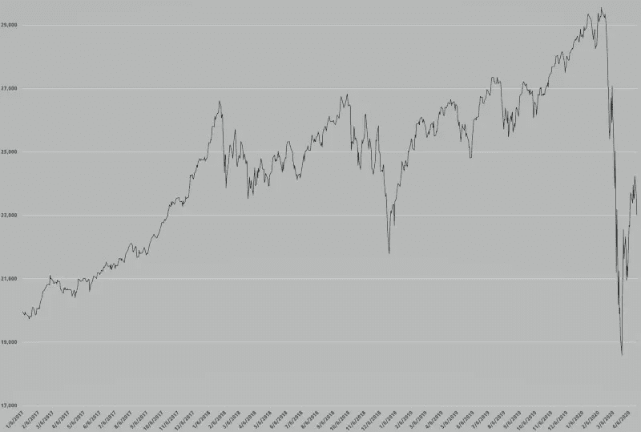

# 新冠肺炎期间股票交易的 9 个教训

> 原文：<https://medium.datadriveninvestor.com/9-lessons-learned-about-stock-trading-during-covid-19-c67a6d7688cb?source=collection_archive---------5----------------------->

## 行业新人的最佳实践

Photo by [Patrick Weissenberger](https://unsplash.com/@ricktap?utm_source=medium&utm_medium=referral) on [Unsplash](https://unsplash.com?utm_source=medium&utm_medium=referral)

# 在你浏览之前，让我给你介绍一下我自己。

我是一名拥有 20 多年金融职业生涯的 MBA。我在南亚、中东和欧洲的世界 500 强公司工作过。

然而，作为一名股票交易者，我一开始就跌跌撞撞。

> 这是我在美国的头 16 个月学到的

Photo by [Matthew Feeney](https://unsplash.com/@matt__feeney?utm_source=medium&utm_medium=referral) on [Unsplash](https://unsplash.com?utm_source=medium&utm_medium=referral)

## 1.提高你的知识

你有没有见过一个业余爱好者驾驶飞机，建造房子，或者找到治愈疾病的方法？不可能吧！那么，不先了解业务，怎么可能成为一个成功的股票交易者呢？你应该每天抽出一段时间来提高你的股票交易知识水平。

以下是你可以做的几件事:

*   阅读**文章**(你感兴趣的行业)。
*   参加**网络研讨会**(提高你的交易技能)。
*   参加**培训**(股票市场)。
*   参加**课程(**金融、会计和商业分析)。

Photo by [Oskar Yildiz](https://unsplash.com/@oskaryil?utm_source=medium&utm_medium=referral) on [Unsplash](https://unsplash.com?utm_source=medium&utm_medium=referral)

## 2.应用工具获取及时信息

每天，市场都在变化。在每一种情况下，都有机会。这完全取决于你的准备程度和消息灵通程度。真正的问题是你如何评估形势，做出决定，并实施你计划好的行动。您应该准备好所有的资源，并在事情发生时收到 ping。

这里有几个我用过的好方法:

*   至少在股市开盘的时候，关注彭博或美国消费者新闻与商业频道的商业新闻。
*   加入 Whatsapp 或脸书集团，获取新闻和观点。
*   考虑订阅**付费信息门户**获取股票更新。
*   在 Twitter 上发展一个强大的网络，以便及时获取信息。

Photo by [Cathryn Lavery](https://unsplash.com/@cathrynlavery?utm_source=medium&utm_medium=referral) on [Unsplash](https://unsplash.com?utm_source=medium&utm_medium=referral)

## 3.列出你最喜欢的公司的清单

人们应该有一个最喜欢的公司的清单。这可以是你在这个行业/公司的经历，也可以是你对商业本质的兴趣。

将特定公司作为你的最爱的原因可能会有所不同。但是，以下几点可能是相关的:

*   访问他们的**网站，了解**的商业战略更新。
*   记录财务结果公开的日期。
*   跟踪股票价格及其波动趋势。
*   维护一个分红日历。
*   **关注相关商品**。它可能会影响股票价格，例如原油价格上涨也可能会提高石油公司的股票价格。

Photo by [JESHOOTS.COM](https://unsplash.com/@jeshoots?utm_source=medium&utm_medium=referral) on [Unsplash](https://unsplash.com?utm_source=medium&utm_medium=referral)

## 4.发展多种投资策略

你需要更好的风险管理、更高的盈利能力和持续的成功。所以，用多种方式投资你的资本。

其中一些如下:

*   建立一个**投资组合**(高/低价、各种行业、商品……等)。).
*   投资**短期**(几周，几个月，或者最多。最长 1 年)。
*   投资**长期**(1 年以上，多多益善)。

> “如果你不愿意在十年内持有一支股票，那就别想在十分钟内持有它。”(沃伦巴菲特)。

*   购买**产生股息**的股票(标明除息日和支付日)。
*   购买**分割股票**(以其真实价格的零头购买蓝筹股)。
*   买**细价股**(记住:公司的数据一般不可靠)。
*   保持**流动性**(例如利用好机会或退出亏损头寸)。

Photo by [Michael Longmire](https://unsplash.com/@f7photo?utm_source=medium&utm_medium=referral) on [Unsplash](https://unsplash.com?utm_source=medium&utm_medium=referral)

## 5.不要太贪心

就像在板球比赛中，你赢得比赛不是靠击球，而是靠单打。多交易小赚是明智的。不要为了在几笔交易中获取高额利润而等待太久太久。

 [## 新冠肺炎期间股票交易的 9 个教训|数据驱动的投资者

### 在你浏览之前，让我告诉你一些关于我自己的情况。我是…

www.datadriveninvestor.com](https://www.datadriveninvestor.com/2020/12/09/9-lessons-learned-about-stock-trading-during-covid-19/) 

记住，股票价格总是有很大的波动。所以，从每笔交易中获得合理的利润并平仓是明智的。追求额外的收入会导致损失，让你花费大量的时间和金钱。

## 6.关注不太贵的股票

毫无疑问，大牌吸引了更多的投资者。但是，高价值的股票也需要大量投资。然而，投资价值较低的股票也有可能获利。这是一个很好的选择，以防你预留的资金较少，或者想在投资组合中拥有多种股票。

这是理想的，尤其是对于早期的初学者。他们可以开始投资一些不太贵的股票。万一亏了就出仓也不会太难。

## 7.保证金交易风险很大

融资融券交易是**用自己的资金+借来的资金** *进行投资。*借款额度可能高达 1:50 或更高。这意味着，如果你有 1，000 美元，那么你将能够购买价值 50，000 美元的股票。

不用多说。这种商业模式有风险。如果股价暴跌得太低，你可能会失去全部投资。

> 股票市场崩溃和 1929 年大萧条的主要原因之一是由于保证金交易。不信，那就看下面的视频。

YouTube video on TradingCoachUK

> 如果你只是浏览文章，快进到 13:50，给它几分钟时间。还是忙，到 26:46，能看多少看多少。

## 8.小心市场暴跌

当消息传出时，市场会做出反应。这是你为可能的变动做准备的时候了。任何好消息或坏消息的影响都会持续几天(这不是规律，但这是市场运行的方式)。但这完全取决于事件的严重程度。

***2019 年 14-9 月:*** 沙特阿美油田(Abqaiq 和 Khurais)发生袭击事件。原油价格一夜之间下跌了 20%。

***2019 年 11 月 17 日:*** 再往前看，一场来自中国的健康危机爆发就是近段时间最好的例子。这引发了全球范围的股市崩盘，至今仍未恢复。

**“冠状病毒崩溃”**

Courtesy by Wikipedia

尽管看起来很糟糕，但每个硬币都有两面。如果你在正确的时间出手，即使是最小的投资也能变成数百万。

股票市场对不断变化的情景做出反应。因此，我们必须睁大眼睛，在需要时采取战略行动。

## 9.趁早接受损失

价格波动是股票交易的一个常见特征。所以，万一出现亏损的情况，你应该能够承受。什么时候和多少是你需要问自己的问题。但是，最好确定一个最适合你的百分比或数值。

如果价格下跌超过一定价位，你应该立即卖出。这一点非常重要。很多时候，股票在一个位置卡住，需要很长时间才能达到盈亏平衡点。这是你必须付出的一个很大的机会成本。因此，你不能投资于其他更有利可图的股票，因为你的资本已经被套牢了。

> 如果你有足够的动力，推它一把，开始你的旅程！

## 访问专家视图— [订阅 DDI 英特尔](https://datadriveninvestor.com/ddi-intel)