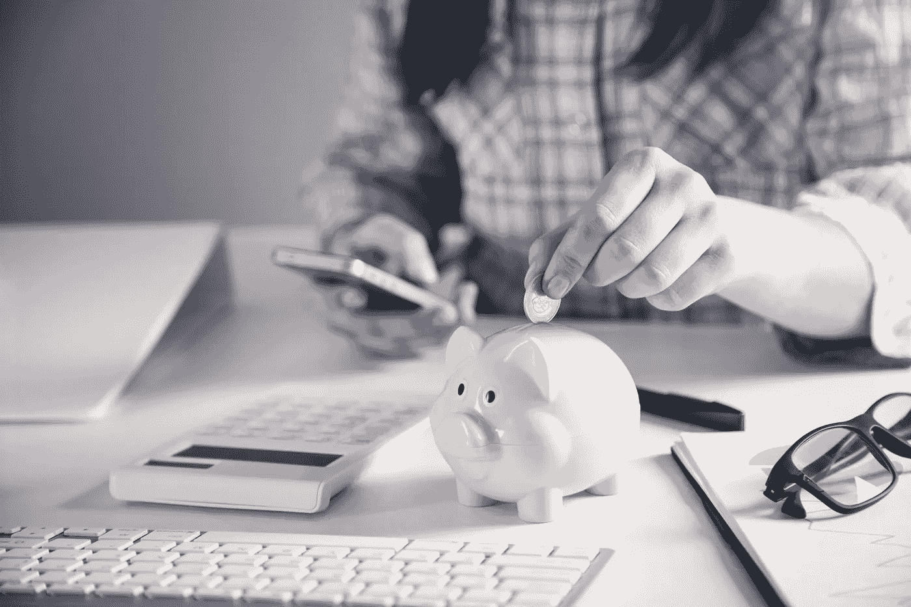

# 新冠肺炎疫情期间省钱的 9 个实用方法

> 原文：<https://medium.datadriveninvestor.com/9-practical-ways-to-save-money-during-the-covid-19-pandemic-e6ae28703344?source=collection_archive---------29----------------------->

## 在充满挑战的情况下，存一些额外的钱可能会对不确定的情况有所帮助。这里有九个任何人都可以实现的简单提示！

[ANDRANIK HAKOBYAN](https://www.shutterstock.com/g/ANDRANIK+HAKOBYAN)/Shutterstock.com with a license.

新冠肺炎横扫世界。没有人预见到它的到来，也没有人提前准备好他们的资源。它的发作给几乎所有人带来了沮丧和恐惧。如今，在经历了半年的行动受限、经济不稳定、就业无保障之后，人类是否已经接受并拥抱了新常态？

新冠肺炎不仅夺走了我们的身体自由；它对经济的不可否认的影响也对全世界人民的经济独立构成了威胁。疫情期间，商业运作受阻，顾客受限，工作岗位流失。开支不断，而收入仍然不足。政府的支持不能持续太久，人们必须制定一个计划来在经济上生存。在面对疫情几个月之后，没有人还能确定这场疫情将在何时或如何结束。这需要具体的解决办法——节俭和足智多谋。为了帮助你在疫情中重获财务自由，这里有九个实用的方法在这场健康危机中省钱。

# 1.削减你的电话和保险费用

尽管疫情带来了经济和健康方面的限制和问题，但它也显示了友情和同情。一些开账单的人削减了他们的月保费，以帮助他们的客户适应新冠肺炎带来的限制。其他公司甚至在疫情高峰期取消每月付款。

根据美国消费者联合会的报告，大约 80%的汽车保险公司退还并取消了 5 月和 6 月价值约 65 亿美元的保险。例如，Farmers Insurance Group 根据投保地点的不同，在特定月份提供 15%、25%和 40%的折扣。数百家运营商还签署了“保持美国人连接承诺”的承诺，承诺在疫情期间不会因逾期付款而终止连接，作为对客户经济情况的考虑，免除滞纳金，并为每个有需要的美国人提供开放的 Wi-Fi 热点。运营商还承诺开发更便宜的计划和促销活动来帮助消费者省钱。

提到这些事情后，您可能想打电话给您的提供商，了解他们是否实现了相同的考虑事项。您可以退还并保存您已经支付的额外保费。考虑到疫情的限制，你也可以要求重新计算，尤其是汽车保险。转而选择更便宜、更包容的计划，这些计划刚好能满足你的连接需求。

 [## 为什么我们投资 Totient，也就是人工智能如何帮助我们生产抗癌药物和 Covid | Data…

### 9 月 10 日，一家人工智能驱动的药物研发公司宣布与……建立关键合作伙伴关系，从此悄然出现

www.datadriveninvestor.com](https://www.datadriveninvestor.com/2020/09/13/why-we-invested-in-totient-aka-how-ai-can-help-us-produce-drugs-against-cancer-and-covid/) 

# 2.选择简单的食谱

我们不能去餐馆和酒吧吃饭，至少从我们的经济状况来看，可以被认为是塞翁失马焉知非福。在外面吃饭时，我们不仅为我们吃的食物付钱。我们还支付场所和服务的费用。除了实际成本，企业还会增加一些成本来获得可观的利润。总的来说，这些费用花费了我们大量的金钱，但是我们愿意为我们的体验和满意度付费。

疫情让我们别无选择，只能放弃外出就餐的好处。从积极的一面来看，它能让我们节省一大笔日常食物开支。在家做饭可以让我们选择我们想要的食物，同时考虑食材的成本。由于疫情的末日仍不确定，我们必须选择简单的食谱。简单的食谱并不意味着简单和乏味。如果一个人知道如何正确地做，它们甚至会令人兴奋。使用互联网找到你最喜欢的食谱的廉价替代品。砍掉不必要的成分，尤其是那些只出于审美目的的成分。为了最大限度地提升体验，您可以创建一个 DIY 餐桌布置来营造您想要的氛围。

# 3.保持你的购物清单简单

为了最大化你的简单食谱的好处，把它和一个简单的购物清单结合起来。在疫情之前，我们习惯于购买物品，甚至是我们购物清单之外的物品。为什么不呢？我们有稳定的工作和固定的收入。但是这个疫情给我们上了人生重要的一课——纪律。

保留一份简单的购物清单可以确保你的食物支出不会超过你的预算。在这样的危机时刻，这是一种至关重要而又直接的储蓄方式。你也可以选择批量购买，以较低的价格获得商品。把你的食物放在冰箱里以延长保质期。

# 4.取消订阅

紧缩的预算需要令人心碎的措施。手头有了多余的预算，我们很想订阅几份能让我们远离无聊的东西。这是完全可以接受的…在疫情开始之前。为了在危机剩下的日子里省钱，你必须削减不必要的开支。取消不重要和不常用的订阅。只保留必需品。

# 5.如果可能，选择二手物品

在疫情，我们对物质的需求仍然存在。老实说，我们应该部分内疚，部分机智。考虑到我们不稳定的收入，我们可以选择二手物品而不是全新的。虽然其他人可能没有意识到这一点，但超支和二手物品仍然可以像新的一样有用和有价值。

为了节省一些钱，利用你能找到二手物品的市场和平台。只是一定要仔细检查描述和规格，以及卖家的信誉。尽可能避免提前付款。

# 6.拥抱 DIY 家居设计

疫情期间，家居装修可能会推迟，但如果不可能，为什么不利用这个机会为你的家做一个 DIY 设计呢？互联网上有大量的资源，你可以观看、阅读并遵循这些资源来实现你梦想中的家居设计，而无需花费大量的金钱。在封锁期间，这也是一个很好的时间杀手。

第一步，想好自己想要的主题，搜索便宜的 DIY 家居设计，购买需要的材料，享受设计过程。向你的家庭成员和室友寻求帮助，使产量最大化。

# 7.处理您的退款

新冠肺炎疫情对旅游业有着令人不安的影响。成千上万所谓的旅行者现在无法到达旅游目的地。仅在美国，旅游支出预计将下降 5190 亿美元。这一价值相当于经济产出减少了 1.2 万亿美元。

不幸的是，旅行者还需要退还他们预先预订的预订，以处理他们当前的费用。你可能会觉得这很麻烦，但这绝对很重要。如果你是这些旅行者中的一员，立即打电话给航空公司、酒店、度假村和其他你已经预付了费用的公司，要求退款。预计公司会准备好接受这种索赔，因为在理想情况下，许多客户都要求相同的退款。其他公司可能会为您提供不同的选择，例如未来预订的积分。

# 8.节约能源

在危机爆发期间，全球能源消耗达到了 30 年来的最低水平。企业的倒闭和全球经济的急剧下滑推动了这种下滑趋势。

然而，随着企业部分或全部恢复运营，学校和组织转向以家庭为基础的安排，我们的能源消耗开始增加。我们的日常活动需要我们使用更多的电器和小工具。虽然这是不可否认的，但我们仍然必须尽可能节约能源。如果没有必要，限制使用加热和冷却系统、灯、电脑和电话。我们不仅能省钱，还能合理利用环境。

# 9.填满你的现金储备

既然你已经学会了如何在疫情期间省钱的八种方法，那么你就可以继续充实你的现金储备了。你的现金储备就是你的应急基金，如果你用尽了所有其他资源，或者只有在紧急情况下，你才会用到它。你可以将前八条建议所带来的所有节省和退款放入你的现金储备中。它让你免受不稳定的经济、不稳定的就业和疫情带来的不确定性的影响。只是要自律，注意不要把钱花在其他地方。

毫无疑问，新冠肺炎·疫情震撼了所有人。到 2020 年初，我们只知道损失、隔离和限制。尽管将这种流行病视为一个问题更容易，但我们仍应寻找正确的一面。与其沮丧和气馁，不如利用这个机会存点钱。不要因为不能出门而难过；相反，你应该感谢你可以避免吃饭和外出的不必要的花费。梦想、工作和实现财务目标的时机没有错。谁知道呢，这个疫情可能是你实现财务自由的完美动力？

## 访问专家视图— [订阅 DDI 英特尔](https://datadriveninvestor.com/ddi-intel)