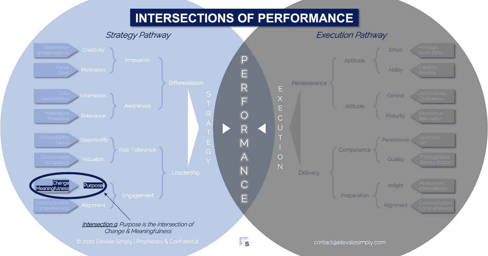

# 9.目的:变化和意义的交汇点

> 原文：<https://medium.datadriveninvestor.com/9-purpose-the-intersection-of-change-meaningfulness-9f12b0153e1?source=collection_archive---------10----------------------->

Image from 123rf.com

下次你和领导在一起时，问问他们组织的目的是什么。然后询问这个目的与组织的使命或愿景有何不同。我发现，很多时候，领导者并没有过多考虑目的、使命或愿景之间的区别。大多数人都知道使命和/或愿景是存在的，即使它不容易背诵(这本身就很说明问题)。一个公司的目标被正式化并被传达是不常见的。

目的是公司应该拥有的最基本的原则之一。而是‘公司为什么存在’。看似简单，却常常被忽视。简洁地定义目的的能力在商业的许多方面都是普遍适用的，令人惊讶的是许多公司没有做到这一点。从招聘员工*(“这是我们存在的原因，我们认为你符合这个目的”)*到制定战略*(“这是我们存在的原因，我们计划如何实现这个目的”)*，拥有一个目标应该是每个组织的北极星。

**目的可追溯性**

大多数员工希望知道他们的所作所为对公司的目标和结果有积极的影响。这种联系导致了员工的参与度。这是从每个员工的日常战术执行到公司目标的可追溯性。

*   目的优先事项战略目标执行

这个可追溯性双向流程中的每个阶段都很重要。但是很少能找到一个成功实现端到端的组织。通常情况下，有不同的部分做得很好，而其他部分似乎存在于真空中或完全被忽略。

建立可追溯性的第一步是确认组织的目的。

**目的交集是什么？**

目的是变化和意义的交叉点*(见下图交叉点 9)*。组织的产生和存在是因为人们认识到变革的可能性和必要性。然而，除非有意义的驱动，否则抓住改变的机会是不会发生的。

*改变*

改变是一个相当简单的概念……它是与现在不同的东西。作为目的交叉的一部分，它接受了调整框架，变得更加真实。用动作改变*成为可能。没有动作的改变*仍然是不可能的。**

“公司为什么存在？”大多数情况下，公司的存在是因为它们给市场带来了变化。新的或改进的产品和服务、创新的解决方案、将现有产品或服务推向市场的更好方法、不同的定价模式等。这些变化等同于目的。

人们渴望目标，不管他们是否用这个词来表达这种渴望。企业目标定义了公司寻求改变世界的方式。从发挥作用和影响变化的角度来看，这有助于员工实现自己的个人目标。

交叉点 9:目的=改变+意义

Image by [Brett Simpson](https://medium.com/u/191cf90a65d7?source=post_page-----9f12b0153e1--------------------------------)

*意义*

没有意义的改变是没有激情的。“没有激情”和“有目的”不能很好地结合在一起，这就是为什么有意义是这个十字路口的第二条路。考虑到“公司为什么存在？”再说一次，我还没有遇到多少人有兴趣成为对他们个人或他人没有意义的事情的一部分。

意义可以是满足、共性、平等、公平、解决方案、创造性、创新、价值、满足、幸福、成就等。有意义并不能保证完美或成功，但它在很大程度上是一个可控的，积极的变量。

有目标的公司已经找到了有意义的改变，围绕这种改变，他们可以建立共识，并让希望成为独特事物一部分的团队参与进来。

**领导者能做什么？**

高层领导负责定义企业目标。然后，他们需要创建对目标的可追溯性，这种可追溯性能够在组织的其余部分实现并激励成功。

如果领导者不能清楚地表达公司的目的，或者有效地沟通其可追溯性工作流程，参与度和进度将达不到最优化。

目的为公司、领导和员工提供意义和验证。

**总结&下一个**

所有公司的成立都是有原因的。因此，他们已经有了目的。关键是声明它，交流它，并创建必要的从目的到执行的可追溯性，以最大化组织实现该目的的潜力。

下次我们将考察业绩的第 10 个交叉点，也就是**估值交叉点**。

在这一系列文章中，我们探索了性能的交集，共有 30 个。绩效的交叉点*框架基于*[*Brett Simpson*](https://www.linkedin.com/in/brettjsimpson/)*[*董事总经理【简称为*](https://www.linkedin.com/company/elevatesimply/)*】20 多年来作为企业家、顾问和投资者在大大小小组织中的领导经验和见解。**

***绩效-文章链接的交集***

*1.[绩效:战略的交集&执行](https://medium.com/the-innovation/1-performance-the-intersection-of-strategy-execution-2bf06329f8d4)*

*2.[战略:领导层的交集&分化](https://medium.com/the-innovation/2-strategy-the-intersection-of-leadership-differentiation-a568b17731ab)*

*3.[领导力:敬业度的交集&风险承受能力](https://medium.com/the-innovation/3-leadership-the-intersection-of-engagement-risk-tolerance-f8c887e6c1d3)*

*4.[差异化:创新的交叉点&意识](https://medium.com/@brettjsimpson/4-differentiation-the-intersection-of-innovation-awareness-a21d053ecf12)*

*5.[接合:目的的交集&对准](https://medium.com/@brettjsimpson/5-engagement-the-intersection-of-purpose-alignment-953747437c26)*

*6.[风险承受能力:机会的交叉点&估值](https://medium.com/@brettjsimpson/6-risk-tolerance-the-intersection-of-opportunity-valuation-29cf4d9a0ac)*

*7.[认知:信息的交集&关联性](https://medium.com/@brettjsimpson/7-awareness-the-intersection-of-information-relevance-f0fd5322bcb7)*

*8.[创新:创造力的交汇点&动机](https://medium.com/@brettjsimpson/8-innovation-the-intersection-of-creativity-motivation-7c1a12e0d5e2)*

*9.[目的:变化的交集&意义](https://medium.com/@brettjsimpson/9-purpose-the-intersection-of-change-meaningfulness-9f12b0153e1)*

*10.[估价:对价的交集&验收](https://medium.com/@brettjsimpson/valuation-the-intersection-of-consideration-acceptance-eebe7b15e763)*

*11.[机遇:欲望的交汇&问责](https://medium.com/the-innovation/opportunity-the-intersection-of-desire-accountability-7e81adb1e195)*

*12.[相关性:重要性的交集&及时性](https://medium.com/@brettjsimpson/relevance-the-intersection-of-importance-timeliness-56cc748eb066)*

*13.[信息:数据的交集&解读](https://medium.com/@brettjsimpson/information-the-intersection-of-data-interpretation-62acc94ba8bf)*

*14.[动机:焦点的交集&驱动](https://medium.com/@brettjsimpson/14-motivation-the-intersection-of-focus-drive-d9ebd3ca9951)*

*15.[创造力:观察的交集&独立性](https://medium.com/@brettjsimpson/15-creativity-the-intersection-of-observation-independence-57f7294acb2b)*

*16.执行:毅力和交付的交叉点*(即将推出！)**

*17.交付:准备与能力的交叉点*(即将推出！)**

*18.毅力:天资与态度的交汇*(即将推出！)**

*19.准备:洞察与对齐的交集*(即将推出！)**

*20.能力:坚持与质量的交集*(即将推出！)**

*21.态度:控制与成熟的交集*(即将推出！)**

*22.资质:努力与能力的交集*(即将推出！)**

*23.洞察力:评估与解释的交集*(即将推出！)**

*24.质量:彻底性和标准化的交汇点*(即将推出！)**

*25.坚持:乐观与勇气的交汇*(即将推出！)**

*26.成熟:经验与理性的交集*(即将推出！)**

*27.控制:果断与自信的交集*(即将推出！)**

*28.能力:能力与实践的交集*(即将推出！)**

*29.努力:远见和职业道德的交集*(即将推出！)**

*30.对齐:传播与综合的交汇点*(即将推出！)**

****在*** [***领导力、教练和个人成长***](https://app.ddichat.com/category/leadership-coaching-and-personal-growth)***:****

* [## 专家-领导力、教练和个人成长- DDIChat

### DDIChat 允许个人和企业直接与主题专家交流。它使咨询变得快速…

app.ddichat.com](https://app.ddichat.com/category/leadership-coaching-and-personal-growth) 

***申请成为 DDIChat 专家*** [***这里***](https://app.ddichat.com/expertsignup) ***。****