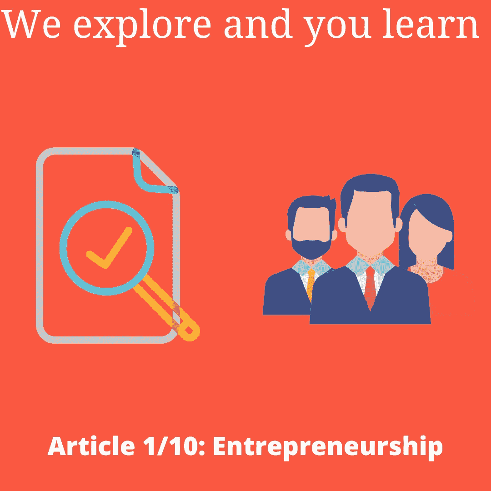
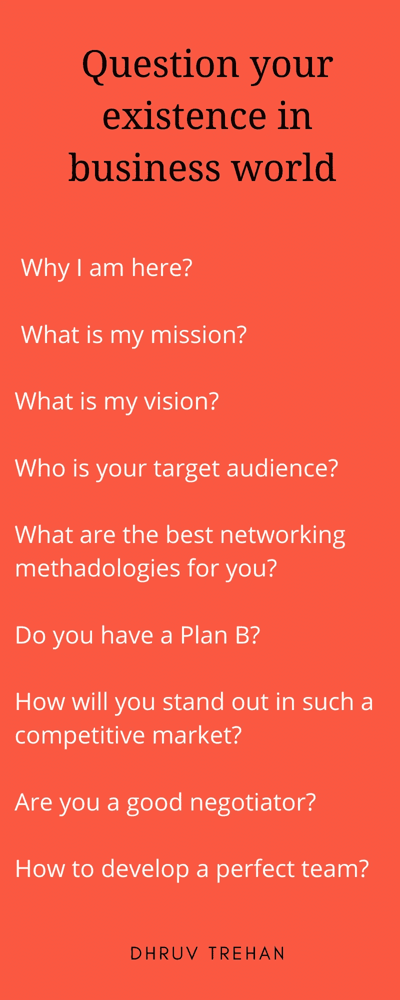
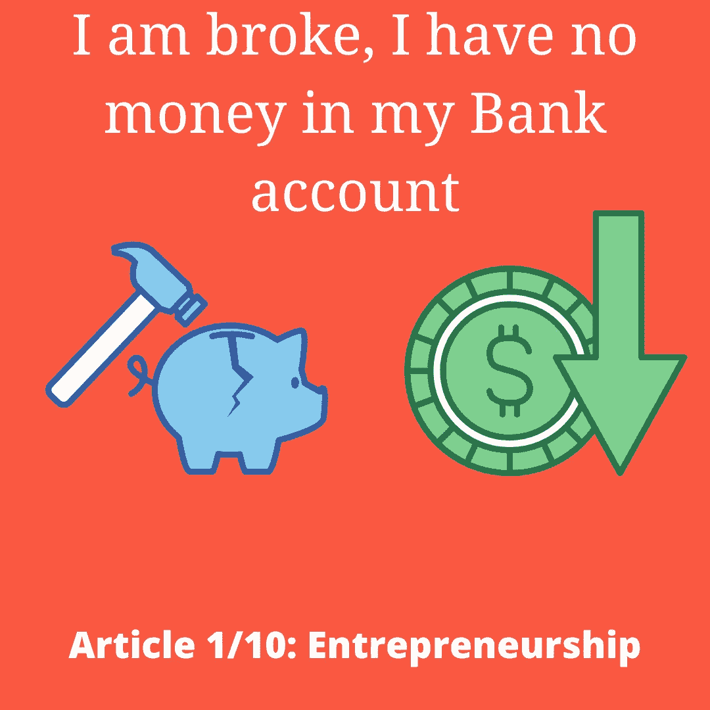
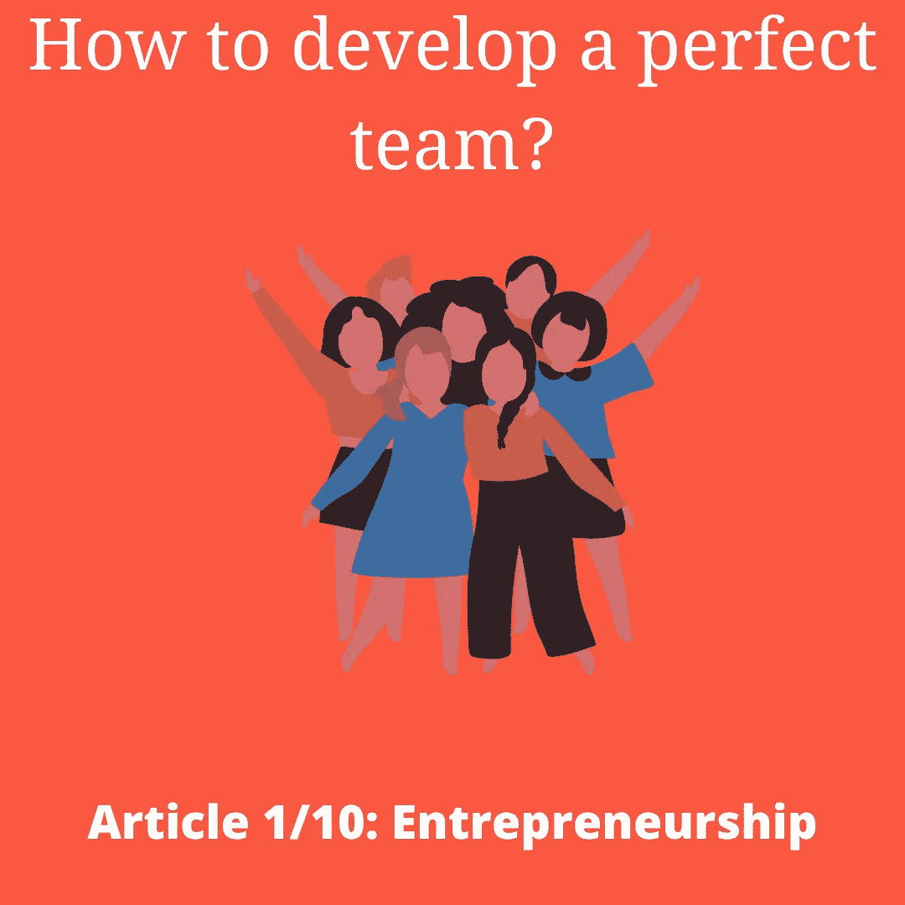

# 如果你想创业，你应该问自己 9 个问题

> 原文：<https://medium.datadriveninvestor.com/9-questions-that-you-should-answer-yourself-if-you-want-to-go-for-entrepreneurship-b243955626ce?source=collection_archive---------10----------------------->

嘿伙计们，

很高兴看到你回来了！这个系列的主题是“我探索，你学习”。

这个系列是关于什么的？

> “我探索，你学习”将是一个系列，在这个系列中，我和我的团队将涵盖一些很酷的事实，这些事实可以[追溯到你脑海中的](https://www.drillitdown.com/)查询”

Article 1/10 completed

**我对我的读者有什么期待？**

> 分享您的反馈，并获取您希望下一篇文章的主题。

**感谢我的队友**

> Asmi Gupta :为本文提供了一些令人敬畏的见解，并帮助以简洁的方式创建了这篇文章。

所以，现在让我们从我们的第一篇文章**开始，这篇文章是写给那些想从事创业的人的。我们不会分享*创业的定义或什么是创业？这篇文章与众不同，所以让我们深入研究一下。***

Hope this helps you :)

**自我吹捧一下:**上周，我在看文章，重新发现一个创业的不为人知的事实。

**真实事实:** Woohoo！通过研究，我发现了“每个有抱负的企业家都应该回答自己的 9 个宝贵的方言”

**只是为了引起你的注意:**所以，直接转向话题的潜在性，激起你对了解这些事实的渴望，我得到你应该问自己的第一个问题。

 [## 为什么那个创业者筹的比我多那么多？数据驱动的投资者

### 养多少既是一门艺术，也是一门科学，这个话题在许多其他帖子中有详细讨论。这篇文章将…

www.datadriveninvestor.com](https://www.datadriveninvestor.com/2020/06/14/why-is-that-entrepreneur-raising-so-much-more-than-me/) 

# 为什么我想成为一名企业家？

如果仅仅是因为杰夫·贝索斯赚了很多钱，那么如果你开始做生意，你会带着满满一袋子钱回家。如果这是你投身创业的原因，那么亲爱的，放弃这个想法是好的。因为，创业是指在开始时经历很多事情，然后在很长一段时间后最终获得一些利润。

所以，建议知道一个答案，为什么你想进入创业？

# 创办这家公司背后的使命是什么？

如果你能理解你公司的使命，那么你就能丰富一种进步的方法，从长远来看，这种方法会给你的公司带来很多利润。它被建议制定能给你很大帮助的策略。

# 你有 B 计划吗？

你付出了所有的努力，这样你就可以观察到你的公司的自愿增长。该公司的图形趋势是观察相当不错的物流，但可悲的是，你看到贵公司的增长完全崩溃。对你有效的计划悲惨地失败了。现在，你有 B 计划吗？

如果是，那么这种崩溃不会对你造成严重影响。否则，它会对你公司的发展造成不良影响。建议发展逆向思维模式，当你破产时，它可以帮助你迅速恢复。

**注意:如果你有机会见到企业家，你应该问他们这些问题，从他们那里获得一些知识:** [*65+你应该问的开放式问题*](https://www.drillitdown.com/open-ended-questions-to-ask-from-leaders/)

**

*Do you have Plan B?*

# *在这个竞争激烈的市场中，我是否足够优秀？*

*企业家精神正在兴起，人们正在研究你现在正在思考的想法。但是，能让你和你的公司在这个竞争激烈的市场中脱颖而出的是你为消费者的生活增加价值的潜力。销售你的产品的方法和谈判任何好交易的方法。*

*建议你在进入企业家的世界之前，学习一些好的谈判技巧。*

> **告诉你一个好消息:我刚刚发现了这个很棒的* [*【谈判技巧训练】*](https://www.drillitdown.com/negotiation-skills-training/) *可以帮助你脱颖而出。**

# *如果我破产了，我能活下来吗？*

*如果你的生意面临亏损，你有勇气在市场中生存下来吗？在建立你的生意时，你必须考虑到建立你的生意所需的许多因素。你需要寻找资金，你需要关心你的企业的远景和长期使命，做一个图形分析和培养预测，可以作为你的企业的居住者。*

**

*No money in my bank account*

# *福斯特除霜器为什么不是烘烤器*

*当你准备开始一项冒险时，你应该有一种能在市场中脱颖而出的个性，在这个市场中，人们随时准备考验你的想法。你应该擅长使用脚镣，这样你就可以面对所有的铲球。如果你很容易被任何人通过的一些不恰当的判决所冒犯，那么巴迪，企业家精神不适合你。*

> ***注:** *把自己培养成一个人，即使是别人对你最负面的赞美，他也有能力获得积极的回报。**

# *你有一个团队准备好为你的事业全力以赴了吗？*

*创业是一次旅行，最优秀的人会坚持到最后。独自开始是好的，但随着时间的推移，你需要建立一个可扩展的团队，与他们一起为你的公司发挥最大的作用。*

*你需要成为一个有深度的谈判者，这样你才能策划一个完美的方式来发展一个团队，为你的公司带来最大的成果。*

**

*A perfect Team*

# *我的解决方案会与我所在地区的问题产生共鸣吗？*

*"*一种能够解决您当地问题的方法，可以最大限度地提高您产品的成功率"**

*许多有深度的研究者总结道，当你的目标是开发一个模型时。尝试以一种能帮助你所在地区的人们的方式进行再创造。*

***您可以遵循的层级:***

> **你所在地区的问题- >你所在城市的问题- >你所在州的问题- >你所在国家的问题**

*当你遵循上面提到的层次模型时，你会随着时间呈指数增长。*

# *时间流逝:跨越城市界限，自愿提供你的产品*

*解读你产品的目标。按照以下模式计划事情:*

*1.确定你的目标受众*

*2.开发最适合您业务的网络方法*

*3.当你要开始的时候，建议为我提供服务*

*4.从目标受众那里获得真实的反馈*

***注:** *关注随时间呈指数增长。你需要在用户的头脑中建立起你的产品的印象，甚至让他们告诉他们的同伴。**

*至此我们来到了 ***第 1 篇共 10 篇文章的结尾。****

*所以，现在我想听听你的意见？*

> *你喜欢谈判技巧培训吗？*
> 
> *对你来说，这篇文章最精彩的部分是什么？*

*让我们相互交流，努力相互学习。请通过 [Dhruv Trehan](https://twitter.com/dhruvtrehan45) 与我联系*

***访问专家视图—** [**订阅 DDI 英特尔**](https://datadriveninvestor.com/ddi-intel)*