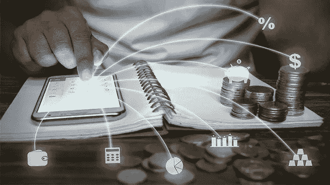
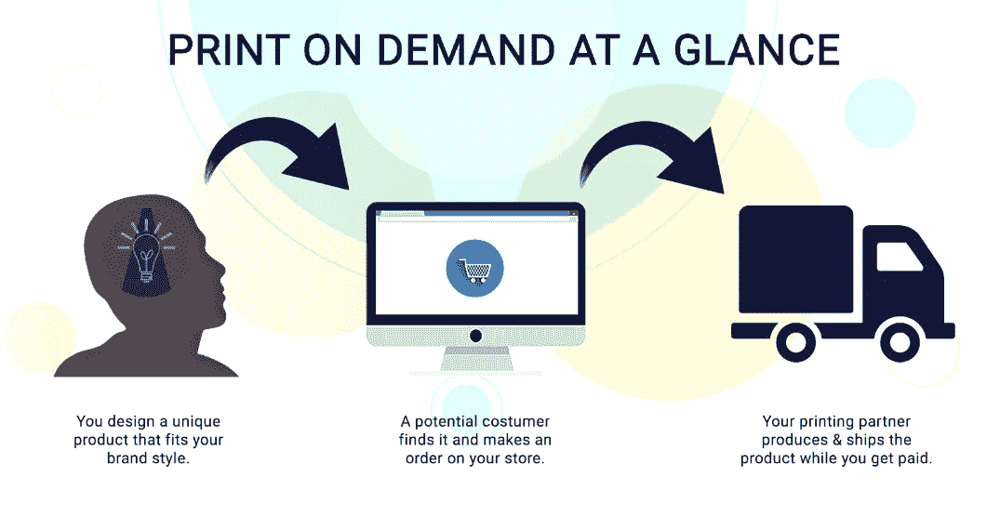
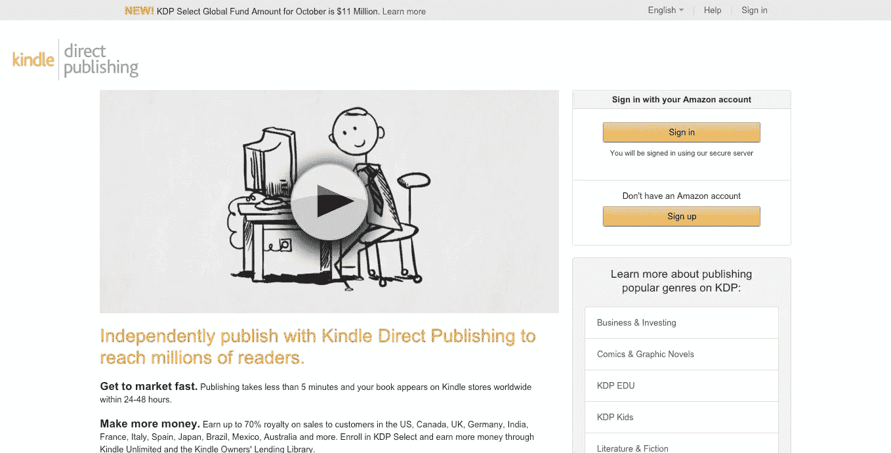
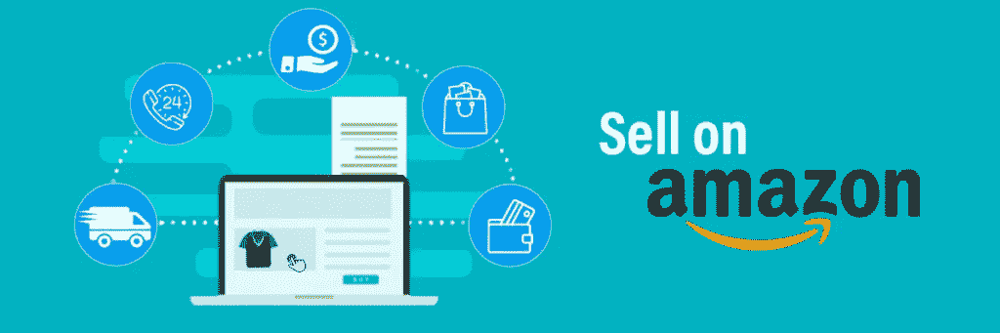
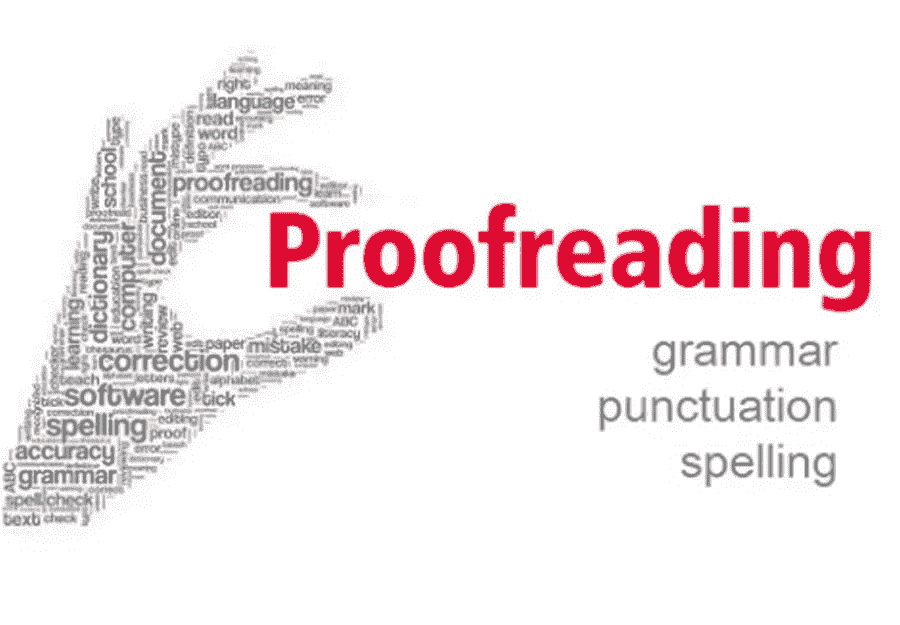
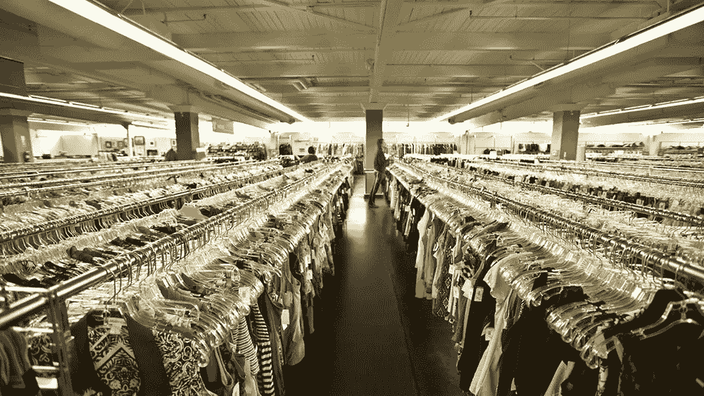
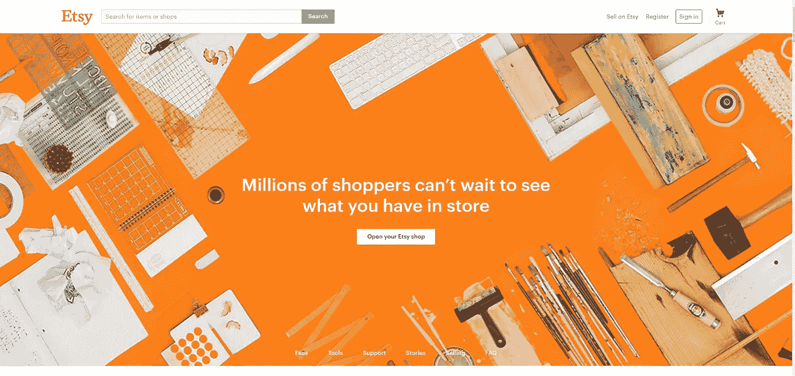
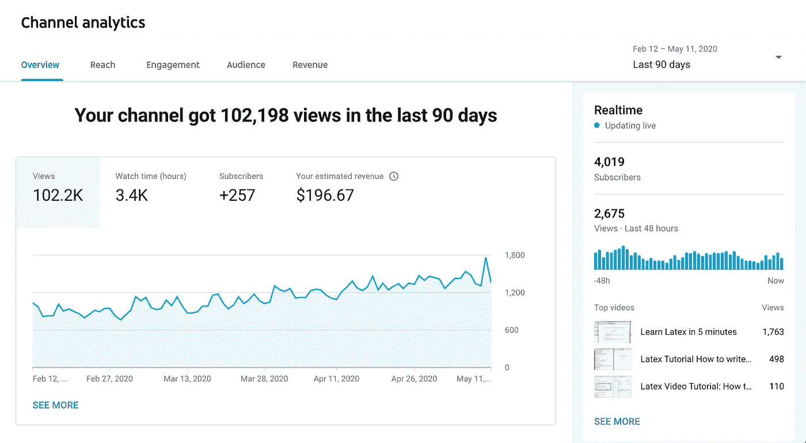

# 你可以从 2021 年开始做 9 个侧推

> 原文：<https://medium.datadriveninvestor.com/9-side-hustles-you-can-start-in-2021-6bd270d8a3b?source=collection_archive---------6----------------------->

Image Source: [Inc. Magazine](https://www.incimages.com/uploaded_files/image/1920x1080/getty_624511276_389958.jpg)

找到一个真正赚钱的副业可能很困难。我已经做了五年多了。我有我的主要收入来源，我们稍后会谈到这一点，但我已经尝试了很多东西，从 YouTube 和 Instagram 到联盟营销，甚至在 Shopify 上直接发货。

有些骗局失败了，有些成功了，但投资回报并不丰厚，还有一些让我想放弃一切，它们太痛苦了。

侧推对你有用的唯一方法是你喜欢它。你最不想做的事情就是去工作，回家，做一些你害怕做的事情。

例如，我不喜欢刊登脸书的广告。我不擅长，也没学过系统。一个小小的错误就会让你失去所有的钱。对我来说，作为一个“营销代理”，开始为别人做脸书的广告并不理想。当然，我可以学习，从小规模开始，逐步扩大，因为那里有一大笔钱，但我讨厌它的每一秒钟。

***你确定你准备好侧身狂奔了吗？***

Image Source: [The Dough Roller](https://www.doughroller.net/wp-content/uploads/2019/05/apps-that-loan-you-money-now-payday-loan-alternatives-648x364-c-default.jpg)

兼职需要时间。任何说不知道的人都是在撒谎。是的，有些人很“幸运”或在正确的时间跳到某样东西上，有些人是早期采用者并从中受益；但在很大程度上，副业需要奉献和时间来积累一份值得微笑的收入。

不管你是每周花一个小时还是 20 个小时来做兼职，总会有适合你的工作。虽然我的生意是 100%在线的，但我在这上面花了很多时间。是的，尽管我在自己舒适的家里，大部分时间穿着运动裤和印花 t 恤工作，但压力总是存在。

当你从朝九晚五的工作中打卡下班后，大部分时间工作会在你回家后离开你的大脑。对我来说，工作总是在我的脑海里。如果我不尽我所能努力工作，我从事的生意和收入来源可能会枯竭。虽然我有每月支付我的被动收入，但它们从来没有得到保证。所以一旦你做到了“成功”,不要放弃，继续推动自己保持在那个水平或者继续成长。

虽然我明白不是每个人都想成为下一个拉塞尔·布伦森或托尼·罗宾斯，但有些人只是想每个月在银行账户里多存 500 美元。它可能是为了支付账单，偿还债务，或者每年有额外的钱去度假。不管你的目的是什么，一旦你达到目标，继续大步前进以保持那个水平，即使你正在获得的收入看起来是“被动的”。

随着网络世界的不断发展，有成千上万的方法可以在网上赚钱。无论你是对木工充满热情，还是喜欢写故事，在线空间都有适合你的东西。你只需要寻找它，并让它发生。

***我的前九边 2021:***

虽然我没有直接做所有这些事情，但有一些我会做，只是因为我喜欢做。这些想法中，有一些是我亲眼目睹人们成长、壮大并转化为全职收入的。

选择你的副业最重要的是激情。如果你非常讨厌写作，博客不适合你。找到你喜欢的东西；不要害怕尝试一些不同的副业来找到你喜欢的。在一天结束的时候，你的副业是为你自己，而不是别人。

1.  ***博客***

Image Source: [Stocksnap.com](https://stocksnap.io/photo/wordpress-blogging-3ZHG0XOIT6)

写博客是一个爆炸，可以有很大的回报，它可以是几乎任何话题。无论你是一个木工，想要分享你的艺术作品或你用来获得特定效果的技术，你都可以写博客。从厨师和厨师，到全职妈妈，无论小众，总有人在读书。

写博客是一项长期的副业，不要指望第一天就能赚几百或几千美元。

写博客，你有几个不同的选择，没有正确或错误的答案。你可以在 Medium 这样的网站上写博客，他们会直接付钱给你。每当一个媒体订阅者阅读一篇文章，你就会得到他们的订阅费。会员给你的阅读时间越多，你赚的就越多。Medium 的伟大之处在于它每月带来数以千万计的读者。缺点是你没有“拥有”网站。你的另一个选择是建立自己的网站，创建自己的在线形象，在这里你拥有一切，可以按照你的设想设计你的网站。但是你要么有一个疯狂的流量到达你的网站，从广告中赚钱，或者使用你的文章中的附属链接来产生收入。

无论你决定朝哪个方向成功，这两种选择都有利弊。我最喜欢写博客的一点是，几乎任何人都可以写，你可以写你感兴趣的话题。

***2。按需打印:***

Image Source: [FreeUp](https://freeup.net/wp-content/uploads/2018/09/Davis-Sarmins-POD-at-a-glance.png)

按需印刷并不是什么新鲜事。如果你已经找了一段时间的副业，你可能会遇到卖家的故事，他们在 P.O.D .领域赚了六七位数。事实上，按需印刷是我最大的收入来源，也是我最喜欢做的事情。

按需印刷让像你我这样的普通人可以在网站上免费销售产品。从有趣的衬衫到定制的袜子，如果你能想到你穿的产品，有人会提供。

在按需印刷领域的五年时间里，我看到新卖家的年利润从零增长到超过 50 万美元。这种情况很少见，大多数人在看到成功之前就放弃了，但是按需印刷是一个非常有利可图的行业。

在像 Merch By Amazon & Redbubble 这样的按需印刷网站上，你绝对没有开销，这意味着你不必购买库存或处理客户支持；他们会帮你处理。对于其他选项，如 Etsy，您将不得不处理客户支持，但很多时候利润率会更高。

***3。在 Fiverr 和 Upwork 等网站从事自由职业:***

Image Source: [IMTips](https://d3037fd1gzi13p.cloudfront.net/wp-content/uploads/2018/07/freelancing.jpg)

自由职业是一种适合任何人的副业。无论你是拥有适合有声书的舒缓嗓音，还是能像老板一样校对故事，总有一种“演出”适合你。

像 Fiverr 和 Upwork 这样的网站允许人们在他们的网站上发布“演出”。当客户来到其中一个网站寻找某人来完成一项工作时，他们可以选择雇佣谁。如果你提供了高质量的工作，并收到了优秀的评论，你的“演出”会得到更多的关注，你就可以为你的服务收取更多的费用。

就我个人而言，过去我经常使用 Fiverr 和 Upwork 招聘平面设计师、博客作者、SEO 专家等等。有时行得通，有时行不通。但是不管你的激情是什么，你都可以发布一个广告，然后开始找工作。

当发布你的第一份工作时，想想你擅长什么，对什么有热情。你想教人钩针吗？读一个故事，把它变成有声书？还是单纯的喜欢写作，想写某些话题？

无论你的专业领域如何，总有人在“招聘”。

***4。Kindle 直接出版***

Image Source: [Kindle Direct Publishing](https://kdp.amazon.com/en_US/)

Kindle Direct Publishing(简称 KDP)可以归入按需印刷类别，但它有点不同。像亚马逊的 Merch 或 Redbubble 一样，Kindle 将在你在世界各地的任何亚马逊网站上销售的任何时候打印和运送你的书籍。同样，这意味着不需要与客户服务打交道，你也没有任何库存成本。

Kindle Direct Publishing 不仅允许你写电子书，在 Kindle 设备上和通过 Kindle 应用程序销售，还允许你创作平装书。

虽然你可能认为我不是一个作家，但是你很幸运。当你开始接触 KDP 时，你不必是一个作家。任何你想到的，(只要合法)，都可以放在书里面。

想为 2021 年创造规划者？给你侄子买本涂色书怎么样？有了 KDP，他们会把你的想法变成现实。只需按照你想要的方式，而不是出版商想要的方式创作图书，上传到你的 KDP 账户，它就可以在亚马逊上全球销售，任何人都可以购买。当你的一本书售出后，亚马逊会为你打印和运输这本书，并向你的账户支付版税。

所以，不，你可能不是一个作家，但如果你能为自己创造一个完美的 2021 年计划，并把它卖给全世界的人，你会这样做吗？幸运的是，Kindle Direct Publishing 为我们这样的普通人提供了这种可能性。没有出版商打交道，没有人告诉你他们不会出版你的书或杂志，你的想法，你的方式。

***5。在亚马逊上卖:***

Image Source: [CEDCommerce](https://cedcommerce.com/blog/wp-content/uploads/2018/05/blog-sell-on-amazon-1024x341.jpg)

如果你研究过网上赚钱，你可能也在你的脸书 feed 上看到过展示某人在亚马逊上销售赚了 6 万美元的广告。

虽然你可能有点怀疑，但这是很有可能的。我的导师，那个带领我进入数字空间的人，靠在亚马逊上销售为生。

这绝不是一个“容易”的一方骗局，因为它曾经是。规则越来越严格，越来越多的人试图成为卖家。但是不要因此而害怕尝试。

在亚马逊上销售有两个不同的方面。第一个是 FBA，由亚马逊完成。这是你把你买的产品送到亚马逊仓库的地方。当一个人卖出时，他们通过亚马逊 Prime 将你的产品运送给客户，并在扣除费用和运费后给你提成。另一方面是商家履行，你把产品放在你的房子或商店里，当一个卖了，你把它直接送到顾客那里。

通过 FBA 计划在亚马逊上销售的最大好处是你的产品会获得亚马逊 Prime 徽章。就我个人而言，如果一件商品有 prime 徽章，我会多花几美元，因为，嗯，我已经等不及了，感谢亚马逊惊人的送货计划。

不管你决定去哪个方向，都有钱赚。下次你去当地的沃尔玛或者塔吉特百货的清仓区，看看你在亚马逊上找到的一些东西卖多少钱。很可能你会找到一些比商店售价更值钱的东西。

*注意:在亚马逊上销售还有很多，但我想告诉你这个机会。如果你对在亚马逊上销售感兴趣，可以通过 Medium 或 YouTube 搜索。有一些很棒的入门教程。*

 [## 取代你的风投？企业家的 5 条原则|数据驱动的投资者

### 在 Tau Ventures，我们建议所有企业家将融资过程中的勤奋过程视为双向的…

www.datadriveninvestor.com](https://www.datadriveninvestor.com/2020/11/29/replacing-your-vc-5-principles-for-entrepreneurs/) 

***6。校对:***

Image Source: [Acavent](https://www.acavent.com/wp-content/uploads/2018/06/2018-06-12_220410-900x.jpg)

事实是，我不擅长纠正我的语法错误…

有时候我的大脑比我的手打字的速度还快，我会用错。其他时候，我会有一整段话，只是一个很长的句子。

如果你曾经通读过脸书的作品，并能指出左右两边的语法错误，你可能想看看为作家做一些校对。如果不是我的阿姨，她是一个校对，我的一些文章甚至不会可读。

写作可能很难，但改正自己的拼写和语法错误可能更难。这就是为什么校对在当今世界如此受欢迎。

无论你是想校对和编辑短篇小说和博客，还是想确保整本书都整理好，总有一份工作在等着你。像 Fiverr & Upwork 这样的结帐网站可以找到需要你的工作。

注意:上面已经提到了 Fiverr 和 Upwork，但是随着网络世界的快速发展，对校对人员的需求也在增加，因此我们把它作为一个单独的部分包括进来。

**7*。旧货店翻转:***

Image Source: [CreativeLive](https://www.creativelive.com/blog/thrift-store-shopping-tips/)

还记得“一个人的垃圾是另一个人的财富”这句话吗？

对于旧货店来说，这是不可能的。我确实在许多场合下在旧货店发现过价值超过要价二十倍的黄金。

当我走进旧货店时，我总会寻找一些东西。

1.  黄金和白银——通常这些物品可以在所有“昂贵”物品的柜台上找到；但是，这是一家旧货店，它们到底能有多贵…
2.  复古服装——是的，旧衣服可以值很多钱。无论是旧的李维斯牛仔布，旧的帽子和运动衫，总是浏览服装部分。
3.  书籍——这并不奇怪。我去过的每一家旧货店都有大量的书籍可供选择。大学周围的旧货店通常根据一年中的不同时间出售教科书。这些书可以带来巨大的投资回报。
4.  玩具和游戏——旧的填充动物玩具和棋盘游戏可以带来一些可观的收入。随着时间的推移，一些游戏和收藏品变得越来越罕见，不时出现在旧货店。

易贝是销售书籍、玩具和收藏品的好地方，而像 Mercari 和 Poshmark 这样的网站是销售服装的好地方。至于黄金和白银，我建议你带着它去一家金银店，在那里他们会按照物品的重量给你现金，或者在珠宝店见面确认黄金、白银或钻石是真的之后，在当地出售珠宝。

这种拥挤实际上是我开始进入网络世界的原因，这是一次爆炸。只要有机会，我还是会去几家不同的旧货店。几周前，我发现了一个全新的价值 250 美元的路由器，只卖 15 美元，还密封在包装里。在 Mercari 网站上，仅仅十分钟就卖出了 175 美元的利润。

***8。创建自己的 Etsy 商店:***

Image Source: Etsy.com

你是否有制作产品的艺术爱好，比如蜡烛、毯子、木制标牌或其他家居用品？

如果是这样，Etsy 商店可能适合你。仅在 2019 年，Etsy 在全球就有超过 3900 万活跃买家购买蜡烛和乳液等物品。

无论你是制作世界上最好闻的蜡烛，还是在酒吧制作漂亮的木制招牌，那里都有适合你的位置。

我喜欢把 Etsy 想象成一个网上农贸市场，那里的大部分东西都是像你我这样的普通人手工制作的，而不是大公司。你可以看到真实的人在制造真实的产品，希望将他们的创造传播到全球。

Etsy 可以免费加入，也很容易建立。只需想出一个商店名称，创建一个图形，告诉你的后台商店，并开始在数百万顾客面前列出你的产品。

随着评论和反馈开始增加，你的销售也会增加。但是不用担心，你不必满足任何生产数量水平。因此，如果你的项目需要大量的时间来制作，你可以设置较低的数量水平。你店里列出的每一件商品都是你设置的。设定你自己的价格，创造你自己的形象，这是你自己的网站上的商店，每月收到数百万的浏览量。

***9。YouTube:***

Image Source: [RecurPost](https://blogmedia.recurpost.com/blog/wp-content/uploads/2020/05/Screen-Shot-2020-05-13-at-1.18.42-PM.png)

根据你看到的统计数据，YouTube 是互联网上访问量最大或第二大的网站，人们从中赚了大钱。

如果你喜欢在镜头前，有一些有趣的事情可以谈论、教授或向世界炫耀，YouTube 可能会成为你最好的朋友。让我们面对现实吧，我们都发现自己在 YouTube 上看一个关于这样或那样的视频。它可能是一个“如何做”的视频，或者是你最喜欢的艺术家的新专辑。

YouTube 的伟大之处在于你可以围绕你的频道建立追随者和社区。虽然我关注很多商业和科技频道，但我最喜欢看的频道之一是克里特斯·麦克法兰(Cleetus McFarland)，他是一个佛罗里达州的乡巴佬，喜欢对汽车做一些令人发指的事情，比如在一辆退休的警车上放一个车顶行李架，以便在他的 ATV 上拖运。

不管你的兴趣是什么，总会有人搜索内容。如果你很上镜，喜欢聊天，你可能真的想给 YouTube 一个机会。

你不需要只是说话。你可以玩游戏，分享你的音乐，对他人的视频做出反应，分享你购买的新产品，或者分享你创作的动画。

创造一个足够强大的追随者来为你赚取收入确实需要时间，但是时间越长，回报就越大。这并不容易，速度也不快，但你会惊讶于 YouTube 上有多少频道拥有超过 100 万的订户。我向你保证它比你想象的要高。

无论你是第一次开始寻找兼职，还是已经从事兼职有一段时间了，总会有更多的机会。

作为一名自由职业者，我总是在寻找新的赚钱的地方和新的途径。当你停止做某件事的时候，其他人会取代你的位置。

希望我给你介绍了一些你以前没有想到的新的副业，或者也许你已经想到了，但是我激发了你学习更多的兴趣。如果你有任何问题或者想了解更多关于这里讨论的话题，请在下面留言；我会给你一篇文章或一段视频来帮助你更深入地解释它。

回答你的问题，YouTube 上有超过 22，000 个频道，订阅用户超过 100 万。

**进入专家视角—** [**订阅 DDI 英特尔**](https://datadriveninvestor.com/ddi-intel)