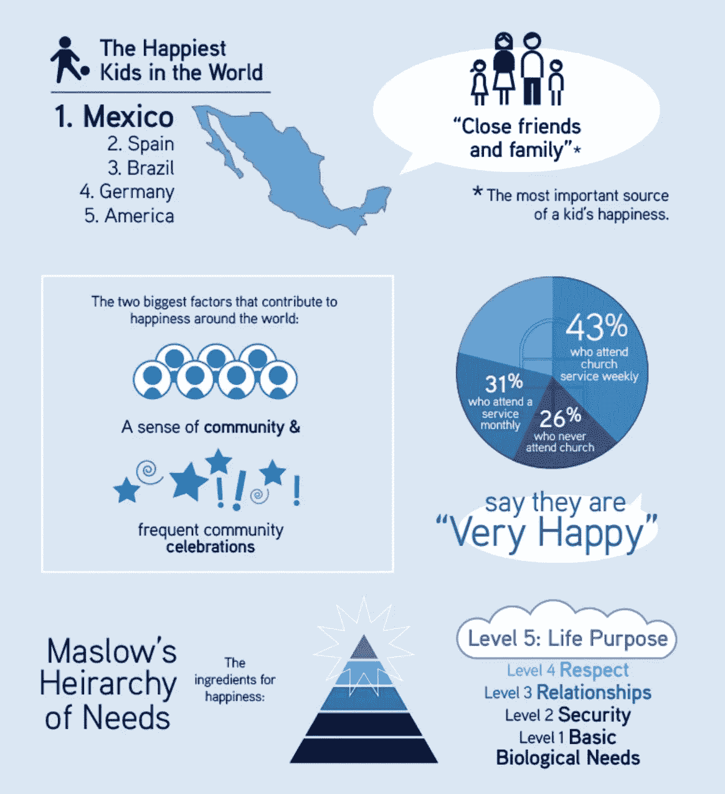
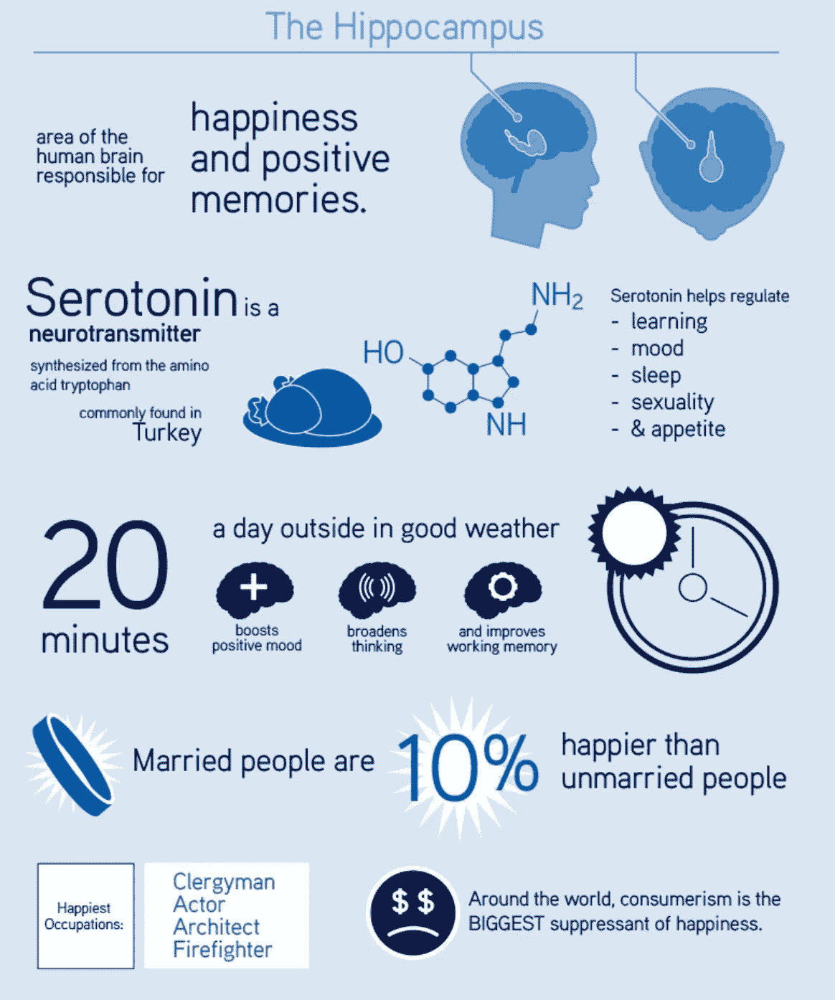
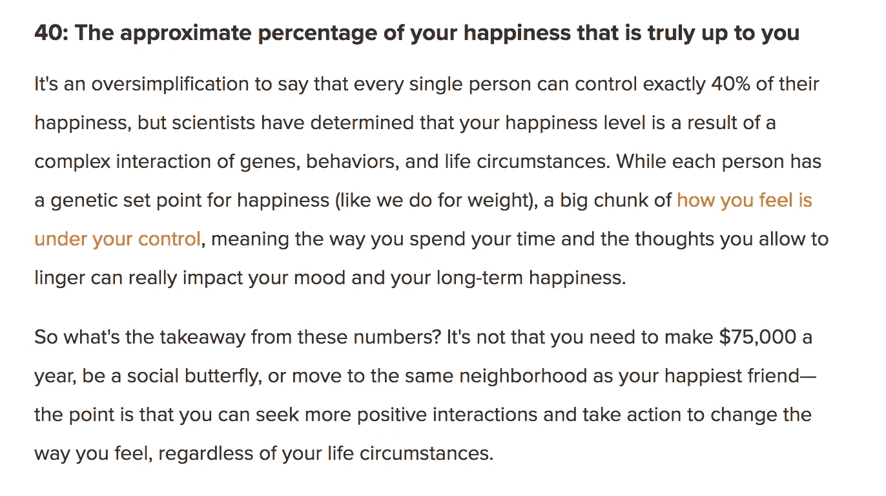
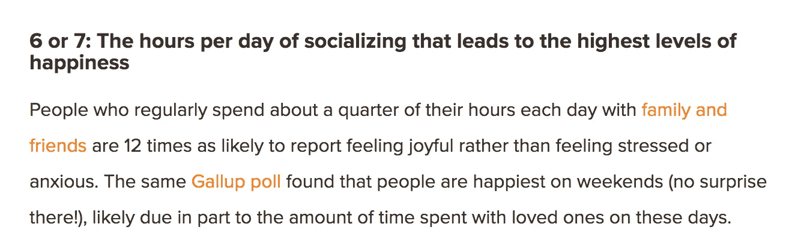
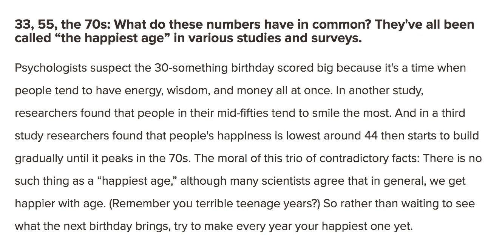
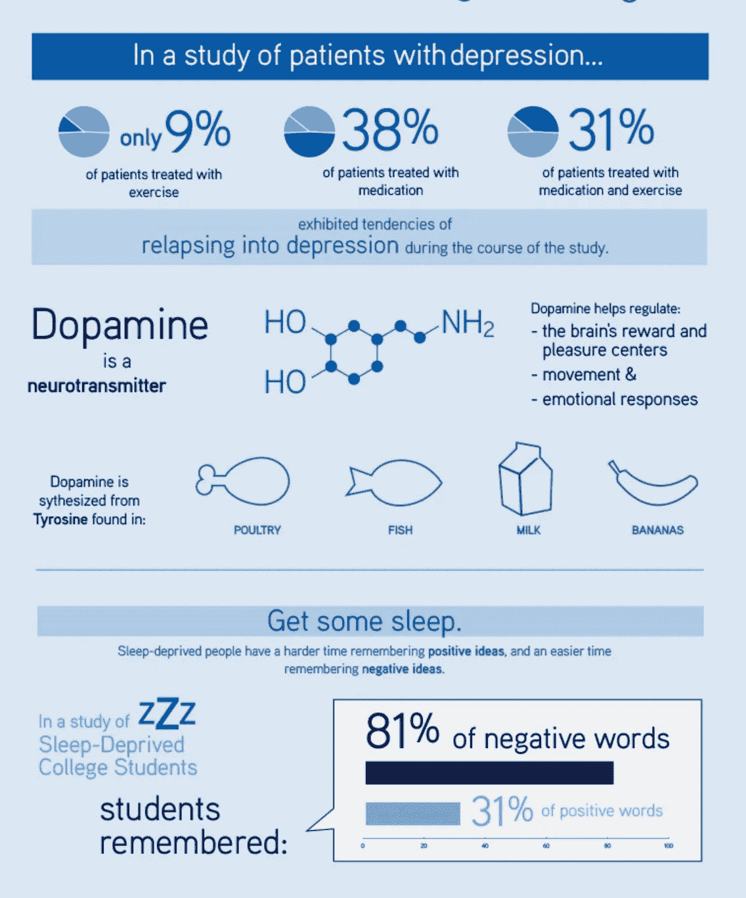
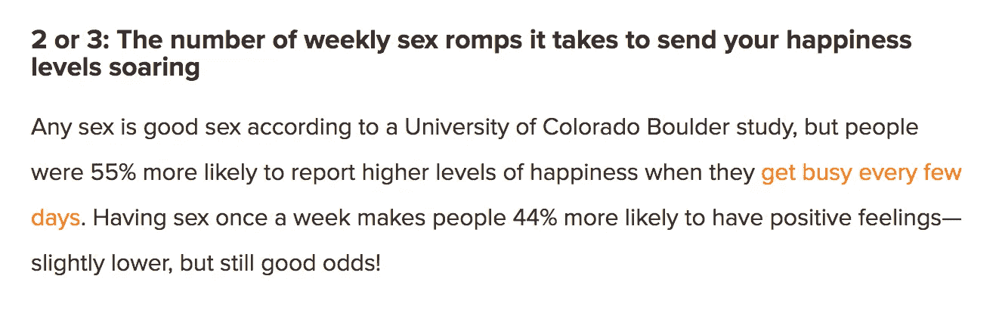
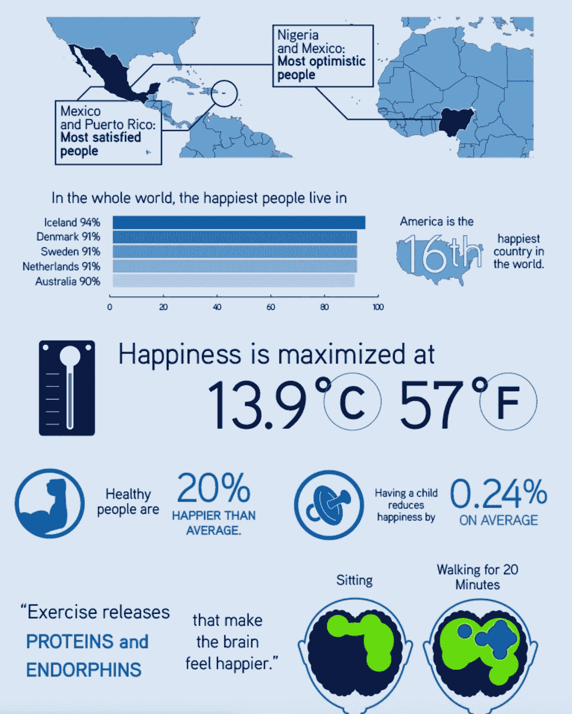

# 打造快乐灵魂的 9 种方法

> 原文：<https://medium.datadriveninvestor.com/9-ways-to-make-a-happy-soul-695551856b50?source=collection_archive---------0----------------------->

## 为什么快乐的灵魂是由内而外的

photocredit: lifehack.org

你想知道我一直想知道的一件事——为什么寻找幸福的概念总是关于到达你生命中的某个目的地？

我知道一件事，快乐需要努力、持续地理解、创造和连接到我内心最深处。

## 1.40%的幸福是你努力争取的。

[lifehack.org](http://www.lifehack.org)

然而，每个人对努力工作都有不同的定义。我对努力工作的解释是，在生活中你最感兴趣的领域里做日常的、有意义的事情。这是一个让你变得更快乐的简单方法。做你真正感兴趣的事情。做个小丑。做一个作家。做一个房地产投资者。除了股票和债券，把你的钱投资在别的东西上。做一个电影人。

 [## 在创业之旅中，拥抱学习|数据驱动的投资者

### 好像建立一个数百万美元的公司还不够困难，企业家必须额外照顾他们的…

www.datadriveninvestor.com](https://www.datadriveninvestor.com/2018/10/16/on-the-entrepreneurial-trek-embrace-the-learning/) 

幸福是知道自己受到召唤并去做。

photo credit: happyify.com

随着时间的推移，如果你专注于做这些(有时)艰难但重要的日常行为，让自己更快乐，你会生活得更快乐，提高你的技能，更经常地在快乐的时刻迷失自己(M&M 说得很好)。

## 2.建立一个强大的当地朋友、家人、导师和社交网络。

这个世界不会等你起来交新朋友。如果你正在改变，也许是时候出去闯荡并结交新朋友了。如果你的朋友陷入了抱怨、责备或找借口的固定思维模式，你就会变得和你最像的五个人一样。

photo credit: happify.com

## 3.比起自己的声音，你更看重社会的声音吗？

在朝着更快乐的状态努力的过程中，必须有一些利他的，或无私的，或内在有意义的东西——因为从现在起 10 到 20 年后，你将是食物链上更高的 40 到 60 岁的人，住在他们的办公室里，分享不到工作的快乐。

向前看，看看你想成为什么样的人，看在上帝的份上，忘了上大学和为一份你可能根本不想要的职业负债吧！

诚然，吸毒让人们在吸毒的那一刻更快乐(对吗？)，但快乐来自于外部，来自于释放你所享受的某种感觉的化学物质和化合物。然而，真正的幸福从内心萌芽，并在你的日常生活中成长，以自然、可持续的方式释放相同的化学物质。没有大麻布朗尼。不喝酒。春假不吃钼。没有蒸汽。

## 4.理解时代的智慧

photocredit: happify.com

> 真正的幸福寻求者必须理解大脑中产生血清素、多巴胺或催产素的外部和内部变量之间的差异。

幸福的一个很好的比喻是吃更多的水果、蔬菜和生的食物。如果你只吃一块西兰花，它不会让你感觉更健康或更快乐。需要坚持一日三餐食用来自地球的天然食物(持续数周),才能改变你的外貌，提高你的抗氧化水平，增加能量，改善身体组成。

所以，如果我们知道幸福不是一次性的目的地或一片西兰花——让我们向前看，大多数美国人都在做什么，对他们自己的快乐水平造成严重破坏。

lifehack.org

## 5.听听马克·曼森的话:你可能有低劣的价值观。

> 你生活在狗屁价值观中，每天都在消费这些价值观。
> 
> 你买了一些没用的东西，或者没有给你的生活带来真正价值的东西，却让你暂时开心起来(你知道那些新的名牌鞋不会带来永恒的幸福)。
> 
> 你一直在为你的猴脑拉老虎机(提示，提示——iPhone 通知)或者吸毒来逃避你的现实。
> 
> 你不能通过头衔、工作或在线状态来获得快乐。
> 
> 你认为名誉和金钱让人更快乐；错了，这让他们更像原来的样子。
> 
> 你认为幸福是一场受欢迎程度的竞赛，或者是你银行账户中零的数量。

Photo by [Helena Lopes](https://unsplash.com/@wildlittlethingsphoto?utm_source=medium&utm_medium=referral) on [Unsplash](https://unsplash.com?utm_source=medium&utm_medium=referral)

## 6.快乐通过努力工作在你身上成长，并通过时刻的自我意识超越你。

最终，快乐和幸福成为一种存在状态——就像太阳能电池板为电池提供能量一样。如果太阳走了，电池会持续产生一段时间的电力，但电池只有在能够再次捕获阳光的情况下才能充电。没有意义、好奇心或阳光的生活会耗尽你的电池。你不能不为自己做些有意义的事情就给自己充电。

## 7.多做爱

为什么我们不能有更多的性生活？我们被技术分散了注意力。我们每天看手机或电脑屏幕四个小时(呃哼哼，我在这里把自己扔到公交车底下)。我们无法集中注意力，倾听我们内心的声音。

今天集中精力寻找有意义的时刻。明天再做一次。

冲洗，重复。

## 8.找出是什么给了你意义(和多巴胺)

不知道什么给你的生活带来了意义、积极或目标？

当我不确定什么给我带来意义时，我会这样做。我开始做一些事情，并期待最好的结果。这对我来说是不舒服的，但不舒服并找出你的意义藏在哪里是开始快乐之旅最困难的部分。无论是在国外生活，开公司，健身，做你害怕的事情，恋爱，保持爱情，抚养孩子，还是宠物，在你的工作场所茁壮成长——都只是一个小小的耳语。

> 这种耳语存在于你的内心——它是一种小小的好奇心，一种天生的力量，或者一种等待成为你个人喷气燃料的痴迷。

你是你的意义的建筑师——只有你。我是说，是的，如果你愿意我可以加入，但是我不能替你做决定。你的父母不能做这个决定，你的朋友也不能。

> 这是你的责任，所以他妈的成熟点吧。

记住，有意义的生活不是做别人都在做的事情。这不是关于昂贵的大学，朝九晚五的工作，或跟随你朋友的道路，或从众投资(你看到有多少人说“要真实”，但穿着最新的时尚，试图在 Instagram 上获得粉丝，或获得最新的小工具，汽车或衣服？)

> “真实性”这个词的讽刺在今天看来是很可笑的。

最终，要过有意义的生活，你必须开始做让你着迷的工作。如果你不与你的自我、你的条件反射作斗争，不开始实践自我意识(比如今天我想成为什么样的人？)

将这些日常时刻视为与人、工作、团队分享、创造或一起工作的机会，以及带给你更多快乐的时刻。

## 9.锻炼身体，吃好，照顾好你的身体(这有助于照顾你的幸福水平)

众所周知，锻炼比大多数药物更有助于消除焦虑、抑郁和不快。加入健身房。像 [Swish House](http://www.swishhouse.com) 这样的健身社区，或者纯 Barre，或者瑜伽社区。

