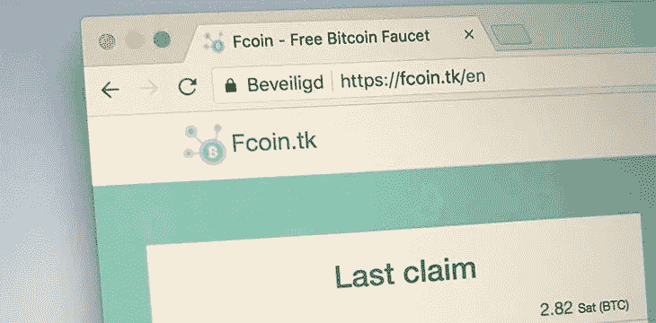

# 1.3 亿美元的骗局，FCoin 的贪婪

> 原文：<https://medium.datadriveninvestor.com/a-130m-scam-fcoin-940cd446c572?source=collection_archive---------3----------------------->

> 生活有时是无情的，而这个世界却充满了爱。—贾斯汀·孙

2020 年 2 月 18 日，ron 首席执行官 Justin Sun 支持 FCoin 骗局。当我读到这里时，厌恶和喜悦的混合感觉让我放下了刚刚做的玉米煎饼。厌恶这种“自由和公共的”分散行业的无法无天和机会主义的本质，但高兴地意识到人们将**在很长一段时间内记住这个数百万美元的教训。**

FCoin 不仅给加密货币行业敲响了警钟，整个网络行业也应该警醒。一些 IT 企业家采取了一种竞争方式，即不断向用户提供补贴，通过“烧钱”占据市场领先地位，但在最后一美元的微弱火焰熄灭后，你不得不问，在这场金钱战争中，他们在与谁作战？投资人还是自己。**咳咳 WeWork。**

> 通往地狱的道路是真诚铺就的---张健，FCoin 首席执行官

这是张健的公开坦白引起了所有的愤怒和恐慌，以及 BTC 12%的下跌。

对此我要说:通往地狱的道路是由贪婪铺成的。尽管很难承认，这就是人们在 2017 年从密码行业获得的 100 倍利润的方向，更多的想法更多地在他们身后挥舞着“去中心化”的旗帜。

 [## 总部位于瑞士的 ETP 进入加密交易市场|数据驱动的投资者

### 虽然金融市场几乎没有沉闷的时刻，特别是在引入…

www.datadriveninvestor.com](https://www.datadriveninvestor.com/2019/03/10/swiss-based-etp-enters-the-crypto-trading-market/) 

时至今日，张剑终于承认，FCoin 的问题不是系统的问题，不是黑客的问题，也不是内部的问题，而是资金储备无法由用户支付的问题。

早在 FCoin 创立之初，庞大的交易量就已经让所有交易所眼红，备受争议的“交易即挖矿”模式也已经蔓延到所有社区。事实上，有人指出 FCoin 的商业模式是“变相 ICO”或“庞氏骗局”，但在巨大的利益面前，项目业主和投资人被贪婪蒙蔽了双眼。

## 投资者的贪婪

首先，我们再来回顾一下 FCoin 的挖掘规则。FCoin 共发行了 100 亿 FT 代币，其中 49%属于私募股权，51%属于平台交易员。事务挖掘解锁了 51%的令牌，其余 49%的令牌将以相同的比例解锁。Fcoin 通过交易双方的记录，将交易费用的 100%转化为 FT，并在第二天返还给用户，然后完成一次挖掘操作。FCoin 会按照 FT 币/ FT 发行量的比例，每日将平台收入的 80%分配给用户。如果你仔细分析这种模式，你会发现，FCoin 实际上是为了吸引更多的用户来促进交易量，并缓解销售。只要新用户数量更大，老用户的盈利就会一直让他们留在游戏里。嗅到一个以 P 开头的骗局？没错，利用新人补贴老人的旧式庞氏模型。

投资者总是渴望金钱。当这种欲望演变成贪婪，就会驱使投资者加入疯狂的逐利人群，最终付出代价。

正如张剑自己所说，当 FCoin 在 2018 年由于交易挖掘的流行而开始运营时，它很快就变得月月化，以至于在短短几个月内其个人收入是巨大的(累计达 1.5-2 亿美元)。对于任何创业团队来说，这都是一个梦幻般的开始，甚至是大多数创业者一生都无法达到的高度。当时的老 FCoin 用户甚至可以在一天内赚取高达 **6000 BTC。**

在这样的利益驱动下，大量投资者涌入 FCoin 也就不足为奇了。

2018 年 8 月，FCoin 实施了一项“社区推荐者”计划，鼓励每个人去建立自己的社区，**基本上是要求你把家人和朋友一起拖下一艘沉没的船**，然后允许 FT 持有者拥有投票权，开始社区共治；2019 年 5 月，FCoin 社区推出合伙人制度，合伙人可以制定平台发展战略。平台的决策权交给了操盘手。7 月，FCoin 在棋盘上推出了创新和货币的规则，直接造成了以太坊的拥堵。所有这些运营都是为了一个目的:吸引新用户。

但问题是，只要有人离开 FCoin，或者新用户数量少于现有数量，就会造成成交量下降，价格剧烈波动。而且后期的不断抛售变得特别明显。

张謇在*的《币的真相*》中坦言:说到底一切都是为了两个字:“币价”。

事实上，一些人很早就指出，股息取决于 FT 发布速度、FT 价格以及其他难以衡量的变量。例如，如果 FT 价格相对稳定，所有股息都以 FT 的形式收到并投资回来，则复利回收期约为 35 天；如果 FT 价格继续上涨，这个周期会大大缩短；相反，如果 FT 价格下跌，后来者将承担价格大幅下跌导致投资回收期疯狂延长的风险。

## 投资者的恐慌

上周一(2 月 10 日)，FCoin 突然宣布紧急停机维护。然而，关闭的恢复时间被延迟，交易所的官方团队全部脱网。虽然张剑后来提出了邮件令牌提现计划，但很少有用户能够顺利完成提现。

2 月 17 日，FCoin 还宣布对提现流程稍作改动，其中提到“收到验证码并不意味着提现可以成功。”只有在收到用户取款确认并启动邮箱+资产验证成功后，才能开始邮箱+资产验证。虽然 FCoin 声称这种繁琐的过程是为了确保安全，但有眼光的投资者称这是“无耻地购买时间”。提现流程越复杂，投资者拿回资金的难度就越大。

张健的一系列丑态显然激怒了投资者。虽然现在还无法准确地衡量投资者因这场灾难而损失的资金总额，但据说很多人的损失超过了 10，000 美元。在 FCoin 的*真相公布后不久，一名律师解释说，张健此举是为了**将一起刑事案件变成民事案件**。如果他跑了，那么他们可以以欺诈罪立案，但现在由于他聪明地承认了所有债务，立案不再是一个选项，不知道退款的可能性。*

但从 2019 年开始，FCoin 开始了社区运营，这意味着 FCoin 目前由社区和官方团队两部分组成，而不是一家注册公司，因此很难确定资金损失和退款由谁负责。尽管张健在公告中表示将承担投资者的债务。

不仅如此，加密货币行业的退款往往非常罕见。以 Mt. Gox 为例，其破产托管人 Nobuaki Kobayashi 一再推迟支付计划诉讼。对于那些在被黑的 Mt.Gox 交易所遭受损失的人--也就是现在的债权人来说，可能需要很长时间才能拿到退款。

FCoin 和 Mt.Gox 是不同的，尽管如此，对于投资者来说，在“民事案件”中获得退款通常更加困难。

## 投资者的未来？

据张健透露，他已经决定“重新开始”，打算用新项目的盈利来补偿投资人的损失。一旦新项目步入正轨，长期的邮件退款处理将开始，但“这个过程可能会持续 1-3 年。”

然而，无论是早期投资人，还是主要投资人和社区，都无法接触到张健本人，更谈不上“重新开始”究竟是什么意思。此外，FCoin 的投资方还包括丹华资本、共识实验室、FFund、原点资本、拉链基金会、时间戳资本、节点资本、崛起资本、歌手资本、八维资本等。机构，至于这些机构投资者是否也遭受了巨额损失，此时不得而知，但可以肯定的是，这些机构持有的 FT 代币大部分都被锁定，限制提现，因此损失几乎是公认的。

张剑自称是去中心化和加密货币的信徒，甚至说“加密货币是我的梦想，但一夜暴富不是，所以我愿意用我的财富来换取加密货币的梦想。”但我们要记住，经济的最大价值是刺激早期网络。**发行者必须用现实世界的应用稳定市场地位，或者在后期用优质服务武装自己，**否则代币的价值将为零。

至少从目前来看，整个加密货币行业应该好好看看平台币、交易所、代币项目发起人的监管安全问题，因为你永远不知道你的贪婪会把你带到哪个悬崖。