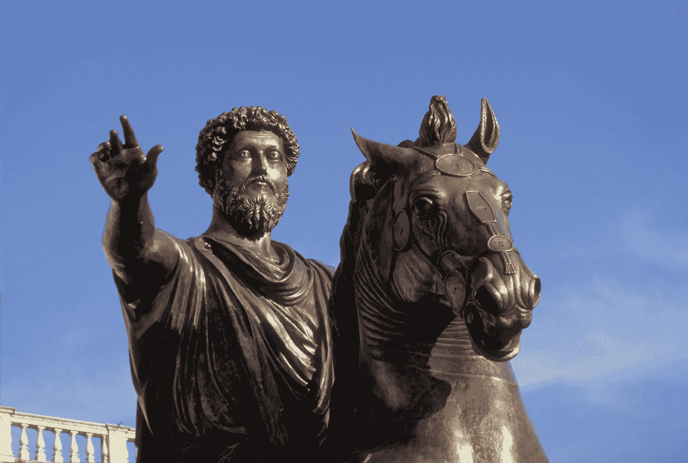
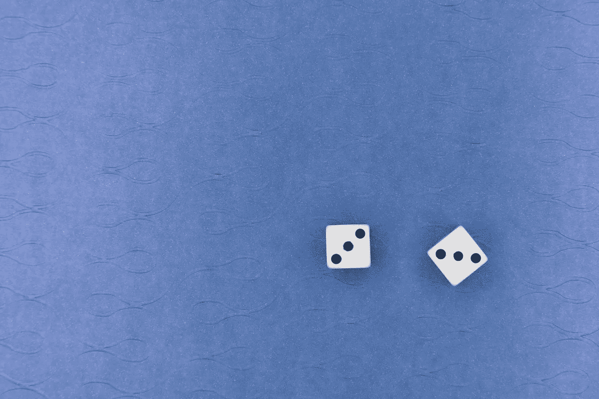

# 一个 17 岁的禁欲主义者

> 原文：<https://medium.datadriveninvestor.com/a-17-year-old-and-stoicism-daf49f5f847b?source=collection_archive---------6----------------------->

## 我从这两个月的实践中学到了什么，为什么你应该在你的生活中实施它，以及如何去做。

Roman Emperor & Stoic Marcus Aurelius (Photo: U-M Library Digital Collections)

你曾经在压力下感到恐慌吗？在这段疫情期间，你有没有感到迷茫或者对自己的处境感到无助？对于你们学生来说，不知道学校是否会亲自开放，或者你是否会进入大学，这两个例子都是我们这一代人中很少有人经历过的现状。对于成年人来说，这种担心更加真实；“我还会有工作，能够把食物放在桌子上吗？”

由于疫情，斯多葛派如今正在复兴。著名的媒体，比如这篇由*卫报*撰写的[新闻文章](https://www.theguardian.com/commentisfree/2020/mar/18/remaining-calm-in-adversity-what-stoicism-can-teach-us-during-the-coronavirus-pandemic)，最近报道了这种起源于公元前 3 世纪早期雅典的古老哲学。

斯多葛派到底是什么？它最广为人知的信条是忍受痛苦或艰难，不表露感情，不抱怨，我发现还有更多，这种哲学事实上提供了一套全面的实用智慧，非常适合我们生活的时代。

请继续阅读过去两个月来帮助我成长的三个最有用的斯多葛派原则，以及你如何将它们应用到今天的生活中。

Photo by [Kevin Lee](https://unsplash.com/@kevin_lee?utm_source=unsplash&utm_medium=referral&utm_content=creditCopyText) on [Unsplash](https://unsplash.com/s/photos/new-york-city-taxi?utm_source=unsplash&utm_medium=referral&utm_content=creditCopyText)

# 1.检查你的印象，深呼吸

你被堵在路上了。街道变成了停车场，没有人移动。你转向你的乘客说，“交通不是最糟糕的吗？”

除了出租车司机之外，我还没见过有人抱怨交通，但实际上并不是这个意思。

那又怎样？我们都同意交通很糟糕，但同时，我们必须明白我们对此基本上无能为力。当然，你可以早点离开，但这不是重点。一旦你遇到交通堵塞，你唯一能做的就是深呼吸，等它过去。更重要的是，首先要为自己能开车而心存感激。虽然这需要时间，但是将障碍转化为机会——在这种情况下要练习耐心——会让你充分利用这种情况。

爱比克泰德，他那个时代的另一位杰出的斯多葛派哲学家，建议我们问自己:“这是不是我能控制的事情？”如果事情在你的控制之下，就采取行动，否则就忽略它。

通过不断地这样做，你会把你的思想和行动集中在实际上在你控制范围内的事情上，同时避免轻率的情绪反应。

> "困扰我们的不是事物，而是我们对事物的判断."

在你控制之下最重要的事情是你如何应对一种情况。在与他人打交道时，一旦你认识到他们的行为超出了你的控制范围，并且通过情绪化的反应加深了他们对你的控制，那么即使你感到委屈或被冒犯，保持冷静也会容易得多。有趣的是，这导致你试图完全减少对社会认可的需求——通过摆脱他人的观点，你能够做伟大的工作。

此外，爱比克泰德写道，我们需要尽最大能力面对所有情况，而把结果留给命运。所以，让你的目标成为你力所能及的事情，而不是命运可以剥夺的事情。

对于今年申请大学的人来说，要知道有时事情不会如你所愿，即使你尽了最大努力，也不管你是否值得。重要的是你投入的工作和学到的教训。

Photo by [Markus Winkler](https://unsplash.com/@markuswinkler?utm_source=unsplash&utm_medium=referral&utm_content=creditCopyText) on [Unsplash](https://unsplash.com/s/photos/game?utm_source=unsplash&utm_medium=referral&utm_content=creditCopyText)

# 2.接受并玩掷出的骰子

你出生在过去 100 年内的几率有多大，更别说是 21 世纪了？根据我写这篇文章的朋友所说，大约是四百万亿分之一。爱比克泰德把生活比作掷骰子的游戏:

> “我们在任何时刻存在的条件都像是已经掷出的骰子；它们不能被改变，必须被接受。[然而]，骰子落下后，我们如何掷骰子取决于我们自己。”

许多人不接受和玩掷骰子的游戏，而是选择让自己被搜索引擎、社交媒体和网络包围，让他们现有的偏见永久化，或者每天让错误和虚假信息充斥他们的大脑。爱比克泰德将这些人描述为能够接受好的事物，但试图逃避挑战和困难。另一方面，他写道，困难是增强我们内心决心的机会。

就我个人而言，这引起了我在竞争性跑步中的经历的共鸣。有些跑步者非常有天赋，而其他人只需要更加努力，我是后一种人。在越野比赛中挑战自己的体能极限是很难的，但之后，你的结果总是激励你继续努力训练，在下一场比赛中与他人，更重要的是与自己的比赛中做得更好。

可以说，去年的掷骰子是疫情。全世界有数千万人的病毒检测呈阳性，其中近 200 万人死亡。公元 2 世纪，罗马皇帝马可·奥勒留经历了一场消灭了三分之一人口的疫情。他和早期的斯多葛派哲学家塞内卡都必须在他们的孩子死后继续。

我们必须接受当前形势的现实，除非你是介于专门研究疫苗的科学家或世界领袖之间的人，否则我们能做的最好也可能是唯一的事情就是遵循公共卫生指令，过我们自己的生活。

Photo by [Deniz Fuchidzhiev](https://unsplash.com/@dfuchidzhiev?utm_source=medium&utm_medium=referral) on [Unsplash](https://unsplash.com?utm_source=medium&utm_medium=referral)

# 3.反思你的一天

斯多葛主义不只是思考，而是行动。提高的最好方法就是回顾和反思。

这里的目标是关注当天发生的重要事情，特别是那些具有伦理价值的事情，因为你当时做出的选择最能代表你的性格。爱比克泰德分享了他的建议:

> “在你算完一天中的每一件事之前，不要睡在你柔软的眼皮里——我做错了什么，做了什么或没做什么？所以开始，所以审查你的行为，然后为卑鄙的行为责备自己，好高兴。”

让反思成为日常习惯会产生复合效应，并且随着时间的推移会产生指数回报(我会在本文的[中更多地讨论复合)。通常，我们倾向于过多关注我们没有完成的事情，或者我们如何能做得更好。虽然这无疑很重要，但同样重要的是，要对今天发生的好事心存感激，并思考你做得好的地方，以便明天可以重复。](https://devindersarai.medium.com/how-1-changed-my-life-b06dafa5a098)

我用一本[成长书](https://shop.johnafish.ca/products/growth-book)来计划我的一天，并在一天结束时进行平衡思考。欣赏和感激是强有力的工具，它让我既能享受生活的时刻，又能感激我每天所拥有的——我可以自信地说，在过去的一年里，它们绝对改变了我的生活。

反思自己的日子，你不会后悔的。

Photo by [Jaelynn Castillo](https://unsplash.com/@jaelynnalexis?utm_source=medium&utm_medium=referral) on [Unsplash](https://unsplash.com?utm_source=medium&utm_medium=referral)

# 现在是行动的时候了

在过去的两个月里，斯多葛主义在很多方面塑造了我的生活，我知道它对你来说也是不可或缺的工具。无论你想变得更加理性，在这个疫情中重新站稳脚跟，还是加速你的成长，斯多葛主义都能帮你实现。

但不要只相信我的话——纵观现代历史，非常成功和有影响力的人，例如西奥多·罗斯福、T2、拉尔夫·沃尔多·爱默生、T4、阿诺德·施瓦辛格和蒂姆·费里斯都在斯多葛派哲学中找到了智慧。这里有三个最有用的斯多葛派原则，你可以应用到你今天的生活中:

*   **审视你的印象，深呼吸:**问自己:“这件事是在我的控制之中，还是不在我的控制之中？”如果事情在你的控制之下，那就采取行动，否则就深呼吸，忽略它。
*   **接受并掷出骰子:**接受美好的事物，但不要逃避挑战和困难——它们是考验你自己和增强你内心决心的机会。
*   回顾你的一天:最好的改进方法就是回顾和反思。每天这样做，以利用复利。

我想留给你们爱比克泰德的最后一个想法和智慧:

> “如果你现在忽视事情，总是一次又一次地拖延，把一天又一天定为关注自己的日子，那么在没有意识到这一点的情况下，你将不会取得任何进展[……]记住，比赛已经开始，你不能再拖延，你的进展是由一天或一个行动决定的。”

我们多久会把自己的工作推到明天？

现在就行动吧，因为在大多数情况下，这个“明天”永远不会到来。

我们走吧。

要查看我的更多作品，跟随我学习改变世界的旅程，你可以注册我的[时事通讯](https://www.subscribepage.com/devindersarai)或在 [LinkedIn](https://www.linkedin.com/in/devinder-sarai/) 上与我联系。