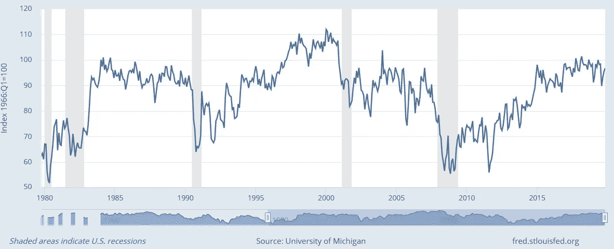

# 2020 年的经济评估

> 原文：<https://medium.datadriveninvestor.com/a-2020-assessment-of-the-economy-656a02385cfc?source=collection_archive---------10----------------------->

## 很多潜力即将显现，但政治将比以前发挥更大的作用。

Photo by Ian Schneider on [Unsplash](https://unsplash.com/)

过去三年经历了一些起伏，但有一点是肯定的:美国经济一直处于最成功的时期之一。

失业率已经下降到 50 年来的最低点，近十年来[的就业增长率一直超过百分之一](https://fred.stlouisfed.org/series/PAYEMS)(自 20 世纪 60 年代以来的最长时间)，自 2017 年以来，实际国内生产总值(GDP)一直在增长大约 2-3%[。此外，自 2017 年](https://fred.stlouisfed.org/series/GDPC1)以来，名义工资增长了 2–3.5%[，集中在非监督人员和蓝领工人中。](https://fred.stlouisfed.org/series/CES0500000003)

 [## 为什么包容性财富指数比 GDP 更能衡量社会进步？|数据驱动…

### 你不需要成为一个经济奇才或金融大师就能知道 GDP 的定义。即使你从未拿过 ECON 奖…

www.datadriveninvestor.com](https://www.datadriveninvestor.com/2019/03/08/why-inclusive-wealth-index-is-a-better-measure-of-societal-progress-than-gdp/) 

就连高盛也评论说，经济“在结构上不太容易陷入衰退”，这表明能源独立性增强，与其他国家的贸易条件改善，金融机构的杠杆作用降低，等等。白宫还预测明年的实际 GDP 增长率约为 3%。

# 预测者的责任

我发现特别有趣的是，有多少批评家推测经济正在走向衰退——并且被证明是非常错误的。

还记得几个月前[反转收益率曲线](https://www.cnbc.com/2019/08/14/the-inverted-yield-curve-explained-and-what-it-means-for-your-money.html)吸引的所有头条新闻吗？或者，关于衰退风险的[关税](https://www.nytimes.com/2019/08/07/opinion/tariff-tantrums-and-recession-risks.html)呢？

有一点是肯定的:预测是艰难的。几乎所有的经济学家都专注于解释历史数据——也就是说，利用历史数据来恢复两个或更多因素之间貌似合理的因果关系。

这本身就具有挑战性，但当你试图预测未来的衰退时，这是一个全新的难度。不仅有“已知的未知的”风险因素，也有“未知的未知”，即我们甚至还没有考虑的风险因素。

最近的预测被多次证伪，这一事实应该让我们在准备预测时保持谨慎和谦逊。它还应该提醒我们在犯错时承担责任——勇于承认。

# 乐观的理由

鉴于下一年的挑战性以及已经有多少人错了，对我来说，给出一个大胆的预测是具有讽刺意味的。

但是，我们可以做的一件事是指出机遇和挑战的领域，强调它们如何与更广泛的社会和政治力量相互作用。

我们近年来看到的实际国内生产总值增长背后的最大驱动力之一是消费者信心的飙升。虽然没有真实背景的信心是错误的，但美国经济已经取得了一些重要进展，值得关注。

Consumer Sentiment (1966 = 100) by [the St. Louis Federal Reserve](https://fred.stlouisfed.org/series/UMCSENT)

与其列出一长串不同的结构性因素，不如让我们具体谈谈一个让我非常乐观的因素:监管改革。

在过去的四十年里，美国变得更加规范。例如，Mercatus Center 的 [QuantGov](https://quantgov.org/) 数据库显示，1980 年至 2017 年间，联邦监管增长了 71%。

虽然目前正在就监管的最佳数量和类型进行辩论，但人们普遍认为，某些形式的监管特别有害。例如，住房法规导致州际和州内流动性下降，T4 各州和城市的生产率下降，生活成本上升。根据对总体效应的额外估计，如果监管保持在 1980 年的水平，到 2014 年 GDP 将增长 25%。

特朗普政府寻求减少繁重的监管，同时保持良好的形式。例如，根据监管限制的 QuantGov 指数，相对于该指数开发以来的所有其他政府，特朗普政府期间监管增加的[最少](https://www.mercatus.org/publications/regulation/regulatory-data-trump%E2%80%99s-first-year)(至少根据第一任期的结果)。此外，经济顾问委员会最近发布了[一份报告](https://www.whitehouse.gov/wp-content/uploads/2019/06/The-Economic-Effects-of-Federal-Deregulation-Interim-Report.pdf)，发现自 2017 年 1 月以来的监管改革将使每个家庭每年的实际收入增加 3100 美元。

# 作为经济挑战的政治两极分化

虽然我们都可以看到社会变得[更加两极化](https://www.theatlantic.com/politics/archive/2017/10/trump-partisan-divide-republicans-democrats/541917/)，但我们往往忽视了生产力和人类繁荣的额外后果。

例如，它对消费者信心和支出的影响。政治倾向越来越能预测经济信心。虽然温和派和共和党人对经济的信念有 77%的相关性，但自 2016 年以来，民主党人和共和党人的相关性接近-90%。这会影响人们的储蓄和消费。

或者，考虑这样一个事实，即两极分化已经造成了许多立法僵局。简而言之，越来越少的法案获得通过，尤其是应对即将出现的结构性挑战的重要法案。相反，我们陷入了争吵和针锋相对。

Photo by Sushil Nash on [Unsplash](https://unsplash.com/)

如果我们想在 2020 年达到最大程度的繁荣，我们必须走向和解。经济表现很好，我们不仅避免了一些人心中的衰退，还通过持续的生产率增长加强了经济的核心。工作的人比以往任何时候都多，工资也在持续增长。

2020 年我们不要浪费机会。