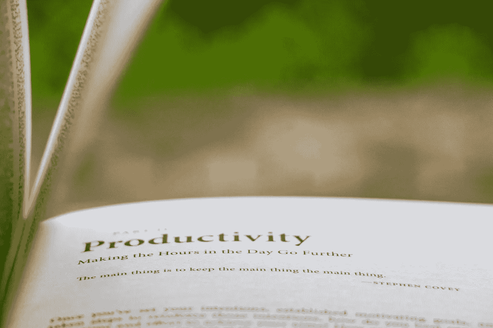

# 生产力的三步蓝图

> 原文：<https://medium.datadriveninvestor.com/a-3-step-blueprint-for-productivity-39a45e062616?source=collection_archive---------19----------------------->

趁现在好，赶紧去买。

Photo by [Thirdman](https://www.pexels.com/@thirdman?utm_content=attributionCopyText&utm_medium=referral&utm_source=pexels) from [Pexels](https://www.pexels.com/photo/man-in-white-crew-neck-t-shirt-wearing-black-framed-eyeglasses-5318488/?utm_content=attributionCopyText&utm_medium=referral&utm_source=pexels)

人们往往把智力与生产力联系在一起。但这可能不是一个完美的相关性——生产率通常与习惯和纪律的关系比智商更大。你持续进行的活动有助于你朝着自己的目标前进。

保持积极的行为是具有挑战性的。在 2020 年尤其如此，那时我们已经笨拙地从面对面做事调整到在网上忙碌。

尽管疫情在模式上有所转变，成功的游戏计划仍然是一样的——加强你的注意力，重新审视你的目标，控制你的分心。

这些活动将帮助你克服生活中的小烦恼，获得更多成就。

# **1。** **支撑你的注意力。**

在一个充满无数娱乐的世界里，重新审视你的焦点对生产力至关重要。开始一项任务、保持注意力并努力完成它的能力可能会令人畏惧。有人称之为[“心流”](https://www.amazon.co.uk/gp/product/0061339202/ref=as_li_qf_asin_il_tl?ie=UTF8&tag=nesslabs-21&creative=6738&linkCode=as2&creativeASIN=0061339202&linkId=0c2a94c7d890744e1af1c4ec10a68fb7)——你希望保持最佳状态的精神状态。

心流将你对生产力的渴望与你的情绪联系起来。当你追逐目标时，你的大脑是快乐的。既然完成事情的感觉很棒，你可能会继续你的追求。

米哈里·契克森米哈博士创造了术语“心流”他用下面的话总结了他对专注和生产力的看法:

> “自我消失了。时光飞逝。每一个行动、运动和思想都不可避免地来自前一个。你整个人都参与进来了，你正在最大限度地运用你的技能。”

你的目标可以是任何事情，从掌握一个食谱，提高工作表现，或学习一项新的运动。你甚至可以在做庭院工作或打扫卫生的时候融入其中。主要因素是，目标必须需要你的关注，并为你提供清晰的标志来衡量进展。

 [## 在家工作如何提高我的工作效率|数据驱动型投资者

### 在家工作确实激发了我最大的潜能，让我更有效率。因为在家工作给了我…

www.datadriveninvestor.com](https://www.datadriveninvestor.com/2020/07/29/how-working-from-home-increased-my-productivity/) 

当你出于内在原因专注于一项活动时，最好能达到心流状态——也就是说，带着你的动机去完成一项任务，而不仅仅是因为你觉得有义务去做。这就引出了第二步…

Photo by [krisna iv](https://unsplash.com/@finesite?utm_source=unsplash&utm_medium=referral&utm_content=creditCopyText) on [Unsplash](https://unsplash.com/s/photos/productivity?utm_source=unsplash&utm_medium=referral&utm_content=creditCopyText)

# **2。** **重温你的目的。**

如果你不明白你为什么要做一件事，你怎么能指望完成它？

最好的目标以“为什么”开始不仅仅是表面的“为什么”，而是深入挖掘，发现点燃你激情的火花。

你的健身目标仅仅是为了穿上一条牛仔裤，还是为了变得更健康、增强自尊？

你参加在线课程是为了给工作中的人留下深刻印象还是为了增强你的知识基础？

当你挖掘出隐藏在目标背后的意义时，目标会很快转化为使命。这种改变会激发你变得更有目的性。

并非每个目标都饱含情感，但如果你经常重温你的目标，你会发现你想完成的事情根植于你的价值观。如果你找到那种意义并放大它的声音，它就变成了一种使命。然后你几乎不可能转身抛弃它。

# **3。** **管理自己的杂念。**

你给它们喂食，它们就会生长。因此，如果你不断地让自己分心，它们就会在你的生活中不断扩大。

人们处理分心的方式各不相同，但大多数人都允许分心摧毁他们的效率。每当你屈服于查看智能手机或浏览社交媒体订阅源，你就会分散你的脑力和代谢资源，同时失去宝贵的动力。

解决这个问题的一个方法是连续冲刺。与健身中的[高强度间歇训练(HIIT)](https://www.webmd.com/fitness-exercise/a-z/high-intensity-interval-training-hiit) 类似，你可以将你的努力安排成短时间的突发艰苦训练，迫使你保持专注。

像 HIIT 一样，连续冲刺可以提高强度，让你的注意力更加集中。这个过程中会有一些停机时间，但这是最小的——所以分心的事物永远不会有机会接管。

网络搜索可以发现无数其他处理分心的方法。关键是你必须找到一种适合你的方法来减轻娱乐对你工作效率的影响。

# **变革的方法。**

每个人都陷入了无所事事的平静。没有办法保持坚定的专注。因此，我希望你们不要把当前的挑战视为障碍，而是重新审视自己意图、调整视角的机会。

> 增强你的注意力。
> 
> 重温你的目的。
> 
> 管理你的杂念。

我支持你。

阿德里安·s·波特是一名作家、工程师、顾问和演说家。他写诗歌、短篇小说和各种主题的文章，包括创造力和个人成长。他是诗集[和散文集](https://www.amazon.com/Everything-Wrong-Feels-Adrian-Potter/dp/109519061X/ref=sr_1_4?qid=1560264651&refinements=p_27%3AAdrian+S.+Potter&s=books&sr=1-4&text=Adrian+S.+Potter)[的作者。在](https://e2857002-6118-41be-9746-64261e36cacb.filesusr.com/ugd/21d2c2_03522f10c7c84340a05a8d03a97e1642.pdf)[http://adrianspotter.com/](http://adrianspotter.com/)在线拜访他。

# **附加文字**

[35 件你应该为自己做的有益的事情](https://medium.com/datadriveninvestor/35-beneficial-things-you-should-do-for-yourself-7824dda0c44?source=friends_link&sk=6057dbef7e93b86538a11dc3a146a706)

[自我提升需要考虑的 3 种心态调整](https://medium.com/the-innovation/3-mindset-adjustments-to-consider-for-self-improvement-beb3dd0783a6?source=friends_link&sk=9979440e940fb531d8a61383ebdb58b8)

[没有动力的人的 5 个习惯](https://medium.com/an-idea/5-habits-of-unmotivated-people-dea1468d4768?source=friends_link&sk=3886eb72b7205ac5f1045e66808c6620)

## 访问专家视图— [订阅 DDI 英特尔](https://datadriveninvestor.com/ddi-intel)