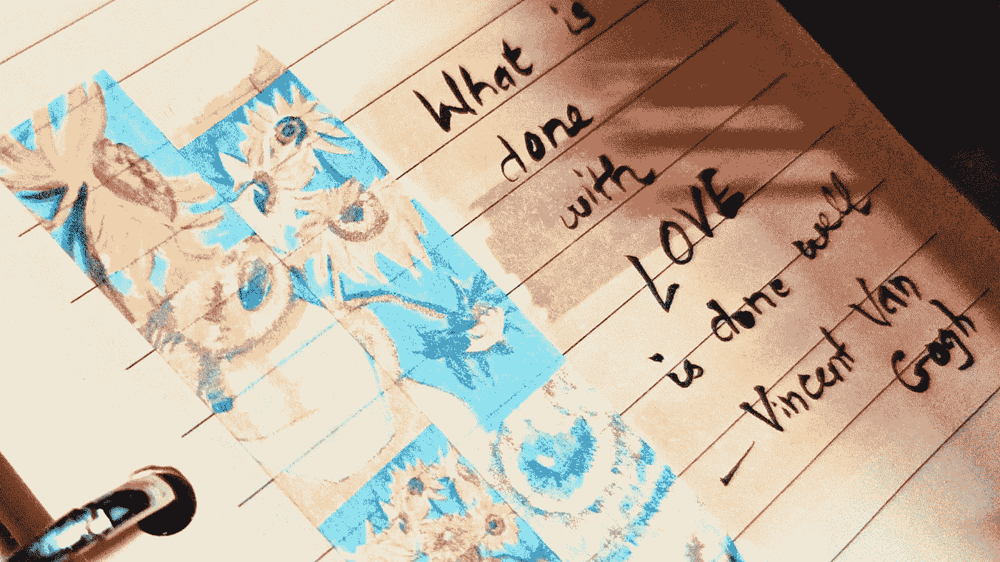

# 艺术创作初学者指南

> 原文：<https://medium.datadriveninvestor.com/a-beginners-guide-to-creating-art-9cede9aaf145?source=collection_archive---------11----------------------->

## 艺术家心态初学者手册——从一个崭露头角的艺术家到另一个。

我过去讨厌犯错。他们会打乱我想要实现的目标，让我完全失去平衡。最糟糕的是——他们会让我相信我永远也不会做好我想做的事情。

很多人在创作了一两件艺术品后，也确实相信这一点。他们告诉我，‘我就是不能像你一样画画！’虽然在这种情况下这是真的，但老实说，客观地说，如果和其他艺术家相比，我并没有那么伟大。我的艺术通常只比这个人创作的艺术更好——这个人认为他们不能像我一样画画，他刚刚开始艺术之旅。在几次尝试之后，许多人倾向于放弃，并决定“我就是做不到”。如果这听起来很熟悉，请继续读下去。

现在，当然，你的目标不是成为下一个毕加索，你只是想做些漂亮的东西。即便如此，很有可能你在创作艺术时犯了一些基本的错误和假设，让艺术创作过程变得乏味或令人沮丧。比需要的多得多。

就像我之前说的，我过去讨厌犯错。很多这样的错误是在我试图创造美好事物的时候犯的，我从中学到了很多。我不后悔，但他们肯定是浪费时间。我已经写下了一些基本的事情，在你开始创作艺术之前，或者至少在你因为艺术不能给你带来快乐而放弃艺术之前，你应该做这些事情来节省你的时间和眼泪。

## **1。找到你创作艺术的理由**

很少有人问自己为什么要做一件事，并且诚实的回答。有一个清晰的答案会让你的行为更深思熟虑，更少随意。艺术也是一样，没有错的答案。这是我的。我这样做是因为我觉得这是表达我的想法和情感的最好方式。我这样做也是因为好的艺术对人们有意义。当我完成一件作品时，我会有一种巨大的冲动，这件作品以前只是我想象中的虚构，现在是真实的，在画布上，看起来就像我做得很好。这就是我创作艺术的原因。

你可以说你只是想尝试一些新的东西，或者你想做一些漂亮的东西，或者你想学习如何表达自己。在你开始写一篇文章之前，先要有这个想法。相信我，会有帮助的。

## 2.我从哪里开始？从简单开始。

所以你已经想到了你为什么要做艺术。现在呢？总得从某个地方开始。如果你已经知道你想做花卉，这一步会更容易。如果你没有——以下是我的建议。

打开你的浏览器，一个接一个地搜索这些主题——“花卉艺术”、“初学者风景艺术”、“肖像艺术”、“基础水彩画”和“初学者的艺术想法”、“抽象艺术”。浏览图片，记下你喜欢的东西。许多图片将链接到 youtube 教程相同的艺术品。一旦你选择了你喜欢的艺术种类，你就可以潜心学习如何创造它。

## 3.尽可能使用参考文献

每当我得到类似“你是如何画出这么可爱的猫的”这样的赞美时，我的脑海中就会闪现出谷歌搜索“可爱的坐着的猫”并滚动浏览 10 张(好吧，50 张)猫的图片来选择我要提到的那张。

很多人认为，如果你是一名艺术家，你只需要知道如何运用你的想象力来绘画。虽然对于一些有经验的艺术家来说，这可能是真的，但在制作艺术品时，你永远不应该回避使用参考文献。大多数艺术家都使用参照物，你也应该这样——尤其是如果你想真实地再现某样东西。世界就在你的指尖——搜索你想要的图像，并尝试将其作为一种学习的方式。

不是出轨，从来都不是出轨。不相信我？这是一幅古老大师使用暗箱将 3D 场景转换成 2D 表面的图像，就像某种机械复写纸一样。

至少你不必亲自出现在你的推荐人身边。

## 4.小心选择你的美术用品

有多少次我想扔掉我的画笔或颜料，因为它们看起来*不管我在我的笔画上花了多少功夫，或者我如何管理合适的水量，或者我如何轻描淡写地使用我的画笔……太多了。我使用任何可用的东西，不知道冷压和热压的区别，可以和颜料一起使用的介质，或者在商店里看起来很好但使用一次后就散架的刷子。*

*你不需要价格不菲的专业、艺术家级别的用品，但你需要好的用品。它们让你如何体验制作一件艺术品变得完全不同，这反过来又会在结果中表现出来。*

*我可以写一系列关于每种介质的耗材的文章，但总的要点是:研究你想使用的耗材。比方说，你想从事水彩画。你应该仔细阅读可以使用的不同种类的纸，画笔和颜料。找出哪些是最好的，为什么。了解一下哪些够好，哪些买得起。了解如何识别糟糕的供应品(我在看你，给孩子们的蛋糕水彩。).*

*劣质的供应品不仅会毁掉你的体验，还会浪费宝贵的时间和金钱。足够好，但负担得起的用品是我对每个初学者的建议，这样他们就可以练习这些，然后在他们达到水平后挥霍在专业用品上。*

## *5.耐心是关键，实践是关键*

*当人们开始从事艺术时，他们有一种奇怪的期望——他们应该能够立刻创作出漂亮的东西。这种情况经常发生，因为社交媒体上的延时视频将艺术家*小时*的工作浓缩为 2-3 分钟。有时候 30 秒！这在潜意识里给观者一种艺术轻松或快速的错觉。*

*当现实与电影胶片不符时，人们往往会感到沮丧。我就是画不出这样的！“你是怎么做到的，”有一个简短的回答。*

**我练习。**

*我就做这些。我做什么都是练习。我被委托做的任何事情都是练习。我不能给你另一个答案，因为没有答案。*

*在多动症的世界里，慢慢地坚持做某件事，直到你认为自己“可以”为止，也需要惊人的耐心。甚至不好，只是还好。大多数人在认为自己还可以之前放弃了很长一段时间，因为他们的“还可以”是和很多人最好的作品相比的。*

## *6.社交媒体可能是你的朋友，也可能是你最大的敌人*

*想要向你的朋友和家人展示你创造的东西是很自然的。不管我们是否意识到，我们都在进行验证，能够说‘嘿！这是我做的！。*

*在你开始在社交媒体上发帖之前，我希望你考虑一些事情。*

*a.信用信用信用:如果你引用了另一位艺术家的作品或者试图复制他们的作品来学习一种技术，你必须毫无例外地信任这位艺术家。艺术家拥有构图、构思和执行。试图把一件不属于你自己的艺术品当成你的，往好了说是失礼，往坏了说是不道德/犯罪。*

*b.社交媒体的喜欢或关注者不会说你作为一名艺术家的技能。*

*c.如果你的目标是成为一名“著名的社交媒体艺术家”,你要知道，要让算法“游戏”关注你并在社交媒体上出名，需要日常工作、演示、营销和大量运气。*

*d.社交媒体上的追随者数量并不能说明你可以通过艺术赚到多少钱。*

*e.如果你打算把你的作品拍下来发布到社交媒体上，日光是你最好的朋友。*

## *7.知道什么时候退出*

*如果某样东西不能给你带来快乐，那么你应该放弃它。我知道这很难做到。我们已经习惯于把放弃某件事视为失败。说实话，放弃只是让我们更快地做下一件事。*

*如果一幅作品每画一笔后看起来更糟，撕掉画布，扔掉它。重新开始。如果艺术作为一种爱好不适合你，那就放弃这个爱好。重新开始。*

*做了某件事却发现没用，总比从来不做好，或者更糟，因为害怕失败而一直做下去。*

*所以总结一下:*

1.  *找到你创作艺术的理由*
2.  *从简单开始*
3.  *尽可能使用参考文献*
4.  *小心选择你的美术用品*
5.  *耐心是关键，实践是关键*
6.  *社交媒体可能是你的朋友，也可能是你最大的敌人*
7.  *知道什么时候退出*

*我遇到过许多想开始创作艺术品的人，他们说我应该教他们。我告诉他们我还没到。我还不能教授每种媒体的确切技术，因为我正在努力提高我的技能。*

*我能做的，就是给你一些我从未得到过但又非常需要的建议。我希望你能节省一些时间和心痛，这样你的艺术之旅会更加顺利和充满奇迹。*