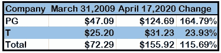
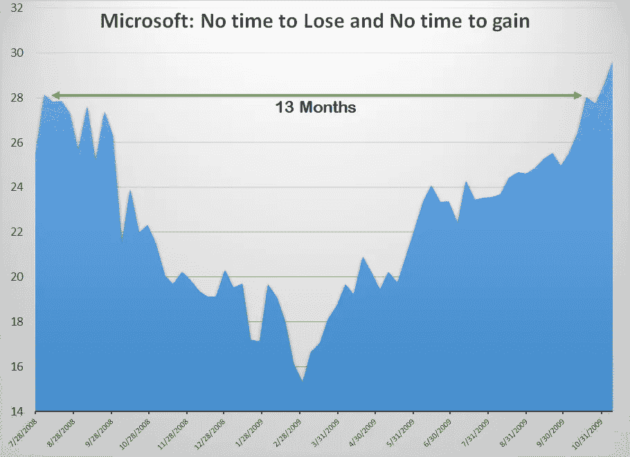
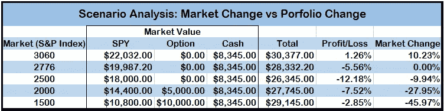

# 低迷时期投资初学者指南

> 原文：<https://medium.datadriveninvestor.com/a-beginners-guide-to-investing-in-a-downturn-92b9791aa372?source=collection_archive---------11----------------------->

有没有想过低买高卖？

让我告诉你一个秘密。

Photo by [Ben Sweet](https://unsplash.com/photos/2LowviVHZ-E) from Unsplash

这正是全球成千上万的交易员和基金经理想要做的事情，但没有人能一直做对。甚至连沃伦·巴菲特和 T2·彼得·林奇也没有。如果训练有素的专业人士和传奇人物不能坚持低买高卖，那我们该怎么办？

投资的关键是积累对我们有利的机会，一次一层。

# 第一层:低迷是最大的机会

“如果股票定价过高，即使一切顺利，你也赚不到钱，”传奇投资者彼得·林奇在他的书《华尔街一日游》中写道。我相信他所说的话的反面非常适合经济低迷时期。

**如果股票价格被严重低估，即使很多事情出错，你仍然会赚钱。**

在估值过高的市场中找到估值过低的股票就像大海捞针，但在估值过低的市场中找到估值过低的股票就像在一堆针中找到一根针。

 [## 投资区块链前要问的三个简单问题(也是一个困难的问题)|数据…

### 现在是了解区块链的最佳时机。不同货币之间的增长率，比如…

www.datadriveninvestor.com](https://www.datadriveninvestor.com/2020/03/12/three-simple-questions-and-one-difficult-one-to-ask-before-investing-in-a-blockchain/) 

低迷时期是投资的最佳时机，因为被低估的市场会给你很大的安全边际。在低迷时期，你必须非常努力才能找到一个长期输家。如果你设法找到一家基本面强劲的公司，并在经济衰退期间投资，你的投资将在很长一段时间内保持收益。

Data from Yahoo Finance: 2009 [PG](https://finance.yahoo.com/quote/PG/history?period1=1235865600&period2=1238457600&interval=1mo&filter=history&frequency=1mo), [T](https://finance.yahoo.com/quote/T/history?period1=1235865600&period2=1238457600&interval=1mo&filter=history&frequency=1mo), 2020 [PG](https://finance.yahoo.com/quote/PG/history?period1=1235865600&period2=1238457600&interval=1mo&filter=history&frequency=1mo), [T](https://finance.yahoo.com/quote/T/history?period1=1200614400&period2=1587168000&interval=1d&filter=history&frequency=1d)

与标准普尔 500 的许多其他公司相比，宝洁和美国电话电报公司做得并不好。如果你在 2009 年 3 月底之前购买了这两家公司的一只股票，那么到 2020 年 4 月 17 日收盘时，你将获得 115.69%的回报。在市场从峰值下跌了两位数之后，这是一个不错的回报。即使市场从现在开始再下跌 30%,你的投资价值经通货膨胀调整后也是安全的。这就是低迷时期投资的优势。

几只股票只用了 13 个月就恢复到了大衰退前的价格。投资像微软这样的公司的最佳时机是在估值与公司的基本面和未来完全脱钩的低迷时期。

几只股票只用了 13 个月就恢复到了大衰退前的价格。投资像微软这样的公司的最佳时机是在估值与公司的基本面和未来完全脱钩的低迷时期。

Chart created by Author: Data Source Yahoo Finance [MSFT](https://finance.yahoo.com/quote/MSFT/history?p=MSFT)

微软在此期间的季度营收增长分别为 [9%](https://www.microsoft.com/en-us/Investor/earnings/FY-2009-Q1/press-release-webcast) 、 [2%](https://www.microsoft.com/en-us/Investor/earnings/FY-2009-Q2/press-release-webcast) 、- [6%](https://www.microsoft.com/en-us/Investor/earnings/FY-2009-Q3/press-release-webcast) 、 [-17%](https://www.microsoft.com/en-us/Investor/earnings/FY-2009-Q4/press-release-webcast) 。这是微软恢复金融危机前定价前最糟糕的季度表现。很明显，微软的业务收益和收入增长与其 2009 年的市场估值毫无关系。

# 第二层:永远不要忘记你的清单

在美国上市的证券超过 3500 种。现在用交易所交易基金、共同基金、债券、期权和期货来增加它的味道——可用投资工具的列表几乎是无穷无尽的。

要成为一个成功的投资者，你只需要少数几个赢家，而不是几百个。

决策瘫痪对投资来说是一个明显而现实的危险。心理学家伊娃·m·克罗克博士说:“研究表明，如果你周围有大量的选择，你通常会比一开始选择较少的时候更不满意你的最终决定。”帮自己一个忙，总是准备好一份投资想法的清单，最好是几个。

复杂化是容易的，保持简单是困难的部分。

# 第三层:给自己买份保险

在低迷时期投资的关键不在于我们在选择公司时有多聪明，而在于我们对自己的弱点有多聪明。如果我们担心我们已经投入市场的资金，那么我们的胜算就会越来越小。当你持有的头寸已经以每周两位数的速度贬值时，你能说服自己增加投资吗？你会责怪一个在 2008-09 年微软股价下跌 40%后平仓的投资者吗？事后诸葛亮对他来说并不是一种安慰。

对冲你的投资组合。

对冲不仅仅是大型基金管理公司的事情。像我们这样的小投资者可以使用对冲作为一种积极的策略，不仅可以保护我们的投资，还可以确保我们在市场崩溃时不会恐慌。

对冲需要钱，但汽车保险费也一样。你会开没有保险的车吗？你比较保险公司，检查他们的报价，如果可能的话，协商一个更好的交易。但最终，你要年复一年地支付保险费。你从来不认为那是不必要的花费。

我们的投资组合比我们的汽车价值高得多，但我们很少考虑购买保险。

**对冲——举例:**让我们假设我准备投资 3 万美元，我认为经济很有可能面临严重的长期低迷。我也担心市场短期内会继续上涨，我会失去一个很好的进场点。我有点困惑，因为我在各个方向思考。

但我还是决定尝试一下，制定以下计划:

1.  向 SPY 投资 20，000 美元，这是一只追踪标准普尔 500 指数的 ETF。
2.  留出 1000 到 2000 美元用于对冲。
3.  其余的作为现金持有。
4.  如果市场在未来 12 个月下跌超过 50%,投资现金。

**执行:标准普尔 500 指数在 2776 点**

1.  我买了 72 单位的间谍。总投资 19969 美元。
2.  买入 1 份看跌合约(SPY，执行价 250 美元)，到期日 2020 年 11 月 20 日。
3.  我持有 8345 美元的现金头寸

**结果场景:六个月后**

当对冲在 11 月到期时，我的投资组合价值将发生如下变化。

如果市场走高的话，对冲交易会让我大赚一笔。但如果市场下跌超过 45%，我的投资组合也只会损失 3%。对冲本来应该做到的是:确保当市场疯狂下跌时，我不会蒙受巨大损失。

注意:我没有将佣金计算在内。间谍 ETF 没有准确跟踪标准普尔 500 指数。如果你对期权感到满意，你可以考虑一个[看跌价差](https://www.fidelity.com/learning-center/investment-products/options/options-strategy-guide/bear-put-spread)来降低你的对冲成本。

# 第四层:把你的投资分成几类

彼得·林奇将股票分为六类:缓慢增长型、坚定型、快速增长型、周期型、资产型和扭转型。我将在他的清单上再加一条:投资组合保险。将资产分类可以更容易地管理您的投资组合。它会提醒你为什么买这只股票，以及你买的时候的预期是什么。

缓慢增长者:已经过了高速增长期的老牌公司。我会把像麦当劳、宝洁或星巴克这样的公司留在这一组。

不太可能倒闭的公司。我会把苹果、谷歌、微软和伯克希尔·哈撒韦这样的公司留在这个名单里。由于净现金头寸，这些公司破产的几率极低。

确保你对任何进入这份名单的公司都保持很高的门槛，你的选择标准越严格越好。我建议只把有净现金头寸的公司放在这个名单上，因为没有债务的公司不会破产。

**快速成长者:**成长速度迅猛的小公司。

**周期性:**航空、汽车等周期性行业的公司。这两个行业都因繁荣-萧条周期而闻名。

这些公司的交易价格远低于其价值，这使得它们对投资者来说是一个有吸引力的赌注。根据彼得·林奇的说法，这可能是“任何一家坐拥你所知、但被华尔街大众所忽视的有价值的东西的公司。”

扭亏为盈:勉强生存的公司。但如果他们扭转局面，解决他们面临的问题，股价就会反弹。

**投资组合保险:**熊市往往是短暂的，只有当你预计熊市到来时，你才需要保险。据[景顺](https://www.invesco.com/us-rest/contentdetail?contentId=049233173f5c3510VgnVCM100000c2f1bf0aRCRD&audienceType=investors)统计，1956 年以来牛市的平均长度为 55.1 个月。熊市的平均持续时间只有 11.7 个月。如果你从 1956 年开始投资，你为投资组合购买保险的时间不到 18%。

**需要记住的要点:**有些公司有资格进入多个类别。但是如果你知道你为什么要购买，你会把它们放在正确的类别中。一旦他们被定位在正确的位置，你就很容易决定什么时候卖出，什么时候不卖出。当基本面发生变化时，公司必须重新定位到各自的类别，迫使你自动改变你的预期。

**品类再平衡——举例:**假设我买了苹果和谷歌的股票。我将它们归入“坚定者”一栏，因为这两家公司破产的几率极低。在我购买它们的十年后，一个新的管理团队决定大举借债，两家公司都迅速滑向净负债。我现在要把它们从强壮的植物中取出来，放在缓慢生长的植物下面。

有类别的投资组合比没有类别的投资组合更容易重新平衡。在经济衰退期间，我将最不担心那些被我列为中坚力量的公司。我将退出扭亏为盈和资产投资，质疑我的周期性头寸，并仔细观察增长缓慢的公司。

投资不是火箭科学。要想成功，你需要简单的数学知识、少量的常识、适当的纪律和接受错误的能力。很多人都有。但不知何故，我们都设法让它看起来比实际更困难。如果你能打破这种复杂性，并设定你参与的条件，你将从一个有利的位置开始。

确保你是决定投资组合条款的人，而不是股票的当前价格。

*最初发表于 2020 年 5 月 1 日*[*【https://www.datadriveninvestor.com】*](https://www.datadriveninvestor.com/2020/05/01/a-beginners-guide-to-investing-in-a-downturn/)*。*

*注:我在本文中使用的股票——微软、宝洁、AT & T 和看跌期权只是我用来解释策略的例子。不是推荐。在做任何财务决定之前，请咨询财务专家。*