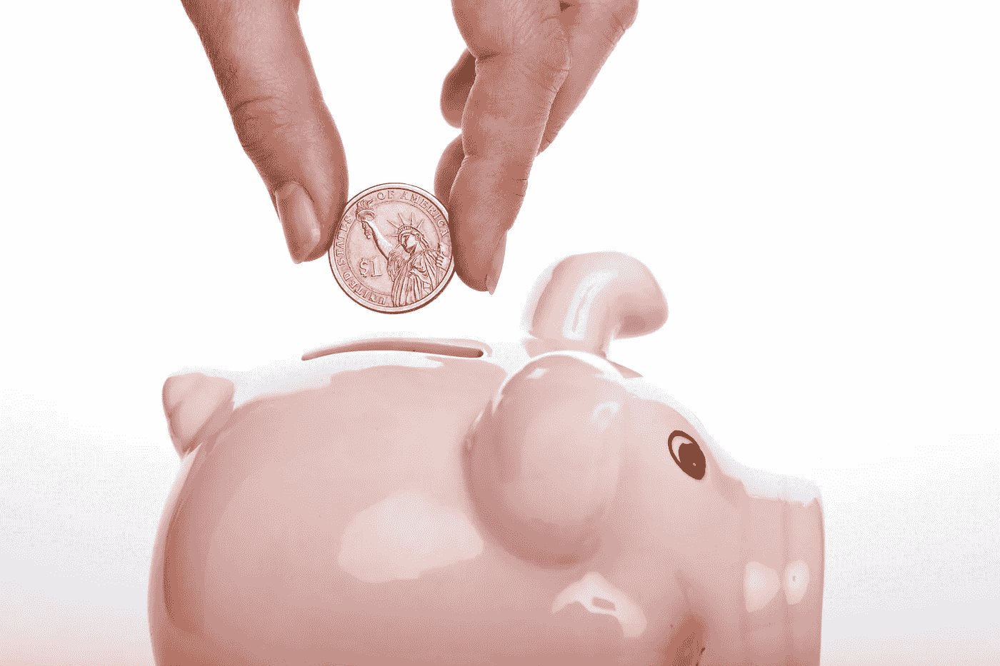
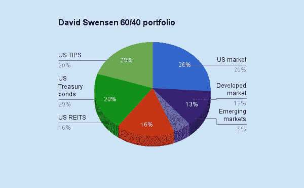

# 个人理财入门指南

> 原文：<https://medium.datadriveninvestor.com/a-beginners-guide-to-personal-finance-d85a5a5830?source=collection_archive---------4----------------------->

尽管我们都接受了很多年的学校教育，学习了太多的科目，但有一个关键话题却经常被忽略:个人理财。毕竟，为什么我们不得不阅读像*贝奥武夫*这样的古书，或者学习如何对反三角函数求导，但我们却没有学到将伴随我们一生的关键资金管理技巧？实际上，我和我的妹妹一起看到了这种奇怪的教育现象，她完成了近 24 年的学校教育，最近获得了医学博士学位，但当她开始住院实习时，并不知道 401(k)和罗斯个人退休帐户之间的区别。诚然，一旦她拿起一本《穿白大褂的投资者 T2》，她就能很快理解这个概念，但令人难以置信的是，美国教育体系竟然没有向数百万人传授个人理财的基础知识。

事实上，根据[下一代个人理财](https://www.marketwatch.com/story/want-to-develop-financially-capable-americans-teachers-may-be-even-more-important-than-laws-2019-09-20)进行的一项研究，在 23 个州和华盛顿特区，不到 5%的学生被要求参加独立的个人理财课程。因此，后果并不特别令人吃惊:

*   将近 78%的工人靠薪水生活
*   平均每个家庭有 8398 美元的信用卡债务
*   美国消费者债务总额(抵押贷款、汽车贷款、信用卡、学生贷款)为 13.86 万亿美元

我希望在你读完这篇文章时，揭开个人理财世界的神秘面纱，给你简单可行的步骤，开始有效地管理你的钱。

**【注:本文内的观点和思路很大程度上是受拉米特·塞西的惊人之作** [***我会教你变得富有***](https://www.amazon.com/Will-Teach-You-Rich-Second-ebook/dp/B07GNXPP4P) **的启发。我强烈推荐你去读它，因为它是一本有洞察力和娱乐性的读物。]**

# 1.信用卡和信用评分

信用卡是一把双刃剑。一方面，如果你将它们视为免费资金的来源，并开始透支你的信用额度，你将慢慢开始积累大量债务。另一方面，如果你将它们视为一种有福利的借记卡，你将获得很多好处，如旅游积分和现金返还，以及提高你的信用评分。

从引言中的统计数据可以看出，许多美国人认为信用卡是前者。这就是为什么你会看到像马克·库班这样的人坚定地提倡，“不要使用信用卡。”然而，你不是普通的美国人:你知道你应该只收取你实际支付得起的费用。因此，你可以开始利用信用卡为自己谋利。

现在，谈到信用卡，我是一个极简主义者:我不相信开一大堆信用卡来赚取积分(你可以用你的时间做更好的事情来赚更多的钱，稍后你会看到)。事实上，Ramit Sethi 建议你应该结合旅行卡(例如 Chase Sapphire Preferred)来支付食物和旅行，以及现金返还卡来支付其他一切。关于现金返还卡，您可以选择统一比例的现金返还(例如花旗双倍现金卡的 2%)或专注于您的特定消费类别(例如美国运通蓝卡在超市的 6%)。

现在，除了奖励，开信用卡的另一个主要好处是能够增加你的信用评分。虽然你可能不会马上想到买车或买房，但你的信用评分非常重要，因为当你需要借钱购买大件商品时，它会影响你的利率。因此，为了有效地使用你的信用卡，要注意三件事:

1.  每月还清你信用卡的**全部余额**。
2.  保持你的信用卡**余额较低**(即不要经常透支)。
3.  (只有当你在第一和第二点上很可靠时才这样做)每 6 个月或一年，请求增加你信用卡的信用额度**。**

这三个因素将帮助你提高信用评分，并在未来为你省钱。

# 2.消除你的消费债务

如果你碰巧有债务，你应该采取三个步骤:承认并记录你的债务，决定如何解决它们，并协商降低你的利率。

首先，债务是很多人面临的一个压力很大的问题。然而，简单地忽视它并希望它消失是没有帮助的。你必须承认你必须还清一大笔钱，并准确记录你欠了多少。

其次，你应该决定你到底打算如何处理你的债务。人们偿还债务有两种常见的方式:

1.  **由高到低的利息**:先偿还利率高的债务，再偿还利率低的债务。
2.  **戴夫·拉姆齐的滚雪球法**:先偿还余额较少的债务，再偿还余额较多的债务。

从技术上来说，第一种由高到低的利息选择是更好的选择，因为从长期来看，你支付的利息更少。然而，如果你在偿还债务上有心理上的困难，滚雪球法将通过消除你的大量债务让你重新获得信心和控制你的财务。

最后，一些公司可能愿意与你协商利率。一个简单的电话可能最终为你节省数百或数千英镑。

# 3.开一个高收益储蓄账户

你们中的许多人可能在美国银行、富国银行或大通银行有存款和支票账户。虽然将你的储蓄账户与你的支票账户紧密相连确实很方便，但问题是你从这些银行获得的利息低得令人难以置信:你的年百分比收益率(APY)在 0.01%至 0.06%之间。如果你打算为应急基金或长期目标存点钱，使用高收益在线储蓄账户有两个好处:

1.  APY 更高，让你得到更多的钱。
2.  因为你已经把你的储蓄和支票分开了，你不太可能不必要地从你的储蓄中提取用于消费，因为银行间转账比内部银行转账需要更长的时间。

我最喜欢的两个网上储蓄账户是高盛的[马库斯账户](https://www.marcus.com/us/en)和[美国运通网上储蓄账户](https://www.americanexpress.com/personalsavings/home.html)，尽管你可以自由探索哪家银行符合你的需求。

你可能会遇到的一件事是，一些网上银行可能会提供比其他网上银行稍微更有竞争力的 APYs:同样，像信用卡交易一样，一个小的百分比差异不会帮你赚更多的钱。只需专注于远离超低利率的 APY 银行，如美国银行/富国银行/大通银行，获得一个足以满足你需求的网上储蓄账户。

[注意:有网上支票账户，但我真的不在乎，因为(1)它至少允许我进入当地银行的 ATM 机，从我的支票账户中提取现金，(2)与传统银行相比，APY 的差异可以忽略不计。]

# 4.开设退休账户

对于大多数年轻人来说，开设退休账户的想法似乎很荒谬。他们可能会对自己说，*我甚至还没有一份全职工作呢*或者*退休还很遥远！然而，关于退休账户的一个常见说法是“昨天是开立账户的最佳时间”*

退休账户有什么重要的？嗯，主要有两个好处:

1.  你可以将这笔钱投资到你的退休账户，以获得比储蓄账户更高的回报(我们将在下一节讨论投资)。
2.  退休账户有独特的税收优惠，帮助你获得和节省更多的钱。

三种最常见的退休账户是罗斯个人退休账户、传统个人退休账户和 401(k)账户。一般来说，大多数人都有一个罗斯个人退休帐户和 401(k)帐户的组合，但是一旦他们超过罗斯个人退休帐户的收入限制，并且不能再直接向他们的罗斯个人退休帐户缴款，他们最终会增加一个传统的个人退休帐户。

以下是个人退休帐户的简单介绍:

**罗斯共和军:**

*   *税后*缴款最高为每年 6000 美元(50 岁以上为每年 7000 美元)【截至 2020 年】
*   你投资的钱免税增长
*   *有一个*收入上限*，如果你的收入超过某一限额，你就不能交费*
*   *你可以随时提取你投入的资金，而不会受到惩罚(这不适用于你从投资活动中获得的额外资金——你必须等到退休)*

***传统个人退休帐户:***

*   *截止到 2020 年，税前*或税后*缴款最高为 6K 美元/年(50 岁以上为 7K 美元/年)***
*   *你投资的钱会增长*延税*(当你开始退休取钱时，你必须缴税)*
*   *没有收入上限*
*   *提前退出会受到处罚*

*如你所见，罗斯个人退休帐户比传统个人退休帐户有更多的优势。因此，在你的收入超过限额之前，你越早开始向你的罗斯个人退休帐户缴款，你就可以从你的投资收益中获得越多不用缴税的钱。因此，即使你还没有正式工作，你也可以通过实习、兼职和兼职来投资，从罗斯个人退休帐户中获益。*

*最后一个退休账户，401(k)与 IRAs 略有不同，因为它的主要好处是从你的雇主那里获得免费资金！这里是破败的:*

*401(k):*

*   *雇主赞助的退休账户(你需要一份有福利的全职工作)*
*   *贡献来自你的税前薪水，最高为 19.5 万美元/年[截至 2020 年]*
*   *你的雇主将匹配你贡献的相同数额的税前资金，直到一个上限(*免费资金！)**
*   *你的投资收益增长*延税*(就像传统的个人退休账户)*

*既然你已经知道了这三个退休账户是如何运作的，下面是你应该如何对它们进行优先排序:*

1.  *贡献你的 401(k)的匹配极限。*
2.  *最大化你的罗斯个人退休帐户/传统个人退休帐户。*
3.  *最大化你的 401(k)。*

***【注意:还有更复杂的退休/税收优惠账户，如罗斯 401(k)、后门罗斯个人退休账户或健康储蓄账户(HSA)，但鉴于这是一本初学者指南，你可以自己研究一下。]***

# *5.投资你的钱*

**

*投资你的钱才是你的退休账户真正的价值所在:否则，它们只是被美化了的储蓄账户。*

*现在，当大多数人听说投资时，他们有点不知所措。让我们弄清楚这一点:投资非常简单，而且，不，你不需要把你的钱交给“财富经理”(他们只会拿走你的钱)。*

*第一，**投资**不是**交易**。交易就是买卖股票/期权，在几分钟或几天内卖出。当你投资时，尤其是用退休账户投资时，你将持有你的头寸数年或数十年(至少直到你开始卖出你的头寸以在退休时取出你的钱)。*

*第二，你应该如何投资你的钱？*

*大多数人不应该选择股票，尤其是用他们的退休账户。我并不是说投资个股不可能成功(如果你有兴趣，可以看看彼得·林奇的《华尔街上的一只股票》(the Wall Street))，但是选股是一门挑剔的艺术，需要大量的时间来分析和更新你投资组合中的 10 到 20 只股票。如果你依赖于来自朋友、家人和华尔街的热门建议，你尤其会纠结于选股或者类似的东西。*

*你也不应该投资于主动管理基金/共同基金。简而言之，积极管理型基金/共同基金是由一群哈佛和沃顿商学院的经理管理的一套股票和债券，他们经常买卖，试图战胜市场(特别是标准普尔 500)。他们不仅不能长期战胜市场，他们的高费用率(或为你管理资金的成本)将抵消你的长期收益。给你一个建议，尽量把你的费用率控制在 1%以下。*

*你应该做的是专注于指数基金，这是被动管理的基金。这些基金并不试图跑赢市场，而是反映市场。因此，你不仅会跑赢共同基金，而且你还会支付更低的费用率，因为它是被动管理的。*

*现在投资的另一个方面是知道在特定的时间点你应该投资多少特定的指数基金。有针对美股、外资股、国债等的指数基金。据此分割你的投资组合的概念被称为**资产配置**。资产配置，通俗地说就是你给自己的投资组合分配每种资产(比如美股、国债)的百分比。通常情况下，当你年轻时，你会希望持有股票等波动性更大的资产，因为它们有更大的潜力让你赚更多的钱。然而，随着年龄的增长，你希望慢慢增加债券的比例，因为债券更加稳定，当你试图提取退休金去夏威夷度假时，价格不会快速波动。*

**

*[A sample asset allocation.](https://www.bogleheads.org/blog/2019/01/04/david-swensens-portfolio-from-unconventional-success-2018-update/)*

*我现在只想说，资产配置是一个很难跟踪的问题，涉及大量的计算和再平衡。这就是为什么拉米特·塞西鼓励你简单地投资于一只**目标日期基金**。例如，如果你计划在 2060 年退休，只需购买一只 2060 年目标日期基金，它会自动为你便宜地重新分配指数基金的股票/债券比率(费用比率超低)。此外，你不需要把握市场时机:只要你向自己的退休账户缴款，就定期购买目标日期基金，让你的账户自行增长。*

*或者，你可以使用像 Betterment 或 Wealthfront 这样的机器人顾问。机器人顾问就像目标日期基金，但他们使用算法来微调你的投资组合，以适应你的具体财务状况。此外，如果你将它与应税投资账户(如果你想投资更多的钱，但已经透支了你的退休账户)结合起来，他们会有更多的好处。拉米特·塞西不喜欢机器人顾问，但他们提供了很大的税收优惠，可以跑赢目标日期基金。唯一的缺点是它们的费用率略高(0.3%，而目标日期基金为 0.1%)。*

*然而，如果你想做自己的资产配置，我相信你有能力自己想出怎么做！*

# *6.预算和支出*

**

*对拉米特·塞西来说，经济上负责任并不意味着斤斤计较，当你真的想喝咖啡或波霸时就不喝。相反，他说你应该专注于你生活中的重大胜利，也就是我们已经介绍过的让你赚钱的事情，即正确使用信用卡、消除债务以及用你的退休账户进行投资。*

*从那里，了解你的短期义务和长期目标是什么:你需要支付租金或保险吗？需要六个月应急基金吗？你需要攒钱买车或买房吗？你想去日本度假吗？如果是这样，确定你需要多少钱，你应该存多少钱，才能在一定的时间内实现这个目标。*

*在你已经为你的退休账户做了贡献，并考虑了你的短期和长期资金需求之后，你可以自由地花你想要的任何东西(只要你在预算之内)。只要你没有胡乱动用你的储蓄或退休账户，你就不会有负罪感。*

# *7.自动化你的财务*

**

*自动理财是个人理财的基础，让你在全力以赴购买最新的 Yeezy 系列产品之前，确保优先考虑你的储蓄目标和退休账户。*

*“财务自动化”简单地说就是你每个月自动把钱转移到适当的地方。这里有一个自动财务应该如何工作的例子:*

1.  *在你收到薪水之前，每个月都会有一部分自动存入你的 401(k)账户。*
2.  *你的薪水会自动存入你的支票账户。*
3.  *您的支票账户会自动向您的罗斯/传统个人退休帐户和您的储蓄账户(根据您的储蓄目标)汇款。*
4.  *您的退休账户会自动购买合适的目标日期基金/指数基金进行投资。*
5.  *你的支票账户会自动付清你的信用卡账单、房租、保险等。*

*你唯一需要偶尔调整的是，如果你的收入发生变化，你自动缴纳的金额。除此之外，从现在开始，你的财务应该是完全自由的。*

# *结论*

**

*有了这七个步骤，你现在就有了了解和管理你的财务的钥匙！你不再需要为钱而紧张，相反，你知道一切都在掌控之中，你会感到充满力量。*

*当然，这仅仅是一个初学者指南——我已经尽可能地简化了个人理财。为了更全面地了解个人理财，我再次推荐拉米特·塞西的《我会教你致富的**》。***

****祝你的个人理财之旅好运！****