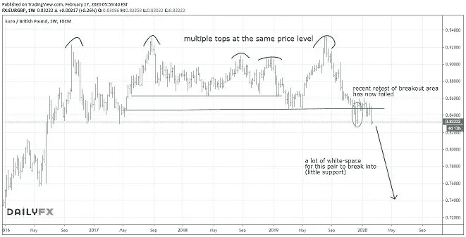

# 欧洲的一个大机会

> 原文：<https://medium.datadriveninvestor.com/a-big-opportunity-in-the-eurozone-73a537960b0e?source=collection_archive---------23----------------------->

**本周一周交易:*空头欧元英镑(远期)***

在上周的[文章](https://mangrovetrading.com/eurgbp-headed-next/)中，我分享了我对欧元英镑的做空想法。这一对在上周一整天都在下跌，以本周低点收盘。当我坐拥这一对的巨额利润时，我相信这一行动才刚刚开始。

本周，我将在任何回调(价格上涨)时增加我的头寸。

下图显示了欧元英镑的周远期价格。自英国退出欧盟公投引发首次上涨以来，尽管多次尝试，但这一对货币一直无法再创新高。听起来很简单，如果一个市场根本找不到上涨的方法，它将不可避免地下跌。诀窍是知道这什么时候会发生。

 [## 机器学习的外汇交易挑战|数据驱动的投资者

### 机器学习是人工智能的一个分支，之前占据了很多头条。人们是…

www.datadriveninvestor.com](https://www.datadriveninvestor.com/2019/02/18/the-challenge-of-forex-trading-for-machine-learning/) 

考虑到这个大局，我已经在阻力区域做空这对组合几次(例子可以在这里找到，[这里](https://mangrovetrading.com/brexit/)和[这里](https://mangrovetrading.com/brexit-now-british-pound/)，并从市场中获得大量利润。而在过去几年中，这两种货币一直保持在较大的交易区间内。

然而，让目前的机会如此引人注目的是，这一对现在看起来有望最终突破这个交易区间，走向下行。这将打开一个以前没有价格行为的巨大领域——有效地使价格有可能像刀子穿过热黄油一样穿过。

出于所有这些原因，我认为欧元英镑目前呈现出一个巨大的交易机会。我们可能不会立即下跌，但考虑到大局，我认为任何反弹都应该被视为卖出这对组合的机会。

Online Trading Analysis Chart

你想学习如何从市场中获得持续的利润吗？ [*点击此处*](https://go.mangrovetrading.com/freetraining) *，我们将通过一系列免费培训视频带您一步步了解我们的整个交易策略。*

*——*

请注意，一如既往，这不是投资建议，您应该在做出任何投资决定之前咨询您的财务顾问。我不是财务顾问，提供这些信息只是为了提供信息和教育目的。