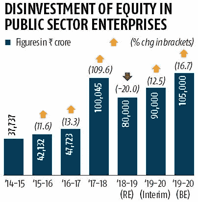

# 能力之火

> 原文：<https://medium.datadriveninvestor.com/a-bonfire-of-competencies-1e3653b86c95?source=collection_archive---------19----------------------->

## 印度大量消耗现金且无能的国有企业需要被淘汰

How has this travesty survived this long?

1 **|王公的私房钱终于被偷了**

> 在这个英迪拉·甘地于 1971 年废除私房钱的国家，真正的王公依靠政府的施舍又生存了 50 年。

T4 政府最终宣布，他们将无条件将印度航空公司投入市场。这被誉为近年来最受欢迎的“经济”新闻。这比看上去更能说明经济状况。一些评论家把这次出售等同于政府终于认识到“没有生意可做”。这显然是不真实的。

这更像是政府意识到市场正在对他们实施一种他们并不真正感到舒服的纪律。如果政府有办法的话，如果他们的先决条件得到满足，他们会以更低的价格完成印度航空公司的第一次拙劣的销售——但是市场没有接受。

> 简而言之，市场击退了政府的过时思维，即背负 8000 亿印度卢比债务和有害的先决条件的航空公司是有吸引力的，因为它在希思罗机场和 JFK 以及孟买南部的一些黄金地段有几个着陆位置

政府自己的想法是印度主流思想的升华，即国家应该继续从事商业活动。这背后的多数主义思想很简单——政府拥有的东西最终归人民所有，因此为什么要把它们送给贪婪的企业，以换取卢比的红利呢？

鉴于印度的资本主义经历除了几个部门之外并不美好，这种说法甚至有点道理。资产大多管理不善，尤其是在资源领域。然而，认为这些公司(以及相关资产)属于人民的想法显然是荒谬的。

> 公民没有分享这些公司创造的财富；在年景好的时候，这些钱会直接进入政府，帮助他们进行财政慷慨。

在过去 70 年中至少有 65 年是糟糕的一年，政府承担着经营这些亏损企业的重担。单是薪金、工资单、酬金和养老金就使政府陷入困境。不存在榨取、榨取或收获这些资产来造福纳税公民的情况。相反，我们缴纳的税收(以及政府增加的债务)被用来刺激的不良表现，因为公共部门企业及其员工无需承担任何后果。一个在孟买的职位可能会变成一个在比拉斯布尔的职位。即使这样也有好的一面，因为 PSU 员工现在的生活成本更低了！

An info-graphic from Sep-2019, when dropping Working Capital debt from the proposal was first considered to make Air India more attractive. A 100% stake sale was eventually announced in December 2019, a month before the budget announcement. (Source: Economic Times)

许多人希望这些僵尸公司继续运营的一个未被充分挖掘的原因很简单——在一个一直难以在 IT 部门以外创造有意义的永久就业的国家，它们提供了一些最好的就业形式。90%的印度人仍然渴望有一份稳定的终身工作，之后还有养老金。

最重要的是，大多数倡导这种事情的印度人都是公共部门雇员的子女。不仅仅是铁路、军队、警察和司法部门——人们可以合理地预期它们仍属于国家，还有数不清的银行、矿业公司、石油公司等等，它们都没有业务存在。难怪我们不想前进，因为这将对我们父母的养老金产生负面影响！

2 **|清除有毒资产**

出售这些资产是政府将在这些公司的有生之年做出的最重要的决定，因为这将决定进入它们金库的资金——而它们只有一次机会做好这件事。等到全世界都清楚地看到这些资产几乎无法挽救时——他们通过为他们的(我们的)资产获取更低的钱来伤害这个国家。

通过等待，政府损害了自身的融资利益，并向市场发出信号，只有表现不佳的人才会被出售。市场将永远避免出价过高，因为它们完全有望在“好公司”中发现腐烂的部门和“不可挽救的资产”。他们需要在他们的出价中贴现这一点，从而刺激政府不出售的大量“低价”。

Source: Business Standard

在印度航空公司的案例中，政府预先给出了令人讨厌的惊喜——买家不能欺骗员工或资产，投标者必须主要是国内航空公司。这就否定了外国航空公司收购它的可能性，更不用说私人股本公司了。更重要的是，即使是一家航空公司，也无法通过提高运营效率来“消耗资产”或削减成本，因为政府的指令非常严格。

所有这一切都发生在政府稳定外资所有权和税收框架之前，这一框架可能会在历届政府的两个极端之间摇摆不定。在许多情况下，令人讨厌的意外往往是评估/运行不佳的资产，它关闭了未来现金流的可能性。

作为一项公开的撤资政策，政府首先应该采取的行动是制定一个框架和可执行的指导方针。相反，通过等待在财年结束前出售政府投资组合中的布偶，政府最终表明它无力管理资产，也无力实现财政赤字目标(这对主权借款和外汇有影响)。

3**|不，军队不该独善其身**

我几乎总是写关于军队的文章——我和军队有着密切的联系，所以为了避免有人指责我有党派偏见——我相信甚至军队的养老金制度也没有进行重大改革。当然，这是一个不受欢迎的说法——但是没有理由认为一个官员在服役期间不应该得到更高的报酬，并且应该为他/她自己的退休储蓄。

> 那种认为他们“放弃挣钱的岁月”的陈旧观念站不住脚，因为他们在“挣钱的岁月”里挣了钱，还获得了一些“实物”福利。

他面临的生命和肢体风险几乎比任何其他工作都要真实，但解决这个问题的方法是预先提供更高的薪水，如果不幸的话，还要提供更高的死后福利。解决方案不在于政府将年金流视为其账户上的负债。目前最大的问题是，他们不像私营部门的员工那样被要求为退休储蓄。

Comparing the numbers to China isn’t always instructive, but when you get as hopelessly outgunned as this, because the economy is also a shambles — how can you bring down your % contribution to defence AND expect more bang for buck? (Source: Stockholm International Peace Research Institute, The Economist)

反常的是，武装部队膨胀的养老金债务最有害的影响是在武装部队本身(不像其他 PSU 部门，费用是分散的)。他们被迫用陈旧的武器作战，年复一年遭受着糟糕的资本预算拨款。

> “例如，在最新的预算中，国防养老金拨款同比增长 13.6%，达到 13.3 亿卢比，尽管武装部队的总体资本预算拨款仅增长 3%，即 340 亿卢比。国防养恤金，包括国防部文职雇员的养恤金，高于军饷和津贴！”

如今，即使是像法国这样(相对)富有成效的经济体也在努力应对一位木星总统，他想要改革一个从摇篮到坟墓的养老金体系，该体系有大约 43 个代码——不顾公众的强烈反对。与此同时，我们有一个领导人，他不敢触及所有事业单位的“进入坟墓的养老金制度”，因为潜在的反弹。要求选民为自己的养老金出资并不诱人。

> 大多数印度 PSU 都是资本和能力消亡的地方。让 PSU 维持生命支持并不光彩。

政府可以采取的第一步是提供税收稳定和刺激储蓄——通过取消累退的长期资本利得税、股息分配税和各种其他税收，然后再着手进行更艰巨的任务，改革我们为养老金储蓄和做生意的方式。

剔除表现不佳的 PSU 和养老金，将是一件高度紧张和有争议的事情，但对这届政府来说，艰难的划时代决定难道不是一件容易的事情吗？

**汤姆·沃尔夫会不高兴的——这不是*合适的东西*。**

— — — — — — — — — — — — — — — — — — — — — — — — — —

[*大石油正在枯萎*](https://medium.com/datadriveninvestor/big-oil-is-withering-away-b6e3c5670d40)

[*意大利隐现债务之山*](/datadriveninvestor/italys-looming-mountain-of-debt-2e715915b19f)

[*不要再称之为衰退了——这是‘高度封锁’的萧条*](/datadriveninvestor/stop-calling-it-a-recession-this-is-the-great-lockdown-depression-2877616977ed)

[*【没有出价，精神上】*](/datadriveninvestor/no-bids-mental-c09c3ce38d27)

)(我)(们)(都)(不)(知)(道)(,)(我)(们)(还)(不)(知)(道)(,)(我)(们)(还)(不)(知)(道)(,)(我)(们)(还)(不)(知)(道)(,)(我)(们)(还)(不)(知)(道)(,)(我)(们)(还)(不)(知)(道)(,)(我)(们)(还)(不)(知)(道)(。 )(我)(们)(都)(不)(知)(道)(,)(我)(们)(还)(不)(知)(道)(,)(我)(们)(还)(不)(知)(道)(,)(我)(们)(还)(不)(知)(道)(,)(我)(们)(还)(不)(知)(道)(,)(我)(们)(还)(不)(知)(道)(,)(我)(们)(还)(不)(知)(道)(,)(我)(们)(还)(不)(知)(道)(,)(我)(们)(还)(不)(知)(道)(。 )(我)(们)(都)(不)(知)(道)(,)(我)(们)(还)(不)(知)(道)(,)(我)(们)(还)(不)(知)(道)(,)(我)(们)(还)(不)(知)(道)(,)(我)(们)(还)(不)(知)(道)(,)(我)(们)(还)(不)(知)(道)(,)(我)(们)(还)(不)(知)(道)(,)(我)(们)(还)(不)(知)(道)(。 )(我)(们)(都)(不)(知)(道)(,)(我)(们)(还)(不)(知)(道)(,)(我)(们)(还)(不)(知)(道)(,)(我)(们)(还)(不)(知)(道)(,)(我)(们)(还)(不)(知)(道)(,)(我)(们)(还)(不)(知)(道)(,)(我)(们)(还)(不)(知)(道)(,)(我)(们)(还)(不)(知)(道)(。