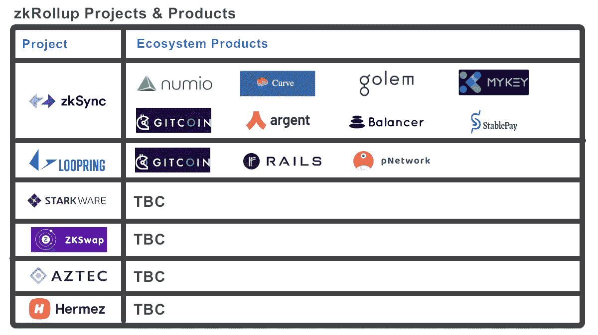
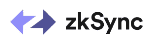
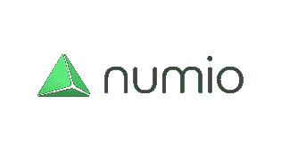
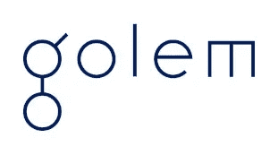
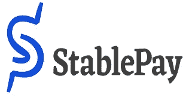
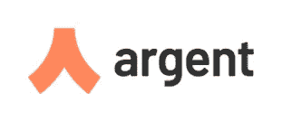
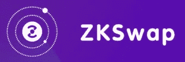

# zkRollup 项目和产品简要指南—2021 年 1 月

> 原文：<https://medium.datadriveninvestor.com/a-brief-guide-to-zkrollup-projects-and-products-january-2021-ebf857a8165b?source=collection_archive---------0----------------------->

*自从这篇文章发表以来，zkRollup 技术有了巨大的发展——为了跟上构建该技术的所有项目的最新进展，我们在*[*ZK roll ups . XYZ*](http://zkRollups.xyz/wallets)*创建了一个目录。*

 [## zkRollup 目录

### 以太坊 zkRollup 生态系统参与者目录，包括 Rollup、wallets、dapps、NFT 和 infra 项目…

www.zkrollups.xyz](https://www.zkrollups.xyz/wallets) 

以太坊又慢又贵，而且随着越来越受欢迎，只会越来越慢，越来越贵。以太坊社区致力于解决这两个问题的方法之一是使用被称为 [zkRollups](https://docs.ethhub.io/ethereum-roadmap/layer-2-scaling/zk-rollups/) 的第 2 层伸缩解决方案。

通过我在 Numio 的工作，我已经建立了一个与 zkRollups 合作的其他项目和创新者的列表。

因此，下面是您对正在构建 zkRollup 基础设施的项目的简要指南，谁已经发布了产品，谁计划在不久的将来推出产品。

# **zkRollup 解决方案:zkSync**

项目: [zkSync](http://zksync.io) 由[物质实验室](https://matter-labs.io)完成。

zkSync 是一个可信、安全、以用户为中心的协议，用于在以太坊上扩展支付和智能合约

Token:目前没有，但是已经宣布他们将推出一个。

zkSync 产品:zkWallet

 [## zksync-zkwallet-vue

### 创建 zkWallet 是为了释放 zkSync L2 运营的力量，并让任何人都可以在…上访问 L2 zkSync 功能

wallet.zksync.io](https://wallet.zksync.io/) 

文件:[https://zksync.io/faq/intro.html](https://zksync.io/faq/intro.html)

GitHub:[https://github.com/matter-labs/zksync](https://github.com/matter-labs/zksync)

# **使用 zkSync 的生态系统产品:**

## **直播**

Numio

Numio 通过构建任何人都可以使用的支付和存储应用程序，让加密变得简单。

Numio 应用程序是世界上第一个在谷歌 Play 商店推出的非托管、zkRollup 支持的以太坊移动钱包。

 [## numio—Google Play 上的应用程序

### Numio，一个非托管以太坊移动钱包应用程序 Numio 是世界上第一个在谷歌 Play 商店的 Android 应用程序…

play.google.com](https://play.google.com/store/apps/details?id=com.numio.pay) 

**GitCoin**

Gitcoin 是一个社区，开发者可以通过奖金在开源项目中合作并将其技能货币化。

https://gitcoin.co/grants/

**假人**

假人是一个计算能力的分散市场。它使 CPU 和 GPU 能够在对等网络中连接，使应用程序所有者和个人用户(“请求者”)能够从其他用户(“提供者”)的机器上租用资源。

 [## zkSync 上的第 2 层支付

### 目前，当您运行 yagna 支付 init -r，假人初始化一个新帐户从我们的自定义水龙头(一项服务…

handbook.golem .网络](https://handbook.golem.network/introduction/layer-2-payments-on-zksync) 

**稳定支付**

[StablePay](https://stablepay.io/) 是一种分散式支付解决方案，支持用户使用代币在线支付以美元计价的产品和服务。

 [## StablePay |仪表板

### 通过接受加密货币赚取利息和奖励。接收加密提示和美元捐款，并避免…

stablepay.io](https://stablepay.io/dashboard) 

## **开发中**

**曲线**

[曲线](https://curve.fi/)是以太坊(类似 Uniswap)上的交易所流动性池，旨在实现(1)极其高效的稳定货币交易(2)低风险，流动性提供商的补充费用收入，没有机会成本。

 [## 第 2 层与 zkSync 的曲线相交

### Curve 和 Matter Labs 团队自豪地宣布，在安全和分散的环境中，以太坊的规模向前迈进了一大步…

资源.曲线. fi](https://resources.curve.fi/guides/more.../layer-2-meets-curve-with-zksync) 

**平衡器**

一个[平衡器](https://balancer.finance/)池是一个自动做市商，具有某些关键属性，使其能够作为一个自平衡加权投资组合和价格传感器。

集成尚未完成，但平衡器团队已经进行了讨论[https://Twitter . com/mikeraymcdonal/status/1321095040127668232](https://twitter.com/mikeraymcdonald/status/1321095040127668232)

**银色**

Argent 是一个简单安全的智能加密钱包。

整合尚未完成，但 Argent 团队已经就不和谐进行了讨论。

**我的钥匙**

MYKEY 是在多个公共区块链上实现的自主身份系统。

集成还没有完成——没有太多的信息。

# **zkRollup 解决方案:LoopRing**

项目: [LoopRing](https://loopring.org/)

Loopring 是一个 zkRollup 交换和支付协议

Loopring 产品:Loopring Exchange &移动钱包

 [## 环路交换机

### 以太坊 zkRollup 交换和支付协议

exchange.loopring.io](https://exchange.loopring.io/swap)  [## Loopring 智能钱包 Google Play 上的应用程序

### 有史以来第一个以太坊智能合约钱包，具有基于 zkRollup 的交易、转账和 AMM。无气体、安全且…

play.google.com](https://play.google.com/store/apps/details?id=loopring.defi.wallet) 

令牌— [LRC](https://www.coingecko.com/en/coins/loopring)

github:[https://github.com/Loopring](https://github.com/Loopring)

# **使用 Loopring 的生态系统产品:**

## **直播**

**GitCoin**

[Gitcoin](https://gitcoin.co/) 是一个社区，开发者可以通过奖金在开源项目中合作并将其技能货币化。

[https://gitcoin.co/grants/](https://gitcoin.co/grants/?)

**轨道**

Rails 允许你把你钱包里的 ETH 和任何 ERC20 兼容令牌转移给 L2 环内的任何人。

 [## 轨道

### Rails 为大众带来了快速、廉价、便捷的加密货币小额支付。上船吧。

rails.eth.link](https://rails.eth.link/#/auth) 

## **开发中**

**p 网络**

网络是 pTokens 系统的治理层。pTokens 是未被束缚的资产，将流动性从一个区块链转移到另一个。

整合尚未完成。

# zkRollup 解决方案:StarkWare

项目: [StarkWare](https://starkware.co/)

StarkWare 使用 STARK 技术提高了区块链的可扩展性和隐私性，提供了零知识、简洁、透明(不需要可信设置)和后量子安全的加密证明。

目前还没有。

## 基于 StarkWare 的生态系统产品:

不适用的

# zkRollup 解决方案: **ZKSwap**

项目: [ZKSwap](https://zks.org/en)

基于 ZK-AMM 模型的第二层索引。

ZKSwap 产品:ZKSwap 钱包

[https://zks.app/en/wallet](https://zks.app/en/wallet)

令牌: [ZKS](https://www.coingecko.com/en/coins/zkswap)

## **基于 ZKSwap 的生态系统产品:**

不适用的

# zkRollup 解决方案: **Aztec**

项目:[阿兹特克](https://aztec.network/)

创建 AZTEC 协议是为了通过使用 zk-SNARKs 隐私算法加密区块链数据来实现公共区块链的隐私

 [## 阿兹特克人

### 新的货币互联网受到开放的保护，但代价很高——你的所有交易对手都知道你的整个…

aztec.network](https://aztec.network/) 

令牌:无

## **建立在阿兹特克上的生态系统产品:**

不适用的

# zkRollup 解决方案: **Hermez**

项目: [Hermez](https://hermez.io/)

Hermez 是一家不可信的 ZK 公司，专注于以太坊羽翼上的规模化支付和代币转移。

 [## hermez-第 2 层-可扩展性-图表

### 零知识证明技术保证了计算完整性和链上数据的可用性，同时…

hermez.io](https://hermez.io/) 

令牌: [HEZ](https://www.coingecko.com/en/coins/hermez-network)

## **基于 Hermez 的生态系统产品:**

不适用的

# zkRollup 解决方案:织机网络

项目:[织机](https://loomx.io/)

Loom 是面向医疗保健提供商的分布式企业平台

公告:

 [## 将 zkRollup 集成到 Loom 协议中

### zkRollup 是减少织机区块链对环境影响的最佳方式，同时提高安全性和…

medium.com](https://medium.com/loom-network/integrating-zkrollup-into-the-loom-protocol-b398c170fd4b) 

# 让我们建造这个

以太坊和 zkRollups 将在 2021 年变得越来越强大，随着技术的发展，这份名单也将增长。让我知道是否有我错过的任何项目或产品，我会添加它。

注意这个空间。

约珥

https://twitter.com/joelkite