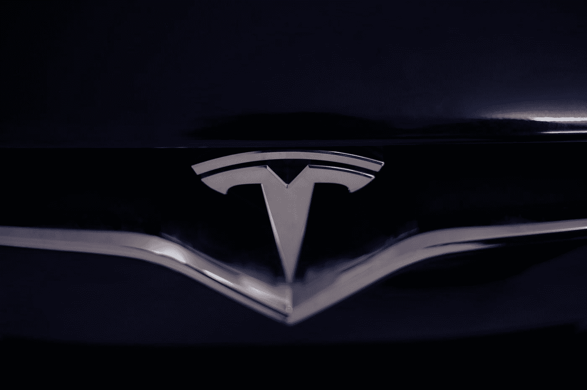
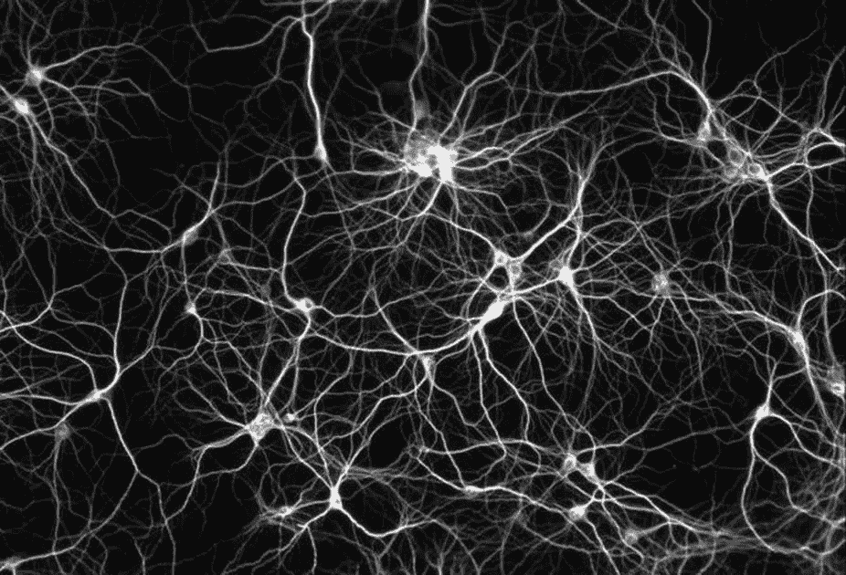

# 人工智能简介

> 原文：<https://medium.datadriveninvestor.com/a-brief-introduction-to-artificial-intelligence-63c6f8ed3fd1?source=collection_archive---------9----------------------->

A Cute Robot ^w^

听到“人工智能”这四个字，你会想到什么？黑仔机器人？特斯拉？[花生酱三明治](https://thenextweb.com/neural/2020/08/27/this-ai-makes-peanut-butter-and-banana-sandwiches-that-are-fit-for-the-king/)？所有这些肯定都和 AI 有关，但都不是 AI 本身。

那么什么是 AI 呢？定义是:人工系统自己学习，完成需要智能的任务。定义相当模糊，但那是因为 AI 有很多它封装的子领域和应用。

但在我们继续之前，必须澄清一个误解！AI 实际上，在更高的层面上，分为两类:人工通用智能(AGI)和人工狭义智能(ANI)。黑仔机器人、无所不能的生物、超级智能神，都是 AGI 在电影和书籍中的幻想。但是几乎没有人在 AGI 上工作，因为它在大多数人工智能世界中被视为“天上掉馅饼”的想法(也因为我们不知道如何建造它)。大家实际上做的是 ANI。特斯拉、Siri、网飞和优步都是这种人工智能帮助我们人类的例子。所以不要害怕进入人工智能，你不会在 AGI 工作！

Tesla (the best car company in the world!) uses AI for Autonomous Driving

好了，现在这个误解已经清楚了，我们要来谈谈 ANI！ANI 有很多类别，但我们将讨论产生大量应用的 2 个类别！这两个应用是算法和神经网络。

算法不是官方的说法，是我编的，但是我们现在就用它。算法是专为完成特定任务而设计的模型。这样的模型包括 K-均值、随机森林、梯度推进、K-最近邻等等。你必须一个一个地了解这些家伙，要理解发生了什么，你需要知道一点数学知识(别担心这并不难)。总体算法对结构化数据(有数字和类别的电子表格)有效，但对非结构化数据(图片、文本和推荐系统)不是很有效。

 [## 商业价值和人工智能的 5 个原则|数据驱动的投资者

### 提取商业价值很难。我是说真的很难...说到高级分析，这一过程甚至…

www.datadriveninvestor.com](https://www.datadriveninvestor.com/2020/07/07/5-principles-for-business-value-and-artificial-intelligence/) 

为了在非结构化数据中获得出色的结果，我们求助于神经网络。这些家伙是基于我们大脑的神经元，他们有广泛的应用。应用范围从计算机视觉，自然语言处理，协同过滤，甚至处理结构化数据。一旦你了解了神经网络，你就可以获得广泛的应用！

注意:机器学习是人工智能的一个子集，其中程序学习做它没有明确编程要做的任务。

Neural Networks are based on neurons in the brain

好吧，那么我们能从哪里学到这些东西？很高兴你问了！有 2 个主要资源，我会告诉你如何开始！

Youtube 频道:

*   [**Sentdex**](https://www.youtube.com/channel/UCfzlCWGWYyIQ0aLC5w48gBQ) :提供算法和神经网络的深度讲解
*   [**3Blue1Brown**](https://www.youtube.com/channel/UCYO_jab_esuFRV4b17AJtAw) :直观地教你复杂的数学概念。具体看看微积分，线性代数和神经网络系列
*   [**Codebullet**](https://www.youtube.com/channel/UC0e3QhIYukixgh5VVpKHH9Q) :关于 AI 一些好玩应用的爆笑视频
*   [**Tech With Tim**](https://www.youtube.com/channel/UC4JX40jDee_tINbkjycV4Sg) :关于 Sklearn 和 Python 的实用教程系列

课程:

*   [**吴恩达的机器学习课程**](https://www.coursera.org/learn/machine-learning) :本课程从头教你。它慢慢地建立你，一点一点地向你介绍机器学习。在为期 11 周的课程结束时，你将能够用人工智能进行照片 OCR，以及大量的应用程序！完成本课程大约需要 60 个小时。
*   [**FastAI**](https://www.fast.ai/) :本课程自上而下教你。您可以直接进入代码，首先看到应用程序！然后你会被介绍到所有东西实际上是如何工作的。本课程稍长，可能需要 140 个小时才能完全理解。

感谢阅读！我是 Dickson，17 岁的技术爱好者，很高兴能加速自己的步伐，影响数十亿人🌎

如果你想跟随我的旅程，你可以加入[我的每月简讯](https://bit.ly/DicksonNewsletter)，查看[我的网站](https://bit.ly/DicksonWebsite)，连接 [Linkedin](https://bit.ly/DicksonLinkedin) 或 [Twitter](https://bit.ly/DicksonTwitter) 😃

## 访问专家视图— [订阅 DDI 英特尔](https://datadriveninvestor.com/ddi-intel)