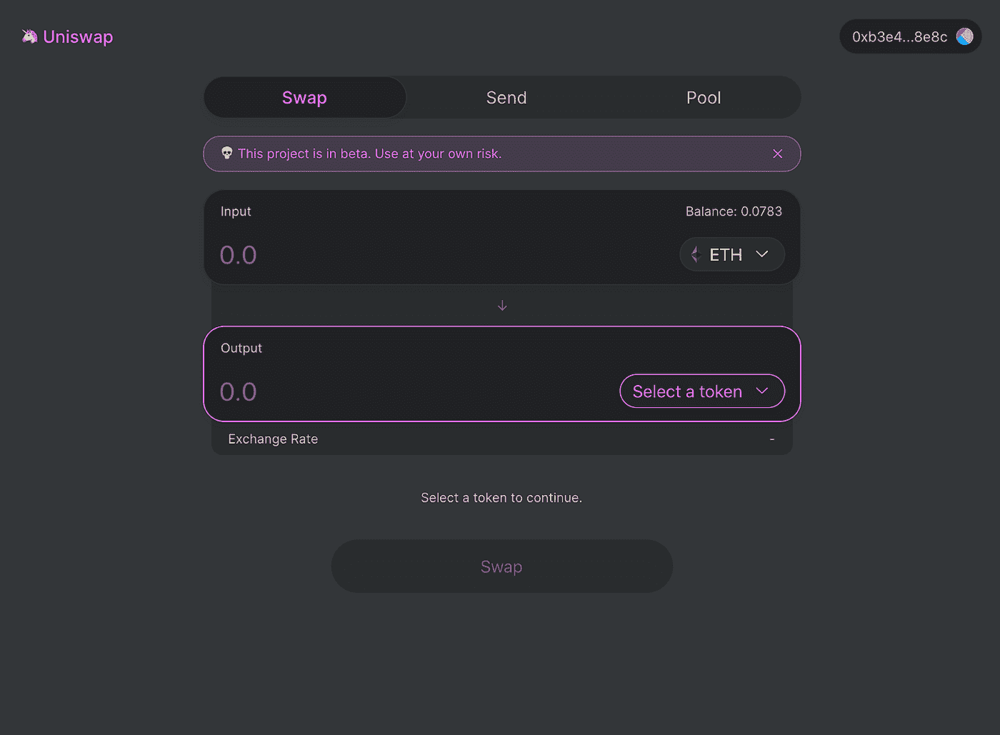
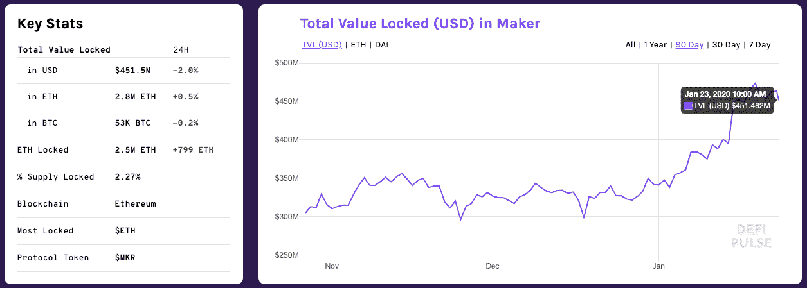
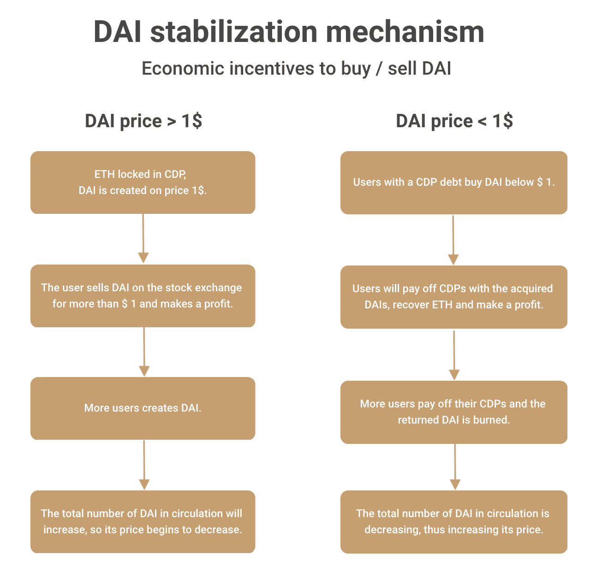
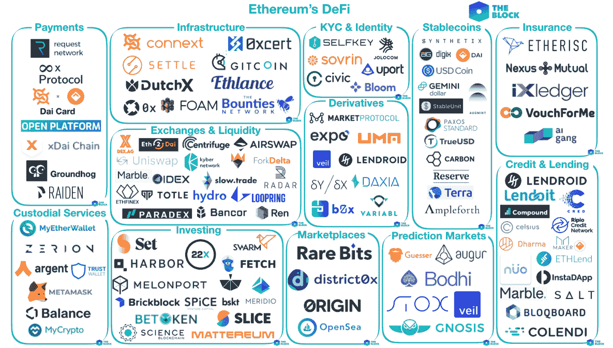
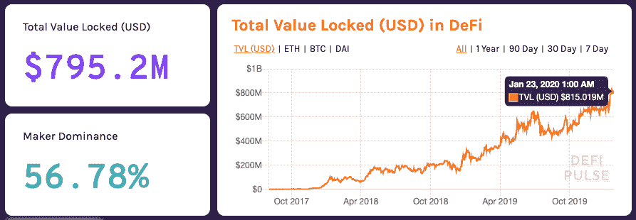

# DeFi 简介

> 原文：<https://medium.datadriveninvestor.com/a-brief-introduction-to-defi-aa1e06b87188?source=collection_archive---------10----------------------->

分散式金融(DeFi)是一种新兴的分散式应用类别，在以太坊等公共网络上开发。在过去的两年里，从贷款到合成衍生品或保险，一系列金融产品被创造出来，几乎没有被更广泛的公众所注意到，但在加密社区却大受欢迎。

Source: unsplash.com

在这篇文章中，我想解释一下 DeFi 代表什么。最终，你会更好地理解 DeFi 意味着什么——不仅对你个人，而且对世界和你的财务自由。

**以太坊:数字金融栈**

以太坊是一个不需要呈现给读者的平台。有了智能合约，我们可以把以太坊平台想象成一个自由的世界，为各种各样的去中心化应用提供无限的可能性。就像互联网为内容创作者创造工具一样，以太坊也通过创造新的金融服务做到了这一点。为什么是以太坊？与以太坊上的 DeFi 相比，闪电网络使比特币可以用于微支付，但目前，它无法用于智能承包商等功能，而整个 DeFi 生态系统正是基于智能承包商。其他网络，如 EOS、Cardano、Dfinity 和许多其他具有智能合约的网络可能对 DeFi 有用，但迄今为止，以太坊网络是市场领导者。

首先，我想指出“开放金融”和“分散金融”之间的区别。这些术语经常放在一起，尽管它们是两个不同的术语，具有不同的含义。开放式金融指的是传统(集中或法定)金融中的银行服务业，初创公司在有限的地理区域内提供专业化服务。一个很好的例子就是 Revolut 应用，很多人认为它是一个银行，但实际上，它是一个拥有银行牌照但不涉及存款保障基金的 fintech 应用，这不是一个可靠的信号。另一方面，分散融资通常是伪匿名的，可能会抵制审查，全球可用，并且由于在公众可访问的区块链上运行，更加透明。

 [## 5 个可以拯救环境的潜在区块链用例|数据驱动的投资者

### 区块链技术已经成为创新和颠覆的代名词。而医疗保健等几个行业…

www.datadriveninvestor.com](https://www.datadriveninvestor.com/2020/03/06/5-potential-blockchain-use-cases-that-can-save-the-environment/) 

在相对较短的时间内，以太坊网络上出现了一揽子去中心化的金融服务。任何人只要有互联网连接和加密钱包，现在就可以获得全方位的金融服务。我将逐步解释逻辑上相互关联的不同类别。

**DEX —分散交易所**

与传统的集中式交易所相比，分散式交易所有一个很大的优势。它们消除了盗用用户数据和/或俗称的“黑客攻击”的风险，并因此消除了私钥泄露到用户钱包的风险。分散式交易所将允许用户用资金进行交易，而不需要注册或验证账户，尤其是不需要中介，只需用用户自己的钱包(最常见的是元掩码)。用户直接处理智能合约，在这种情况下，智能合约充当安全透明的管理员。像任何解决方案一样，DEX 有其优点和缺点。安全性可能是一个毋庸置疑的优势，尽管乍一看似乎不是这样，但从安全的角度来看，交易的处理时间和用户必须为每笔交易支付的汽油费。这种机制使得操纵市场变得更加困难。不幸的是，不利的一面可能是用户群更小，因此订单簿更窄(未完成交易更少)，流动性尤其差。

对于这些缺点，Uniswap 项目可能是解决方案，该项目是 DeFi 生态系统中最著名的项目之一。Uniswap 不仅实现了去中心化，还通过实现用户与商店交互的智能合约解决了订单簿问题，保留了令牌，因此不必将用户与特定的未结头寸相关联或等待新订单。这些智能合同池令牌储备被称为“储备池”。

*uni swap . exchange 主页*

Uniswap 是以太网上自动交换 ERC 20 令牌的协议。与传统的 DEX 不同，Uniswap 不使用订单簿，而是使用一种算法定价机制，保证流动性并提供低利差。这种机制非常简单，允许直接使用以太坊智能合约进行相对简单的操作。这提供了额外的安全好处，并且由于简单，还降低了汽油费用。

在 Uniswap 上交易的每个 ERC-20 令牌都有自己的池和一个 ETH 池。代币的价格由 ETH 池(基金)规模与交易代币池规模的比率决定。每当有人向 ETH 出售令牌时，池中的令牌数量就会增加，反之亦然。这逐渐降低了代币的价格。每当有人购买 ETH 时，Uniswap 令牌的数量会减少，ETH 的数量会增加，从而增加其成本。这种定价机制是自动的，因此不需要创建订单簿。而是通过仲裁来调整价格。每当 Uniswap 令牌的价格低于市场时，最好交易 Uniswap 令牌，从而逐渐根据市场调整价格。

储备基金或流动性池只能部分解决流动性问题。它们当然有巨大的增长潜力，因为向网络中添加额外的流动性池相对容易，但它们仍然没有创造一个完全流动的市场。智能合约上的每个操作都受到以太坊网络上处理交易所需时间的限制，这可能是一个很大的限制。

DEX 是一个单独的章节，可以写很多东西，但对于本文来说很重要，因为它是通向 DeFi 生态系统及其所代表的财务自由的门户，即使集中式交易所继续运行其自身服务的“不可信”变体。例如，币安和 Bitfinex 已经推出了自己的分散式交易所。

**Stablecoins**

在过去的几年中，已经进行了几次尝试将实物资产令牌化，但是趋势和需求一直表明对可交易令牌的兴趣。由于以太坊平台和智能合约的灵活性，随着时间的推移，不同的令牌出现了不同的功能和用途。2017 年的 Cryptokitties 现象是对发行新虚拟资产的兴趣增加，即所谓的 NFT(不可替代的令牌——ERC-721)，这是基于市场对“虚拟资产”的需求。

稳定币是一种被“支持”的资产——被另一种资产、商品或任何代表价值的东西所覆盖。例如，在 stablecoin 系绳的情况下，其价格包含在美元价值中，即 1 系绳为 1 美元。因此，这种加密货币不受比特币等市场波动的影响。

目前最受欢迎的是和戴。虽然他们来自同一个家庭，但他们之间有很大的不同。最大的分歧在于集权和分权的问题。

Tether 是一个需要“可信管理器”的集中式稳定中心。这可能是一家银行或基金，持有价值作为抵押品，在 USDT 的情况下是美元。与此同时，它还进行审计，核实每张发行的 USDT 都包含相同的美元金额。然而，这为滥用创造了机会，泰瑟承认，USDT 已被低估了几次。

另一方面，戴是一种分散的稳定货币，它利用以太坊智能合约中实施的市场机制来维持其与美元绑定的价值。它的抵押品并不代表像 USDT 那样锁定在银行账户中的美元金额，而是使用 Maker 平台管理戴的用户，他们实际上在那里存储资产作为戴的抵押品。因此，戴是一个真正分散的稳定中心，也是大多数 DeFi 生态系统的基石。

**马克尔道&戴**

戴是以太坊网络上可自由交易的 20 代币。任何在以太坊网络上有钱包的人都可以在去中心化的交易所拥有、接收、转移或交换 DAIs。没有当局控制它，因此没有人能限制或阻止它的出版。它的稳定价格是由“稳定机制”保证的，我们将在后面解释。

DAI 的工作原理是担保贷款，用户将 ETH 形式的担保放入智能合同，并以 DAI stablecoin 的形式获得贷款。在智能合约的情况下，这意味着用户为交换智能合约的 DAI 而发送的 ETH 被交换为 WETH，WETH 随后被存储、汇集为 CDP 中的 PETH，也称为“抵押债务头寸”。在用户偿还 DAI 贷款之前，钱包持有者不能访问 CDP 中的 ETH。

*Source: DeFi.Pulse January 2020*

通过获得的 DAI，用户可以继续交易或在不同的应用中使用 DAI，但这意味着存在与另一种加密货币相同的供求市场机制，因此需要稳定机制。下图可以更好地解释这种机制。

在协同网络攻击的情况下，MakerDAO 有能力管理 DAI stablecoin，平台用户可以一起投票来还原更改。制造商有能力在必要时采取干预措施，但决不能影响戴的成本。

DAI 的好处在于，它的稳定机制不只是像许多其他平台那样只是一个理论，而是从一开始就被成功地实现了。截至本文发布之日，稳定机制并未以任何方式失效，而日交易量仍以百万美元计，市值接近 9000 万美元。

戴是一个很好的例子，成功地实现了分散金融的基石——稳定币，也是一个很好的例子，说明它如何在这样一个没有中介或任何权威的环境中工作。

**分散的金融市场**

许多金融科技公司和现代银行现在承诺消费者对他们的资源有更大的控制权。这些都是误导性的承诺，因为在大多数情况下，银行仍然管理资产，客户必须相信银行，银行会好好保管他的资金。它们可能更快、更方便，但与传统银行业务没有本质区别。

真正的创新只有完全掌握在用户手中并能立即获得资产时才会出现。这种创新是以自由和自由获取用户资产和金融产品为条件的。第二个条件是代码的开放性和透明性。所有协议都是开源的，因此任何人都可以开发新的金融产品，来自世界各地的人们可以合作，提出新的价值创造形式。这可以带来更快的创新和强大的“网络效应”。

DeFi 已经提供了各种常见的金融工具和产品作为开源协议，确保用户始终是其资产的唯一管理者。DeFi 生态系统每天都在增长，一个全球金融市场正在慢慢形成，可编程资产和服务不仅服务于用户，而且完全掌握在用户手中。[这是一个不断扩大的 DeFi 生态系统项目清单。](https://defiprime.com/)

下面的信息图展示了 DeFi 的协议和项目。许多这些服务是传统金融产品的免费和分散版本。

*Infographics of DeFi Ecosystem for the year 2019*

然而今天，这些协议中的大部分都不赚钱。据一些消息来源称，其中许多是成功的，但只有时间和市场的不可预测性才能证明它们是否给协议带来了真正的价值。

一些 DeFi 项目纯粹专注于智能合约的开发，对于各种金融产品，与前几年的许多项目不同，它们不实施自己的令牌或令牌经济，它们提供纯粹的智能合约服务。一个很好的例子是像 Compound 和 Synthetix 这样的项目。

下图显示了 ETH 目前的赤字水平。截图取自 Defi。Pulse 监测 DeFi 项目的关键指标，并跟踪该领域的最新趋势。

*Source: DeFi.Pulse January 2020*

今天，在 DeFi 生态系统中发生了许多发展，甚至初创公司也开始明白，要创建新的分散式产品或应用程序，没有必要建立自己的网络，但通过以太坊上的智能合同，一切都可以是独角戏。