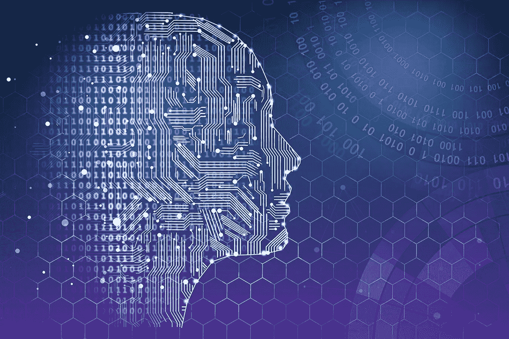

# 人工智能发展简史(下)

> 原文：<https://medium.datadriveninvestor.com/a-brief-summary-on-the-history-of-ai-part-2-5c465e544523?source=collection_archive---------10----------------------->

**我们又来了(1980-1987)**

20 世纪 80 年代，一种叫做“专家系统”的人工智能程序被世界各地的公司成功采用。到 1986 年，一个专家系统估计每年为一家公司节省了 4000 万美元。在同一年，日本政府大力资助人工智能的第五代计算机项目。美国紧随其后，成立了微电子和计算机技术公司(MCC ),作为一个旨在确保国家竞争力的研究联合体。总的来说，人工智能产业从 1980 年的几百万美元发展到 1988 年的几十亿美元，包括数百家公司建立专家系统、视觉系统、机器人以及专门用于这些目的的软件和硬件。

 [## 修复摄影|数据驱动的投资者

### 汤姆·津伯洛夫在转向摄影之前曾在南加州大学学习音乐。作为一个…

www.datadriveninvestor.com](https://www.datadriveninvestor.com/2019/03/22/fixing-photography/) 

专家系统是指能够使用从专家的知识中导出的逻辑规则来解决特定知识领域的问题的程序。在同一时期，我们正在目睹一场“知识革命”，因为人工智能研究人员开始相信，智能很可能基于以不同方式使用大量不同知识的能力。

人工智能的另一个有益事件是神经网络的回归。神经网络可以以一种新的方式学习信息的证明(由约翰·霍普菲尔德提出)和“反向传播”的普及成功地复兴了连接主义(人工神经网络)的领域。

**第二次艾冬季(1987–1993)**

不幸的是，我们有另一个“人工智能冬天”，因为许多公司因未能兑现奢侈的承诺而半途而废。上世纪 80 年代末 90 年代初，艾遭遇了一系列财务挫折。事实证明，专家系统的维护成本太高，而且只在少数特殊情况下有用。日本的第五代项目没有实现其雄心勃勃的目标，而美国削减了对人工智能的资助。

在同一时期，一种新的人工智能方法出现了。一组研究人员认为拥有一个身体是智能机器的基础。它必须移动，感知和处理现实世界。这种方法复兴了自 60 年代以来一直不受欢迎的控制论和控制理论的观点。另一位先驱是大卫·马尔，他在 20 世纪 70 年代末从理论神经科学的成功背景来到麻省理工学院，领导研究计算机视觉的小组。

在方法论上，艾采用了科学的方法。要被接受，假说必须经过严格的实证实验，并且必须对结果的重要性进行统计分析。一个相关的例子是语音识别领域。在 20 世纪 70 年代，尝试了各种不同的架构和方法。其中许多是临时性的和脆弱的，仅在少数几个特别选择的例子中得到证明。近年来，基于隐马尔可夫模型(hmm)的方法开始主导该领域。

**初具规模(1993–2011)**

AI 领域正开始在整个科技行业成功使用，但不知何故在幕后(不切实际的高期望导致的两次 AI 寒冬后，人们开始更加谨慎)。有些成功是由于不断增长的计算机能力，有些是通过在做研究时使用科学方法取得的。人工智能被分割成专注于特定问题或方法的竞争性子领域。艾比以往任何时候都更加谨慎，也更加成功。

1997 年 5 月 11 日,“深蓝”成为第一个击败国际象棋世界冠军加里·卡斯帕罗夫的计算机国际象棋系统。此外，在 2005 年，一个斯坦福机器人赢得了 DARPA 大挑战，它在一条未经训练的沙漠小道上自主驾驶了 131 英里。两年后，一个来自 CMU 的团队赢得了 DARPA 城市挑战赛，他们在城市环境中自主导航 55 英里，同时遵守交通危险和所有交通法规。

在 20 世纪 90 年代，我们看到了智能代理的出现，这是一个感知环境并采取行动以最大化其成功机会的系统。尽管智能代理取得了成功，但一些有影响力的人工智能创始人，包括约翰·麦卡锡、马文·明斯基、尼尔斯·尼尔森和帕特里克·温斯顿都对人工智能的进展表示不满。他们认为，人工智能应该减少对创建擅长特定任务的不断改进的应用程序版本的强调，例如驾驶汽车、下棋或识别语音。相反，他们认为人工智能应该回到它努力的根本，用西蒙的话说，“思考、学习和创造的机器。”

**人工智能的新时代(2011 年至今)**

21 世纪的前几十年让我们接触到了大量的数据(被称为“大数据”)，更便宜更快的计算机和先进的机器学习技术。其中一个因素对人工智能如何改变其关注点有着重要影响:数据。在计算机科学的 60 年历史中，重点一直放在作为主要研究课题的算法上。但人工智能领域最近的一些工作表明，对于许多问题来说，更有意义的是担心数据，不要那么挑剔应用什么算法。这就是数据变得如此重要的原因，也是为什么现在数据可能是世界上最受欢迎的资源。

如今，人工智能出现在许多现实世界的应用中，如机器人车辆、语音识别、自动驾驶汽车、垃圾邮件过滤器、控制你的订阅的社交媒体算法、机器人技术。这些只是几个例子，并不是详尽的清单。

本文使用的资料来源:

1.  人工智能中最有影响力的教科书之一:[人工智能，一种现代方法(Stuart Russel，Peter Norvig)](https://www.amazon.com/Artificial-Intelligence-Modern-Approach-3rd/dp/0136042597)
2.  [维基百科](https://en.wikipedia.org/wiki/History_of_artificial_intelligence)

如果你喜欢这篇文章并想看更多，那么就在[推特](https://twitter.com/RautaAlin)上关注我。

我是一名独立制作人，正在写一本关于人工智能基础的书。如果你想支持我，并且你对人工智能感兴趣，那么你可以在这里打折预购我的书(直到我完成这本书你才会被收费):[https://gumroad.com/l/SXpw/sideproject](https://gumroad.com/l/SXpw/sideproject)