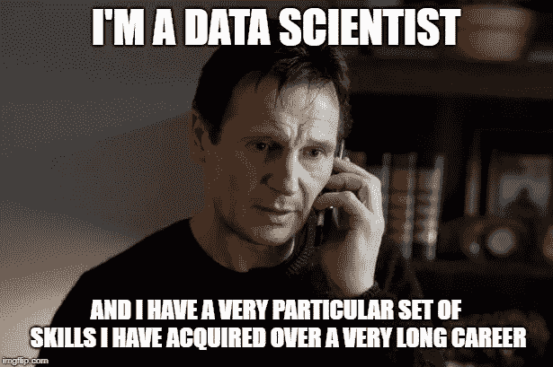

# 数据科学优秀认证指南

> 原文：<https://medium.datadriveninvestor.com/a-certification-guide-to-excel-in-data-science-43d3c4d4453a?source=collection_archive---------7----------------------->

## 为 21 世纪最性感的工作做准备！

Photo by [National Cancer Institute](https://unsplash.com/@nci?utm_source=medium&utm_medium=referral) on [Unsplash](https://unsplash.com?utm_source=medium&utm_medium=referral)

如果你在这里写这篇文章，你可能已经意识到了一个严峻的事实:数据科学现在正处于全盛时期。甚至有人说“数据科学是 21 世纪最性感的工作”。

目前的市场场景就是成千上万的公司在雇佣数据分析师和数据科学家的最大证明。顶级商业领袖正在使用数据科学来解决复杂的商业问题。

 [## 将定义 2020 年就业前景的五大数据科学和机器学习趋势|数据驱动…

### 数据科学和 ML 是 2019 年最受关注的趋势之一，毫无疑问，它们将继续发展…

www.datadriveninvestor.com](https://www.datadriveninvestor.com/2020/02/19/five-data-science-and-machine-learning-trends-that-will-define-job-prospects-in-2020/) 

从数据工程师、数据分析师到科学家，公司都在投资他们，从他们的数据中获取一些肉。数据至关重要！公司关心他们的数据就像父亲关心儿子一样。正如 Humby 在 2006 年所说，“数据是新的石油”。

成为一名数据科学家是一个漫长的旅程。如果你渴望拥有一个，所需要的只是时间和大量的学习。如果您打算从头开始，您可以遵循我为您创建的认证指南。

在我开始之前，这些都是 Udacity 的纳米学位。先说清楚！

## 用 Python 为数据科学编程

在数据分析、机器学习或数据准备方面，Python 是最强的语言。如果你想从头开始，选择“用 Python 为数据科学编程”将为你铺平道路。

在本课程中，您将了解 SQL、Python、数据分析库和 Git 控件。如果你掌握了这门课程，前方的路会变得非常清晰。一旦你熟悉了 Python，你就可以进入数据准备阶段，也就是数据工程师的工作。

## 成为一名数据工程师

> 这个世界现在充斥着数据，我们可以更清晰地看到消费者。

数据工程就是准备数据。数据可以以多种形式出现。数据工程师的唯一和主要目的是为数据分析师准备数据以供进一步分析。

在本课程中，您将学习数据建模概念、设计数据模型、构建数据仓库和数据湖、自动化数据管道以及处理海量数据集。一旦你清楚了数据准备的概念，并且确信你可以准备任何数据进行分析，下一步就是学习分析，即分析大数据。

## 成为一名数据分析师

> 目标是将数据转化为信息，将信息转化为洞察力。

数据分析就是分析数据，并从大数据中提取有用的信息。Udacity 提供的这个项目为您的数据分析师职业生涯提供培训。数据分析就是组织数据、揭示模式、得出结论和交流关键发现。

在这个程序中，你将不得不使用 Python 及其数据分析库，如 Numpy 和 Pandas。你可以参与不同的项目，这些项目可以在你的简历中展示。

## 成为一名数据科学家

这就是你开始的目的！成为数据科学家？如果你彻底地学习这个程序，这将对你是非常令人鼓舞的。这是一个高级计划，可以提高您的数据科学技能，并为您从事数据科学家的工作做好准备。

要完成这个程序，你必须彻底与 Python 和 SQL 的概念。除此之外，你必须有良好的数学技能，特别是数据科学家的概率和统计。机器学习的基础知识会给你加分。

而且，就是这样！

如果你认真地完成这些课程和认证，你将最终在数据科学行业找到自己的位置。

> 附注——我不支持 Udacity。

但是，他们提供的内容是艰难的，棘手的，这是为未来训练你。**快乐学习！**

**和平！**

**访问专家视图—** [**订阅 DDI 英特尔**](https://datadriveninvestor.com/ddi-intel)