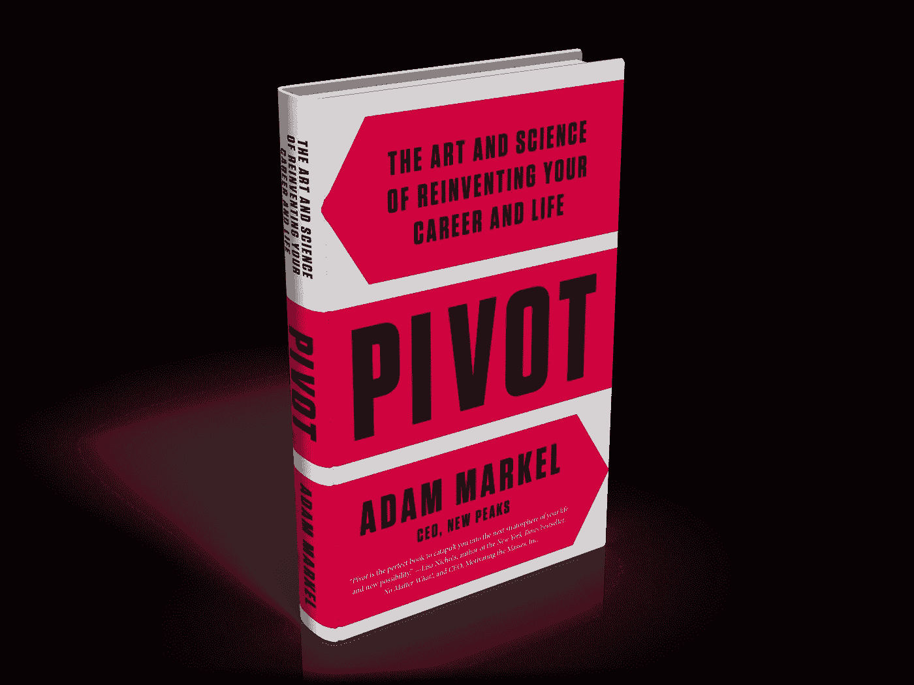

# 一个你可以相信的改变计划

> 原文：<https://medium.datadriveninvestor.com/a-change-plan-you-can-believe-in-489660d1fea3?source=collection_archive---------26----------------------->

现在总是改变你生活的好时机。但是在这个疫情时期，与世隔绝的需求可能会有所帮助。

但是就像所有的改变一样，总有一件事会阻碍我们。很多人说他们想要生活中有所不同，但很快就清楚了，他们不想做任何不同的事情来实现这种改变。这个因素是许多个人和商业问题的根源。

也许你陷入了自己不喜欢的职业。也许你看到了正在扰乱你的行业的变化，但是随着机会的减少，你陷入了困境。这发生在书店工作的人身上，因为亚马逊彻底改变了读者购买书籍的方式。当实体零售商最终明白过来时，已经太晚了。那是生意！

但是对于人来说，改变永远不晚。唯一真正的问题是，要摆脱旧的，找到新的，需要一种你以前可能没有尝试过的方法。

# 如果你想改变，需要改变什么？

即使你准备以不同的方式做事，到底需要改变什么？这是一个很难回答的问题，也是亚当·马克尔试图在他的书《支点:重塑生活的艺术与科学》中解决的问题。

你读一些书，然后思考你所读的内容。这个不一样。你需要阅读它，然后采取行动。和往常一样，对于自助类书籍，没有捷径可走。不过，它的布局方式确实让这个过程变得更加可行。

 [## 良好的生活是习惯的形成|数据驱动的投资者

### 过度思考是过度紧张。仅仅几个简单的习惯就会在一天中产生巨大的影响。那是…

www.datadriveninvestor.com](https://www.datadriveninvestor.com/2020/01/17/a-good-life-is-habit-forming/) 

# 一口大小的子弹让你的改变计划进行

在每一章的结尾，都有几个要点列出了前面几页的关键概念。基本上，你不必去猜测作者想表达什么，因为它已经被清楚地表达出来了。例如:

*   你的无意识习惯创造了你的现实
*   要改变，你需要创造与你想要的生活一致的习惯，而不是与你已经拥有的生活一致的习惯。

# 做出改变时，和谐很重要

此外，你还需要问自己一些关键问题，以便参与到旋转的过程中，就像同一章中的以下内容一样，

*   你如何重新组织你的生活，使它与你的梦想和愿望更加和谐？
*   哪三个新习惯，如果每天坚持，会让你离梦想更近一步？

这本书以一个 21 天的行动计划结束，这基本上意味着你可以在一个典型的日历月内完成它，并且仍然可以在周末休假。你可能需要这样的休息，因为就像第一次学习代数和微积分一样，改变是精神上和情感上的艰苦工作。

不要期待过程会很容易，因为不会。但话说回来，没有什么好事是容易的。

这是一个故事的编辑版本，首次发表于 2016 年 4 月 11 日的《Forbes.com》。