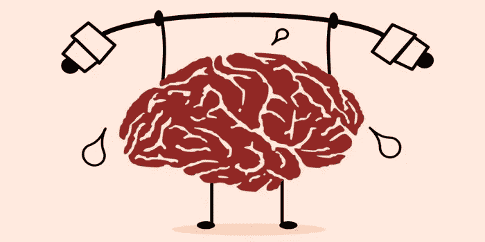

# 实力清单:没人看的时候你赢了

> 原文：<https://medium.datadriveninvestor.com/a-checklist-of-strength-you-win-when-nobody-is-watching-a22b4aec4555?source=collection_archive---------20----------------------->

力量不是你从外面看到的，而是你从内心感受到的

Life Coaching Academy

什么是**实力**？你从外的**看到的东西？肌肉，宽肩膀，大胳膊？咄咄逼人地大叫，挥拳，砸窗户？**

什么是**弱点**？身体脆弱，话不多，表现情绪，求助？

人们把别人或自己看做**强或弱**有太多**不同的原因；每个人对此都有不同的看法。**

我认识两个属于**的人，通常被归类为**一个是强者，另一个是弱者。

让我解释一下我的意思:

第一个人是从之外的**来看，可以归类为*拥有一切的人*。健康、财富、丈夫、孩子、孙子，而且很快就要搬进她梦想中的房子。一个好斗、大声且“自信”的人。但是她最近患上了严重的抑郁症。**

她神经极度紧张。她不能享受 T21 的任何东西，并且总是抱怨每件事。她日复一日地为每一项普通的任务而奋斗。她一直在哭，就好像她停止了生活。

另一个人是从外面看起来像你会归类为“软弱”的人。她不怎么说话，也不会用她的观点去打扰任何人；她很**柔软**和**冷静**。

但是她**没有全部**。她有三个孩子。她的第一个儿子在 5 岁时被诊断出患有白血病。她女儿那时 3 岁。她带着两个小孩在经历地狱般的煎熬，却还敢生第三个。她的儿子康复后，令人惊讶的是，她怀上了第四个孩子，然后可怕的是，她在第九个月失去了第四个孩子。

这种纯粹的想象让我起鸡皮疙瘩！

但是她**仍然心存感激**并且对别人很好；她**关心**他人，为**未来**做打算；总之她**还活着**！

这个女人对我来说真的**体现了力量**！

所以，这两个女人让我思考力量到底意味着什么。

直到最近，我对什么是真正的力量也有一种扭曲的看法。我原以为这是**你可以从外面**看到或确定的东西，但这个**离现实不可能更远了。**

 [## 自然中的创新:改变企业的生活史战略方法|数据驱动…

### 在我们这个时代，每个人都以谷歌、亚马逊或苹果为例谈论创新。在这些会谈中，创新…

www.datadriveninvestor.com](https://www.datadriveninvestor.com/2020/11/20/innovation-in-nature-a-life-history-strategy-approach-to-change-your-business/) 

在改变我的观点后，这是我认为力量是什么和不是什么:

# 实力不代表…

…手臂很大。

…不示弱。

…不表露情感。

…不寻求帮助。

…不谈论你的需求。

…不承认失败。

…复仇。

…不承担责任。

…遇到困难就放弃。

…没有面对现实。

…让别人相信你有你的屎在一起。

…不要说你错了。

…假装冷酷无情。

# 力量是勇气…

…无论生活有多艰难，都要心存感激。

…成为你。

…让过去成为过去。

…说“不”。

…到没有借口。

…不要让你的自我意识左右你的反应。

…保持不舒服。

…靠你自己。

…要靠自己。

…承担责任

…拥有你的大便。

…即使每个人都不同意，也要说出自己的想法。

…度过困难时期。

…即使你被吓得魂不附体，也不要放弃。

…承认你错了。

…接受你不能控制一切的事实。

…即使你的声音颤抖，也要说出真相。

# 力量是从外面看不到的，但可以从内心感受到。

你可以让人们相信你很强大，但更重要的是当你的自我占据了所有创伤、愤怒和痛苦的中心舞台时，你的感受和反应。

正如先知默罕默德的**圣训**所言:*“强者不是以力量战胜人民的人，而是在愤怒时控制自己的人”* (Sahih al-Bukhari，8:73:135)。

# 没人看的时候你赢了！

感谢阅读，

哈蒂斯

## 访问专家视图— [订阅 DDI 英特尔](https://datadriveninvestor.com/ddi-intel)