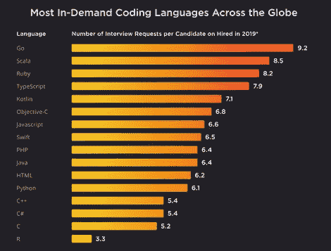
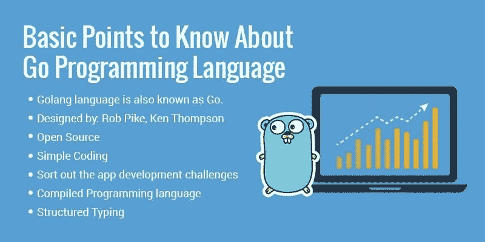
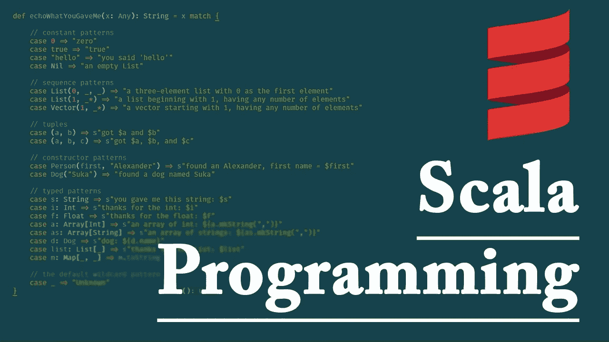
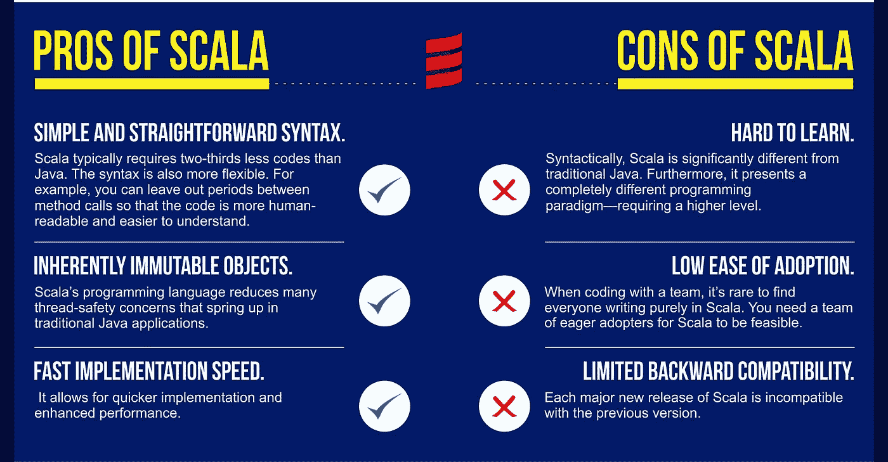

# 程序设计语言的比较研究——Go 和 Scala

> 原文：<https://medium.datadriveninvestor.com/a-comparative-study-of-programming-languages-go-and-scala-d17ccdce2a06?source=collection_archive---------1----------------------->

编程语言对于追求成功的数据科学职业生涯非常重要。了解更多流行语言——Go 和 Scala 在这里。

**编程语言**让专业人士拥有更少更容易理解的代码工作。它帮助大数据专业人员组织他们的非结构化数据集。此外，使用代码的专业人员并不总是创建代码的人。因此，编写代码应该更具交流性，以避免在 [**数据科学项目**](https://www.dasca.org/world-of-big-data/article/7-best-big-data-hadoop-analytics-tools-in-2021) 的交付中受到阻碍。

提一提不说，编程技能是 [**大数据专业人员**](https://www.dasca.org/) 必备技能之一。根据手头的任务、你对知识更上一层楼的渴望、你的组织使用数据科学的方式，编程语言的功效必须得到调整。

> 在 Python、Scala、Go、JavaScript、R、SQL 等众多编程语言中，我们选择了两种主要语言——Scala 和 Go 在这里进行讨论。

专业人士根据项目和客户的需求规格从这两者中选择一个。Golang 或 Go 由 Google 开发，是一种静态类型和编译语言，其中的工具、源代码和编译器都是免费和开源的。另一方面，Scala 是一种通用编程语言，为函数式编程提供支持。

# 下面我们就来详细了解一下这两种编程语言。

# Go 作为一种编程语言

它是由 Rob Pike、Robert Griesemer 和 Ken Thompson 开发的一种编程语言。Go 语言的语法有点类似于 C 语言，并提供动态类型能力、垃圾收集、类型安全、可变长度数组和键值映射。

# 围棋语言的特点

Go 编程的重要特征包括

程序简单明了

加快编译速度

支持环境采用模式

拥有内置的并发支持——例如轻量级流程、通道和 select 语句

支持类型嵌入和接口

生成静态链接的本机二进制文件，没有任何外部依赖性

# Go 语言的优势

编程语言具有明显的优势。举几个例子，他们是-

提高可用性和服务可靠性，因为它比包括 Python 和 Java 在内的语言更快

对于具有 Java 或 C 语言知识的专业人员来说很容易，因为它有相同的过程方法

它是可扩展的，因为当多个并发进程运行时，它只占用 2KB 的内存。它还可以高效运行，而不会导致系统崩溃。

组织越来越依赖 Golang，因为它是一个强大的开源软件，并且易于学习。

 [## 一瞬间学会数据科学！？数据驱动的投资者

### 在我之前的职业生涯中，我是一名训练有素的古典钢琴家。还记得那些声称你可以…

www.datadriveninvestor.com](https://www.datadriveninvestor.com/2020/07/23/learn-data-science-in-a-flash/) 

# Go 语言的用例

Golang 惠及各行各业的商家。这里简要介绍了一些用例。

云存储共享服务 Dropbox 通过 Golang 有效管理其网络上的 5 亿多用户。

用于网络、云和分布式功能，如 web 服务器、API 和 web 应用程序。

用于构建云原生计算的基石，如 Kubernetes 和 Docker。

取代传统的对应物。例如，Teleport 是 SSH 服务器的新版本。

适合创建工具和实用程序，因为它们可以快速启动并打包以便重新发布。

现在，让我们来看看另一个，Scala。

# 作为编程语言的 Scala

Scala (Scalable Language)是一种多范例编程语言，由 Martin Odersky 创建，可以轻松地与函数式语言和面向对象语言集成。对于从事数据科学职业的专业人员来说，这很容易，因为它基于 Java，并且每个数据科学专业人员都会 Java、C、C++或 Python。它为他们的 [**数据科学职业**](https://medium.com/@taylor.mark110/data-scientists-career-path-from-associate-to-director-levels-a3f2ce22f8ce) 提供了额外的提升。

# Scala 的特性

Scala 是可扩展的、面向对象的、静态类型的。

Scala 是函数式的，因为每个函数都是一个值，每个值都是一个对象。

抽象以一种安全的方式被连贯地使用。

Scala 是可扩展的，因此很容易流畅地添加新语言。

Java 和 Scala 运行在一个公共的执行平台上，即 Java 虚拟机(JVM)。

Scala 以一种不可变的方式简化了代码的编写，使得应用并行性和并发性变得容易。

# Scala 的优势

使用 Scala 的一些优势包括:

提供便捷的学习体验。

为代码复杂性提供优化。

执行类似 Java 的功能，但代码行更少。

可互操作并与 Java 兼容。

# Scala 的用例

Scala 对初学的开发人员和专家也很有用。一些使用案例包括:

广泛用于大数据和分析，是数据工程师的首选。

由于其可伸缩性优势，在交易服务和并发系统中使用。

充当构建 API 和应用程序的高度并发的 web 框架。

在单个应用程序中创建高度分布式的应用程序。

按照领域构建库和框架。

如果你想选择这两个中的任何一个，那么我们建议 Go 对于云原生应用来说性价比较高。Scala 似乎是大数据和并发关键系统的最佳选择。然而，这完全取决于您正在处理的客户项目。所以，作为一名数据科学专业人士，建议通过拥有相关学位**、**、[、**获得大数据认证**、](https://www.dasca.org/data-science-certifications/)，学习几种编程语言，擅长软技能和沟通技巧来拥有技术技能。

## 访问专家视图— [订阅 DDI 英特尔](https://datadriveninvestor.com/ddi-intel)