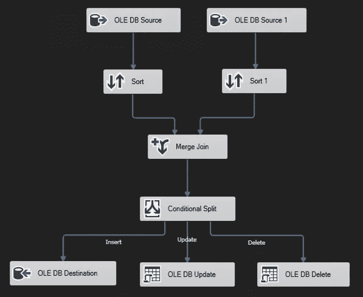
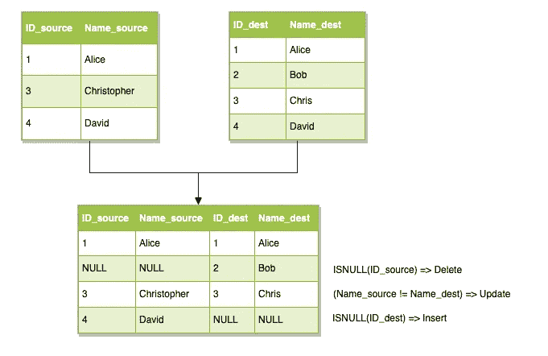
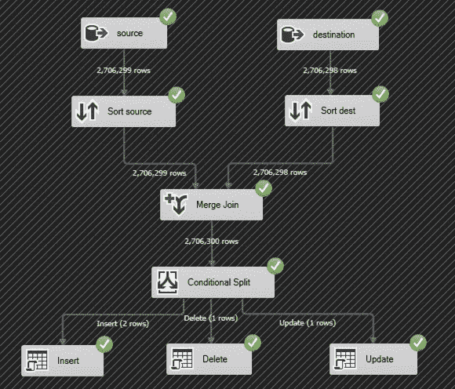
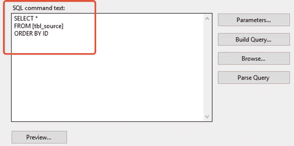
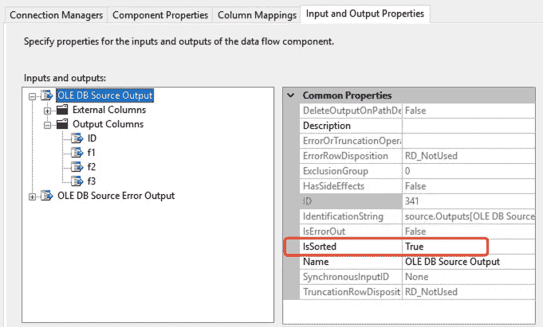
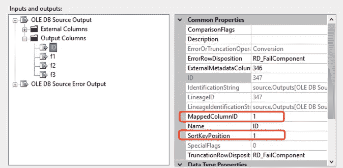
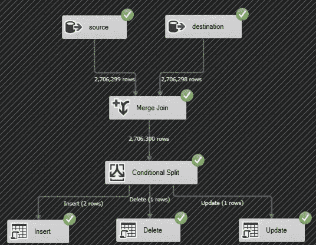
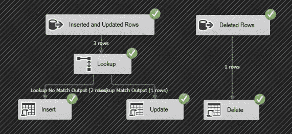
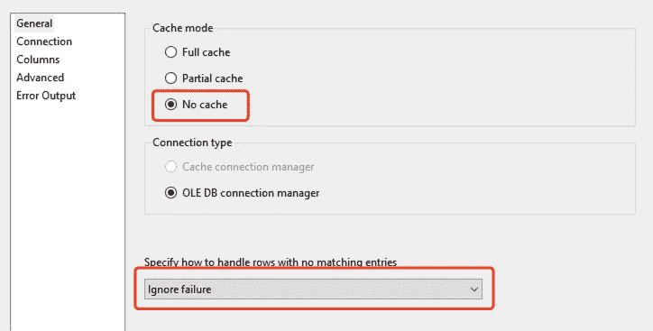

# SQL Server Integration Services 中不同更改数据检测方法的比较

> 原文：<https://medium.datadriveninvestor.com/a-comparison-of-different-methods-of-changed-data-detection-in-sql-server-integration-services-ec606d119311?source=collection_archive---------0----------------------->


# 介绍

在我之前的帖子中:

> [**使用 SSIS**](https://medium.com/@qiuyujx/manually-implementing-change-data-capture-cdc-on-non-cdc-enabled-tables-using-ssis-b75edb12bae2) 在未启用变更数据捕获(CDC)的表上手动实施 CDC

我介绍了一种手动检测表上数据变化的方法。在与我的同事进行了一些讨论后，我们提出了更多的方法。在本文中，将列出这些不同的方法，并评估它们在 SSIS(SQL Server Integration Services)中的性能。

开始之前，我们先定义一下问题。

Microsoft SQL Server 具有 CDC 功能，可以在特定的表上启用该功能，以便可以检测到表上的每个更改(插入、更新和删除),并将其记录在一个单独的系统表中，这样我们就可以将它用作“CDC 源”,以便非常轻松地执行增量加载。这个特性非常有用，尤其是在为数据仓库 ETL 过程构建数据管道时，因为常规 ETL 只需要处理源表和目标表之间的差异。

但是，在某些情况下，我们没有足够的权限来启用 CDC 功能。这在非 IT 行业的公司中并不少见，这些公司使用一些第三方软件和软件包中的 SQL Server。此外，有时出于安全原因，不应该授予启用 CDC 功能的权限。

出于上述原因，我们需要手动检测自 ETL 过程的最后一次运行以来更新了什么。此外，根据不同的需求，我们可能不需要检测删除，因为有些源表永远不会删除条目，比如事务表。因此，我将在两个不同的场景中评估这三种方法:

*   检测插入、更新和删除
*   仅检测插入和更新

# 检测插入、更新和删除

第一种方法是我在上一篇文章中提出的，它纯粹利用 SSIS 内置转换组件来执行源表和目标表之间的完全外部合并连接。

## 完全使用 SSIS 内置转换



在此方法中，源表和目标表都将被送入 SSIS 排序转换，以便使用主键字段对整个表进行排序。然后，这两个排序的数据集可以在它们的主键上合并连接。这里，排序是强制性的，因为合并连接转换只能对两个排序关系起作用。

之后，连接的结果将被送入下一个组件——条件性拆分。在该步骤中，如果右关系主键为空，则插入的结果将被识别。另一方面，如果左关系主键为空，则意味着在源表上发生了删除。对于两个表之间匹配的键，我们仍然需要比较其他感兴趣的字段(在大多数情况下，只有几个字段会被跟踪以检测更新更改)，如果至少有一个字段不同，则将该行标记为已更新。



我在上一篇文章中提出的方法是在一个大约有 270 万行的测试表上实现的。该表中有 6 列:ID、f1、f2、f3、o1 和 o2。“ID”是主键，“f1”、“f2”和“f3”是我们要跟踪更改的字段。换句话说，只要其中一个字段发生了变化，我们就称之为更新。然而，“o1”和“o2”对此不感兴趣。



整个过程耗时 2 分 56 秒。


## 预排序源表和目标表

我的同事提醒我，排序转换非常耗时，但不是必需的，尽管合并连接需要对左右关系进行排序。也就是说，我们可以使用 SQL 语句查询表(SELECT *)，然后添加“ORDER BY”子句来手动排序，而不是按原样加载表。



这里的技巧是右键单击 OLE DB 源对象，选择“显示高级编辑器…”。在“输入和输出属性”选项卡中，选择 OLE DB 源输出项，并将右窗格中的“IsSorted”属性设置为“True”。



接下来，转到“ID”字段，将“MappedColumnID”和“SortKeyPosition”设置为 1，因为我们只想按 ID 排序。



所有其他的转变都保持不变。



从经过的时间来看，我们可以看到性能提高了一点点。我假设这些改进来自于两个排序转换对象的缺失。但是，使用排序转换和 SQL 语句“ORDER BY”似乎没有太大区别。


## 使用 SQL 命令“EXCEPT”

实现这一点的另一种方法是使用 SQL 命令“EXCEPT”。如果您从未使用过该命令，下面是微软给出的解释:

> EXCEPT 从左侧输入查询返回右侧输入查询未输出的不同行。

但是，根据它的定义，我们可以放心地使用它来标识任何插入和更新的行，而不是删除的行。假设有一行不存在于左关系中，但存在于右关系中,“EXCEPT”命令将找出在左关系中但不在右关系中的内容，因此删除将被忽略。因此，为了识别被删除的行，我们需要使用“EXCEPT”两次。

首先，确定插入和更新的行:

```
SELECT [ID]
      ,[f1]
      ,[f2]
      ,[f3]
FROM [dbo].[tbl_source]
EXCEPT
SELECT [ID]
      ,[f1]
      ,[f2]
      ,[f3]
FROM [dbo].[tbl_dest]
```

然后，我们交换源表和目标表的位置，以确定是否有任何被删除的行:

```
SELECT [ID]
FROM [dbo].[tbl_dest]
EXCEPT
SELECT [ID]
FROM [dbo].[tbl_source]
```

注意，我们只需要比较 ID 列来检测删除的行，否则:

*   性能不会得到优化
*   如果包含其他字段，我们可能会再次识别更新的行，这会产生不必要的问题

此外，为了分离插入的和更新的行，我们需要使用“Lookup”转换来查看 ID 是否已经在目标表中。如果是，它是一个更新的行，否则，它是一个插入的行。

最后，数据流如下所示:



令人惊讶的是，它超级快(只有 11 秒)，压倒性地优于其他两种方法。


一些提示:

*   如数据流程图所示，用于标识插入/更新的行和删除的行的 OLE DB 源可以并行运行。
*   完整的缓存需要将整个目的表加载到内存中，这将消耗大量的时间。强烈建议对任何大型表使用“无缓存”。
*   对于如何处理没有匹配的行，请确保选择“忽略失败”。否则，不匹配的行可能会导致查找转换失败。



# 结论

使用 EXCEPT SQL 命令比其他两种方法有着极其出色的性能。原因可能是因为以下几点:

*   SSIS 在幕后使用 C 编程语言，它将数据流编译成具有固定结构的特定程序，这很大程度上受你如何定义数据流的影响。
*   EXCEPT 命令是一个 SQL 命令，它将在 SQL Server 引擎上运行，执行计划并由引擎优化。
*   前两种方法可能需要由 SQL Server 引擎将源表和目标表都读入内存，然后传输到 SSIS 进程中执行合并联接。
*   EXCEPT 命令将仅在 SQL Server 引擎上运行，然后仅将差异(插入、更新和删除)行传输到 SSIS 程序中以供下一步使用

因此，我们已经证明，当我们想要手动检测表的变化时，使用 SQL 脚本比一系列 SSIS 变换要高效得多。

[](https://medium.com/@qiuyujx/membership) [## 通过我的推荐链接加入灵媒-陶

### 作为一个媒体会员，你的会员费的一部分会给你阅读的作家，你可以完全接触到每一个故事…

medium.com](https://medium.com/@qiuyujx/membership) 

如果你觉得我的文章有帮助，请考虑加入 Medium 会员来支持我和成千上万的其他作者！(点击上面的链接)

# 资源:

1.  使用 SSIS
    T3【https://medium . com/@ qiuyujx/manually-Implementing-Change-Data-Capture-CDC-on-Non-CDC-Enabled-Tables-Using-ssis-b 75 EDB 12 BAE 2 在未启用 CDC 的表上手动实现变更数据捕获(CDC)
2.  SQL 命令“EXCEPT”文档
    [https://docs . Microsoft . com/en-us/SQL/t-SQL/language-elements/set-operators-EXCEPT-and-intersect-transact-SQL？view=sql-server-ver15](https://docs.microsoft.com/en-us/sql/t-sql/language-elements/set-operators-except-and-intersect-transact-sql?view=sql-server-ver15)