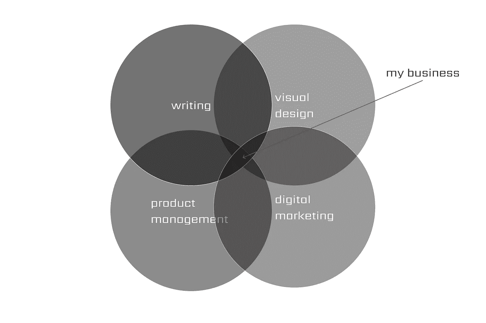
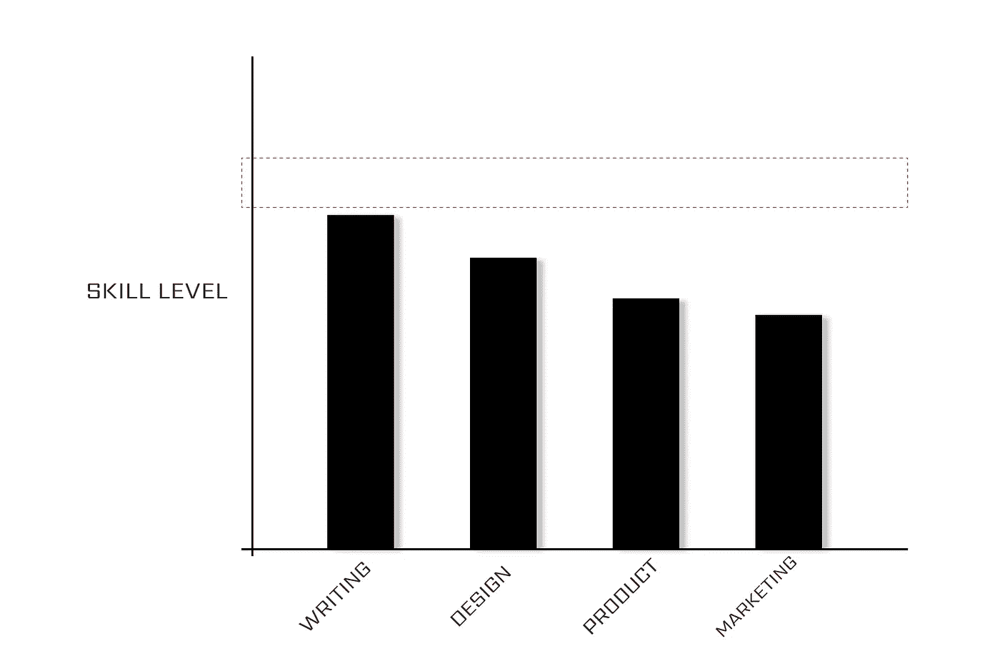
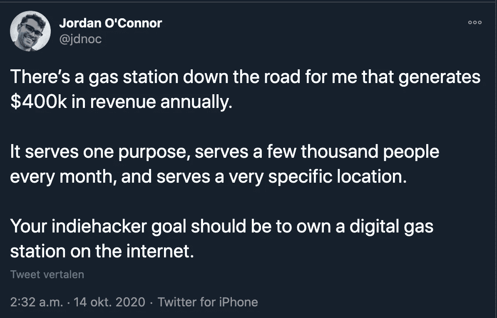
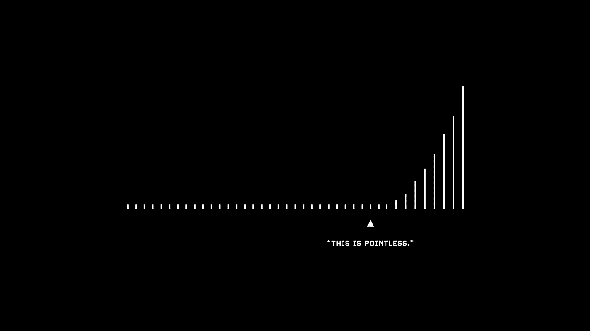
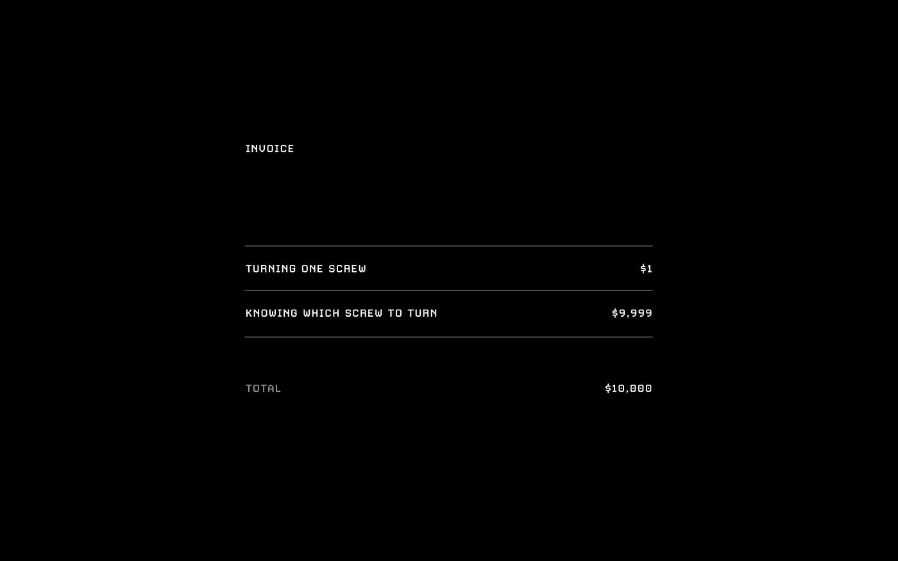
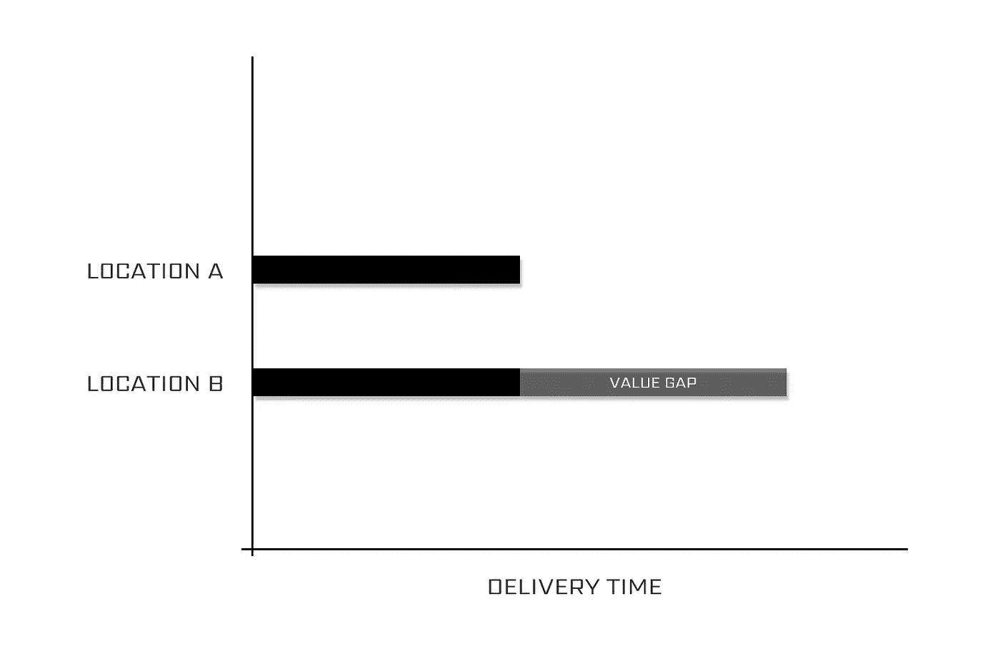
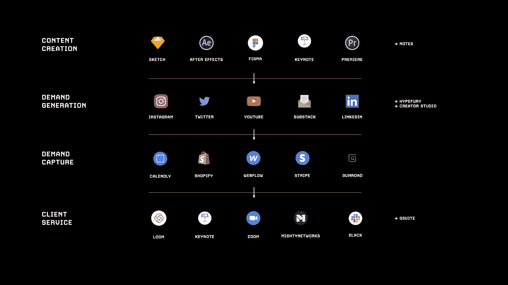

# 一个完整的网上赚钱 4 步指南

> 原文：<https://medium.datadriveninvestor.com/a-complete-4-step-guide-to-making-money-online-9582a7e3b?source=collection_archive---------1----------------------->

## 不要为了钱而出卖你的宝贵时间，用你的头脑来代替

Photo by [Morgan Housel](https://unsplash.com/@morganhousel?utm_source=unsplash&utm_medium=referral&utm_content=creditCopyText) on [Unsplash](https://unsplash.com/s/photos/wealth?utm_source=unsplash&utm_medium=referral&utm_content=creditCopyText)

# 网上赚 1 美元将改变你的生活

网上赚钱是现代版的加州淘金热。赌博、在线调查、交易、查看网站和应用程序、写博客。可能性是无限的。唯一的问题是——你仍然在用你的时间来换取金钱。

这个 4 步指南教你如何把你独特的经验和技能变成一个可扩展的产品。一个产品，消除了时间和地点的限制，使您能够随时随地赚钱。最终目标是为了自由和独立而优化你的生活。

真正的力量来自于利用杠杆——一些你已经拥有的东西来实现更好的结果。不要把自己局限于只想到物理工具。胸怀大志。你的筹码可以是任何东西。

将杠杆作用和承担责任与更仔细选择的方向结合起来，努力工作会让你走得更远，走得更快。

> 给我一根足够长的杠杆，和一个立足点，我将撬动地球——阿基米德

不是说努力不算。这是错误的开始。这可能是你待办事项清单上的第八项——仅次于耐心和毅力。

当你在网上赚到第一笔钱的时候，你会突然意识到:

**时间≠金钱
地点≠机会
努力工作≠精明工作**

我知道它永远改变了我对工作的看法。它播下了自力更生的种子。我希望它对你也一样。是时候为了自由和独立而优化自己的生活了。

让我们深入研究这 4 个步骤——这是一个值得解决的难题。

# 1 —技能培养

与生活中的所有努力一样，网上赚钱需要耐心和毅力。

> 对行动不耐烦，对结果有耐心——埃里克·乔根森

如果你想在生活中获得非凡的成就，你可以做两件事:

1.  在一件特定的事情上成为最好的。
2.  在两件以上的事情上变得非常优秀(前 25%)。

第一条路通向几乎不可能的地步。有些人甚至会说这是运气使然。很少有人会在 NBA 打球或者出白金唱片。如果你不是天生的天才，不建议走这条路。

第二条路其实很简单。

每个人都有几个领域，通过努力他们可以进入前 25%。就我而言，我可以比大多数人写得更好——我不是世界级的作家，但我的排名比很多人都高。这同样适用于平面设计。无论如何，我不是一个熟练的设计师，但我知道我的工具，我能够创造和发现伟大的设计。已经有两项我擅长的技能，通过努力，我可以达到前 25%。

此外，我在产品管理和数字营销方面的技能高于平均水平。再说一次，还没有达到人们会为我的工作付钱的水平，但是我比大多数人更熟练。除此之外，通过努力，这两种技能都相对容易提高。

design of the author — cc: [Jessie van Breugel](https://medium.com/u/b42fe9e4deb5?source=post_page-----9582a7e3b--------------------------------)

秘密在于结合。没几个人能写得好，又会设计。更少的人能够增加产品化和营销的能力。嘣——我们做到了。我的位置。

为了更进一步，我盘点了我目前的技能水平，并把它可视化。我鼓励你也这样做。这个过程可能有点抽象，但是对自己诚实，以类似的方式规划你的技能，找出你最需要改进的地方。想象你必须把你的技能带到哪里，并开始朝着那个水平努力。

design of the author — cc: [Jessie van Breugel](https://medium.com/u/b42fe9e4deb5?source=post_page-----9582a7e3b--------------------------------)

现在，想想你自己——你最感兴趣的是什么？选择那个技能。这是你可以轻松投入足够精力达到前 25%的事情。

在你的技能组合中，至少有一项技能与沟通有关，无论是书面的还是口头的。这可能就像学习如何比世界上 75%的人更有效地销售一样简单。

现在你已经有两个了。

在你最初尝试想出你最感兴趣的事情时，我敢肯定你想过其他你喜欢做的事情。找一些你相当擅长的事情。即使是在织毛衣。不要评价自己。

最佳时机是拥有 3 或 4 项技能。

规划你的技能并保持诚实— **你在哪些方面需要改进？**

我们的技能组合让我们独一无二。提高你的技能，你就可以起飞了。

在当今时代，我们不会坐等机会到来。我们将自己创造它。但是，首先，是时候用我们的技能产生结果了。

> 你在某方面每提高 0.1%，你就超越了数百万人——杰克·布彻

# 2-结果生成

向全世界展示你的技能，看看市场有多看重你的技能。很简单——没有人愿意为你的技能买单，那就是爱好。所以，你必须找到一种方法来展示你的技能，并将其货币化。

毫不奇怪，互联网让你能够利用口袋里所有可用的计算能力到达整个世界。可能性是无限的，您将在接下来的两个阶段看到——专业化和产品化。

有些技能比其他技能更难展示。通过在线分享你的作品集，很容易展示设计技巧。分享你教学技巧的成果就更难了。

您可以在不同的地方寻找结果:

1.  **你的简历**

你的职业履历，但不要只看你工作过的公司或你担任过的职位，要寻找你所建立的技能的证明。你在某份工作中取得了哪些成就？这些成就如何转化为你目前正在提高的技能？

**2。你的设计或写作作品集**

通过分享你的作品集来分享你的技能是很好的，但也要想想你用它解决的(想象中的)问题。考虑创建一个商业案例来补充你的投资组合。合在一起，就无敌了。

3.**你的中等统计**

如果写作是你的事情，你可以检查你的媒体统计，看看你的内容是否产生效果。但是要注意，它们可以被视为*虚荣指标*——它们并不能说明一切:有人看了你的文章并不意味着他们阅读或喜欢内容。相反，寻找阅读时间，电子邮件注册，或点击你的产品页面。

# 3 —专业化

cc: [Jordan O’Connor](https://medium.com/u/80cc8cf692e3?source=post_page-----9582a7e3b--------------------------------) on [Twitter](https://twitter.com/jdnoc/status/1316175103797981184?s=20)

我想不出更好的比喻来描述专业化在当今世界的重要性。提到的加油站结合了它的一套技能，推动结果，并且已经找到了一个要解决的本地问题。结果→ $$$

我觉得今天没人跟你说，所以来了——**把自己当成加油站。**是时候结合你的独特技能了。为了找到正确的问题来解决，我们必须在以后审视价值差距。

在传统的就业中，时间是一个制约因素，我们正在撞上时间的障碍。为了自由和独立而优化你的生活，你必须积累更高水平的专业化来增加你时间的价值。

随着你变得更好，你会注意到这一点:*你可以为你的时间收取更多的费用*。这是关于积累声誉和资产，带来更多的钱在长期内。

让我们更进一步——有了可用的工具，我们也不再考虑位置。如果你是老师，教室的限制不再重要。像 Coursera 和 Udemy 这样的平台可以让你把你的技能和知识带到整个世界。

当你开始让自己专业化，让自己融入这个世界的时候，市场就会开始认可你所做的工作。目标是成为你关系网中的“男孩/女孩”，机会会突然出现。

cc: Visualize Value on [Twitter](https://twitter.com/visualizevalue/status/1314279502512619520/photo/1)

机会是伟大的，但更多并不总是更好。一个常见的陷阱是同时承担太多的工作。你最终要么不堪重负，要么再次分散太多。有些事你必须避免做。

> 寻找能消除成百上千个其他决策的单个决策。

艺术就是限制你正在做的工作，让你保持专业，并有能力收取额外费用。

## 特定的知识等于金钱

cc: Visualize Value on [Twitter](https://twitter.com/visualizevalue/status/1307822363246030848?s=20)

任何人都可以替换螺丝钉。知道更换哪个螺钉是特定的知识，并被用作杠杆。

把特定的知识想象成沃伦·巴菲特的投资智慧。这是多年积累下来的，是通过有意暴露于市场而积累起来的。具体的知识是正规教育教不出来的。

特别要注意最后一部分“*不能外包或自动化*”。在一个尽可能多的东西注定被自动化的世界里，你需要严谨地工作，以保护你的特定知识不被自动化。

## 确定价值差距

design of the author — cc: [Jessie van Breugel](https://medium.com/u/b42fe9e4deb5?source=post_page-----9582a7e3b--------------------------------)

我很难告诉你在哪里可以找到一个问题来解决，但我敢打赌，你足够聪明，可以环顾四周，探索你感兴趣的行业和领域。

想想你的顾客、同事、邻居、配偶或你生活中的任何人提到的问题。人们倾向于谈论他们不喜欢的东西，而不是生活中积极的东西。利用这一点，找到一个干扰你技能的问题来解决。

不要想得太小，要有远大的梦想，想象你能对这个世界产生的影响。

**记住这个:**

你成功的程度取决于你解决问题的深度——亚马逊解决了零售领域的物流问题，并获得了数十亿美元的“奖励”。

更进一步，想想亚马逊 Prime。他们不是该领域的第一家，但他们发现了更快交付的需求，并创造了一种新产品。事实证明，人们愿意花大价钱来获得额外的便利。他们成功地找到了价值差距。

# 4 —产品化

最后，也可能是最激动人心的阶段——是时候消除时间和地点的限制，扩展我们自己了。

将自己产品化就是将自己的体验打包成可扩展产品的能力。从单纯的服务业务转向产品增强型业务。

cc: Jack Butcher on [Twitter](https://twitter.com/jackbutcher/status/1321096801571819527/photo/1)

目标是设计你梦想的生活，为自由和独立而优化。

这几乎是他的口头禅——但杰克·布彻经常说“[造一次，卖两次](https://shop.visualizevalue.com/products/build-once-sell-twice-the-productization-playbook)”,这也应该是我们建立自己企业的方式。

把自己产品化想象成把自己变成一个企业。

> 例如，学习机器蒂姆·费里斯(Tim Ferriss)将他的个人品牌变成了一项业务。他的技能和专业知识被利用到他的资产中——书籍、播客、博客等等。在他睡觉的时候，它会赚钱，并以演讲演出、投资和与其他企业合作的形式吸引新的机会。我打赌你知道更多像蒂姆这样的例子。

不要错误地认为以这种方式创业就像被动收入流。这需要几个月，甚至几年的时间来建立多种收入来源，为你提供足够的财富。足够的钱让你整天睡觉或者只做你想做的项目，无论何时。

在这最后一个阶段，快速反馈是至关重要的。因此，强烈建议在公共场合构建。摆脱被拒绝的恐惧，开始把工作放到网上。公共建筑是讲述故事，包括成功和教训，以及围绕你的想法和产品召集追随者。

将你的作品发布在一个拥有巨大分发量的平台上，然后将流量引向产品页面。提供大量的免费价值，并不断创造和利用社交渠道。然后，偶尔你会选择包含一个行动号召，并把流量引向你的产品页面。

在这个数字世界里，很难找到你需要的不同工具。让下面的视觉引导你在这个过程中。

cc: Jack Butcher on [Twitter](https://twitter.com/jackbutcher/status/1320831098218307585?s=20)

除了快速的反馈循环和广泛的曝光，在线谈论你的过程和分享你的进展还有另一个很大的好处:它改进了你的产品。

创造一些人们想谈论的话题。

每天都在谈论他们。

这是一个机会，让你在醒着的每一刻和对产品的每一次迭代中创造内容。

还是那句话，专业化，杠杆化自己。我们的目标不仅仅是拥有一种产品，我们的目标是让你的收入由产品和服务组成。

收入=产品美元美元+服务美元美元美元

到目前为止，您将理解服务受到时间、地点和精力的限制，而产品唯一的限制是您的营销能力。是时候看看经常被忽视的*秘密*成分，让机器继续运转。为需要连续运转 24 个月的机器加油。一砖一瓦，为解放自己，彻底分散收入打下基础。

# 秘制调味酱

> 执行的越多，失败的就越多。
> 你失败得越多，就越不在乎。
> 你关心的越少，你执行的越多。
> 
> 当风险很低时(大多数情况下都是如此)，尽可能多地失败。

只要你提高你的技能，增加你的专业知识，就没有失败。用你以前可能经常听到的话来总结:

这需要努力和耐心。**成功** **=** **努力** * **耐心**。其他的忽略。

力求完整而非完美。

确保有一个坚实的基础来建立你的人生简历。将你的技能产品化，建立多种收入来源。你做得越多，带来的乐趣就越多。最终，这会带来最大的回报。

让我们以纳瓦·拉维康德的名言来结束:

> 积累特定的知识对你来说就像是玩耍，但对其他人来说就像是工作

# 最后的话

首先，也是最重要的，需要有相当数量的学分给[杰克·布彻](https://medium.com/u/cdb9e84adacb?source=post_page-----9582a7e3b--------------------------------)，并想象激励我和教我这个过程的价值。

他曾经提到，他是在建立了目前的业务之后才后知后觉地看到这个过程的。当然，他已经做了一些调整，我相信这个世界会因为他选择分享他的宝贵经验而变得更好。

现在轮到我们利用这些知识，开始建立我们的企业，创造我们梦想的生活。

Photo by [Aron Visuals](https://unsplash.com/@aronvisuals?utm_source=unsplash&utm_medium=referral&utm_content=creditCopyText) on [Unsplash](https://unsplash.com/s/photos/hourglass?utm_source=unsplash&utm_medium=referral&utm_content=creditCopyText)