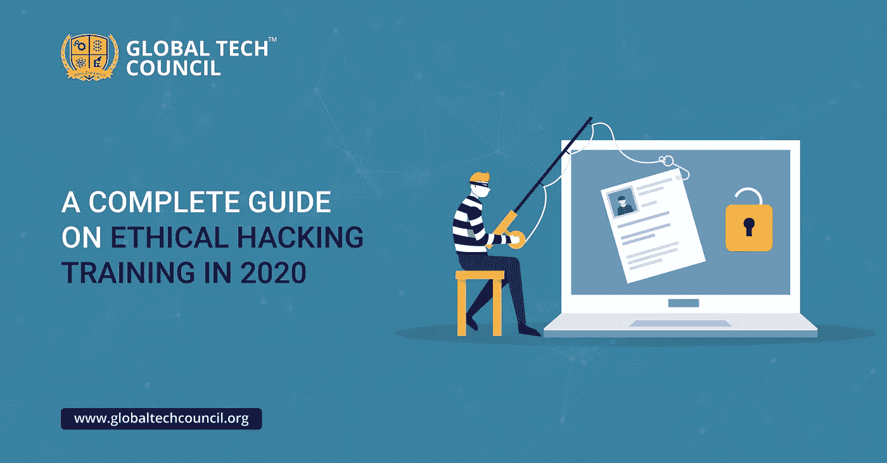

# 2020 年道德黑客培训完整指南

> 原文：<https://medium.datadriveninvestor.com/a-complete-guide-on-ethical-hacking-training-in-2020-405d46a94dc8?source=collection_archive---------12----------------------->

黑客一直有着负面的名声。像今天这样的时代，大部分数据都已上网，系统非常容易受到攻击，我们需要有助于保护数据的系统，同时使系统更加高效。您不希望您公司的数据被您的竞争对手访问，因此让网络安全专业人员为您工作是至关重要的。许多公司都在投资对员工进行 [**网络安全培训认证**](https://www.globaltechcouncil.org/cybersecurity-certifications/?utm_source=Article&utm_medium=31%2F03%2F2020&utm_campaign=GTC%20Off%20Page) ，以确保公司数据的完全安全。实现这一点的方法之一是由龚对员工进行道德黑客培训。你应该听说过白人黑客。这些都是积极参与网络安全小组，从而确保制定技术，最终有助于数据的安全。

在你继续了解道德黑客培训的细节之前，你必须知道什么是黑客，以及为什么公司投资雇佣认证白帽黑客是至关重要的。

基本上，黑客是以未经授权的方式进入数字鸿沟，即计算机系统。相同的有不同的应用，而钓鱼和数据黑客是恶意的；白人黑客参与保护公司的数据。黑客的工作是利用软件和设备的弱点和漏洞，并加以纠正。他们通常与高级管理人员密切合作。

**为什么道德黑客变得至关重要？**

恶意黑客对任何组织来说都是灾难性的。根据美国经济咨询委员会的报告，黑客攻击使美国经济在 2016 年遭受了 1090 亿美元的损失。数据泄露会给公司造成 386 万美元的损失；这项研究是 2018 年的。我们只能期待这个数字继续增长。

**你为什么要去考白帽黑客认证？**

如果你期待一份未来能给你巨大发展的工作，那么你必须寻找白帽认证是很重要的。有许多在线平台，如全球技术委员会，提供道德黑客培训和 [**网络安全认证**](https://www.globaltechcouncil.org/certifications/certified-cybersecurity-professional/?utm_source=Article&utm_medium=31%2F03%2F2020&utm_campaign=GTC%20Off%20Page) 培训。本培训将帮助您发展技能和技术，帮助您创建应对网络攻击的突破性解决方案。白色黑客是网络安全的一个重要组成部分，全球技术委员会特别强调创造认证的白帽黑客。

**如何成为认证白黑客？**

成为一个认证白帽黑客是一个伟大的职业选择，这将看到多倍增长。根据劳工统计局的说法，白人黑客的就业前景在 2014 年至 2024 年间将增长 18%左右。

 [## 认知计算——一套被广泛认为是……

### 作为它的用户，我们已经习惯了科技。这些天几乎没有什么是司空见惯的…

www.datadriveninvestor.com](https://www.datadriveninvestor.com/2020/02/19/cognitive-computing-a-skill-set-widely-considered-to-be-the-most-vital-manifestation-of-artificial-intelligence/) 

根据美国劳工部的说法，技术部门将在未来一段时间内迅速发展，因此，对网络安全专业人员和网络安全工程师的需求将会不断增加，因此道德黑客培训、网络安全培训认证将是提升自己技能的一个好方法。

如果你想成为一个认证的白帽黑客，那么你必须知道交易的诀窍；最简单的方法是注册认证白帽黑客认证计划。要报名参加这个项目，你必须了解它。你可以去参加同一个认证项目，或者有提供网络安全学士和博士学位的机构。

**一个白人黑客做什么？**

作为一个认证的白帽黑客，你需要提供设置反黑客攻击的对策。他们使用与白人黑客相同的方法对抗 sand 的漏洞。这些方法包括:

1.  社会工程
2.  病毒
3.  沃尔姆斯
4.  特洛伊人
5.  网络枚举
6.  SQL 注入
7.  拒绝服务
8.  暴力黑客

他们利用必要的网络攻击工具进入系统，或者创造自己的技术。这样，他们就可以解决系统中存在的问题。

**总结想法** —你是期待成为认证白帽黑客还是成为网络安全专家？如果是，那么您必须报名参加网络安全培训认证或 [**道德黑客培训**](https://www.globaltechcouncil.org/certifications/certified-white-hat-hacker-certification/?utm_source=Article&utm_medium=31%2F03%2F2020&utm_campaign=GTC%20Off%20Page) 。全球技术委员会的这些培训模块是按照行业标准设计的。这些培训模块在网上提供，您可以轻松注册参加该计划。

网络社会是时代的需要，随着越来越多的人现在沉迷于数字世界，需要有助于对抗系统脆弱性的系统和技术。因此，需要有经过认证的白帽黑客和网络安全工程师来提供他们的服务，使系统不会出错。如果你愿意成为一名认证的白帽黑客，那么你今天就必须联系全球技术委员会。