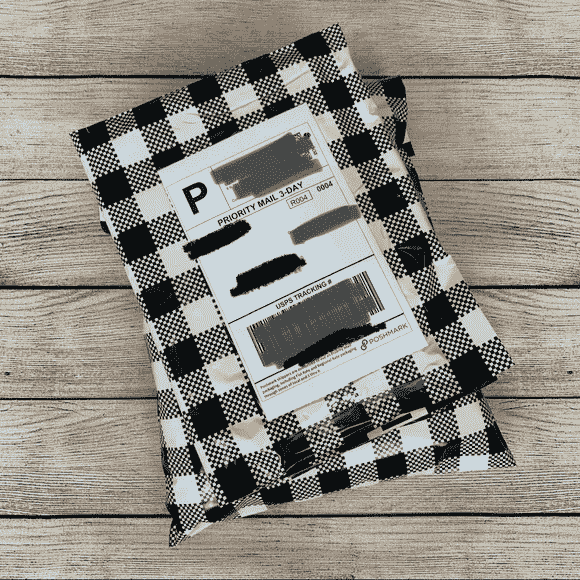

# 如何在 Poshmark 上出售你的衣服的完整指南

> 原文：<https://medium.datadriveninvestor.com/a-complete-guide-on-how-to-sell-your-clothes-on-poshmark-946de37bf157?source=collection_archive---------2----------------------->

## 我已经赚了 1054 美元，你也可以这么做

Photo by [Alyssa Strohmann](https://unsplash.com/@anotherlovely?utm_source=medium&utm_medium=referral) on [Unsplash](https://unsplash.com?utm_source=medium&utm_medium=referral)

2018 年 12 月我在**的 [Poshmark](https://poshmark.com/) 上开始卖我的衣服，当时我去父母家度假，发现我小时候的衣柜里挂了一大堆衣服。**

*不再合身的旧牛仔裤，大学的正式礼服，我为 DIY 万圣节服装买的随意的衣服，高中的帽衫…*

目光炯炯，尾巴浓密，我把所有东西打包，开车去最近的寄售店。我以为我坐在一座金矿上。我以为我会拿到奖金。女孩，我错了吗？

他们给我一分钱买我的东西。不，我在大学最后一年的新年前夜穿过的 BCBG 闪光短裙价值远远超过 75 美分。

我在谷歌上快速搜索“卖旧衣服”，找到了 Poshmark。几分钟之内，我开了一个账户，拍了一些我的 BCBG 闪光短裙的照片。几天后，它卖到了 15 美元！

我说的就是这个。我就是这样迷上的。

从那以后，我已经卖出了 **89 件物品**，总共赚了【1,054 美元。

现在，让我说:1000 美元不是一个小数目。尤其是当我卖的东西不一定是“时髦的”或当季的时候。有趣的是……这个应用上有超过 5000 万的奢侈品买家，你知道有句谚语“一个人的垃圾是另一个人的财富”

你衣柜里有别人想要的垃圾！！

如果你有多余的时间，你需要在 Poshmark 上出售你的旧衣服，把它们变成现金。

另外，推广可持续的时尚，清理你的衣柜，追求更简约的生活方式，也是一件好事！

*还有一件事——我知道有很多销售平台，比如*[*Facebook market place*](https://www.facebook.com/marketplace)*或*[*Mercari*](https://www.mercari.com/)*。*

**就我个人而言，我喜欢 Poshmark 是因为:**

*   该应用程序和网站都很容易使用
*   他们真的保护他们的卖家付款，退货，处理投诉等事情
*   预付费运输标签和免费的 USPS 盒子让运输变得不再令人头疼(买家支付运输费用！)

## 那么你准备好用你衣柜后面的旧衣服赚 1000 美元了吗？我们开始吧！

## 第一步。开户

下载 Poshmark 应用程序并注册一个帐户。

没必要过多考虑你的用户名。这应该不会影响你的销售，但要知道你只能更改两次用户名(这是 Poshmark 截至 2020 年 10 月的最新政策)。

一些用户名的想法:描述你的风格，你卖的衣服的类型，你的家乡城市，你的星座等等。

如果你想要 10 美元的购物信用，请随意使用我的代码' **极简海伦***'——如果你买东西，你会得到 10 美元，我也会得到 10 美元。*

## 第二步。给你的衣服拍些照片

这是**最**重要的部分。描述不好的好照片*会*卖。糟糕的照片即使有很棒的描述*也不会*卖。再读一遍。

你会想要找到一些好的照明(最好靠近有自然光的窗户)和干净的背景来拍照。

就像你和我一样，人们喜欢看到清晰明亮的照片，以确保他们购买的是最优质的商品。

**我推荐拍以下照片:**

*   正视图
*   后视图
*   品牌标签
*   尺寸标签
*   保养说明和材料标签
*   任何拉链、封口、花哨细节、图案等的特写。
*   *如果有任何损坏/瑕疵，请明确包括图片中的损坏/瑕疵！*

贴的图片越多，买家对购买越有信心。Poshmark 允许你上传 16 张照片，所以好好利用这些位置吧！我通常发布大约 5-8 个，取决于项目。

你可以直接在应用程序中拍照，也可以在相机应用程序中拍照，然后在稍后创建列表时上传。我更喜欢把它们从应用程序中移除，这样我就可以拍一堆照片并上传最好的照片。

如果你真的想让你的照片脱颖而出，你可以花不到 10 美元购买一个背景。

Just lay everything on the ground and add a nice prop! Voila, it’s so professional!

亚马逊链接: [KonPon 木质背景墙摄影背景黑胶背景墙木地板摄影背景影楼摄影道具背景 KP-082](https://amzn.to/3o0700b)

## 第三步。创建时尚标志列表

任何 Poshmark 列表都有三个关键部分:

1.  照片
2.  标题和描述
3.  定价

**照片:**当你上传照片的时候，要确保它们都按照正确的方向旋转，并且符合逻辑流程(前视图- >后视图- >细节)。

**标题&描述**:你应该尽量主动回答买家点击房源时可能提出的任何问题。尽可能具体。

*下面是标题的快速模板:*【品牌】【颜色】【款式名称】【服装类型】(尺码)

提示——如果你能在谷歌上找到该品牌的准确商品名称，请在标题中注明。人们可能正在寻找它！

*下面是我通过研究其他成功销售拼凑出来的描述格式:*

在描述的第一行重复标题(不要问我为什么，显然这提升了 SEO 算法)。

包括尺寸、材料、(*可选*)尺寸、状况等细节，以及一系列关键词！问问你自己，'【T6]如果我正在寻找这样一件物品，我会搜索什么词？再次强调，这将有助于搜索。

定价:这里的黄金法则是给你的商品定价，比你的预期价格高出 20-30%。我会在下一步解释原因。

*其他一些定价考虑:*

*   对于所有低于 15 美元的销售，Poshmark 收取 2.95 美元的固定佣金。对于 15 美元或以上的销售额，Poshmark 的佣金是 20%。确保你在定价时考虑到这一点。
*   你不应该为你的收入缴税，因为从技术上讲，你是在承受出售个人物品的损失。从理论上讲，你购买物品的价格高于你的售价，所以你没有“获利”。一旦你开始从销售中获得真正的利润，你应该咨询税务顾问。(我不是税务顾问，也不是理财顾问)。
*   如果你不知道如何给你的物品定价，那就对 Poshmark 上出售的类似物品做一些研究。只需在应用程序中搜索你的商品，并通过“已售商品”过滤“可用性”这应该会让你更好地了解人们愿意为你的商品支付多少钱。

要查看实际的 Poshmark 列表，请查看我最近出售的一个列表[这里](https://poshmark.com/listing/Lucky-Brand-black-Lolita-Capri-skinny-jeans-5ef78b1188cce3b29507d287)！

## 第四步。分享你的衣柜，向买家出价！

Poshmark 的平台对所有卖家都是平等的。那意味着新卖家(像你！)和经验丰富的卖家(像我，*有点*)在搜索中得到同样的认可。这完全取决于我们“分享”物品的频率。

Poshmark 不列出促销商品，也不按畅销商品排序。相反，默认设置是按“共享”项目排序，这为所有向潜在买家展示的物品创造了平等的机会。

每次我们通过点击“分享”图标来分享我们的项目时，它会将项目带到列表搜索类别的顶部。如果有人在你的列表标题或描述中搜索任何关键字，它也会显示出来。

所以经常分享！或者一天一次，如果你是个忙碌的人。

*专业提示:在 Chrome 或 Safari 应用程序中登录 Poshmark 网站，以便更快地分享！*

一旦买家“喜欢”你的商品，你就有了一个潜在客户！！

平台上的大多数买家都希望你对商品提供折扣，这就是你的*优于*定价派上用场的地方。你已经把折扣算进去了。

私下向喜欢你的人提议，等待他们的回应。这是最有效的销售方式，因为“折扣”是*立即购买的心理诱因！*

为此，请点击你的列表->选择“报价/降价”->选择“向喜欢者(私人)报价”->并降低价格！你还必须对运费打折，以使报价对买家更有吸引力。同样，这应该是你的原始上市价格。

## 第五步。卖出出货！

如果报价足够诱人，那么你就有了一笔买卖！耶！

这是**好玩**的部分。

买家支付统一运费标签，所以你不需要担心。或者你可能已经把它算进了你的折扣中。无论哪种方式，只需打印标签，你就可以走了。

要打包物品，您有三种选择:

1.  **重复使用旧包装:**这可能是最好的选择。这是可持续的，没有麻烦，你没有成本。将您的物品包装在任何用过的包装信封/盒子中，并将运输标签贴在任何旧标签上！
2.  **USPS 优先邮件供应:**第二个最佳选择是从 USPS 获得免费包装。材料成本已经包含在运输标签价格中。你可以去邮局拿这些箱子，或者免费订购送到你家。
3.  聚邮件信封:如果你打算卖很多衣服，如果你对美学感兴趣，我建议你在网上买一些信封。你可以花 15 美元左右买到 100 个信封。

These are the envelopes I use! So cute!

亚马逊链接: [100 支——10 英寸 x 13 英寸，黑色格子聚乙烯信封，带自动密封条的邮寄包装袋](https://amzn.to/2GWZliA)

你不需要用任何薄纸包起来或者附上一封感谢信。这些都是很好的接触，但它是可选的！只要确保小心密封你的包裹，买家就会很高兴。

要运送物品，你应该能够把它放在你的邮箱里，让你的邮差去取，或者你可以快速去趟邮局。

PS——买家收到物品后，你会收到付款！

就是这样！

在 Poshmark 上销售真的是一个简单的过程，一旦你开始使用它，就会有很多乐趣！知道我以前喜欢的衣服将找到一个新家，我总是很温暖。我能拿回一些钱。

除了卖衣服，Poshmark 还是卖手袋、珠宝和其他配饰的好地方。他们还迅速扩展到其他类别，包括家居装饰和美容保健。考虑所有你能卖的东西！

祝你好运！就像他们在时尚马克上说的，“时尚快乐！”

如果你有任何问题，你可以在 insta gram @ the . money minimal 上找到我——给我发个 DM！

链接到我的衣橱@极简海伦[这里](https://poshmark.com/closet/minimalisthelen) ❤

*披露:#affiliatelink 作为亚马逊的合作伙伴，如果你选择从本文中包含的链接购买，我可能会从合格的购买中获利。*