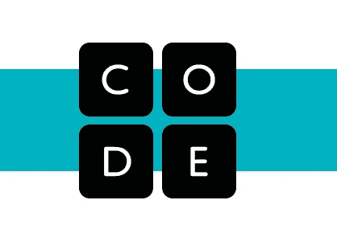

# Code.org 创始人兼首席执行官哈迪·帕托维的经验教训

> 原文：<https://medium.datadriveninvestor.com/a-conversation-with-code-org-founder-ceo-hadi-partovi-14a345b0ca0f?source=collection_archive---------20----------------------->

## (采访)给希望改变世界的新晋企业家的建议

# 开端

2020 年底，我有幸采访了 Code.org[的联合创始人兼首席执行官哈迪·帕托维。Code.org 是一个全球性的非营利组织，致力于扩大计算机科学的参与。Hadi 已经为**超过 7 . 2 亿学生**提供了超过 10 亿小时的计算机科学教学，他与 Code.org 一起努力确保公平获得计算机科学。作为一名高中生和初露头角的企业家，我渴望解决无障碍教育中的紧迫问题，我想听听哈迪对年轻人如何创建积极改变世界的公司的看法:为社会公益创业。](http://code.org/)

Source: [Code.org](https://code.org)

# 代码。（同 organic）有机

对于那些不熟悉的人来说，哈迪·帕托维是 Code.org 的创始人，这是一个非营利组织，旨在通过吸引年轻女性和其他在计算机科学领域代表性不足的群体来扩大学校对计算机科学的了解。Code.org 设想的未来是，每个学生都将计算机科学作为其 K-12 教育的核心部分。自 2013 年以来，Code.org 已经成为美国 K-12 CS 课程的领先提供商。这包括 Code.org 的“一小时代码”计划，该计划吸引了全球超过 15%的学生，其中 40%的美国学生拥有 Code.org 账户。

 [## 今天学习，建设更美好的明天。

### CS 比以往任何时候都重要。让我们建立我们想要的未来。# CSforGood

code.org](https://code.org) 

除了 Code.org，哈迪还在微软担任过高管；创办了两家创业公司，Tellme Networks(被微软收购)，iLike(被新闻集团收购)；并在脸书、Dropbox、airbnb 和优步等科技初创公司担任顾问或投资者。

在采访中，哈迪和我谈到了是什么让 Code.org 如此成功，如何利用企业家精神造福社会，以及给初露头角的企业家的一般建议。这里是我们讨论的一部分，供其他人了解他的故事，甚至为他们自己的企业获得一些洞察力。完整的采访记录可从[这里](http://txt.do/18ajv)获得。

# 采访

## 你的童年是什么样的？它是如何为你的创业生涯做准备的？

> 我的童年在很多方面都与普通美国孩子很不一样。我在中东的血腥伊斯兰革命和血腥战争中长大。那部分显然很不一样。白天，我生活在一个警察国家，每天我都担心当局会因为不知道什么原因逮捕我自己、我的兄弟或我的父母。我的父母可能会消失在监狱里，我再也见不到他们了。当我们的邻居被轰炸时，我们每天晚上都呆在地下室，我们希望我们的家不会被炸。我童年的大部分时间都在担心我的生活，担心我能否见到我的家人。这和大多数人的生活很不一样。

> *作为一名企业家，你需要愿意放弃一份稳定的工作，希望从无到有创造更多。*

> *经历创伤、压力、恐惧和移民都让我为创业做好了准备，因为我知道杀不死我的东西会让我变得更强大，我有很大的动力为自己创造更好的生活。我认为这是很多企业家的共同经历。抛下一切，离开一个国家去另一个国家，这让我觉得冒险很舒服。作为一名企业家，你需要愿意放弃一份稳定的工作，希望从无到有创造更多的东西，这非常类似于离开一个你已经有房子和生计的国家，让你的整个家庭背井离乡，去一个你一无所有的新地方——希望那里会变得更好。*

## 你最初是如何接触到计算机科学的？

> 大约 9 岁的时候，父亲给我们介绍了一台 Commodore 64 电脑。那是在 20 世纪 80 年代早期，我父亲是核物理学家，母亲是计算机科学家。所以，即使我们在战争期间在中东的伊朗长大，我们都有机会使用电脑，知道如何进行电脑编程的父母会在这一路上帮助我们。他们给我们的电脑上没有任何应用程序或游戏，所以我们唯一能做的就是编写自己的应用程序。战争期间生活在这样一个可怕的环境中，当时没有其他好事情可做，所以我们把时间和精力投入到学习如何编码上——做出我们能想到的任何东西。尽管我们外面的世界是相当黑暗和令人沮丧的，但计算机代表了这样一种机会，如果你能梦想它，你能编码它，那么你就能让它变成现实。

> 如果你能梦想到它，你能编码它，那么你就能让它成真。

> 随着年龄的增长，我意识到我在童年时学到的技能将会成为生活中最重要的技能之一。我开始在科技公司实习，因为我意识到他们非常需要有编程和计算机科学技能的人，他们会雇佣一个 15 岁的移民。当时，我喜欢计算机科学，不仅因为我可以用它做任何我想做的东西，还因为，在我需要钱的时候，这是一份真正高薪的工作。

## 你第一次决定要改革 CS 教育是什么时候？

> *我首先要说的是，自从大学以来，我就开始思考为什么计算机科学不是核心的一部分？为什么每个人都要求学习数学？每个人都必须学习一定程度的科学，每个人都必须学习一些外语，为什么计算机科学不是必修的？这是我决定从事的职业，但我也意识到它有很多好处。不仅仅是职业利益，仅仅是理解技术世界是如何工作的看起来和理解历史、科学或数学世界一样重要，然而这些其他的东西是必须的，但是计算机科学不是。*
> 
> *我想做些事情来回报社会，因为我从所受的教育中受益匪浅。一路走来，我受益于这么多的帮助，我想知道我能做些什么来回报。这对我来说是个人的，给其他学生一个像我年轻时一样学习计算机科学的机会似乎是回报的正确方式。这就是我创办 Code.org 的时候。*

## 你获得了哈佛的计算机科学学位。你在哈佛的经历是如何开启你的创业之旅的？

> 计算机科学的一个美妙之处在于，即使你不上大学，它也是你仍然可以擅长的领域之一。事实上，当今世界上一些最著名的计算机科学家都是大学辍学生，他们决定自己学习。至于是比尔·盖茨、史蒂夫·乔布斯还是马克·扎克伯格，这些人都是从学习计算机科学开始，然后决定“我要自学，不去学校。”
> 
> 即使你不是一个亿万富翁企业家，也有很多人仅仅靠自己的努力就在计算机科学上取得了巨大成就。如果你掌握了这些技能，即使没有大学文凭，你也很少有机会在其他领域大展拳脚。这是因为计算机科学方面的技能非常抢手。但是，不管怎样，我的学位对我的帮助是，它帮助我在微软找到了第一份工作，也帮助我与我后来依赖的许多其他人建立了联系——无论是未来的投资者还是我在我创办的公司招募的未来的人。我在大学建立的网络真的很有用，对于任何想成为企业家的人来说，建立一个关系网并维护和培养这些关系是作为企业家你能做的最重要的事情之一。

## 在微软的技术领域取得成功后，你创办了两家初创公司:Tellme Networks(被微软收购)和 iLike(被新闻集团收购)。你在营利性公司的经历是如何推动你改革教育的？

> *你知道我学到了什么？无论是创建自己的创业公司，在微软工作，还是为科技界的其他企业家提供建议，每家科技公司都面临同样的问题。如果你问任何一个经营科技公司的人，他们生活中最大的 3、4 个问题是很难找到拥有计算机科学技能的优秀人才。*

> *世界上没有一个城市和国家的计算机程序员供大于求。*

> 我看到这一点是因为，无论是我自己创业，还是我投资和建议创业，或者当我在大公司工作时，这个问题都围绕着我。我意识到，如果这项技能如此抢手，为什么我们的学校不教它呢？
> 
> *所以我意识到，我能帮助人们也能帮助经济的最好方法之一就是提供一个教育途径，给那些还没有机会获得未来职业机会的学生。*

## 40%的美国学生拥有 Code.org 账户，创建了 1.24 亿个项目，全球 15%的学生参与了“一小时代码”项目。你有没有想过 Code.org 会变得这么大？

> *不！我万万没想到，这种发生在我身上的想法会发展成具有全球影响力的东西。这超出了我的想象。当我创办 Code.org 时，我制作了一个关于计算机科学重要性的视频，我希望这个视频能吸引几百万人。最终，我们获得了 1500 万的浏览量，这太棒了。虽然一个视频获得了 1500 万的点击量，这对 Code.org 来说是一个伟大的第一幕，但我真的不知道接下来会发生什么。但重要的是，在观看我们第一个视频的 1500 万人中，有数万名教师认为这对他们的学生很重要。*

> 这超出了我的想象！

> *我从来没有想象过 Code.org 会对学校教师产生怎样的影响，这些教师决定自己要有动力去改变教育，并有机会在全球范围内改变教育。在世界上的每一个国家，都有人把 Code.org 介绍到他们的课堂上。世界上没有一个城市的学校或地方没有使用过 Code.org。这看起来太棒了，超出了我最大的梦想。*

## 你认为是什么让 Code.org 如此成功地影响了数百万学生？

> *答案只有一个字:教师。从一开始，我们在 Code.org 打了一个赌，改变教育的唯一途径是通过教师。Code.org 现在有将近 150 万名教师。他们的热情，他们做出的牺牲，他们承担的教授一门他们从未学过的学科的风险，向他们的学生介绍他们自己在学校从未学过的计算机科学的风险，Code.org 的每一位教师所承担的风险是什么让我们如此强大。他们为孩子们做一些事情的热情，他们知道这将是打开机会之门的正确的事情。*

> 这就是我们成功的原因，我们很幸运有这么多老师支持我们的愿景。

> 这真的成为了一场由教师主导的改变教育课程的运动，教师们应该得到最大的掌声和最大的荣誉。

## 你已经在改革计算机科学教育方面取得了巨大的成功。你的下一步是什么？

> 我认为下一步是继续这项工作。这项工作在美国还没有完成:只有 47%的学校提供计算机科学课程。这比我们开始时的 10%有所上升，但是大多数学校仍然不教授计算机科学——而且是在这个国家。在世界其他地方，超过 90%的学校不教计算机科学。还有很长的路要走。我们已经取得了初步的成功，但工作还远远没有完成。即使在教授计算机科学的学校，学生也主要是白人、亚洲人或男性，而多样性——获得计算机科学平衡代表性的挑战——也远未完成。我们的工作还没有完成，直到每所学校都教授计算机科学，男孩和女孩之间，跨越种族、地理和收入水平达到平等。至少在谁有机会和谁得到最基本的教育方面。

## 对于希望让世界变得更好的年轻企业家，有什么最后的建议吗？

> *我给你的一个建议是要有远大的梦想。当你还是个小孩子的时候——当你 5、6 岁的时候——你的梦想是无限的。真的，创业是一种挑战和主动决定“什么？去他妈的。即使机会对我不利，我也要干一番大事业。”没有一个企业家不去挑战关于什么是可能的和比这更大的梦想的常识。*

> *每个企业家都必须想象一个尚不存在的世界。*

> 做和我作为移民时一样的事情，离开一个国家去一个新的国家。决定他们要去探索这个未知的领域，那里有风险，失败的可能性比成功的可能性大得多——但他们无论如何都要去尝试。追求远大的梦想是我给你的最好建议。

# 所以基本上，…

adi 的成功在很大程度上归功于他早期对计算机科学的接触。通过认识到其他人不一定有他在计算机科学方面的教育，他看到了他可以改进的地方——他做到了。他的建议是:挫折让你变得更强大，计算机科学的职业生涯不依赖于正规教育，老师允许教育目标变成现实，最后，**大胆梦想！**