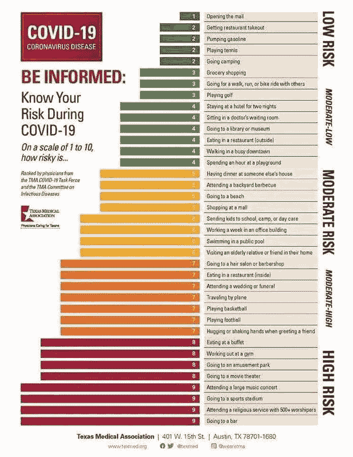

# 否认者得到承认

> 原文：<https://medium.datadriveninvestor.com/a-covid-denier-gets-covid-62151e21b020?source=collection_archive---------8----------------------->

消息传出，一点也不意外。巴西总统雅伊尔·博索纳罗感染了 COVID。这很重要，因为他从一开始就淡化了病毒。他并不孤单。这是全世界民粹主义者的一个特点。英国首相鲍里斯·约翰逊(Boris Johnson)在重症监护室呆了一段时间，似乎改变了态度。博尔索纳罗坚持认为，就像美国的唐纳德·川普和墨西哥的曼努埃尔·洛佩斯·奥夫拉多尔一样，这并不比流感更糟糕。太夸张了，没那么致命。(这也包括美国的州长。)这个诊断应该是对美洲其他两位国家领导人的一个警示。三人中，博尔索纳罗最不可能死，因为他最年轻。像特朗普一样，他也服用了羟氯喹，他可能会认为这是他生存的原因。

 [## 你的创业公司 Covid 证明了吗？数据驱动的投资者

### 在经历了漫长的封闭期后，世界正开始重新开放其经济。还不清楚这是否会持续下去，但是…

www.datadriveninvestor.com](https://www.datadriveninvestor.com/2020/05/25/is-your-startup-covid-proof/) 

由于他比唐纳德·特朗普(65 岁)年轻，无论他是否服用未经批准的药物，他都有更好的机会幸存下来。他可能会有许多幸存者报告的一些后遗症。有些是神经方面的，有些涉及肾脏，他可能会患上糖尿病。无论是巴西人还是我们其他人都不会得到这些必要的信息。没人指望巴西利亚会透明

博尔索纳罗不会承认他称之为温和是错误的。这是他心理素质的一部分。在美洲，他与墨西哥的曼努埃尔·洛佩斯·奥夫拉多尔和美国总统唐纳德·特朗普分享了这一点。两个人都拒绝认真对待。他还与世界各地的其他民粹主义领导人分享了这一点。这是强者的特质。不管他们在政治上是极右还是极左。

我们所经历的还有另一个方面。这三位国家领导人都相信经济是神圣不可侵犯的，让鱼雷见鬼去吧。如果有人死了，就这样吧。这就是为什么特朗普和他在州长层面的一些盟友声称美国目前的飙升没有发生。佛罗里达州的罗恩·德桑蒂斯甚至声称曲线是平坦的，哦，更不用说他所在州的峰值了。他在早间新闻发布会上漫不经心地提到了罕见的 30 到 40%的积极性。这是非常高的，事情已经在国家退化。在这一点上，他拒绝释放重症监护室 COVID 病床，并仍然有一个关于病毒的危险态度。他在为一个人演奏，美国总统。

墨西哥联邦政府也在做类似的事情。我猜如果我们不测试，就没有疾病。即便如此，仍有一些测试显示病毒感染率在上升。尽管死亡率不断上升，但奥夫拉多尔拒绝关闭国际机场等设施，因为这会影响经济。他担心对穷人的影响。他确信经济先于疾病。

顺便提一下，预计墨西哥经济今年将收缩 4%。它已经陷入衰退。如果这听起来很熟悉，为了保持经济开放，特朗普和一些州长也是这种态度。也许他们希望人们对数字变得麻木，并“学会与病毒共存”

巴西也看到了同样的行为。随着阳性率的上升，巴西总统也拒绝关闭。州长们做到了，市长们也是。然而，现在他们正在开放，并将看到我们在美国看到的同样的情况。博尔索纳罗是真男人，记住，真男人，也不要戴面具。他的最高法院命令他这样做。更重要的是，法院不得不命令政府[公布关于病毒的数据](https://www.washingtonpost.com/world/the_americas/brazil-coronavirus-bolsonaro-case-death-supreme-court/2020/06/10/128f3b1a-ab21-11ea-94d2-d7bc43b26bf9_story.html)。缺乏透明度并不仅限于巴西。

墨西哥捏造了这些数字，并拒绝做适当的测试。不用说，我想群体免疫是目标。就像很多美国南部州一样，特别是得克萨斯州和佛罗里达州，非典型肺炎的诊断很可能是 T4 病毒。肺炎导致的过多死亡不是人为因素。我们有三位民粹主义领导人，他们是在一系列虚假承诺的基础上当选的，包括我们几十年未见的经济增长。对这三个人来说，关闭经济是对他们个人领导力的攻击。

这三个人对科学的理解也很差，不信任权威，他们凭直觉统治，他们不喜欢任何人反驳他们。他们是强硬的关键人物，比专家更了解情况。为什么三人连最基本的自我保护都不肯做。社交距离和面具是为娘娘腔准备的。他们以这种姿态为荣。它显示了力量，对他们的基地来说，确实如此。为什么他们的基地拒绝戴口罩和取笑社会距离，那是直到一个家庭成员得到病毒和死亡。然后就变得很真实了。

奥夫拉多尔坚持他与墨西哥州的战争。这是他排干沼泽的版本。为了做到这一点，他实施了严厉的紧缩计划，削弱了医疗系统的应对能力。这个项目已经减缓了经济，所以至少他可以把衰退归咎于病毒。在医院需要资金的危机中，他坚持建造他的玛雅火车、一座炼油厂和圣塔卢西亚机场。最后一次是在暂停已经在建的国际机场建设之后。像病毒一样，他拒绝专家的建议。

特朗普也是用同样的布做成的。他的全部意图是开放经济，因为像 Bolsonaro 和 Obrador 一样，他们相信 40 岁以下的人是不可战胜的。这也意味着群众也相信这一点，并表现得好像他们是。更不用说一些人已经死了，他们把疾病带给了其他人。对这些人来说，经济是唯一重要的事情。这些人没有考虑到的是，恐惧与经济息息相关。我们现在正在经历这种情况。人们不再涌向餐馆、商场甚至健身房。为什么？很少有人相信这样做是安全的。当我们看到地方和州政府再次关闭他们的经济，这将增加这种非常合理的恐惧。

所有这些都可能导致这三个国家的内部动荡。在美国，我们正在经历这种呼吁开放各州和忽视公共卫生官员的建议。一些示威游行包括全副武装的人进入政府大楼。

在墨西哥和巴西，我们在喧嚣中看到了人们对他们的领导人也不满意的信号。当足够多的死亡来临时，流行病会导致社会动荡，经济无法反弹。缺乏有能力的领导是原因之一。我们在美国、墨西哥和巴西看到了这一点。我们可以希望 Bolsonaro 在这条通往 COVID 的道路上有他的耶稣降临时刻。在某种程度上，约翰逊做到了。

**进入专家视图—** [**订阅 DDI 英特尔**](https://datadriveninvestor.com/ddi-intel)