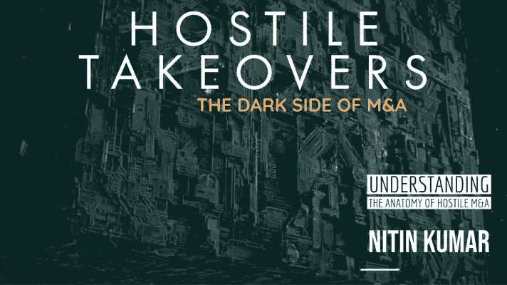
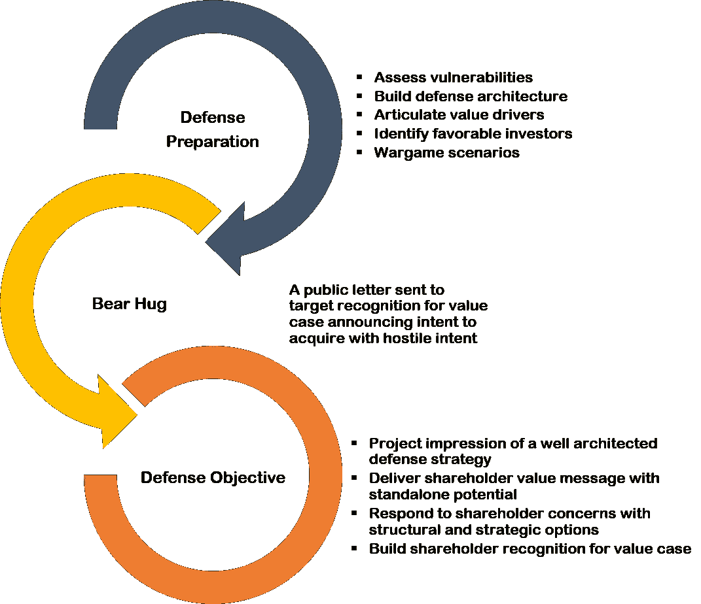
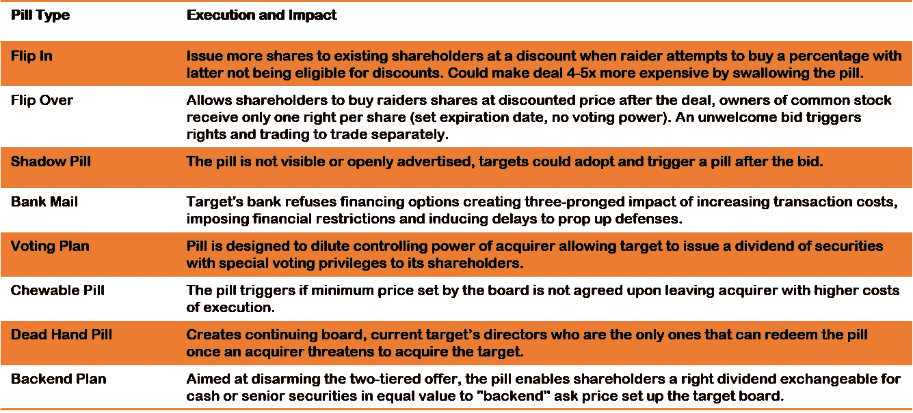
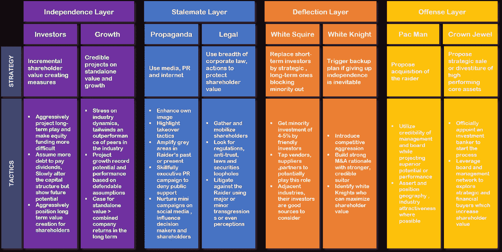
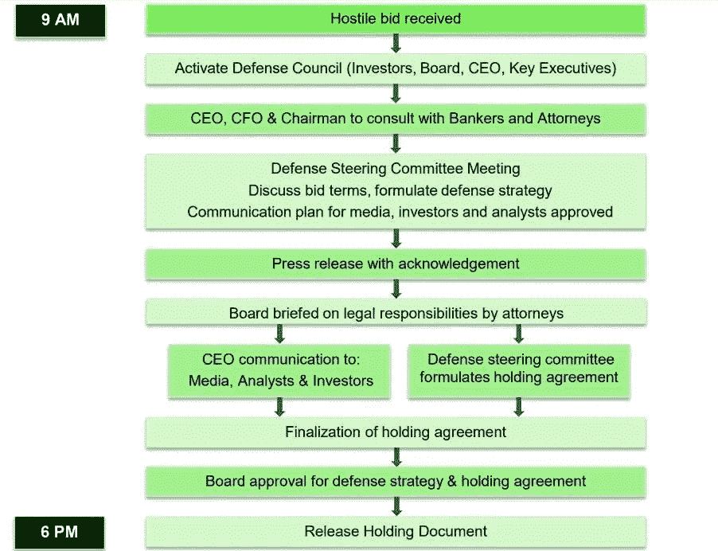

# M&A 恶意收购速成班

> 原文：<https://medium.datadriveninvestor.com/a-crash-course-on-hostile-takeovers-in-m-a-256831f91675?source=collection_archive---------20----------------------->

Image by author using Pixabay

恶意收购的剖析、进攻和防御策略

几十年来，敌对的 M&A 一直是交易领域的一部分，在 20 世纪后期尤其流行。事实上，也许你已经听说过美国在线-时代华纳恶意收购，英博和安海斯-布希恶意收购，或者最近赛诺菲-安万特收购健赞公司背后的肥皂剧般的故事。

尽管这些收购吸引了媒体的大量关注，但在 M&A 世界，敌意收购通常是一个不为人所知的领域。通常，现金充裕的大公司会试图收购一家有前途的公司，以提高自己的地位，或者干脆扼杀竞争。然而，公司和从业者必须记住，无论是敌意还是友好，最终都必须创造股东价值。本文将探讨在敌意并购中部署的几种攻击和防御策略

# 介绍

在敌意收购中，收购方可以利用多种机制，如代理权争夺和要约收购。相反，有多种机制，如毒丸和皇冠上的宝石，目标将用来作为防御手段，试图阻挠敌意收购。

# 什么是敌意收购？

> 在[合并&收购(M & A)术语](https://dealroom.net/resources/ma-glossary)中，敌意收购是收购方违背目标公司董事会的意愿，直接向目标公司的股东进行收购。敌意收购一般是在正式要约被拒绝后发起的，多适用于规模较大的上市公司。

**了解敌意并购的双方对公司和从业者都有好处。**

# 经营现实

即使是潜在的敌意收购威胁也会导致目标公司的董事会部署“杀人蜂”并发展反收购防御。然而，明确保护谁、何时以及如何保护是一个关键的考虑因素。法院通常希望平衡股东和管理层的利益，但这并不总是可能的，而且事情往往倾向于以股东为代价保护管理层。股东还向惠普和布里斯托尔等公司的董事会施压

迈尔斯·施贵宝削弱了他们的反收购防御措施，以确保天平不会只向公司管理层倾斜。所有上市公司一般都会通过采用股东权利计划来部署至少一种反收购机制。

# 敌对 M&A 的攻击媒介

当涉及恶意收购时，有一些众所周知的攻击技术。一般来说，收购者首先会发出一封意向书，以高于市场的价格收购公司，通常被称为“T2 熊抱”让我们来看看几个倾向于遵循“**熊抱**:”的接管技巧

*   **黎明突袭。**拂晓突袭是掠夺者收购者以高于先前市场水平的价格突然进入股票市场，目的是在很短的时间内获得主要股份。通常，黎明突袭会在几天内导致进一步的收购要约或行动。
*   **立足收购。通过在公开市场上购买目标公司的股票，初步收购让收购者有机会起诉目标公司。**
*   **投标报价。**对目标公司股东的溢价收购被称为要约收购。要约收购需要一个双轨尝试:一个前期收购要约和第二个收购意向要约。此外，它们是公开宣布的。虽然要约收购通常被认为是一种敌意收购技术，但如果旨在创造股东价值，它就不是敌意收购，这通常会导致交易获得批准。
*   **匍匐要约收购。**要约收购有一种变体，称为“爬行要约收购”，收购方在此期间开始以市场价值购买目标公司的股票，直到达到控制阈值。这是一个比要约收购或突袭更为渐进的过程。此外，它的实施成本更低(即没有额外的购买价格)，但如果没有达到控制阈值，则失败的风险更高。
*   **代理打架。**这种技巧会诱使股东代理人投票选举董事会中的反叛董事，甚至投票淘汰当前的董事会，目的是最终任命*新的*管理层和支持该交易的董事会成员。代理权争夺战通常是通过接洽分别持有大量股份的股东来完成的。代理权之争也可以增加董事会成员的数量，他们可以影响投票决定。

> 惠普与康柏的交易价值 250 亿美元，然而惠普在广告上花了很大力气来影响股东。
> 
> 惠普面临着来自创始成员和一些反对这一想法的高权力股东的抵制。
> 
> 51 %的股东投票赞成合并，交易按计划进行，尽管有人试图以法律为由拖延时间。

# 设计有效的攻击策略

针对恶意收购的有效攻击策略包括组织自己，了解目标，评估法律陷阱，准备武器库，解除防御，最后使用上述方法之一发起攻击。

*   组织自己。首先，我们必须问一个最重要的问题——除了昂贵且耗时的敌意收购之外，是否已经探索并尝试了所有其他方法？妥协、权衡、风险和机会都需要很好地理解，并且必须起草明确的计划来解决无法进行适当的尽职调查和/或获得目标合作的问题。
*   **了解对手。**需要对目标进行复杂的理解(例如，股东、管理层、董事会成员、防御机制、公众情绪和杀人蜂能力)。这将有助于确定潜在攻击的时间、成本和资源，并确定要部署的攻击媒介。
*   **评估法律陷阱。**所有其他事情就绪后，必须对法律、监管、投资、出口和国家特定事项的限制有深入的了解；还必须创建战术缓解计划，以解决诸如控制变更和加速选项等项目。
*   **准备兵工厂。**所有先前阶段都通知了投标库。它包括设计有效的公关/媒体活动、动员所需的专业人员(即律师和顾问)以及对投标时机进行压力测试。常见的做法是尽早完全或部分锁定支持协议。
*   **解除防御。如何解除目标的潜在防御？最佳实践包括:采取措施实现股东价值最大化，收紧安排以避免违反目标公司董事会的信托责任，启动各种防御机制并制定应对策略。此外，明智的做法是制定反稀释条款并进行测试。**

最后，为你的交易选择正确的攻击策略，并进行一次军事演习来测试所有的假设。

# 敌意收购脆弱性评估

*   ‍ **战略吸引力。**公司的战略吸引力取决于几个因素，包括不断变化的行业动态(整合)、经济周期、时机、颠覆性技术或知识产权的吸引力、其他潜在投标人、与收购方的战略契合度和/或薄弱的管理团队。当然，还有其他因素，比如对尽职调查的需求有限，也可能成为漏洞。正如你所看到的，战略方面需要在可能的敌对方法的背景下不断地被监控和理解。
*   **估值疲软。**与同行或自身历史相比较低的估值，加上信用影响、资本结构、较弱的管理团队和宏观经济条件，可能会使目标容易遭受恶意收购。货币波动和供应商风险增加等其他因素也会导致估值相关的漏洞。
*   小额股票交易数量大幅增加
*   公司高管或董事会成为负面宣传的受害者
*   寻求文件的小股东突然增加
*   其他公司面临敌意收购或黎明突袭
*   主动出售股票的增加
*   寻求客户、债权人和股东信息的检查随机增加
*   激进投资者圈子中的特定活动，著名的袭击者等。

虽然全面的漏洞评估可能是一项艰巨的任务，但企业对恶意收购的漏洞也在不断变化，需要不断分析。它们大致分为三个领域:

除了上述领域，公司还应注意市场上具体的敌意收购模式。很多时候，这些都是恶意收购的早期预警信号。下面是一个不完整的列表:

# 敌意收购防御

总的来说，进行敌意收购的公司比接受收购的公司要少；因此，历史上有更多的方法来防御这些企图。防御机制由组织通过使用专业杀人蜂和定期测试来设计和部署。

有多种防御战略和战术串联或独立部署；它们可以分为预防性防御、积极防御、规避策略、自杀性防御和攻击性防御。虽然每一个都有不同程度的风险、影响和生存几率，但组织通常会将这些因素结合起来。

Image by author

# 1.预防性防御

*   使用交错董事会协议，概述每年只能选举三分之一董事会成员的规定。这需要得到股东的批准才能实施，而且分级董事在任期届满前不能被免职。
*   设计绝对多数条款，要求至少 80%的投票股东批准收购，而不是简单的 51%多数。这是有效的，因为它可以使敌意收购成为掠夺者的一场硬仗。
*   通过修改公司章程，使用公平价格条款作为较弱的防御手段，要求收购方至少以公平市价向少数股东支付公司股票，通常以市盈率的形式支付。

预防性防御旨在降低恶意收购在财务上成功的可能性，使其更加困难。它们是早期预警信号、严格控制或协议以及被称为“毒丸”的基于事件的触发器的组合。让我们更详细地检查其中的几个，以便更好地理解它们。

*   使用名为“防鲨剂”的条款来触发股票交易所的变更控制，以此作为一种威慑。
*   管理和监控股东组合和交易模式或异常情况，作为预警信号。
*   对注册和债务进行更严格的控制。
*   设计黄金降落伞，即股票所有权的变化会给高管带来好处。
*   采用双重资本结构，即不同类型的股票有不同的投票权

 [## SpaceX vs 维珍银河——太空旅游业务主导地位的竞赛|数据驱动的投资者

### 只有 566 个人去过太空。这些人 85%以上来自三个民族。超过一半的…

www.datadriveninvestor.com](https://www.datadriveninvestor.com/2020/11/25/spacex-vs-virgin-galactic-the-race-to-a-space-tourism-business-dominance/) 

## 1.1 公司章程修正案

*   使用交错董事会协议，概述每年只能选举三分之一董事会成员的规定。这需要得到股东的批准才能实施，而且分级董事在任期届满前不能被免职。
*   设计绝对多数条款，要求至少 80%的投票股东批准收购，而不是简单的 51%多数。这是有效的，因为它可以使敌意收购成为掠夺者的一场硬仗。
*   通过修改公司章程，使用公平价格条款作为较弱的防御手段，要求收购方至少以公平市价向少数股东支付公司股票，通常以市盈率的形式支付。

## 1.2 严格控制

*   使用名为“防鲨剂”的条款来触发股票交易所的变更控制，以此作为一种威慑。
*   管理和监控股东组合和交易模式或异常情况，作为预警信号。
*   对注册和债务进行更严格的控制。
*   设计黄金降落伞，即股票所有权的变化会给高管带来好处。
*   采用双重资本结构，即不同类型的股票有不同的投票权

## 1.3 毒丸

这些是由公司设计的，通过降低股票对收购者的吸引力来“毒害”交易和阻止敌意收购者。1982 年，为了保护埃尔帕索电气公司免受通用美国石油公司的侵害，人们首次发明了毒丸；事实上，第一种药丸是布朗·福尔曼在 1983 年对抗鲁诺时使用的。随后，许多变种的毒丸已演变和部署。下表概述了这些药丸的主要特征、执行条件和影响。

Image by author

# 2.积极防御

主动防御只有在出价之后才会被触发。考虑到这一时机，它们会更加被动、昂贵和冒险。主动防御还会带来更高的机会成本，这让高管和董事会非常分心。

## 2.1 诉讼

对恶意收购者提起诉讼，以拖延收购，增加收购成本，并赢得更多时间来启动其他防御措施。为了部署这种主动防御，目标必须找到收购方与法律、监管或证券法相关的秘密。

## 2.2 宣传

激活媒体，引发公众对反对理由的情绪；这有助于围绕收购方的收购策略制造负面影响。我们建议您在引入媒体时强调您所在国家/地区的特殊性以及任何灰色区域。

## 2.3 自行招标

顾名思义，自我招标的目标是以超过股本的金额从其他股东处购买已缴股份，以增加友好股东的相对投票权。

## 2.4 焦土

焦土是目标公司的自我出价，让自己背上了债务。

## 2.5 绿色邮件

绿色邮件指的是向大股东股票支付巨额溢价，以换取不发起对公司控制权的竞购。税收方面为此设置了障碍，因为法令还要求股东批准回购超过一定数量的股份。

## 2.6 停顿协议

停顿协议是收购方承诺在一定时间内不再收购目标公司的任何股份。应该注意的是，停顿协议通常与 Greenmail 一起部署。

# 3.规避动作

回避和谈判技巧通常与主动防御一起使用；一些文献甚至认为它们是主动防御的子集。然而，它们的应用是不同的，需要竞标者、盟友和有利的场景才能发挥作用。下面让我们来探讨一下骑士理论。

## 3.1 白人乡绅

白人乡绅是指同意购买目标公司大量股票的公司。白人通常对获得目标公司的管理控制权不感兴趣，但对目标公司感兴趣的要么是投资，要么是获得目标公司的董事会席位。

## 3.2 白骑士

与敌对公司(黑暗骑士)相比，是更有利的收购方的公司。

## 3.3 黄色骑士

一家公司曾试图收购，但回来后又与目标公司讨论合并事宜。

## 3.4 格雷·奈特

除目标公司和第一投标人之外的新进入者敌意收购候选人，被认为比黑骑士更有利(记住黑夜=不友好的投标人)，但不如白骑士有利(友好的投标人)。

## 3.5 麦克白夫人

一种公司收购策略，通过这种策略，第三方假装成白衣骑士来获得信任，但随后又转而加入不友好的投标人。

*   ‍ **人民邮报。**一种勒索策略，目标公司的高管威胁称，如果袭击者接管公司，他们将一起辞职。
*   ‍ **皇冠宝石防御。**一种战略，目标公司将其最有吸引力的资产出售给友好的第三方，或将有价值的资产剥离给一个独立的实体，从而降低敌对实体的兴趣。
*   ‍ **琼斯镇防御。**在这种“毒丸”的极端版本中，也被称为“自杀丸”，目标采取可能威胁自身生存的行动来抵御敌意收购。

# 自杀防卫

这种毒丸防御被用作威慑，但很少被部署。你可以把自杀防御作为武器库的一部分，但是很少执行，因为它们破坏了价值。

*   ‍ **吃豆人防御。**顾名思义，这种防御是基于游戏“吃豆人”和“吃还是被吃”的主题。它发生在目标公司为回应对目标公司的敌意收购而发出收购要约的时候。
*   ‍ **胖子防御。在这里，目标公司收购第三家公司，使敌意收购者的出价更高。**
*   ‍ **资本结构堵塞。**根据这一战略，目标公司开始对其资本结构进行各种改变，以抵御敌意收购方，例如，资本重组、承担更多债务(债券或银行贷款)、发行更多股票(员工持股计划、普通股、white squires)和/或启动回购(自我购买或公开市场)。

# 进攻防守

*   **资本结构堵塞。**高杠杆率会给公司的现金流带来压力，剥夺公司应对意外情况、投资增长或回报股东价值所需的财务资源。
*   **绝对多数条款。**尽管绝对多数条款有助于抵御敌意收购，但也可能适用于友好收购，使其难以识别；因此，需要建立特殊条款来缓解这种形式的防御。
*   **金色降落伞。**这些通常会遭到股东的强烈抵制，因为它们是通过薪酬披露披露出来的。吃豆人防御。这种策略的一个关键缺陷是，它没有为原始目标公司的股东创造溢价。此外，它非常昂贵，甚至会损害公司。
*   **皇冠宝石防御。**最后，在这种情况下，你可能会导致法院不喜欢某项资产或皇冠上的宝石，将其锁定，这将影响投标过程。

这些是来自目标方的反击行动，旨在让敌对的收购方大吃一惊，挫败其意图。

*   ‍ **施乐和惠普公司【2019 年 11 月，施乐(一家规模小得多的公司)开始对惠普公司发起敌意收购(被视为竞争)。施乐公开其敌意收购意图，以确认其严肃性；惠普公司在 2020 年 3 月拒绝了这一提议，称存在不确定性和不可接受的条件。施乐也因新冠肺炎的情况而退出；这种情况可能会在未来的某个时候发生。**
*   ‍ **美国在线和时代华纳。从各个角度来看，都被认为是并购失败的典型代表。敌意收购于 2000 年完成(价值 1640 亿美元)，但随后的网络和电信泡沫破裂导致该公司在 24 个月内损失了 2000 亿美元。**
*   ‍**air products&chemicals Inc .和 Airgas Inc.** 敌意收购始于 2009 年，拖了两年，Air Products & Chemicals 终于在 2011 年结束了收购。法院支持 Airgas 使用毒丸，但举证责任转移到了 Airgas，以证明它确实值得其声称的估值。它的表现在大萧条期间有所下降，并受到媒体的猛烈抨击。Airgas 最终以两倍于敌意收购报价的价格退出。华尔街现在认为 Airgas 是管理层捍卫其公司权利的最佳论据之一。 **‍**
*   **赛诺菲安万特和健择。2010 年，在 Genzyme 董事会拒绝最初的条款后，赛诺菲对 Genzyme 的收购变成了敌意收购。赛诺菲投标了价值 2 . 37 亿美元的 Genzyme 股份，从而获得了 90%的股权。这笔交易最终在 2011 年完成。**
*   ‍ **KKR 和 RJR 纳贝斯克。**这笔交易发生在 1988 年，是当时最大的敌意收购，价值 250 亿美元。这场斗争很激烈，经常成为媒体头条；这也是一次杠杆收购，增加了交易的复杂性。随着收购的进行，该公司的资产负债表上背负了巨额债务。 **‍** ‍
*   M&A 历史上其他著名的敌意收购包括卡夫食品/吉百利、英博/安海斯-布希、伊坎企业/Clorox、苏格兰皇家银行/ABN Amro 等等。

虽然大多数(如果不是全部的话)防御措施可以对抗权力和贪婪驱动的交易，但它们不一定能创造股东价值。如果说彻底的敌意收购存在灰色地带和可疑的道德，那么许多相关的防御措施也是如此。我已经概述了一些精选的，遇到了比其他更强的阻力。

敌意收购的例子很多；在某些情况下，投标是成功的，而其他人由于良好的防御策略和执行而被击退。下面列出的是并购历史上一些突出的敌意交易。

现在有一种新的趋势，激进投资者开始收购那些相对于同行来说表现不佳的公司，最近有很多这样的例子:赛门铁克(Symantec)、Citrix、Cognizant、欧特克(Autodesk)等等。它们的获取方法略有不同，将在另一篇文章中进一步研究。虽然许多从硅谷收购大型科技公司的交易不能被归类为敌意收购，因为它们是以友好的方式进行的，但主要目标是消除任何可能的竞争，从而为目标留下有限的空间。

# 企业防御体系结构

良好的防御是建立在高估值、积极参与的股东以及一个拥有称职管理层的活跃的董事会之上的。然而，即使在这种情况下，有时系统也会不同步，造成漏洞和干扰。敌意收购攻击或防御是昂贵的、耗时的、资源密集的和分散注意力的。有效防御的艺术和科学是用有限的努力创造更多的影响或威慑。

Image by author

模块化防御体系结构总是有助于扩展您的防御，一次一层。公司在从一层进入另一层之前，应该始终评估风险、机会和权衡，因为随着你越往上走，赌注和风险都在增加。

公司还会陷入一个经典的困境，即敌意收购并不经常发生，因此不值得投入时间或金钱建立强大的防御机制来应对它们。然而，敌意收购的防御不可能在一夜之间建立或加强；相反，鉴于动态的商业环境，这是一个持续的过程。

基于经验、观察和分析，我开发了一个框架结构来防御恶意收购。虽然这种架构不会完美地适合每种场景，但它通常工作得很好，并且足够灵活，能够在适当的严格性和结构下响应流程中的差异。我有幸在美国和加拿大的一些公司通过战争游戏来实现和测试这个框架；然而，我相信它也可以适用于世界其他地区。

每一层都可以被视为一个独立的杠杆来使用，或者可以与其他增量步骤相互依赖地使用，以创建针对恶意收购意图的更严格的防御阵地。随着从独立层向攻击层移动，该过程变得更加复杂、昂贵和消耗资源。

# 敌意收购:伦理考量

M&A 的敌对行动和后果有多个灰色区域，需要在道德方面进行更严格的审查。一些(非详尽列表)道德考虑因素是:

*   所有形式的自杀性防御都会导致股东价值的毁灭，被认为是不道德的
*   必须始终尊重目标董事会的信托责任
*   所有决策都必须做出正确的判断，并且只能是为了保护或提高股东价值
*   我们必须遵守所有法律法规，无论是公司法律、环境法律、劳工法律还是国际法律
*   董事会不得接受任何形式的有形或无形货币价值的付款或不正当利益
*   董事会不应获得黄金股

# 结论

敌意收购将持续存在，企业需要了解其背后的驱动因素，并投资于股东价值的主动管理，评估其脆弱性，并投资于其防御机制。为了权力、贪婪和增长而大量削减小公司永远是有问题的，许多公司可能会屈服于这些。并非所有的敌意收购都是不好的，其中一些确实会给股东带来更高的价值，重要的是要将创造价值的收购与试图破坏价值的收购区分开来。

# 附录 A:快速反应流程

敌意收购响应需要快速、有条不紊且有时间限制——必须在所有利益相关方参与的情况下进行，并且这些响应的第一阶段在 24 小时内发生。同样重要的是，最初几步的反应不一定是为了防御，而是为了承认。第一条途径是投资者关系，他们将召集高管、董事会和其他支持专业人士。

Image by author

上面的例子仅仅是为了教育人们如何在收到一个熊抱后的几个小时内做出快速反应。接下来是更复杂的响应，通常是在运行几周、几个月甚至更长时间之前，沿着概述的防御体系结构的各个层。

# 附录 B:敌意收购的整合

无论意图和交易过程多么敌对，交易后是一个完全不同的球赛。双方的股东都希望公司能够运转并创造价值。新董事会和股东希望为未来创造一个良好的基础。鉴于以上所述，在集成工作集中于产生价值的方面存在选择差异。下面列出了一个不完整的列表:

*   缺乏充分的交易前尽职调查会带来未知风险，严格的确认性尽职调查流程是非常重要的一步
*   重点是创造股东价值，而不仅仅是协同效应。虽然关注传统的成本和收入协同效应是必然的，但[整合团队](https://dealroom.net/blog/integration-strategies-for-modern-business-environments)必须关注β协同效应，即那些直接影响股价的价值驱动因素
*   高管和员工的参与变得比友好收购更加重要；从培训、沟通、激励、保留的所有方面都必须有足够的严格性、关键绩效指标，并且非常注重结果
*   沟通工作流需要全方位关注，即员工、客户、股东、合作伙伴、监管机构等。
*   所有 KPI 和指标都是以执行为导向的，而不是以财务为导向的，例如，应该根据运行成本而不是 EBIT 来跟踪协同效应，因为前者更以执行为导向
*   当谈到整合时，首先确定优先顺序，然后稳定下来，之后恢复活力，并继续传道
*   M&A 的整合努力是面向严格和执行，而不仅仅是速度。例如，我们不度量完全整合的时间，但是 KPI 是面向股东价值的时间

关于这一主题的更多内容将在另一篇文章中介绍，重点介绍敌意收购中交易类型和交易阶段的不同。

*完整 pdf 文档* [*点击此处*](https://www2.slideshare.net/nitkumar2/hostile-takeovers-the-dark-side-of-ma-238561333)

## 访问专家视图— [订阅 DDI 英特尔](https://datadriveninvestor.com/ddi-intel)