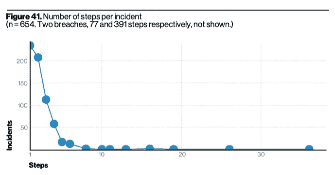
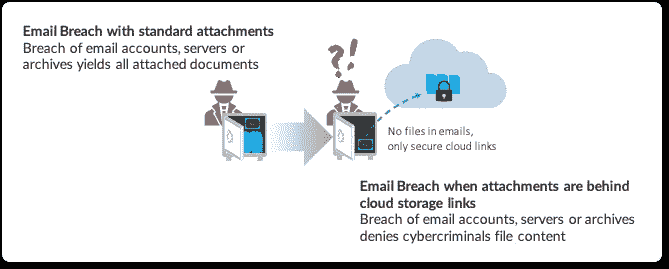

# 大多数安全策略都缺少一个关键的防御层

> 原文：<https://medium.datadriveninvestor.com/a-critical-defensive-layer-missing-from-most-security-strategies-354c0cbe72f9?source=collection_archive---------19----------------------->

分层防御的概念是网络安全的格言；然而，当涉及到电子邮件内容时，公司会敞开大门。如果使用正确，云存储链接可以成为有效防御的关键组成部分。

Multiple layers of defense have long been an effective strategy. With Verizon’s recently published data and analysis, we see how it extends to cyber-security.

威瑞森连续第 13 年发布其[数据泄露调查报告](https://enterprise.verizon.com/resources/reports/dbir/)，这是 CISOs 和 CIO 的重要参考。在超过 100 页的分析中，有很多东西需要了解，一个特别有趣的发现是网络攻击者成功入侵目标所采取的步骤数量。下图描绘了攻击者对每个安全事件采取的步骤数量。

Graph from page 32 of the **Data Breach Investigation Report**, Verizon 2020\. Note the sharp decline of security incidents as the number of attack steps increases.

图表开始处的急剧下降向我们表明，在攻击者和他们的目标之间增加几个步骤(称为“杀伤链”)会有巨大的好处。很明显，攻击者在寻找容易得手的猎物。只要让事情变得稍微困难一点，组织就可以避免违规。

从报告来看，

*“攻击者喜欢短路径，很少尝试长路径。这意味着，你可以很容易地向他们抛出任何东西，以增加他们必须采取的行动数量，这可能会大大降低他们携带数据潜逃的机会。”—威瑞森，2020 年*

数据泄露的主要来源之一是电子邮件，因为标准电子邮件不提供内容保护。当网络罪犯侵入电子邮件服务器、档案或帐户时，他们可以访问其中的所有内容，包括文件附件。公司保护通过电子邮件共享的文件的一种方法是使用安全的云存储链接。当使用云存储链接代替电子邮件附件时，公司在黑客和公司的重要数据之间创建了更多的层。与电子邮件附件不同，云存储链接可以要求身份验证，自动过期，并持续监控异常访问(例如 [Box Shield](https://www.box.com/shield) )。你可以想象，当网络犯罪分子潜入电子邮件宝库后，发现没有文件附件，只有安全的存储链接时，他们会有多沮丧。

Access denied: Files shared using secure cloud storage links present far greater security from breach than standard email attachments.

至关重要的是，云存储链接的优势超越了公司的边界。即使外部合作伙伴、客户和供应商的电子邮件遭到破坏，公司也能从同一层保护中受益。

> 至关重要的是，云存储链接的优势超越了公司的边界。

**让员工使用云存储链接**

通过云存储文件链接共享文件的重要优势有很多并且[量化](https://blog.usejournal.com/5-reasons-why-email-attachment-are-finally-coming-to-an-end-391174f60db4?source=friends_link&sk=b8af4b4295c2bd65461da530f11b2e60)。[1，2，3]但是用户通过链接而不是电子邮件附件发送文件需要改变长期以来的习惯。好消息是，在电子邮件中生成云存储链接的能力正在成为最流行的电子邮件应用程序的一部分，即微软 Outlook 和谷歌 Gmail。为了实现更大程度的自动化，赛门铁克的[电子邮件威胁隔离](https://docs.broadcom.com/docs/isolate-advanced-email-attacks-en)和 mxHero 的 [Mail2Cloud](https://www.mxhero.com/email-security) 平台等技术可以确保电子邮件附件自动上传到云存储，以便安全预览和安全交付。这些解决方案适用于所有用户设备，无需最终用户参与。

 [## 为什么加密对日常生活至关重要？数据驱动的投资者

### 你几乎每天都要输入密码，这是你生活中最基本的加密方式。然而问题是…

www.datadriveninvestor.com](https://www.datadriveninvestor.com/2020/02/10/why-encryption-is-critical-to-everyday-life/) 

电子邮件对企业通信至关重要，但其 50 年的架构在当今的安全环境中造成了不可克服的问题。通过明智和创新的修改，组织可以显著提高安全性，同时保持这一重要介质的工作效率。

**来源**

1.  [我们对电子邮件附件的危险依赖以及如何应对](https://medium.com/datadriveninvestor/why-we-cant-secure-our-data-with-business-as-usual-b4d13bfcf7d3)
2.  [遏制新冠肺炎在家工作时代及以后的数据蔓延](https://medium.com/datadriveninvestor/containing-data-sprawl-in-the-work-at-home-era-of-covid-19-and-beyond-abadf23c51c7)
3.  [拯救地球:用文件共享链接替换电子邮件附件](https://medium.com/datadriveninvestor/save-the-planet-replace-email-attachments-with-file-share-links-1f643e06c0d3)