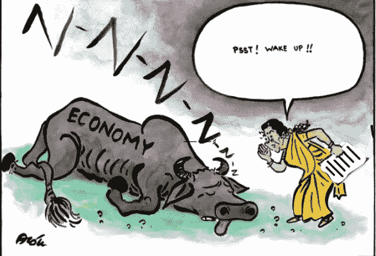

# 印度经济的诅咒

> 原文：<https://medium.datadriveninvestor.com/a-curse-to-the-indian-economy-31aa2bb2e70c?source=collection_archive---------35----------------------->

*Photo by Alok Nirantar on Twitter*

> 人类生存面临的最大威胁是我们缺乏控制自身成长的能力——加勒特·哈丁

当我们看到自己的国家处于领先地位时，总会有一种自豪感。让它成为体育，金钱，资源，经济等。但是当你听说印度正在成为世界上人口最多的国家时会发生什么呢？还有同样的自豪感、优越感和喜悦感吗？不，没有，而且不应该是惊人的和不断的人口增长提出了一个严重的经济问题在我们的国家吗？到 2030 年，印度极有可能超过中国，成为世界上人口最多的国家。这个预测是在 2050 年之前，但是人口增长的速度使它下降了。看现阶段，人越多，越难养活所有人。最重要的是，政府制定的所有计划都被证明是失败的。像我们这样一个资源和矿产丰富的国家仍有人挨饿数日。作为一个发展中国家，无论我们取得什么样的进步，都会被不断增长的人口所占据。

政府采取措施创造就业机会，但当人们每年以更大的规模超过机会时，这有什么意义。有弦在背后拉着发展，印度怎么可能是发达国家？我们说政府是失业率、税收等上升的主要原因。但是我们不认为政府有时因为人民而无能为力。

 [## 集中式经济发展的无用性和 UBI |数据驱动投资者的希望

### 在我的家乡缅因州的乡村海岸，我们曾经有一个经济发展委员会，但它只不过是一个…

www.datadriveninvestor.com](https://www.datadriveninvestor.com/2020/09/11/the-uselessness-of-centralized-economic-development-and-the-hope-of-ubi/) 

现在，由于人口过剩，有几个负面影响已被证明是经济增长和发展的障碍，我试图在下面列出其中的大部分:

1.  **失业:**每个人都想工作，为家人提供食物和住所，但由于寻求有限工作机会和有限资金的人越来越多，因此很难将就业机会分配给每个人。随着人数的不断增加，失业人数也在增加。
2.  **社会问题:**随着人们从农村搬到城市，他们定居在贫民窟，生活在最不卫生的环境中。由于没有工作留给他们，犯罪率上升，由于过度拥挤，交通水平上升很高。
3.  产妇福利:人口爆炸是高出生率的结果。出生率的增加降低了妇女的健康和福利。频繁怀孕对母亲和孩子的健康是危险的。健康状况不佳导致育龄妇女死亡率上升，因为早婚。因此，我们必须降低出生率，以更好地保护妇女的健康。
4.  **资本形成:**印度的人口构成降低了资本形成的增长率。高出生率和低预期寿命意味着总人口中有更多的依赖者。在印度，35%的人口是由 14 岁以下的人组成的，其中大多数人的生存和成长依赖于他人。他们是非生产性消费者。由于这些人对家庭没有贡献，这减少了可以储蓄的收入。因此，资本形成率下降。
5.  **食物短缺:不是每个人都有足够的食物，这迫使不发达国家从不同的国家进口，这导致了额外的外汇支出。因此，整体发展受到损害。此外，粮食短缺影响健康和生产力，降低人均收入，从而导致贫困。**
6.  土地:不断增长的人口增长率导致人均可用土地的减少，并对国家的经济发展产生不利影响。
7.  生活水平:人口的增长减少了可用资源的数量。由于数量有限，甚至生存所需的最基本必需品也变得难以获得。根据联合国数据，印度人口年平均增长率为 1.2%。当人口以这样的速度增长时，为了满足人们的基本需求，每年都需要大量的布料和粮食、房屋和额外的工作。有限的资源不可能满足所有的需求。
8.  **环境:**更多的人意味着更多的技术和高污染设备的使用。过度使用会导致环境恶化。这破坏了生物圈，并产生了更多无法回收的有毒废物。它降低了经济发展的速度，应该得到有效的控制。
9.  **贫困:**家庭成员数量的增加导致支出增加。家庭收入的很大一部分必须用来抚养孩子。正因为如此，它减少了储蓄和资本形成。因此，生产技术没有进步，劳动生产率下降。
10.  **投资:**印度人口正以每年 1.8%的速度快速增长。这意味着，为了让每个人过上体面的生活，甚至人均收入也需要增加，这影响了经济的增长率。

民间没有一个基本的常识，就是家里人越多，要养活的嘴就越多。人们认为家庭中孩子越多，将来家庭收入就会越多。这蒙蔽了人们的双眼，为了孩子们更好的未来，应该有更好的现在。

人口控制不仅是政府关心的问题，也是人民关心的问题，已经成为一种负担。我们人民应该努力教育文盲关于计划生育，控制生育，不要继承生儿子的愿望，以及为了更好的未来现在应该如何更好。如果我们想要繁荣和自给自足，每个人都必须自愿参与进来，控制印度人口的增长。

*原载于 2020 年 12 月 16 日*[*【https://www.datadriveninvestor.com】*](https://www.datadriveninvestor.com/2020/12/16/a-curse-to-the-indian-economy/)*。*

[祖列·雷恩](https://medium.com/u/14d5c41e0264?source=post_page-----31aa2bb2e70c--------------------------------) [加尔·穆克斯](https://medium.com/u/b89f26047265?source=post_page-----31aa2bb2e70c--------------------------------) [经济学家](https://medium.com/u/bea61c20259e?source=post_page-----31aa2bb2e70c--------------------------------) [世界经济论坛](https://medium.com/u/7d44f110eb09?source=post_page-----31aa2bb2e70c--------------------------------) [数据驱动投资者](https://medium.com/u/de42e9af1960?source=post_page-----31aa2bb2e70c--------------------------------) [尼科斯·维托拉基斯](https://medium.com/u/147635d885fe?source=post_page-----31aa2bb2e70c--------------------------------) [舒布·帕特尼](https://medium.com/u/a3762dfaaa71?source=post_page-----31aa2bb2e70c--------------------------------) [易卜拉欣·K](https://medium.com/u/f51f24fe7f6a?source=post_page-----31aa2bb2e70c--------------------------------)[汤姆·库格勒](https://medium.com/u/caa51e5ba081?source=post_page-----31aa2bb2e70c--------------------------------) [谢尔比·丘奇](https://medium.com/u/97fbb3b16247?source=post_page-----31aa2bb2e70c--------------------------------) [托斯卡·基洛兰(EdD)](https://medium.com/u/a3b2436ccc5e?source=post_page-----31aa2bb2e70c--------------------------------) [亚格穆尔萨欣](https://medium.com/u/83f6aaf2f940?source=post_page-----31aa2bb2e70c--------------------------------) [亚格穆尔萨欣](https://medium.com/u/83f6aaf2f940?source=post_page-----31aa2bb2e70c--------------------------------) [克里斯·奈特](https://medium.com/u/66842a2b66af?source=post_page-----31aa2bb2e70c--------------------------------) [卢卡斯·维斯弗莱克](https://medium.com/u/b7230f466d07?source=post_page-----31aa2bb2e70c--------------------------------) [杰西卡·布格](https://medium.com/u/ec583c3449bf?source=post_page-----31aa2bb2e70c--------------------------------) [孔科达](https://medium.com/u/20600512d13b?source=post_page-----31aa2bb2e70c--------------------------------) [蒂姆·丹宁](https://medium.com/u/b6d641be1066?source=post_page-----31aa2bb2e70c--------------------------------) [大卫·奥·](https://medium.com/u/1bc0cb87a6e?source=post_page-----31aa2bb2e70c--------------------------------)[标记编辑](https://medium.com/u/6425b2ce1ee1?source=post_page-----31aa2bb2e70c--------------------------------) [迈特兰](https://medium.com/u/f09b75fc322?source=post_page-----31aa2bb2e70c--------------------------------) [鲁比·哈马德](https://medium.com/u/55d56f9f2f48?source=post_page-----31aa2bb2e70c--------------------------------) [马克斯·乌弗伯格](https://medium.com/u/f6c426734337?source=post_page-----31aa2bb2e70c--------------------------------)

**进入专家视角—** [**订阅 DDI 英特尔**](https://datadriveninvestor.com/ddi-intel)