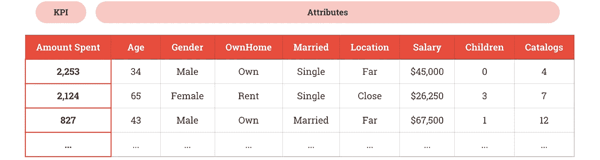
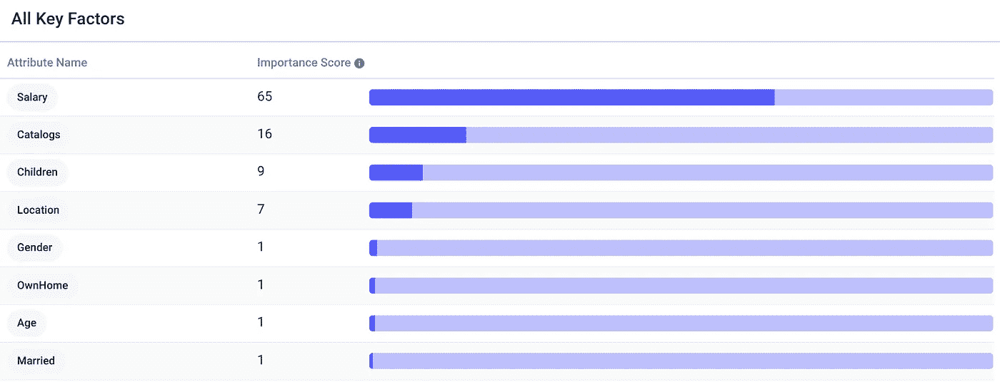
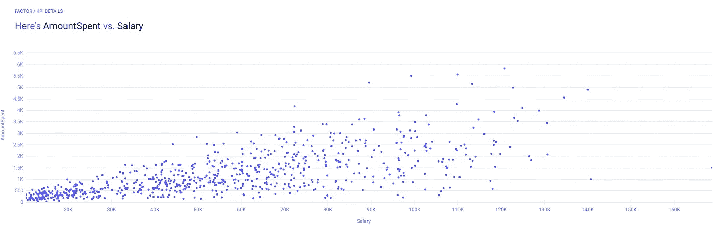
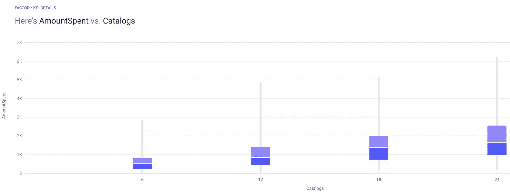
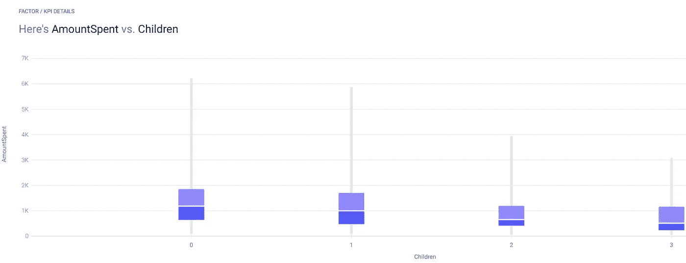
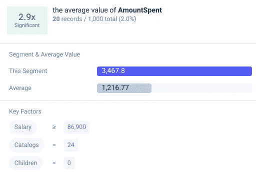

# 数据驱动的直邮营销指南

> 原文：<https://medium.datadriveninvestor.com/a-data-driven-guide-to-direct-mail-marketing-828a155100e6?source=collection_archive---------18----------------------->

## 来自直邮数据的见解。

Photo by [Andrew Buchanan](https://unsplash.com/@photoart2018?utm_source=medium&utm_medium=referral) on [Unsplash](https://unsplash.com?utm_source=medium&utm_medium=referral)

> "没有邮件列表的企业不是企业."—丹·肯尼迪

在个性化广告和聊天机器人的时代，直邮可能看起来过时了，但事实是它可能是一种令人惊叹的技术。今天，用户被广告淹没，以至于我们很多人都是“横幅盲”

如果我们把广告屏蔽用户、点击农场和机器人加在一起，有多少真正的用户会使用广告？答案是*比以往任何时候都少。*不要误会，广告仍然是一个强大的工具，但精明的公司也在使用直邮穿透数字噪音，直接到达顾客家中。

我分析了 Kaggle 的直邮数据，以发现谁是直邮的最佳目标。毕竟有的人对直邮反应不好，把邮箱里来的大部分都折腾出去了，有的人则期待着。

 [## 抓住智能营销，获得巨大成果|数据驱动的投资者

### 网上的人都看过。每当人们在谷歌上搜索某样东西，他们最终都会与类似的广告互动…

www.datadriveninvestor.com](https://www.datadriveninvestor.com/2020/08/19/grab-on-to-intelligent-marketing-for-great-results/) 

# 数据

[数据](https://www.kaggle.com/abhikbr/direct-marketing)的格式非常适合用 [Apteo](http://apteo.co) 进行表格分析，包含 KPI 和相关属性。

我们的 KPI 是`AmountSpent`，而我们的属性是年龄、性别、客户是自有住房还是租房、婚姻、位置、工资、孩子、收到的目录数量。

# 分析

我们可以将 CSV 直接上传到 Apteo 来分析每个属性。下面，我们可以看到，薪水对花费金额的影响最大，其次是收到的目录数量，客户的孩子数量，他们的位置，其余的属性。

其中一些是不言而喻的:高工资的顾客可以，也确实会，碰巧在公司花更多的钱。因此，明智的做法是将目标锁定在平均收入较高的邮政编码。

此外，寄给顾客的目录越多越好。这在任何营销领域都是一样的。[7](https://www.thebalancesmb.com/how-to-use-the-rule-of-7-to-radically-grow-your-business-4037683)法则指的是用户在购买前平均需要看 7 次品牌名称的想法。

孩子越多的顾客实际上花费越少，也许是因为他们经济拮据——孩子太贵了！

所有这些属性的独特组合被用来制作预测`AmountSpent`的机器学习模型。我们还可以看到哪些细分市场是特别有用的目标。

例如，工资高于 86，900 美元、没有孩子、收到 24 份目录的客户，平均花费是普通客户的三倍！这些人有很多积蓄，可以通过重复内容来转化。

直邮可能看似过时，但我们可以使用现代的、数据驱动的策略来优化我们的目标定位，并在竞争不那么激烈的领域接触客户。

**进入专家视角—** [**订阅 DDI 英特尔**](https://datadriveninvestor.com/ddi-intel)