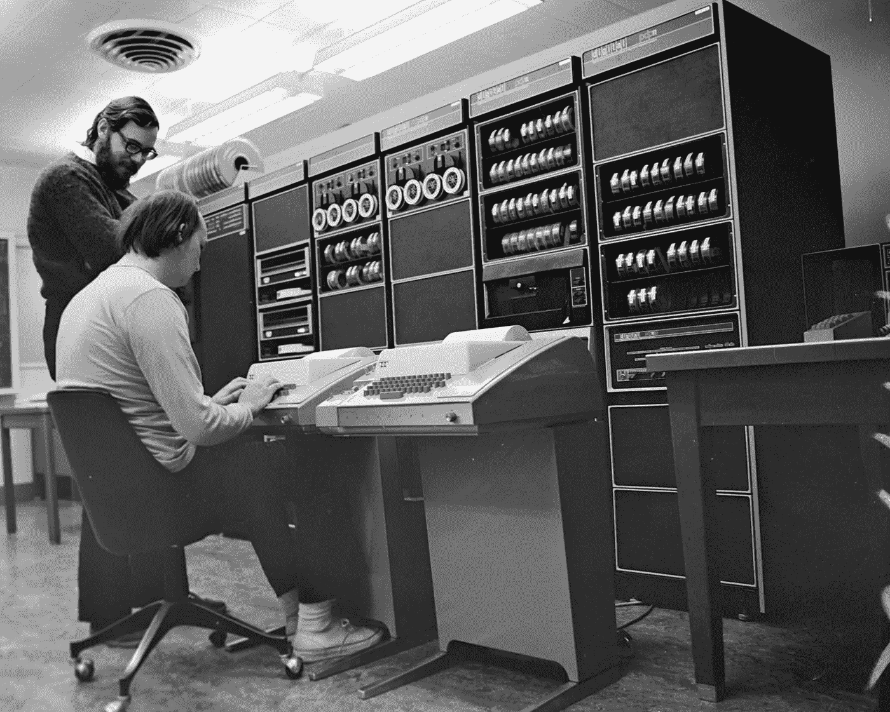
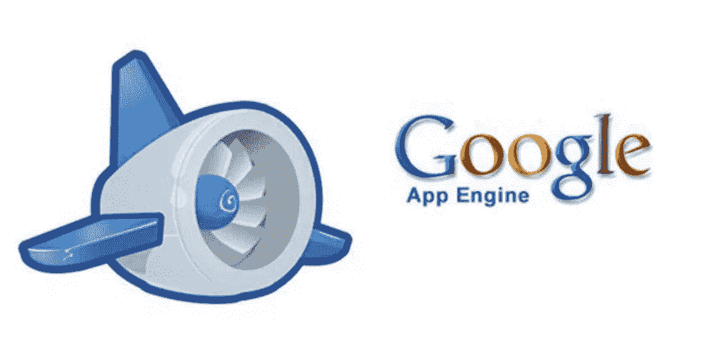
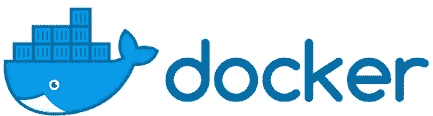

# 容器开发十年:软件交付编年史

> 原文：<https://medium.datadriveninvestor.com/a-decade-of-container-development-chronicles-of-software-delivery-9ca2b83f586c?source=collection_archive---------9----------------------->

*阿里云容器平台高级技术专家、CNCF 大使、Kubernetes 高级会员、维护者章雷*

今年，世界各地的开发人员开始使用容器进行软件测试和在线发布，现在已经习惯了基于容器的软件构建和交付。围绕“云原生”技术和多云时代的应用治理方法的讨论现在很常见。自然，“sidecar”容器模式是默认选择。在当今时代，云已经成为一种常见的基础设施，将容器视为现代软件基础设施的基本依赖是一种规范。现在我们使用容器就像每天使用 Eclipse 编写 Java 代码一样自然。

然而，两年前，整个集装箱生态系统围绕 Docker 展开了激烈的辩论，而[集装箱服务](https://www.alibabacloud.com/product/container-service?spm=a2c41.13977163.0.0)的前景似乎完全不确定。那时，中国许多公共云提供商还没有正式的 [Kubernetes 服务](https://www.alibabacloud.com/product/kubernetes?spm=a2c41.13977163.0.0)。通过使用容器技术在云上管理整个软件生命周期是一种相当前沿的探索。谁能想到在短短两年内，集装箱真的会成为技术人员日常工作的一部分？

随着容器技术变得越来越流行，过去两年见证了现代软件交付方式的重大变革。

# 起源:监狱时代

虚拟化容器技术可以追溯到 20 世纪 70 年代末。1979 年，贝尔实验室开始为 Unix V7(版本 7 Unix)操作系统的发布进行最后的开发和测试工作。

Ken Thompson(sitting) and Dennis Ritchie at PDP-11 ©wikipedia

那段时间，Unix 操作系统还是贝尔实验室的内部项目。运行 Unix 的机器是一个巨大的 PDP 系列盒子，看起来像有音频拨号盘和控制器。在软件危机的最后阶段，即使对贝尔实验室来说，开发和维护庞大的 Unix 操作系统项目也不容易。让事情变得更加困难的是，程序员在开发 Unix 的同时还必须开发 C 语言。

 [## 信息图:云之旅|数据驱动的投资者

### 聪明的企业领导者了解利用云的价值。随着数据存储需求的增长，他们已经…

www.datadriveninvestor.com](https://www.datadriveninvestor.com/2018/09/22/infographic-journey-to-the-clouds/) 

在 Unix V7 的开发过程中，构建和测试的效率是最困难的问题之一。原因很明显，当一个系统软件应用程序被编译和安装时，整个测试环境实际上被“污染”了。为了实现下一个构建、安装和测试，必须重建和重新配置测试环境。如今，有了云计算功能，我们可以通过使用虚拟机(VM)之类的方法来复制整个集群。然而，在一个 64 KB 内存芯片售价 419 美元的时代，快速摧毁和重建基础设施的想法是一种幻想。

为了提高效率，贝尔实验室的聪明人想出了在现有操作系统环境下为软件构建和测试创建一个隔离环境的主意。具体来说，他们想知道是否可以通过运行一些简单的指令来改变应用程序的视图，以便将当前目录用作根目录。如果这被证明是可行的，那么运行一个软件应用程序所需的所有依赖项都将准备就绪，只需将整个操作系统的文件系统部分放入当前目录中。

更重要的是，有了这种能力，开发人员就间接拥有了快速销毁和复制应用程序基础结构的能力，在环境构建完成后，他们不再需要安装和配置依赖项。这是因为运行软件应用程序所需的所有依赖项将以 OS 下的文件目录的形式预先准备好。开发人员在构建和测试应用程序时，只需要将应用程序的根目录切换到文件目录。

于是，一个叫做 chroot(更改根)的系统调用诞生了。

顾名思义，chroot 将当前正在运行的进程及其子进程的根目录更改到文件系统上的一个新位置，这样当前进程就不再能够访问这个位置的“上层世界”了。这个与世隔绝的环境获得了一个生动的名字——ch root 监狱。

值得一提的是，诞生 chroot 的 Unix V7 OS 是贝尔实验室对 Unix 的一级内部发布。当年年底，Unix 被美国电话电报公司正式商业化并允许对外使用，这为 Unix 成为经典操作系统铺平了道路。

chroot 的诞生第一次打开了进程隔离的大门。

随着越来越多的用户采用这种机制，chroot 也成为配置开发和测试环境以及管理应用程序依赖性的重要工具。描述过程环境隔离的“监狱”概念也激发了该技术领域的更多成就。

2000 年，FreeBSD 操作系统上发布了“jail”命令，该操作系统也属于 Unix 家族。

它表明 FreeBSD 监狱环境的普遍可用性。与 Chroot Jail 相比，FreeBSD jail 机制将“隔离”概念扩展到进程的完整视图，并提供隔离的进程环境和用户系统，为 Jail 分配独立的 IP 地址。因此，确切地说，尽管 chroot 是进程环境隔离的起源，但实际上是 FreeBSD 监狱机制使被监禁的进程沙箱化。关键的部分是这个沙箱的实现是基于操作系统级的隔离和限制，而不是硬件虚拟化。然而，无论是 FreeBSD jail(在 Unix 上)还是后来的 Oracle Solaris Containers(在 Solaris 上)都没能在更广泛的软件和交付场景中扮演更重要的角色。在监狱时代，进程沙箱技术总是有限的，并且只为一个小社区所知，因为那时云的概念还没有普及。

# 开发:云和应用容器

事实上，在 jails 获得过度普及的过去几年中，在快速发展的 Linux 平台上也开发出了多种类似沙盒的技术，如 Linux VServer 和 OpenVZ(不包含在内核主干中)。然而，像监狱一样，这些类似沙盒的技术也只有一小部分人知道。这再次证明，在流程沙箱的开发中缺少云的角色会产生巨大的负面影响。谈到云，我们不能不提到基础设施领域的领先公司——谷歌。

谷歌在云计算背后的核心组成部分——基础设施领域的影响是业内公认的。无论是三篇开创性的论文，还是多年来领先业界的内部基础设施项目，如 Borg 和 Omega，Google 都在这个行业扮演着重要的角色。但在目前的云计算市场，仅比 Google Cloud 早发布一年的 AWS 无疑是行业的佼佼者。考虑到他们在 GAE 的经历，许多人可能会认为这是一个有争议的结论。

谷歌应用引擎(GAE)在几代中国技术人员的脑海中留下了不可磨灭的印象。然而，即使是这些忠实的 GAE 用户也可能不知道，GAE 实际上是谷歌当时计划与 AWS 竞争的核心云产品。事实上，GAE 本身与其说是 PaaS，不如说是无服务器的简化版本。在 2008 年，像 GAE 这样的产品很难赢得企业级用户，当时大多数人根本不知道什么是云计算。

这里我们要讨论的不是谷歌的云战略，而是为什么谷歌在技术上把 GAE 这样的应用托管服务视为云计算服务。

很多人可能已经知道的一个重要原因是，Google 的基础设施技术栈实际上是一个标准的容器技术栈，而不是虚拟机技术栈。更重要的是，在谷歌的系统下，容器不再是孤立进程的简单沙箱，而是封装应用程序本身的方法，这要归功于 Borg 项目提供的独特的应用程序编排和管理功能。依靠这种轻量级的应用程序封装，谷歌的基础设施被视为一个自然的以应用程序为中心的托管和编程框架。这就是为什么许多前谷歌员工开玩笑说，如果没有 Borg，他们不知道如何编写代码。现在更容易理解的是，这种架构和形式，在映射到外部云服务之后，变成了像 GAE 一样的 PaaS/无服务器产品。

基于容器的基础设施在 Google 的大规模应用和成熟可以追溯到 2004 年到 2007 年。这个过程中的一个重要里程碑是过程容器的发布。

流程容器的目标非常简单，并且实际上与前面提到的沙盒技术的目标一致，为流程提供操作系统级的资源限制、优先级控制、资源审计和流程控制功能，就像虚拟化技术一样。这些能力是 Google 内部基础设施实现的基本要求和依赖。他们也构成了谷歌的容器技术原型。在 2006 年被 Google 工程师发布后，Process Container 在次年被包含在 Linux 内核主干中。

由于术语“容器”是在 Linux 内核中使用的，所以在 Linux 中，进程容器被重命名为 Cgroups。Cgroups 的出现和成熟标志着 Linux 对“容器”概念的重新审视和实现。这一次，容器技术的倡导者是 Google，它是大规模使用容器技术来定义其世界级基础设施的先驱。

2008 年，Linux Container (LXC)通过结合 Cgroups 的资源管理和 Linux 名称空间的视图隔离，在 Linux 内核中形成了一种完整的容器技术。虽然 LXC 为用户提供了类似于早期 Linux 沙盒技术的功能，如前面提到的 Jails 和 OpenVZ，但随着 Linux 操作系统开始迅速抢占其在商业服务器市场的份额，它的处境要比它的前辈好得多。

从 2008 年开始，AWS、微软等行业巨头在公有云市场不断发力，很快孕育出一个叫 PaaS 的新兴行业。

由于这些老公司在 IaaS 层的先发优势以及这方面的技术壁垒，越来越多受到公有云和云计算继任者影响的科技公司开始考虑如何在 IaaS 之上开发新的技术和商业价值，避免 GAE 曾经走过的错误道路。在这种情况下，第一次出现了一组开源和平台级项目来实现和应用抽象的“PaaS”概念。

这些 PaaS 项目被定位为应用托管服务。与 GAE 等公共云托管服务不同，这些开放的 PaaS 项目有望构建一个完全独立于 IaaS 层的应用管理生态系统。目标是利用 PaaS 更接近开发者的优势，占领云的更高层入口，甚至所有的数据中心。这意味着 PaaS 项目必须能够封装用户提交的应用程序，并将其快速部署到底层基础设施，而不依赖于 IaaS 层中的虚拟化。开源、中立、轻量和敏捷的 Linux 容器自然成为使用 PaaS 托管和部署应用程序的最佳选择。

2009 年收购 SpringSource(Spring 框架的创始人)后，VMware 使用 SpringSource 内部一个 Java PaaS 项目的名称作为自己内部 PaaS 项目的名称，后来在 2011 年成为开源项目。这个项目叫做云铸造。创建于 2009 年的 Cloud Foundry 首次清晰完整地定义了 PaaS。

这个项目第一次为云计算行业带来了许多重要的概念，这些概念也得到广泛的认可。这些概念包括“由 PaaS 项目实现的直接应用程序管理、编排和调度，关注业务逻辑而不是基础设施”和“PaaS 项目通过容器技术实现应用程序封装和启动”。值得一提的是，Cloud Foundry 使用 Warden 来启动和操作容器。Warden 最初是 LXC 的封装，后来被直接重构为 Cgroups 和 Linux 名称空间的架构。

这些越来越受欢迎的 PaaS 项目与谷歌早些时候发布的 GAE 项目具有相同的目标。所有这些项目都有一个共同的概念，即开发人员应该关注具有最高价值的业务逻辑，而不是底层基础设施(例如，虚拟机)。直到云的普及让越来越多的人意识到基础设施管理的高度复杂性和成本，这个概念才变得非常有说服力。在这个蓝图中，Linux 容器已经打破了进程沙箱的限制，开始扮演 app 容器的角色。在这个新阶段，容器和应用程序之间建立了平等的关系，最终允许平台层系统实现完整的应用程序生命周期管理。

如果事情继续这样下去，容器技术和云计算应该会朝着 PaaS 和“以应用程序为中心”的趋势发展。如果 Docker 公司没有成立，这可能是真的。

# 容器:改变软件交付过程

如果不是这些变化的见证者，你可能会发现很难相信 PaaS 甚至整个云计算行业已经被一家初创公司在 2013 年发布的开源项目彻底改变了。但是，这个开源项目的发布，确实是过去五年来整个云计算行业变革的缩影。

没有必要详细说明 Docker 项目的发布及其与 PaaS 的关系。光是“降维攻击”这个概念就足以给业内原本激烈的争论划上一个清晰的句号。

我们知道 Docker 在《LXC》发布的时候只不过是它的一个用户。Docker 用来创建和使用 app 容器的逻辑和 Warden 没有本质区别。然而，我们现在知道真正改变 PaaS 的是 Docker 项目最强大的杀手锏——容器图像。

开发人员不关心如何封装应用程序本身。因此，PaaS 项目可能会发挥很大的作用。然而，如何定义应用程序与每个开发人员密切相关。为了解决这个问题，Cloud Foundry 提供了 Buildpack，它是应用程序可执行文件的封装(例如，WAR 包)。Buildpack 具有内置的启动和停止脚本，可由 Cloud Foundry 和配置信息识别。

但是，Docker 通过使用容器映像直接打包运行应用程序所需的整个环境(即 OS 上的文件系统)。这种方式解决了长期困扰 PaaS 用户的一致性问题。创建一个一旦发布就可以在任何地方运行的 Docker 映像比构建一个甚至不能实现统一开发和测试环境的构建包要聪明得多。

更重要的是，Docker 还介绍了创建容器映像的层。基于层实现构建、推送和更新操作(即提交)显然是对 Git 的借鉴。这种方式的优点也和 GitHub 一样。构建 Docker 映像不再是一项单调乏味的工作，因为映像托管仓库 Docker Hub 允许您和您的软件参与全球软件分发。

此时，你可能会意识到 Docker 实际上解决了一个更高维度的大得多的问题——软件应该如何交付。当软件交付方法被清晰和完整地定义时，制作一个像 PaaS 平台一样的软件托管平台将变得简单和容易。这就是 Docker 几次说它只是站在巨人的肩膀上的根本原因。如果没有像 Linux 容器这样的有用技术在过去十年中的诞生和改进，使用一个开源项目来定义和统一软件交付过程将是一个白日梦。

# 云、应用和云原生

今天，容器映像是现代软件交付和分发的事实上的标准。然而，Docker 在这一领域并没有获得同样的领先地位。原因是显而易见的，Docker 在容器技术取得巨大成功后，在后来的“编排之战”中犯了一些错误。事实上，Docker 凭借“容器映像”的巧妙创新，成功解决了“应用交付”这一最关键的技术难题。然而，对于如何定义和管理应用程序这一更高层次的问题，容器技术并不是“灵丹妙药”。在与开发者息息相关的“应用”领域，对复杂性和灵活性的需求总是不可或缺的，而容器技术自然要求应用的“微服务”和“单负责”，这对于绝大多数真正的企业用户来说是非常困难的。而这些用户恰好是云计算产业的关键。

然而，与 Docker 系统以“单一容器”为核心的应用定义方法相比，Kubernetes 项目提出了一套完整的容器化设计模式和相应的控制模型，从而明确了如何构建一个真正与开发者对接的以容器为核心的应用交付和开发范式。Docker、Mesosphere、Kubernetes 项目对“应用”层有不同的理解和顶层设计，而“应用”层是所谓“编排竞争”的核心。

2017 年底，谷歌在过去十年编制世界上最先进的容器化基础设施的经验，最终帮助 Kubernetes 项目获得了关键的领导地位，并将 CNCF 这个以“Cloud-native”为关键词的组织和生态系统推向了巅峰。

最有意思的是，谷歌注入 Kubernetes 项目的“灵魂”，既不是 Borg/Omega 多年积累的大规模调度和资源管理能力，也不是当年其他公司赶不上的行业领先技术“三篇论文”。Kubernetes 项目中最能体现 Google container 概念的设计是“源自 Borg/Omega 系统的应用编排和管理能力”。

我们知道 Kubernetes 是一个重 API 的项目，但是我们也应该明白 Kubernetes 是一个以 API 为中心的项目。Kubernetes 的容器设计模式、控制器模型以及极其复杂的 apiserver 实现和扩展机制只有基于这种声明式 API 才有意义。然而，在这些看似复杂的设计和实现背后，它们实际上只服务于一个目的——用户在管理应用时如何最大化容器和云的价值。

为此，Kubernetes 结合了容器，并使用 Pod 的概念来模拟进程组的行为。也正是出于这个目的，Kubernetes 坚持使用声明式 API 加上控制器模型来编排应用程序，并使用 API 资源对象的创建和更新(补丁)来驱动整个系统的持续运行。更具体地说，使用 Pod 和容器设计模式，应用程序基础设施可以与应用程序(而不是容器)交互并对其做出响应，从而实现云和应用程序之间的直接连接。有了声明式 API，应用基础设施可以真正与云的细节和逻辑分离，比如底层资源、调度、编排、网络和存储。我们现在可以将这些设计称为“云原生应用程序管理思想”，这是让开发人员专注于业务逻辑并最大化云价值的关键路径。

所以 Kubernetes 项目一直在做的事情，就是进一步明确“应用交付”这个不变的话题。然而，Kubernetes 项目试图明确定义云时代的“应用”概念，而不是交付一个容器和一个容器映像。在这里，应用程序是一组容器的有机组合，还包括应用程序运行所需的网络和存储需求的描述。描述这种应用的 YAML 文件存储在 Etcd 中，然后控制器模型用于驱动整个基础设施的状态不断接近用户声明的状态。这是 Kubernetes 的核心工作原理。

# 未来:应用交付的革命不会停止

回到 2019 年，Kubernetes 和 containers 重新定义了软件交付。

此时，Kubernetes 项目正在继续尝试将应用程序的定义、管理和交付推向一个新的高度。我们实际上已经看到了现有模型的一些问题和缺点，尤其是声明式 API 如何更好地与用户体验保持一致。在这个问题上，Kubernetes 项目还有很长的路要走，但它正在快速前进。

此外，整个云计算生态系统都在试图重新思考 PaaS 的“故事”。在 Google Cloud Next 2019 上发布的 Cloud Run，事实上已经间接宣布，GAE 凭借 Kubernetes 和 Knative 的标准 API“从灰烬中重生”。另一个典型的例子是，越来越多的应用程序以一种更“极端”的方式被抽象成功能，以便它们完全托管在独立于基础设施的环境中(FaaS)。如果容器把应用环境完全封装起来，把应用交付的权利还给开发者，那么函数就把应用和环境的关系分开，把应用交付的权利交给 FaaS 平台。不难看出，云计算在发展到 PaaS 的过程中被 Docker 打乱后，开始以全新的容器理念向 PaaS 融合。但这一次，PaaS 可能会改名为 Serverless。

我们还看到，技术和开源正在迅速抹平云的边界。越来越多的软件和框架不再被设计成直接绑定到云。毕竟，你无法缓解用户对商业竞争的担忧和焦虑，也无法阻止越来越多的用户在全球所有的云和数据中心部署 Kubernetes。我们经常将云比作水、电和煤，并建议开发人员不要关心“发电”和“烧煤”。但实际上，开发商不仅不关心这些东西，甚至可能不知道水、电、煤从哪里来。在未来的云世界中，开发人员将把他们的应用程序交付到世界上的任何地方，没有任何区别，这很可能像现在我们把电脑插到房间里的任何一个插孔中一样自然。这也是为什么越来越多的开发者在讨论“云原生”。

我们无法预见未来，但是代码和技术的发展告诉我们一个事实，未来的软件必须基于云。这将是“软件交付”本质问题不断自我革命的最终趋势，也是“云原生”概念的核心假设。所谓“云原生”，其实就是定义一条最优路径，让应用程序最大限度地利用云能力，发挥云的价值。在这条道路上，没有“应用”这个载体，“云原生”就无从谈起。容器技术是实现这一概念和延续软件交付革命的重要手段之一。

至于 Kubernetes 项目，它确实是整个“云原生”概念实施的核心和关键。但更重要的是，在这场软件技术革命中，Kubernetes 不需要进入 PaaS 领域。它将成为连接云和应用程序的“高速公路”，以标准和高效的方式将应用程序快速交付到世界上的任何地方。这里的交付目的地可以是最终用户，也可以是 PaaS/Serverless，从而创建一个更加多样化的应用托管生态系统。云的价值一定会回归到应用本身。

# 一起进入云原生架构时代

在云趋势下，许多企业开始将业务和技术向“云原生”演进。这个过程中最困难的挑战是如何将应用程序和软件迁移、交付和持续发布到 Kubernetes 系统。在这一波技术变革中，“云-原生应用交付”成为 2019 年云计算市场最热门的技术关键词之一。

自 2011 年以来，阿里巴巴开始利用容器将云原生技术系统付诸实践。由于整个行业没有可供参考的例子，阿里巴巴正在逐步开发一种容器化的基础设施架构，这种架构可以与世界一流的科技公司相媲美，并服务于整个阿里巴巴集团。在这数万条集群管理经验中，阿里巴巴集装箱平台团队探索总结出了四种方法，让配送更加智能化、标准化。库伯内特网上的一切。这意味着要用 K8S 来管理一切，包括 K8S 本身。

应用程序发布回滚策略。应用程序是按照规则分阶段发布的，包括发布 kubelets 本身。通过图像分割将环境分为模拟环境和生产环境。应该在监测方面做出足够的努力，使 Kubernetes 更加透明，以便尽早发现、预防和解决问题。

近日，阿里云容器平台团队公布了两个社区项目:Cloud Native App Hub(仅中文版)和 OpenKruise。 [Cloud-Native App Hub](https://developer.aliyun.com/hub?spm=a2c41.13977163.0.0) 是一个面向所有开发者的 Kubernetes 应用管理中心，而 [OpenKruise](https://github.com/openkruise/kruise?spm=a2c41.13977163.0.0) 是一个基于世界顶级互联网场景的 Kubernetes 自动化开源项目。

云原生 App Hub 为国内开发者提供了一个掌舵应用国内映像站点，方便用户获取云原生应用资源。还推广了标准化的应用打包格式，将应用一键交付到 K8S 集群，大大简化了将云原生应用交付到多个集群的流程。OpenKruise/Kruise 项目致力于成为“云原生应用自动化引擎”，解决大规模应用场景中的诸多 O&M 痛点。OpenKruise 项目源自过去几年阿里巴巴经济体中大规模应用部署、发布和管理的最佳实践。它从不同维度解决了 Kubernetes 上应用的自动化问题，包括部署、升级、弹性调整大小、QoS 调整、健康检查、迁移和修复。

下一步，阿里云容器平台团队也将以此为基础，继续与整个生态系统合作，推动云原生应用定义、K8S CRD 和运营商编程范式、增强型 K8S 自动化插件等一系列标准化，使云原生应用实现大规模多集群场景下的快速交付、更新和部署。

我们期待与您携手共进，迎接云原生时代的到来！

# 关于作者

张曾在 Hyper 和微软研究院(MSR)工作，目前从事 Kubernetes 和相关的上下游工作。

# 原始来源:

 [## 容器开发十年:软件交付编年史

### 阿里巴巴开发者 2020 年 2 月 3 日 101 由 CNCF 阿里云容器平台高级技术专家章雷…

www.alibabacloud.com](https://www.alibabacloud.com/blog/a-decade-of-container-development-chronicles-of-software-delivery_595787?spm=a2c41.13977163.0.0)