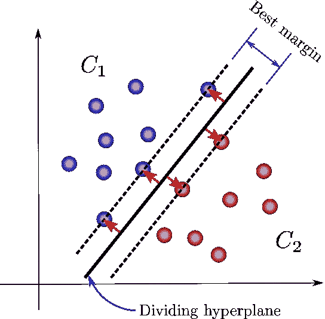
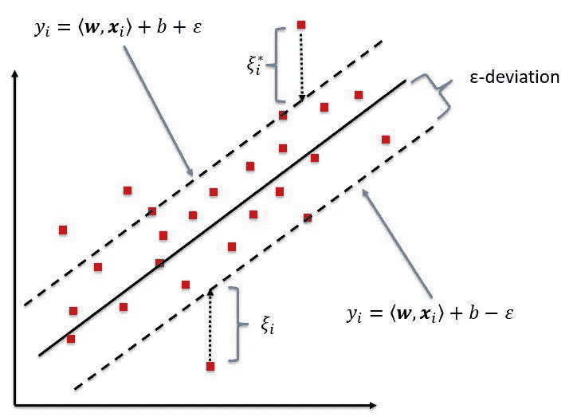
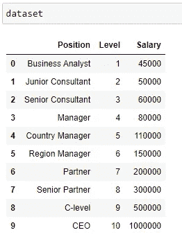
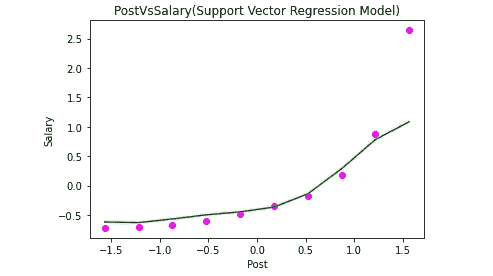

# Python 支持向量回归初探

> 原文：<https://medium.datadriveninvestor.com/a-dive-into-support-vector-regression-with-python-3c1875b08215?source=collection_archive---------10----------------------->

正如我们所知，SVM 算法主要用于分类，很少用于回归。

虽然它为我们提供了 SVR 算法来完成必要的工作。

在我之前的[博客](https://medium.com/datadriveninvestor/support-vector-machines-an-easy-interpretation-of-categorizing-inseparable-data-943631046eec)中，我主要谈论了如何在 SVM 使用 kernel trick 对数据进行分类，在这里我将解释 SVR 如何帮助数据回归。

支持向量的目标是在 N 维空间中找到一个能够分类数据点的超平面。

位于边缘并且最靠近超平面的数据点称为支持向量。



现在，当大多数数据大部分位于超平面每一侧的最佳边界内时，则可以使用 SVR 或支持向量回归来非常清楚地识别和预测相关数据..



它具有数学公式，对于超平面的每一侧的边缘线表示为:

Yi = (w，)+ b +偏差

Yi = (w，)+ b 偏差

**建立支持回归模型应遵循的步骤:**

1)找到您的 X 和 Y 独立和相关数据集来训练模型。

2)快速查看数据，并尝试适应最合适的内核参数。您也可以尝试绘制数据点并查看相关性。

根据复杂性，它可以是线性的、高斯的或多项式的。

最常用的核是高斯核。

*多项式核:K(x，y) =(x .y +1)d，其中 d>0 是定义核的常数

秩序。

*高斯 RBF 内核:K(x，y)= exp(| x y | 2/2σ2)，其中σ>0 是一个参数，它

定义内核宽度。在训练阶段确定相关的参数 d 和σ。

3)绘图

4)预测任何独立值。

现在不要太深入理论部分，让我们看看如何在 Python 中实现它。

**步骤 1)导入库**

```
import pandas as pd
import numpy as np
import matplotlib.pyplot as plt
```

**步骤 2)导入数据集**

```
dataset=pd.read_csv('D:/blog/SVR/PostVsSalary.csv')
```



**步骤 3)定义 X 和 Y 变量**，即因变量和自变量。

```
X=dataset.iloc[:,1:2].values
y=dataset.iloc[:,2:].values
```

这里我们取 x 为职位级别，y 为薪资。

**步骤 4)将数据转换成标量**

正如我们所看到的，职位或职位(1-10)的价值与工资(45000-1000000)的价值之间存在巨大的均等，我们需要有类似基础的数据，以使支持向量回归模型发挥作用。

[](https://www.datadriveninvestor.com/2020/07/07/introduction-to-time-series-forecasting-of-stock-prices-with-python/) [## 用 Python |数据驱动投资者进行股票价格时间序列预测简介

### 在这个简单的教程中，我们将看看如何将时间序列模型应用于股票价格。更具体地说，一个…

www.datadriveninvestor.com](https://www.datadriveninvestor.com/2020/07/07/introduction-to-time-series-forecasting-of-stock-prices-with-python/) 

样品 x 的标准分数计算如下:

x 标准= (x —平均值(x) )/标准偏差

我们通过使用 Python 的 StandardScaler 库来实现。

在其他线性模型中，我们不使用它，因为这些模型已经内置了它，但为了在我们的模型中使用它，我们需要编写以下代码:

```
from sklearn.preprocessing import StandardScaler

st_x=StandardScaler()
st_y=StandardScaler()

X=st_x.fit_transform(x)
Y=st_y.fit_transform(y)
```

**步骤 5)绘制数据来看看**

```
fig=plt.figure()
ax=fig.add_axes([0,0,1,1])
ax.scatter(X,Y,color='r')
```


将独立的数据变量绘制成红点。

在使值成为标量后

**步骤 6)选择一个内核来训练数据。**

最重要的 SVR 参数是内核类型。它可以是多项式或高斯 SVR。

我们有一个非线性条件，我们可以选择多项式或高斯，但这里我们选择 RBF(一种类型)核(参数='rbf ')。

多项式核需要大量复杂的计算，这需要时间来计算。

高斯核是模式识别中最常用的核。

```
from sklearn.svm import SVR 
regressor=SVR(kernel='rbf') 
regressor.fit(X,y)
```

**步骤 6)绘制预测线**的 X 和 Y 点

```
plt.scatter(X, Y, color = 'magenta')
plt.plot(X, regressor.predict(X), color = 'green')
plt.title('PostVsSalary(Support Vector Regression Model)')
plt.xlabel('Post')
plt.ylabel('Salary')
plt.show()
```



**步骤 7)找出预测点:**

请记住，我们在这里进行了数据缩放。现在，如果我们想要以类似的格式返回数据，我们需要做的是在运行预测时缩小规模。

这里，如果我们想预测一个 7.5 级别职位的工资，那么我们需要用 7.5 创建一个数组，并把它交给我们的 predict 函数。然后我们将它求逆，得到缩小后的值。

下面的代码将完成必要的工作。

```
# Predicting a new result
X_pred = sc_X.transform(np.array([[7.5]]))
y_scale_back = sc_y.inverse_transform(regressor.predict(X_pred))
```

**支持向量回归机最合适..**

当我们能够生成训练数据时，我们知道什么是正确的答案。但是，如果我们为每个新的数据点需求计算答案，那么成本可能会非常高。SVR 或高斯过程是一种很好的袖珍友好的替代昂贵的方法。如果我们调用的函数计算起来很平滑，那么这些函数可以重复调用，因此通过预先计算训练集，然后使用 SVR 模型来预测结果，可以节省大量成本。

希望上面的博客有助于理解 SVR。

感谢阅读！

*原载于 2020 年 9 月 29 日 https://www.numpyninja.com*[](https://www.numpyninja.com/post/a-dive-into-support-vector-regression-with-python)**。**

## *访问专家视图— [订阅 DDI 英特尔](https://datadriveninvestor.com/ddi-intel)访问专家视图— [订阅 DDI 英特尔](https://datadriveninvestor.com/ddi-intel)*