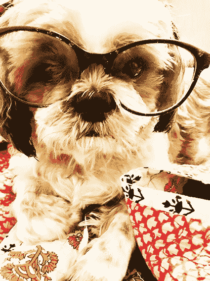
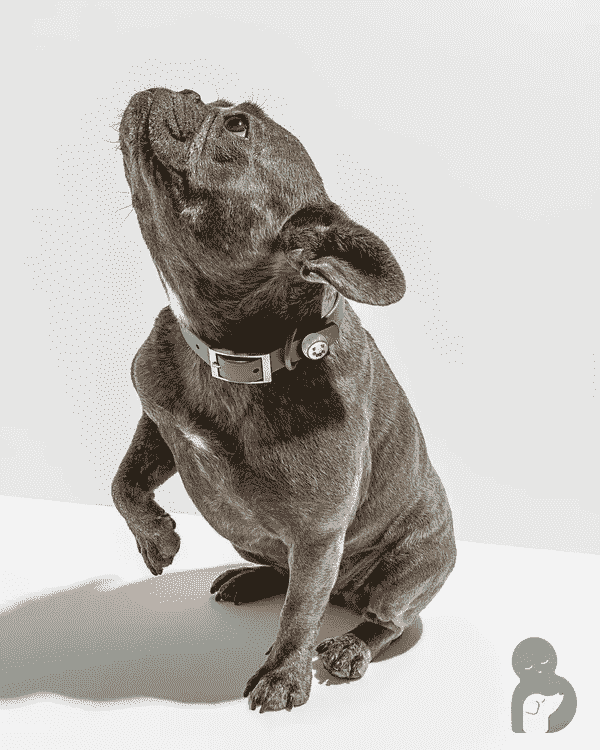
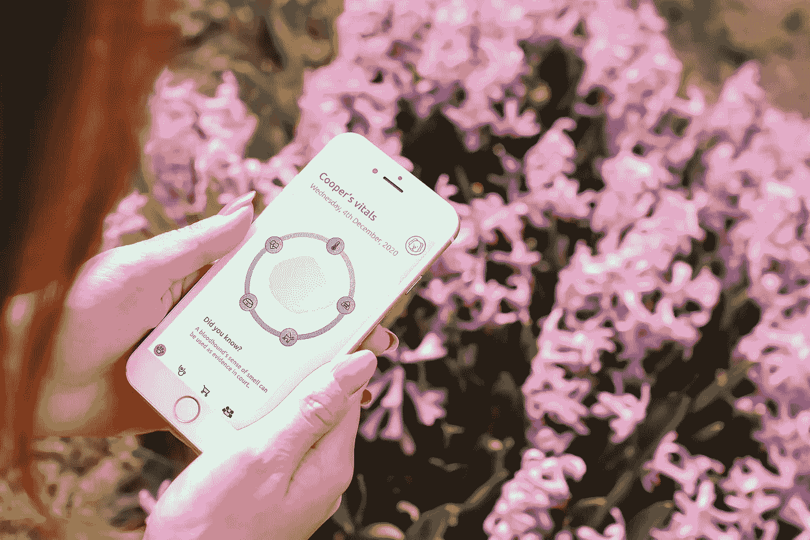
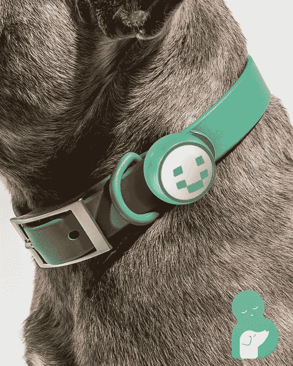
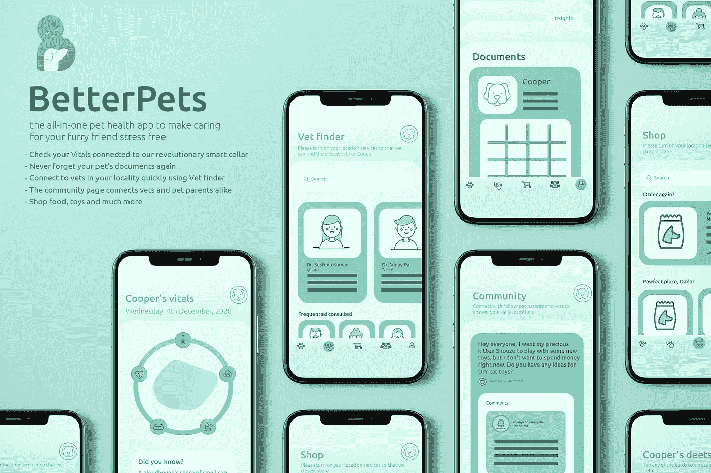

# 狗的目的

> 原文：<https://medium.datadriveninvestor.com/a-dogs-purpose-774144c33b05?source=collection_archive---------22----------------------->

## 这就是人工智能在我们宠物的未来发挥重要作用的地方。

> 我抱着她瘫软的身体去看兽医，麻木的感觉一直萦绕在我心头！接下来的十天是一连串的活动，随着我们的记忆封锁了我们生活中最具创伤性的事件，这些活动都消失了。



**Lola’s Purpose**

人工智能让我们建立了一个庞大的动物和动物疾病数据库，彻底改变了我们照顾宠物的方式。有了像 [Fitbit 这样的创新，收集数据从未如此简单。](https://www.fitbit.com/in/home)

根据美国防止虐待动物协会(ASPCA)的统计，在美国估计有 7800 万只狗作为宠物。

**Alex Joe** 和**‘Ananya Shanmugam**在我们最近结束的在 [ISDI 帕森斯](https://www.isdi.in/communication-design/)-ISU-Mumbai—**(AIML |一个全新的世界)**的选修课中，通过收集遍布世界各地的兽医办公室和宠物主人的大量数据，找出宠物父母认为在照顾他们的动物伴侣方面缺少什么，提出了一个人工智能支持的独特解决方案。



**BetterPets:** AI-enabled device — **Alex Joe** | **Ananya Shanmugam**

将[Fitbit](https://www.fitbit.com/in/home)概念结合到一个智能狗项圈中，不仅可以收集数据，还可以分析它们的生命体征，从而充当你和你的宠物之间的沟通者。

我们的宠物的主要责任之一是确保它们的健康和福利。人工智能有能力有效地分析数据，并帮助主人和兽医治疗可能的疾病。

在医疗保健领域，这意味着人工智能可以帮助专业人员找到疾病和病痛的模式，使它们更容易预防和检测。

当宠物生病时，它需要医疗护理，并且每年，宠物应该由兽医进行检查。像我们一样，我们的宠物也会生病，也需要药物。预防和治疗疾病不仅让他们保持健康，也让我们保持健康。



**Better Pets:** AI-enabled App — **Alex Joe** | **Ananya Shanmugam**

*‘better pets’设备确保我们的宠物活得更长、更健康、更充实，满足它们的所有需求。作为你的宠物的虚拟私人助理， **BetterPets 的**应用程序节省了金钱、时间并减少了压力，帮助主人更深入地了解他们的朋友——使照顾它们更容易，通过避免不必要的兽医之旅节省了金钱。*

**

***BetterPets:** AI-enabled device — **Alex Joe** | **Ananya Shanmugam***

> ****BetterPets*** “作为一种工具，帮助兽医更快更准确地诊断，访问庞大的宠物数据库有助于创建和分析独特的档案。*

**

***BetterPets:** AI-enabled APP — **Alex Joe** | **Ananya Shanmugam***

*虽然印度的人工智能产业正在稳步增长，但在动物或宠物健康领域却鲜有作为。这就是亚历克斯·乔(Alex Joe)和 T2(Ananya Shanmugam)与 T4 的 BetterPets(better pets)合作的地方，better pets 是一款创新的人工智能宠物健康应用，旨在让照顾宠物成为一种无压力的体验*

*疫情对宠物爱好者来说是一个福音，因为我们可以在家工作，花更多的时间和他们在一起。然而，随着疫情接管了优先权，其他的医疗条件被忽视了，宠物主人面临着许多挑战。*

**

***Better Pets:** AI-enabled device — **Alex Joe** | **Ananya Shanmugam***

*而芬兰的赫尔辛基万塔机场已经开始使用探测犬来嗅出感染了冠状病毒的乘客。*

*在印度，疫情期间被遗弃的宠物数量惊人地上升，然而，救助、寄养和收养流浪动物的数量也在增加。*

*在这些对抗心理压力的考验时期，毛茸茸的快乐包给许多家庭带来了快乐。*

*担心宠物需求的日子已经一去不复返了。智能项圈可以测量饥饿、口渴、身体活动、睡眠、温度、位置和心率。它与人工智能集成在一起，可以让你随时了解宠物的生命体征和情绪，即使你不在。它防震防水，不用担心你的宠物玩得太开心；穿上它，忘记它！*

> *虽然项圈会自己收集数据，但为了能够访问分析，必须下载合作伙伴应用程序。需要工作互联网和 wifi。适合体重在 5-270 磅之间的宠物。应用程序具有一体化的宠物健康应用程序，让照顾你的毛茸茸的朋友没有压力。*

**

*BetterPets 是一个宠物健康应用程序，辅以智能项圈，这是印度第一个此类 PetAI。衣领是一个附加的，应用程序可以独立使用。主屏幕的应用图标是可定制的。结合了技术、数据和人工智能的最新创新， **BetterPets 的**帮助父母比以往任何时候都更好地照顾他们的毛茸茸的朋友。*

> *基于人工智能的解决方案渗透到我们生活和做生意的方式中，关于道德、隐私和安全的问题也将出现。学生们进行了各种猜测和预测。**免责声明:**所有创意均为假设的课堂项目。**保留所有权利— I S D I 2 0 2 0***

**创意导师:* [***乌卡沙·马尔卡尔***](https://www.linkedin.com/in/utkarsha20/)*

****ISDI 校区*** *印度设计学院&创新
ISDI 大厦，One Indiabulls Centre，
Senapati Bapat Marg，Lower Parel，
孟买 400013。一般查询:* [*查询@isdi.in*](mailto:enquiries@isdi.in) *布点&行业连接:* [*布点@isdi.in*](mailto:placements@isdi.in)*

```
***UTKARSHA M. |** Author | Design Thinker | Creator  - A desire to understand the world and to improve it always remains at the core. Design is a managed process and my quest for knowledge is subject to an inquiry of the apparent, the imagined and the recalled. As I speculate and design, my liberty of self-expression is in direct correlation to my existence and knowledge.
[**https://www.utkarshaofficial.com/**](https://www.utkarshaofficial.com/)*
```