# 提高电子商务商店搜索长尾性能的双异质图注意网络

> 原文：<https://medium.datadriveninvestor.com/a-dual-heterogeneous-graph-attention-network-to-improve-long-tail-performance-for-shop-search-in-775abbe91baa?source=collection_archive---------12----------------------->

*下载“*[*【KDD 论文云知识发现】*](https://resource.alibabacloud.com/whitepaper/cloud-knowledge-discovery-on-kdd-papers_2592) *”白皮书，探索 12 篇 KDD 论文和 12 位阿里巴巴专家的知识发现。*

*由牛淅川、、、、孙浩川、邓洪波、陈*

# 背景

店铺搜索是中国最大的电子商务平台淘宝提供的一项重要服务。淘宝目前有近 1000 万个店铺，包括几百万个 7 天活跃店铺。商店搜索场景每天注册数千万用户视图(uv)和数亿 gvm。

您可以点击下图所示的选项卡，在其 PC 客户端或移动客户端使用淘宝的店铺搜索功能。

在淘宝平台上，绝大多数的曝光都是针对经常被搜索的查询、商品或店铺，这就导致了长尾效应。下图显示了查询和商店的搜索频率及其排名之间的关系。y 轴显示每日查询页面浏览量(qpv)或商店页面浏览量(SPV)的数量，x 轴显示查询或商店的排名。

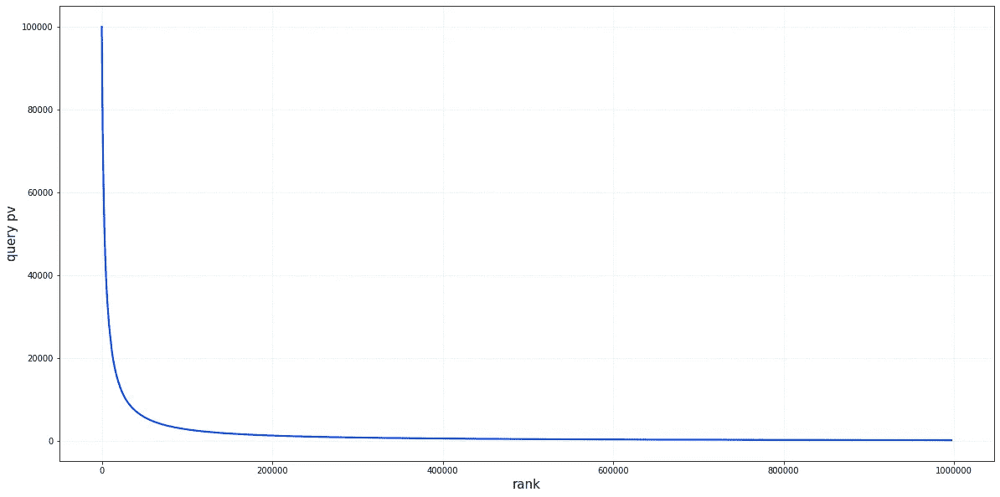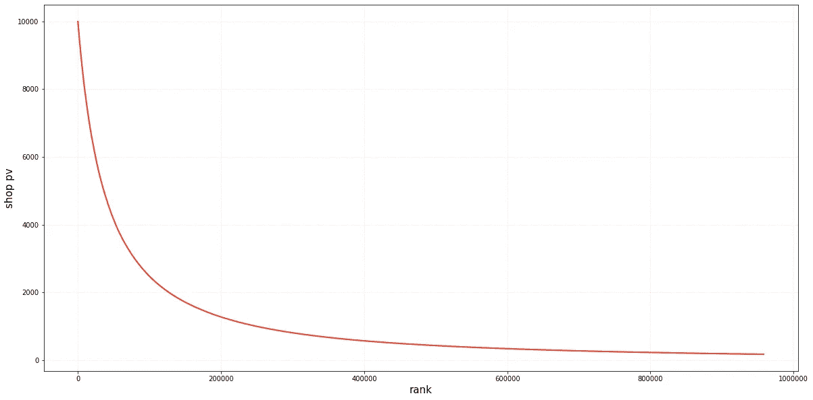

我们为长尾查询和与查询高度相关的长尾商店构建了一个双重异构图注意力网络(DHGAN)。DHGAN 被设计为专注地采用查询和商店的异构和同构邻居来增强它们自身的矢量化表示，这有助于缓解长尾现象。

# 直觉

为什么异质信息可以改善长尾效应？我们在训练和预测过程中发现了以下例子。

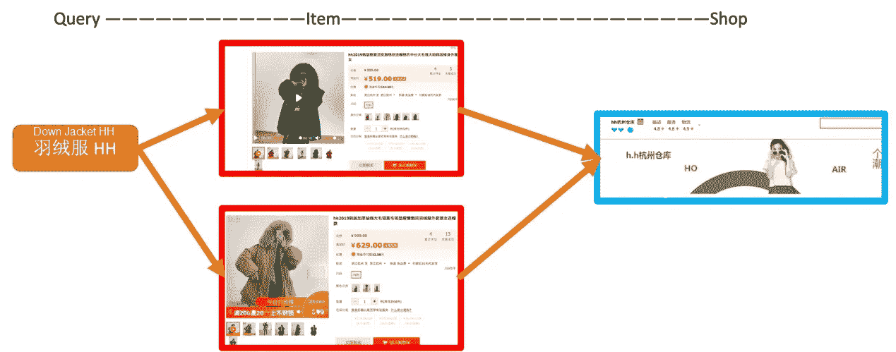

在上图中，用户搜索的查询和目标商店没有在训练数据中同时出现，它们的语义也没有关联。然而，它们可以通过使用查询商品和商品商店嵌入来关联。

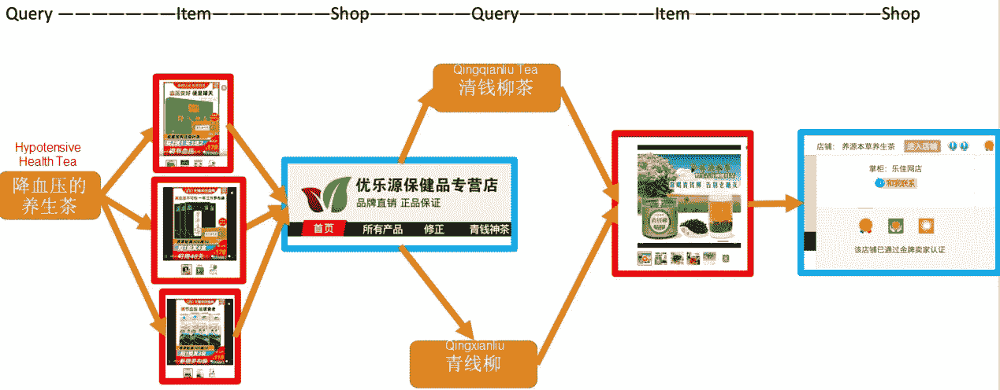

这是一个更复杂的例子。上图中的查询和目标商店在定型数据中并不同时出现，但是可以使用异类信息将它们关联起来。

在前面的例子中，NCF 基线本身不会导致预测成功，但下面描述的 DHGAN 模型会。

# 异构图构造

我们将商店搜索场景中的查询、商店和商品节点结合起来，形成异构边缘。

例如，query2query 关系连接到同一商店中的一个查询，而 shop2item 关系连接到商店中的一个商品。下图显示了详细数据。具体来说,“边”列显示异构边的总数，而“加权边”列表示聚合级重复数据消除后异构边的总数。

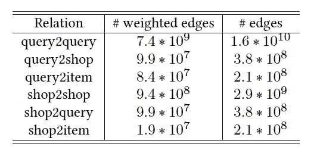

# 条款

**异构图:**具有多种类型的节点和多条边关系的图结构。异构图的对应物是只包含一种类型的节点和边的同构图。

**图形神经网络(GNN):** 将神经网络应用于不规则图形结构的一类算法。gnn 主要应用于学习图节点的语义向量，然后将学习到的节点表示应用于下游任务，例如节点分类和链接预测。

**注意力机制:**模仿人类注意力的计算系统，广泛应用于自然语言处理和计算机视觉。注意机制的核心目标是从海量信息中选择对当前任务目标更为关键的信息。

# 模型概述

我们提出 **DHGAN** 来解决长尾问题。该模型首先基于用户在商店搜索和商品搜索中的行为日志构建异构图网络，然后在异构图中挖掘和使用查询或商店的同构和异构邻居。该模型使用这些邻居来增强查询和商店的矢量化表示，然后迁移项目搜索中的知识和数据，以在项目标题的帮助下弥合用户搜索的查询和商店名称之间的文本语义鸿沟。最后，该模型引入用户特征来个性化搜索召回结果。

# 模型细节

## 总体框架

模型的整体框架是双塔架构，如下图所示。

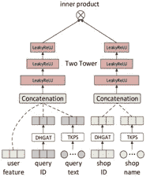

左侧的输入是用户和查询，包括同类和异类邻居，以及项目搜索中已售出项目标题后的信息。DHGAN 和来自产品搜索(TKPS)模块的知识转移将数据聚集到一个向量中。(有关更多信息，请参见下一节。)右边的输入是商店。与查询信息类似，DHGAN 和 TKPS 模块将商店信息聚合到一个向量中。最后，相关性通过双塔架构顶部的向量的内积来测量，并作为向商店召回分配权重的基础。

## DHGAN 模块

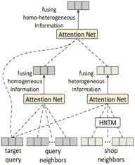

DHGAN 模块采用查询和商店的异构和同构邻居来增强自身的矢量化表示，如上图所示。

以一个用户查询为例。我们首先挖掘它的同构邻居(查询邻居)和异构邻居(商店邻居)。然后，我们使用作用于两类邻居的注意力网络图层图来融合信息。第一层注意网分别融合同质信息和异质信息。具体来说，同质信息由注意力网络直接融合，而异质信息由异质邻居变换矩阵(HNTM)处理，该矩阵将查询映射到商店的向量空间。注意力网络的第二层进一步融合同质和异质信息，最终通过使用同质和异质邻居来增强矢量化表示。作用于商店的层图的注意网与作用于查询的注意网完全相同，只是它们的网络参数不同。

## TKPS 模块

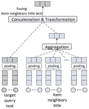

如上图所示，我们以用户查询为例，首先迁移项目搜索中的知识。也就是说，我们在基于同一查询的项目搜索中使用项目邻居标题，然后对目标查询文本和项目邻居标题进行矢量化。通过使用汇集操作来获得矢量化表示。最后，我们聚合项目邻居标题，将其与查询连接，并转换它以获得查询的增强文本矢量化表示。在商店的情况下，我们利用商店中的项目文本信息来增强商店的文本矢量化表示。

## 损失的定义

我们模型的基本损失是传统的交叉熵，定义如下。

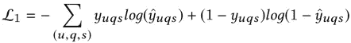

直观上，查询和商店邻居节点应该与查询和商店相似。因此，除了交叉熵，我们还定义了邻居邻近损失，如下式所示。

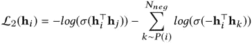

其中，h_i 为当前节点，h_j 为 h_i 的邻居节点，作为正样本，h_k 为随机采样节点，作为负样本。

模型的最终损失是正则化后两个损失值的结果。惩罚分别由α和λ参数控制。

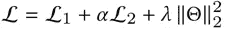

# 离线预测

## 离线数据集构建

为了展示 DHGAN 模型在优化长尾查询和商店方面的优势，除了测试所有测试数据之外，我们还构建了两个特殊的数据集，即硬数据集和长尾数据集。硬数据集包含未出现在训练数据中的查询-商店对，长尾数据集包含仅在训练数据集中出现一次的查询和商店。下图显示了详细的数据集统计信息。交互列指示训练和测试数据中正面记录的数量，查询、商店、项目和用户列指示训练和测试数据中相应数据记录的数量。请注意，在测试过程中没有使用项目数据，以避免特性遍历问题。

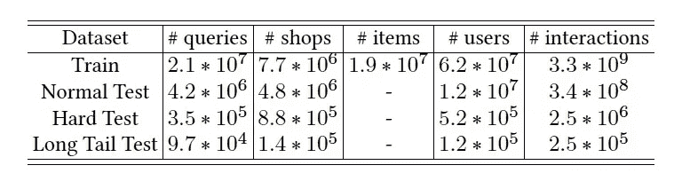

## 总性能

我们使用了 11 种类型的基线进行比较，并测试了添加和不添加(DHGAN_{NP})个性化信息的 DHGAN 版本。最终结果如下。

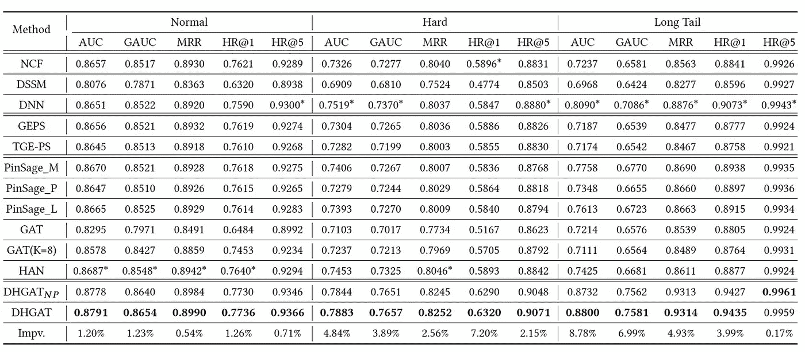

可以看出，DHGAN 模型在所有测试中的指标上提高了 1%，在侧重于优化的硬模型和长尾模型的指标上提高了 4%到 8%。

## 聚变实验

下图中，w/o homo 表示删除 query2query 和 shop2shop 数据，这里的 w/o 表示删除 query2shop 和 shop2query 数据，w/o item 表示删除 query2item 和 shop2item 数据。如图所示，不同类型的异质信息都提高了模型的性能，异质项目信息的提高最为显著。

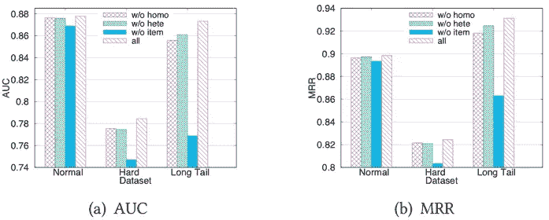

## 超参数分析

我们还分析了邻居计数和丢失权重α。如下图所示，需要调整这两个参数以提供最佳性能。模型的最终邻居计数设置为 6，α设置为 0.001。

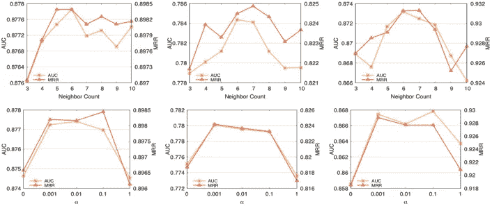

# 摘要

淘宝店铺搜索召回面临长尾和语义鸿沟问题的挑战。为了解决这些问题，我们在商店搜索召回场景中补充了 DHGAN 模型的语义，以获得更好的性能。目前，模型的用户端只包含概要信息。未来，我们将在模型中引入用户项目和用户商店等异构信息，以提高模型的性能。

*本文观点仅供参考，不一定代表阿里云官方观点。*

# 原始来源:

 [## 一个双异质图注意网络来改善商店搜索的长尾性能…

### Alibaba Clouder 年 10 月 15 日 178 下载《KDD 论文中的云知识发现》白皮书，探索 12…

www.alibabacloud.com](https://www.alibabacloud.com/blog/a-dual-heterogeneous-graph-attention-network-to-improve-long-tail-performance-for-shop-search-in-e-commerce_596750)