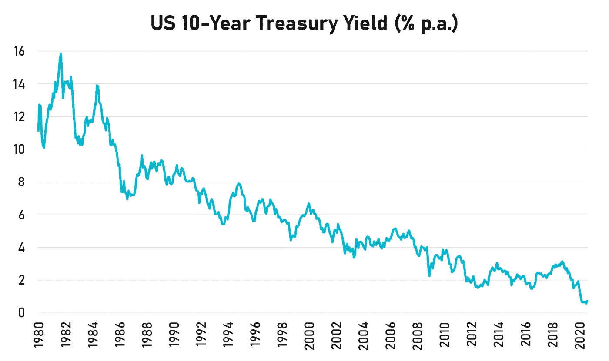

# 比通货膨胀更糟糕的事实

> 原文：<https://medium.datadriveninvestor.com/a-fait-worse-than-inflation-6fe1371f68bc?source=collection_archive---------3----------------------->

## 美联储的新授权是基于一些陈旧的想法

Photo by [Erik Odiin](https://unsplash.com/@odiin?utm_source=medium&utm_medium=referral) on [Unsplash](https://unsplash.com?utm_source=medium&utm_medium=referral)

近四十年来，利率一直在下降。其主要原因是通胀率一直很低，尤其是在金融危机以来的过去十年里。情况并非总是如此。早在 20 世纪 70 年代，由于高能源价格，但主要是由于监管，通货膨胀非常严重。1973 年，美国石油产量在 20 世纪 60 年代达到顶峰后几乎耗尽，石油输出国组织的阿拉伯成员对美国实施禁运，以回击他们对以色列的支持。

封锁导致汽油价格上涨，制造成本普遍上升，这些都转嫁给了消费者。对美国来说，这是一个真正的问题，直到经济在使用石油方面变得更加有效，这导致了 20 世纪 80 年代的过剩。

能源价格波动，产生较高和较低的通货膨胀时期。但是在 2000 年之前的 20 年左右的时间里，通货膨胀的长期下降主要是由于放松管制。航空公司象征着琐碎规则的积累，这些规则支配着从空中乘务员所穿制服的颜色到特定航线上允许的航班数量的一切。这些都没有让消费者受益。在 1978 年《航空放松管制法案》出台之前，美国民用航空局局长阿尔弗雷德·卡恩[向国会投诉](https://papers.ssrn.com/sol3/papers.cfm?abstract_id=2018590):

> “如果没有雪，航空公司可以为滑雪者推出一种退还机票费用的特殊票价吗？两家有财务偿付能力的航空公司的员工可以穿相似的制服吗？我每天都问自己:这个行动有必要吗？这就是我妈养我做的事吗？”

随着通货膨胀失去控制，政府以两种方式应对。首先，时任美联储主席保罗·沃尔克(Paul Volcker)在罗纳德·里根(Ronald Reagan)任期之初提高了利率，导致了经济衰退。但它确实有助于解决通货膨胀问题。后来里根解除了对经济的管制，价格下降并保持在低位。一张机票[的价格最终会减半](https://www.theatlantic.com/business/archive/2013/02/how-airline-ticket-prices-fell-50-in-30-years-and-why-nobody-noticed/273506/)。

# **放松管制等于通货紧缩**

放松管制等于通货紧缩。这是一个每个非专业经济学家，包括那些除了阅读金融新闻什么也不做的人，都能立即直觉感受到的事实。这也是一个被专业经济学家故意忽略的事实，包括那些在美联储的经济学家，他们认为通货紧缩是经济有史以来最糟糕的事情。

预期在经济学中扮演着重要的角色。如果人们相信未来几年价格会上涨，他们会调整自己的行为以符合他们的预期。消费者可能会在价格相对较低时提前消费，如果借款人认为还款的实际价值会下降，他们可能会借更多的钱。

Interest rates have fallen consistently since the 1980s

米尔顿·弗里德曼说过，“通货膨胀无处不在，永远是一种货币现象”。这可能是真的，取决于你玩的定义游戏。我们知道，更多的监管会导致通胀，雇主和雇员之间讨价还价能力的变化、能源价格的突然上涨，或者其他导致供应下降的外部冲击也会导致通胀。我们知道，货币供应量的增加不会统一影响所有商品和服务的价格。

对量化宽松的一个主要批评是，它对一些资产的影响——特别是像股票这样的金融资产——比其他实物资产更大。一些人可能会认为股市上涨是因为量化宽松带来的预期改善，但你可能会预期其他资产的价格也会上涨(事实并非如此)。

几十年来，专业经济学家已经说服自己，我们迫切需要通胀来让市场有效运转。20 世纪 60 年代，经济学家注意到通货膨胀和失业之间有一种简单的关系，这就是著名的菲利普斯曲线。高通胀时期伴随着高就业率，低通胀时期伴随着高失业率。

 [## 大学教育节省 6 位数以上的 5 步法|数据驱动型投资者

### 快讯(讽刺警告):大学教育是昂贵的！即使考虑到通货膨胀，高等教育也有…

www.datadriveninvestor.com](https://www.datadriveninvestor.com/2020/09/09/a-5-step-method-for-saving-6-figures-plus-on-a-college-education/) 

通货膨胀是不好的，但失业更糟糕，所以通常认为容忍一定程度的通货膨胀以保持低失业率是有利的。当然，如果通货膨胀失去控制，那么你会遇到比失业更糟糕的事情——你会经历一场全面的经济崩溃。这种权衡必须小心处理。

但随着 20 世纪 70 年代滞胀的出现，事情变得令人困惑:这是一个高通胀和高失业率并存的时期。经济学家求助于弗里德曼的解释。弗里德曼认为，消费者和投资者会适应高通胀，高通胀会导致失业率攀升。政府和货币当局可以通过制造通货膨胀来降低失业率。中央银行可以增加货币供应，或者政府可以运行预算赤字——但是如果这些政策被提前告知，经济参与者会调整他们的通胀预期，而这些政策对就业几乎没有影响。

自 20 世纪 70 年代以来，关于通胀的争论一直没有超出这两个相互竞争的命题。尽管失业率在历史上一直相对较低(至少在疫情袭击之前),通货膨胀几乎不存在，特别是在欧洲，能源价格是整个欧洲大陆几乎没有通货膨胀的唯一真正原因，但许多学术火力仍然指向解决这场辩论。

各国央行在我们所见过的最宽松的货币政策环境下，在我们所见过的最长的时间里尝试过，但他们的努力毫无成效。货币政策正在失败，还是央行正在与市场的自然通缩力量进行一场失败的战斗？市场的自然通缩力量通常通过竞争、效率提高、创新和技术变革来降低商品和服务的实际价格？

# **美联储 20 世纪 20 年代的解决方案**

通胀持续低于预期是美联储的一大担忧。事实证明，这是一个令人头疼的问题，他们不得不更新他们的国会授权，这一授权自 1977 年以来没有任何重大改变。美联储的目标是将年通胀率控制在 2%左右，它使用自己掌握的货币工具来实现这一目标，如改变联邦基金利率和通过公开市场操作(购买债券和其他证券)。

还有其他工具尚未部署，但在需要时可以使用，如收益率曲线控制，尽管美联储选择暂时搁置这些工具。由于通胀率一直非常低，美联储现在将采用灵活的平均通胀目标(被一些评论人士称为 FAIT)，允许美联储在经济繁荣时让通胀率高于 2%，以补偿通胀率低于 2%的情况，比如在经济衰退后。关键是，在整个经济周期中，通货膨胀率平均为 2%(至少理论上是这样)。

然而，问题不在于由于政策限制，通货膨胀达到了 2%的上限。美联储一直在努力维持 2%的目标，即使使用了金融危机期间开发的量化宽松等新工具。很难将这种变化解释为对通缩力量的屈服，这种通缩力量可能是市场体系固有的，其目的(请原谅目的论的描述)是让消费者的东西更便宜。

Jerome Powell 在解释美联储授权变化的理由的演讲中承认[较低的价格通常是一件好事](https://www.federalreserve.gov/newsevents/speech/powell20200827a.htm):

> “许多人认为美联储想要推高通胀是违反直觉的。毕竟，低而稳定的通胀对一个运转良好的经济至关重要。我们当然意识到，食品、汽油和住房等必需品的价格上涨，增加了许多家庭面临的负担，特别是那些正在失业和失去收入的家庭。”

谁会不同意呢？但在美联储看来，这是一个问题。如果通胀过低，就会造成通胀预期螺旋式下降，这反过来会导致实际通胀下降，同时预期也会下降。这意味着利率持续下降，直到我们得到负的实际利率(这种情况已经持续了很多年)。美联储更希望通胀率更高，这样利率就可以上升，在经济下滑的情况下，给美联储更多空间来放松政策以支持就业。

> “良好的通胀预期对于给予美联储在必要时支持就业而不破坏通胀稳定的空间至关重要。但如果通胀预期低于我们 2%的目标，利率将随之下降。反过来，在经济低迷时期，我们通过降息来刺激就业的空间将会缩小，从而进一步削弱我们通过降息来稳定经济的能力。”

从纯粹的技术专家的角度来看，这是有意义的。但美联储真的能做些什么来阻止利率在过去 40 年里如此剧烈而持续地下降吗？难道不是有某种更深层的力量在起作用，即市场，给了我们更好更便宜的产品吗？

像互联网这样的创新对我们的生活和提供服务的方式产生了什么影响？电视并没有便宜很多，但是已经有了很大的进步。移动设备让我们可以更快地访问互联网，同时应用程序也更容易访问和扩展。食品生产变得越来越高效，机器人和人工智能正在彻底改变制造和物流，几乎所有我们想要的东西都可以在不踏出家门的情况下交付。

挣得越多越好。工资增长可能很弱，但如果我们能用拿到的钱买更多的东西，那么我们会过得更好。美联储会因为坚持上世纪 70 年代的通胀观点而破坏整个过程吗？后果不堪设想。为了我们自己的心理安全，最好是简单地调整一下命令，继续前进。希望通货膨胀会很快回升。也许与中国的另一场贸易战会有所帮助。

**进入专家视角—** [**订阅 DDI 英特尔**](https://datadriveninvestor.com/ddi-intel)