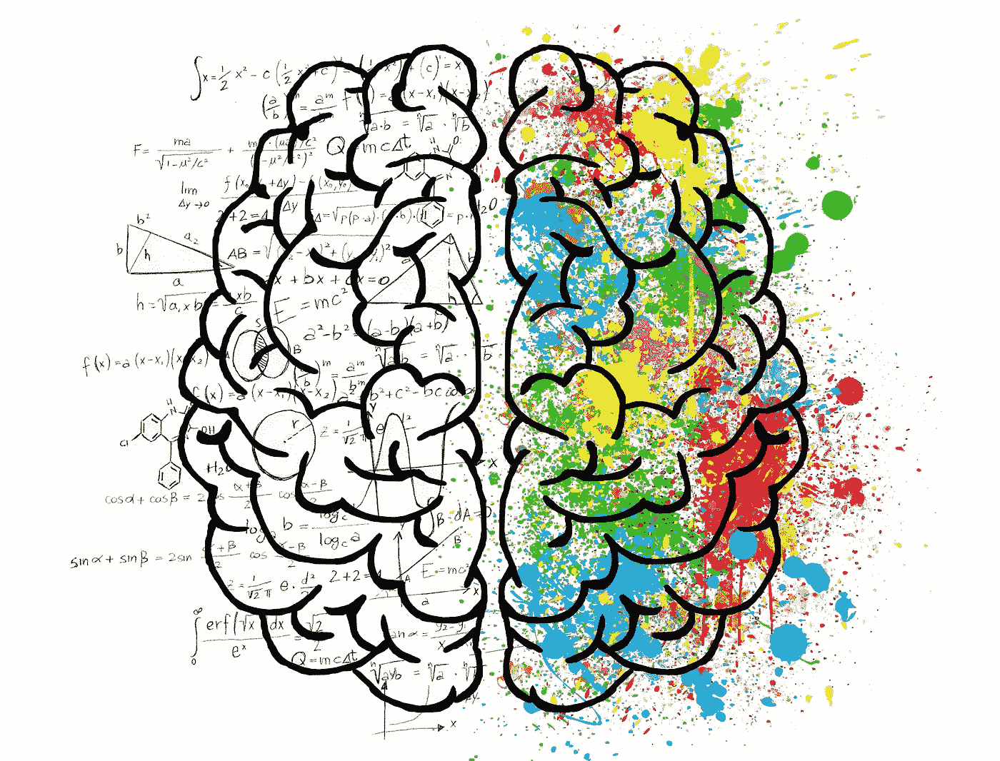

# 快速深度学习课程:从 0 到 60

> 原文：<https://medium.datadriveninvestor.com/a-fast-track-deep-learning-curriculum-going-from-0-to-60-6b64159581d4?source=collection_archive---------13----------------------->

快速、廉价地启动并运行深度学习！

# 介绍

如果你以前有 Python 和机器学习的知识，并且你希望在不倾家荡产的情况下尽快进入深度学习，请完成下面的课程。如果你是 Python 新手，我推荐 Udemy 课程。如果你是机器学习的新手，我建议你去看看吴恩达在 Coursera 上的机器学习课程和华盛顿大学的机器学习专业。(我将只审核这些课程，因为练习是在 Octave 和 GraphLab Create 中进行的，它们已经非常过时了)。不管是哪种情况，看看下面的课程吧！

Image by [ElisaRiva](https://pixabay.com/users/ElisaRiva-1348268/?utm_source=link-attribution&utm_medium=referral&utm_campaign=image&utm_content=2062057) from [Pixabay](https://pixabay.com/?utm_source=link-attribution&utm_medium=referral&utm_campaign=image&utm_content=2062057)

# 课程列表

[1]神经网络和深度学习( [Coursera](https://www.coursera.org/learn/neural-networks-deep-learning) )(审计)

[2]没有博士学位的深度学习([谷歌云](https://cloud.google.com/blog/products/gcp/learn-tensorflow-and-deep-learning-without-a-phd) ) —第 1-3 章

[3]深度学习 TensorFlow 完整指南( [Udemy](https://www.udemy.com/course/complete-guide-to-tensorflow-for-deep-learning-with-python/) ) —第 1–6 节

[4]卷积神经网络( [Coursera](https://www.coursera.org/learn/convolutional-neural-networks) )(审计)

[5]没有博士学位的深度学习([谷歌云](https://cloud.google.com/blog/products/gcp/learn-tensorflow-and-deep-learning-without-a-phd) ) —第 4-6 章

[6]深度学习 TensorFlow 完整指南( [Udemy](https://www.udemy.com/course/complete-guide-to-tensorflow-for-deep-learning-with-python/) ) —第 7 节

[7]完成 MNIST 卡格尔比赛([卡格尔](https://www.kaggle.com/c/digit-recognizer))

[8]序列模型( [Cousera](https://www.coursera.org/learn/nlp-sequence-models) )(审计)

 [## 人工智能、深度学习和医疗实践|数据驱动的投资者

### 人工智能和深度神经学习的效用看起来可能是合法和有前途的，特别是…

www.datadriveninvestor.com](https://www.datadriveninvestor.com/2020/06/24/disclosure-and-resolution-program-wont-prevent-physicians-from-practicing-defensive-medicine/) 

[9]没有博士学位的深度学习([谷歌云](https://cloud.google.com/blog/products/gcp/learn-tensorflow-and-deep-learning-without-a-phd) ) —第 7 节

[10]深度学习 TensorFlow 完整指南( [Udemy](https://www.udemy.com/course/complete-guide-to-tensorflow-for-deep-learning-with-python/) ) —第 8–11 节

[11]强化学习( [Udacity](https://www.udacity.com/course/reinforcement-learning--ud600) )(审计)第 1-3 课

[12]强化学习— Ep。30(深度学习简体版)( [YouTube](https://www.youtube.com/watch?v=e3Jy2vShroE)

[13]强化学习解释( [EdX](https://www.edx.org/course/reinforcement-learning-explained-4) )(审计)

[14]深度学习 TensorFlow 完整指南( [Udemy](https://www.udemy.com/course/complete-guide-to-tensorflow-for-deep-learning-with-python/) ) —第 12–13 节

# 最低价格= 12 美元

唯一需要购买的课程是 Udemy 课程，如果你把握好时机或者在网上找到优惠券代码，你不需要为所有这些材料花费超过 12 美元！相当牛逼！

# 结束了！

希望你发现这是有益的和快乐的学习！

**访问专家视图—** [**订阅 DDI 英特尔**](https://datadriveninvestor.com/ddi-intel)