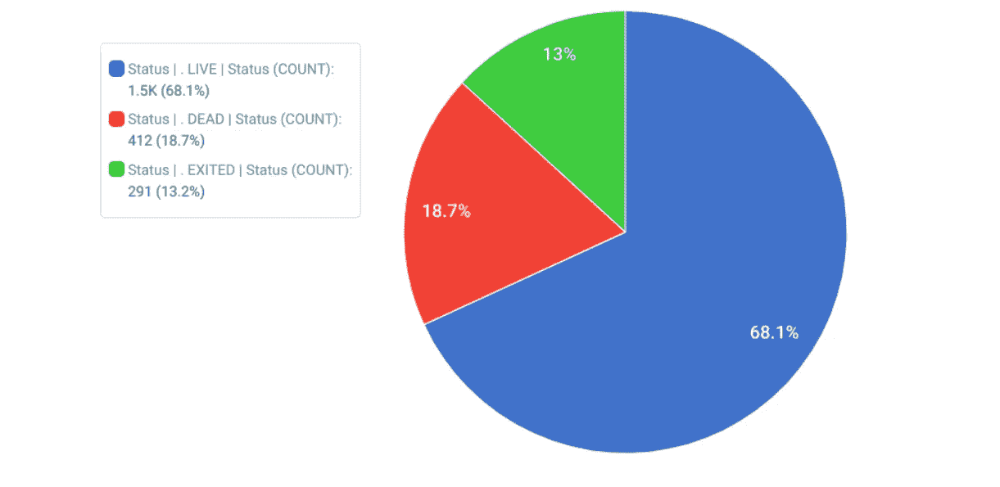
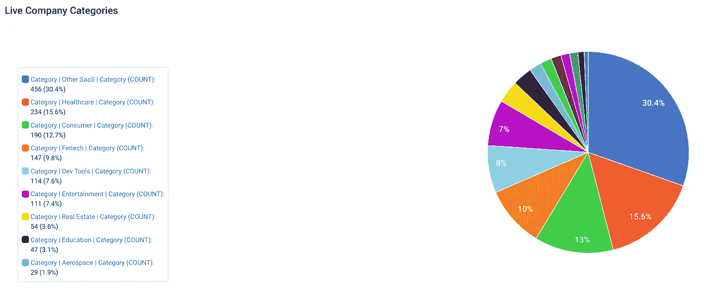
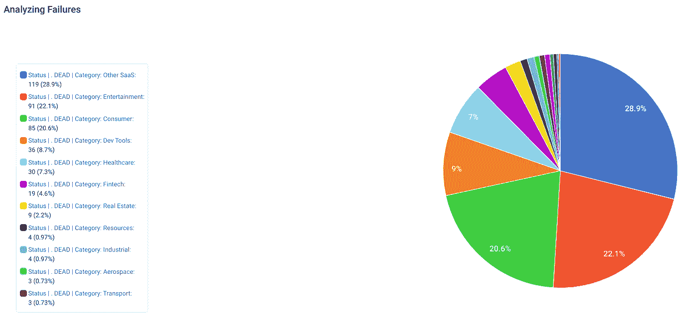
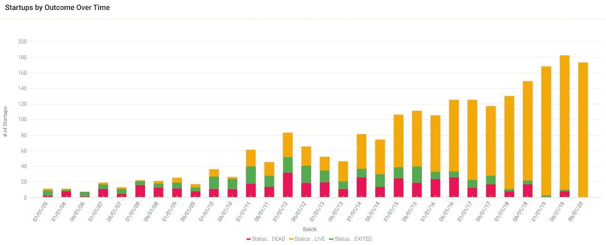
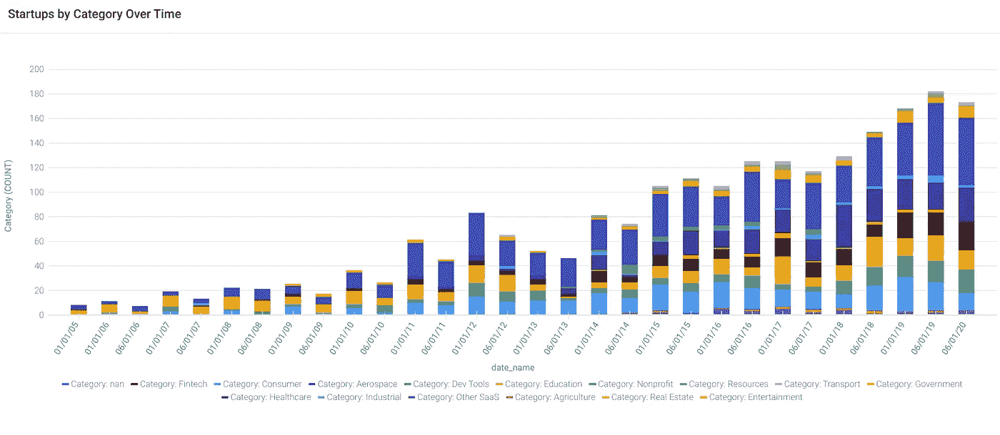

# 五分之一的 YC 创业公司失败[数据分析]

> 原文：<https://medium.datadriveninvestor.com/a-fifth-of-yc-startups-fail-data-analysis-1f909d0b4a64?source=collection_archive---------0----------------------->

## 分析 2206 家 Y Combinator 公司。

Photo by [Benedikt Geyer](https://unsplash.com/@b_g?utm_source=medium&utm_medium=referral) on [Unsplash](https://unsplash.com?utm_source=medium&utm_medium=referral)

Y Combinator 是一家著名的孵化器，位于世界创业之都硅谷。每年两次，他们向一组精选的领先创业公司提供世界级的指导、强大的投资者网络和 12.5 万美元。

我使用无代码分析工具 [Apteo](http://apteo.co) 分析了 2206 家 YC 初创公司的[数据](http://ycdb.co)，以洞察哪些初创公司成功了，哪些失败了。

# 接通率

尽管极其挑剔(T4 的录取率约为 1.5%，T5)，但几乎 20%的 YC 创业公司已经失败了。

By [Apteo](http://apteo.co).

考虑到一些“活着的”创业公司将不可避免地失败——特别是当我们进入[大萧条 2.0](https://medium.com/datadriveninvestor/will-the-great-depression-2-0-cause-an-ai-winter-7c3c353d7b53)——这个比例可能会增加。

 [## 大萧条 2.0 会造成 AI 寒冬吗？

### 人工智能很贵，预算也在削减。

medium.com](https://medium.com/datadriveninvestor/will-the-great-depression-2-0-cause-an-ai-winter-7c3c353d7b53) 

# YC 创业公司的类型

Y Combinator 不仅仅是一家科技孵化器，尽管如果你是一家工业、教育、航空航天或房地产初创企业，你进入的机会相对较低。

By [Apteo](http://apteo.co).

显然，YC 对 SaaS 的初创公司有很大的偏好，对医疗保健和消费品也有兴趣。这三个类别构成了 YC 近 60%的创业公司。

 [## 为什么实时数据处理如此具有挑战性？数据驱动的投资者

### 实时数据分析就是要缩小数据收集、分析和行动之间的差距。与……

www.datadriveninvestor.com](https://www.datadriveninvestor.com/2020/07/30/why-is-real-time-data-processing-so-challenging/) 

# 按类别列出的启动失败

最常见的创业失败是在 SaaS 类别，但这只是与 SaaS 是最常见的类别这一事实相一致——所以没有什么不寻常的。

然而，如果我们仔细观察，我们会发现娱乐和消费类创业公司的失败率高得不成比例——它们的失败率高于它们在 YC 的整体表现。

By [Apteo](http://apteo.co).

# 一段时间内的创业成果

很少发现“快速故障”至少，当前一批中的公司不能被标记为“失败”，上一批中的公司也不太可能已经失败。

创业公司退出需要更长的时间，这是有道理的，因为一般的创业公司需要几年时间才能退出。

By [Apteo](http://apteo.co).

# 新类别的兴起

YC 在大多数主要渠道上都取得了增长，近年来出现了一些新的类别，包括农业和航空航天。

By [Apteo](http://apteo.co).

# 预测未来

Y Combinator 的[创业学校](https://www.startupschool.org/)很好地预示了未来 YC 的创业公司会是什么样子，因为许多 YC 的创业公司在正式加入之前都会参加在线课程。在里面，你会发现许多人工智能、无代码和 AutoML 创业公司。关于 AutoML 的更多信息，请查看下面的文章。

 [## AutoML 会是数据科学家的末日吗？

### AutoML 越来越受欢迎。这就是事情的变化。

towardsdatascience.com](https://towardsdatascience.com/will-automl-be-the-end-of-data-scientists-9af3e63990e0) 

另一个很好的指标是 YCombinator 的 [RFS](https://www.ycombinator.com/rfs/) (对初创公司的请求)，YC 在这里概述了他们有兴趣看到的初创公司，包括人工智能(当然)、碳去除技术、清洁肉类、抗衰老等等。

# 摘要

Y Combinator 是一家创业公司，但它不是万能的。即使有世界一流的资源，失败率也很高。尽管如此，现在比以往任何时候都有更多令人兴奋的创业机会，出现了像 [GPT-3](https://towardsdatascience.com/will-gpt-3-kill-coding-630e4518c04d) 、 [6G](https://medium.com/towards-artificial-intelligence/6g-and-its-implications-for-ai-288d403cec0c) 、[无代码](https://medium.com/predict/why-no-code-is-the-future-of-ai-112d9bfde440)等技术。

**访问专家视图—** [**订阅 DDI 英特尔**](https://datadriveninvestor.com/ddi-intel)