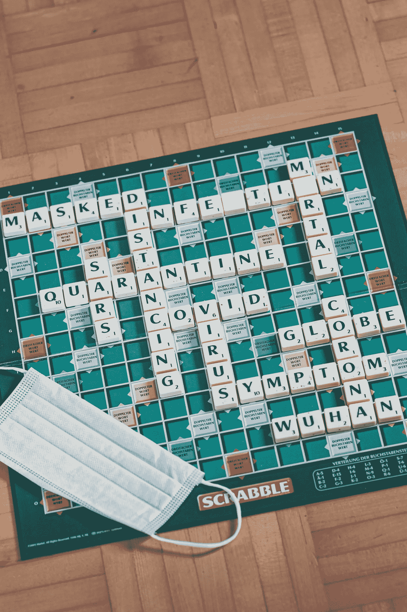

# 让我们假设川普真的领导了我们，我们打败了科维德

> 原文：<https://medium.datadriveninvestor.com/a-flight-of-fancy-trump-actually-led-us-and-we-beat-covid-d8d0d66a4154?source=collection_archive---------24----------------------->

## 为了了解我们是如何失败的，让我们想象一下我们是如何成功的

Photo by [Florian Schmetz](https://unsplash.com/@floschmaezz?utm_source=unsplash&utm_medium=referral&utm_content=creditCopyText) on [Unsplash](https://unsplash.com/s/photos/puzzles?utm_source=unsplash&utm_medium=referral&utm_content=creditCopyText)

我写这篇文章不是为了指责特朗普——他无可指责。不通知你这个悲剧——除非你是伍迪·艾伦在看牙医时陷入昏迷( *Sleeper* reference)那么你是知道的；你甚至可能会对它的继续发展感到悲伤。

我写这篇文章是为了宣扬显而易见的事实，因为在今天不断的信息旋风中，我们听到了最骇人听闻的故事，最令人疲惫不堪的阴谋，而令人遗憾的是，最显而易见的事实却从来没有被我们实际感知到。胡说八道和夸张之所以受欢迎，是因为人们下意识地知道手头的故事正好属于这些修辞范畴，从而使他们摆脱担忧。

然而，显而易见的事实会让人们惊恐万分，因为他们意识到不良后果是多么容易避免。

我写这些是因为我们需要写科学论文，以及同行评审的学术论文，这样才能避免 2020 年的重复。这个国家还没有到愿意从过去的一年中学习的地步——它仍在进行中；然而，让我们想象一下我们可能会采取不同的行动。如果不是因为无缘无故失去的生命，那么美国经济已经失去的数万亿美元将永远不会恢复——这一后果将伴随我们几十年，伙计们，结果可能更糟。

## 让我们想象一下

让我们想象一下——因为我知道你已经做到了。大多数人都有。

我们都想过，如果特朗普总统选择使用只有他知道的知识来领导这个国家，可能会发生什么。他会要求找到减轻病毒影响的最佳对策，以拯救尽可能多的生命，而不仅仅是他的政治生命。

毕竟我们是美国，必要的时候我们可以变魔术。哈佛-麻省理工学院、北卡罗来纳研究三角、硅谷、匹兹堡和新泽西的制药巨头(J&J、默克、布里斯托尔-迈耶施贵宝、诺华、Celgene、赛诺菲等)的大量创新和创业专业知识肯定能够想出办法阻止我们成为新冠肺炎死亡事件的世界领导者。如果其他伟大的头脑，美国的商业巨头们能够在一个漫长的周末坐下来想出解决方案，他们本可以减轻经济影响。

让我们想象一下，事后这些公司中被压抑的创造能量的水平。现在我们看到事情变得有多糟了。

 [## 你的 COVID 等级是多少？为疫情安全设计办公空间|数据驱动投资者

### 自从新冠肺炎·疫情席卷美国，迫使工人逃离办公室，走向孤立无援的境地…

www.datadriveninvestor.com](https://www.datadriveninvestor.com/2020/11/23/whats-your-covid-rating-designing-office-spaces-for-pandemic-safety/) 

让我们想象一下，特朗普政府召集了一群来自各种行业的最具创造力的头脑，然后说，*好吧，这是美国政府可以投资的金额，以防止这件事变成一场狗屎秀——比如 1 万亿美元。这笔钱不是用来填补你的利润，而是用来确保美国和美国人民准备好迎接这个挑战并战胜它。我会支持他的。美国会的。*

当我们下定决心时，我们是一个几乎无所不能的国家。真的，我说这句话没有夸张，甚至没有骄傲。作为一个大半辈子都生活在外国文化中的人，我写下了这些感想。美国有一些东西激励人们做最好的自己；不是说其他国家不也做大事，而是美国人特别擅长。犬儒主义经常阻止其他文化看到我们所看到的。

还记得阿波罗 13 号任务吗？我不知道，但我确实看过这部电影，也读过相关报道——我们解决了*的那个*问题！1970 年坐在地球上的人，使用当时最好的通信技术——相对来说是一根长绳子和两个罐子——不知何故想出了如何将那个太空舱带回地球！我的意思是，即使现在我想起这件事也会让我感到震惊，并让我充满民族自豪感。

看看从那时起，技术在多大程度上改变了我们的生活和我们周围的世界。我们怎么会让一种新型冠状病毒让强大的美国屈服？这只能怪国家领导人吧？但是，不要责备，让我们想象一下会发生什么。

当唐纳德·川普对冠状病毒说不的时候——比如，*不，这不会是个问题，*他决定了我们成千上万同胞的命运。让我们想象一下，如果在那次臭名昭著的会面后，他告诉鲍勃·伍德沃德，他完全理解这件事到底有多糟糕，他却对关于他自恋型人格障碍的无情传言充耳不闻，并说道:

我的美国同胞们，他们称之为新型冠状病毒的病毒有可能摧毁我们的社区和经济。团结起来，利用我作为美国总统所拥有的一切资源，我们将团结起来，我们将创新，我们将相互尊重，这是美国人在面对共同的敌人时所能做到的。美国，我们将一起胜利，否则我们将一起失败。

## 信息发送

让我们想象一下这样的话会有什么样的效果？福克斯新闻频道会支持他的。美国有线电视新闻网，可能会首先试图找到一种方式来抨击他，直到他们自己的医学专家在新闻室获胜，然后他们也会支持总统。国会会支持总统的。当然，一些寄生虫会试图滥用这种情况来促进他们自己疲惫不堪的阴谋论或议程；但最重要的是，新闻集团——以及他们所有崇拜特朗普的主播和记者——会让特朗普美国公司相信，我们需要共同战斗。

## 工作队

鉴于局势迫在眉睫的严重性，像上面提到的那种工作队会与总统会面。想想田纳西河流域管理局/民间保护组织/完美社会为美国人应对病毒而创建的项目；让当地经济做好准备，在关闭期间如何运作。学校里的孩子们过去练习核打击的方式，以及今天的实弹射击，社区将为避免广泛传播的感染和适当的社会距离技术做好准备，目标是保持无病毒社区。

中心地带已经为新冠肺炎做好了准备，不会迷失在虚假信息的迷雾中，互相拥抱超级播种者摩托车集会。

## 面具

一个由特朗普总统领导的任务小组，不是受总统对民调数字的愤怒情绪的变化所引导，而是要求为国家做正确的事情。最重要的结果是对戴口罩提出了明确的要求。他们说要戴口罩，总统也支持他们。

如果你还记得，早在疫情的开始，信息是面具可能不起作用。这种沟通不畅的部分原因是特朗普总统没有领导这场斗争；而且，因为口罩确实严重短缺，这意味着一线工人被迫佩戴不合适的或自制的口罩，导致感染。然而，让我们想象一下，特朗普总统从一开始就领导并已经实施了国防生产法案。面具短缺几乎不会引起注意。

## 社区支持

美国人是天生的营销专家，他们会把整个面具事件变成一场与冰桶挑战相提并论的运动。戴上面具会很酷，很时尚，也很合适。关于蒙版的 gif 和迷因将会无处不在。全国面具日，最具表现力面具大赛，面具请客，快乐面具日，好面具，*嘿，面具你，男人*或*面具起来！*耐克说*只要掩盖它。伙计们，天空真的是极限了。*

## 但是…

截至本文撰写之时，已有 284，000 名美国人死于冠状病毒。今天大约会有 2000 多人死去。右翼媒体和共和党政客呼吁美国人聚集在一起，不带面具过节，以免左翼在圣诞节的战争赢得另一场反对基督教的战争。特朗普总统在推特上发布了一个新建的空医院病房的照片，称整个 T2 事件是一个骗局。到乔·拜登就职时，又有 100，000 名美国人将死去，总人数将接近 400，000 人。

世界上最好的流行病学家估计，如果美国从 2 月中旬开始采取积极行动，采用最佳做法，那么在[和 99](https://www.statnews.com/2020/06/19/faster-response-prevented-most-us-covid-19-deaths/) 之间，死于新冠肺炎的人中有 70%到 99%今天仍然活着——不考虑其他死亡原因。因为我们没有采取行动，相反，我们的反应很容易被巨蟒小组的创造者，甚至是班尼·希尔本人所想象。

记住这一点，超过 300，000 这些死去的灵魂应该活着观看就职典礼。如果唐纳德·特朗普(Donald Trump)能够克服他的精神障碍，表现得像一个真正的领导人，那些死去的美国人会看到他宣誓连任——这是我会不高兴的，但我觉得他活该。

在接下来的一个小时里，75 到 90 名美国人将不会为假期做好准备，因为我们错过了这个时刻。我们让愚蠢占上风。

如果你正在读这篇文章，而你的一个朋友或亲人已经去世，很有可能——几乎可以肯定——他们本不必死去。他们的死是美国总统认为可以接受的牺牲，只要没有任何负面的东西与他的“好名声”联系在一起。他选择不采取行动，假装什么事都没有。我为你的损失感到遗憾。愿那个人安息。

让我们想象一下，下一次我们会做得更好。

## 访问专家视图— [订阅 DDI 英特尔](https://datadriveninvestor.com/ddi-intel)